[TOC]

# 细菌的基因重组

## 基因重组的概念和方式

### 概念

两个不同来源的遗传物质进行交换,经过基因的重新组合,形成新的基因型的过程.

### 方式

原核微生物没有有性生殖,其基因重组通过**转化、接合、转导**方式进行.

### 转化

#### 定义

指**外源DNA**(从供体细胞中提取的或人工合成的)**不经任何媒介**被直接吸收到受体细胞的过程.

#### 转化因子

被转化的游离的DNA片段

#### 转化子

接受了外源DNA的受体菌

#### 转化的必要条件

+   建立感受态的受体细胞
    +   自然感受态/人工感受态
+   外源游离DNA分子(转化因子)
    +   转化因子通常是双链DNA

#### 人工转化方法

+   用$CaCl_2$处理细胞,电穿孔等是常用的人工转化手段.
+   $CaCl_2$处理细胞是改变细胞膜的通透性从而使细胞具有摄取大分子DNA的能力
+   电穿孔法是用高压脉冲电流击破细胞膜形成小孔,使各种大分子能通过这些小孔进入细胞,所以又称电转化.

#### 转化的特点

不需两个细胞直接接触,供体DNA提取出来,注入受体即可.

+   外源DNA一旦进入受体,如果它不能单独复制,就可能产生以下3种不同的结果
    +   暂时存在于受体细胞中,在细胞分裂过程中丢失
    +   整合到受体细胞的基因组中(同源单交换)
    +   外源基因置换受体中的部分基因(同源双交换)

#### 肺炎链球菌的转化实验

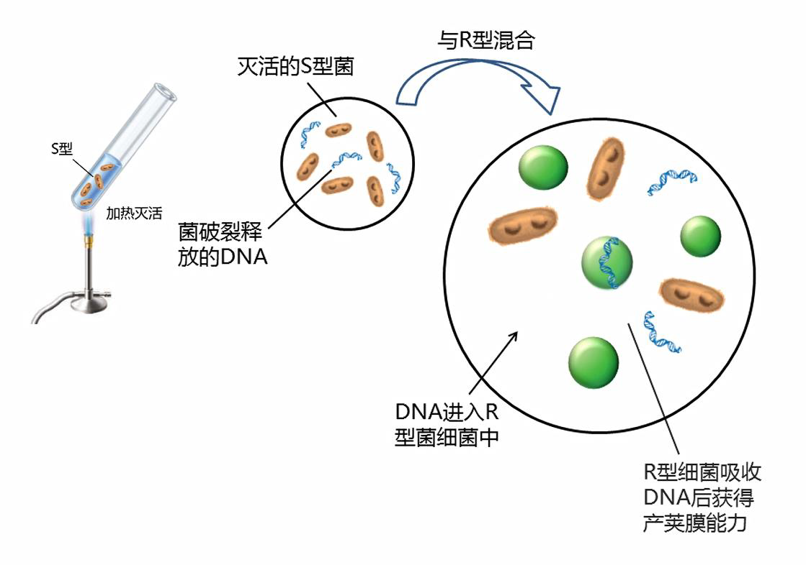

### 转导

是指通过噬菌体介导的DNA在不同细菌细胞间转移和基因重组的现象.

#### 转导噬菌体

能将细菌宿主的部分染色体和质粒DNA带到另一个细菌的噬菌体.
获得了由噬菌体携带来的供体菌DNA片段的受体细胞称为转导子.
在转导中被转移的染色体片段称为**转导因子**.

#### 细菌转导的类型

+   普遍转导
    +   完全转导
    +   流产转导
+   局限转导
    +   低频转导
    +   高频zhuandao

##### 普遍转导(generalized transduction)

噬菌体可以转导供体细胞染色体的任何部分到受体细胞中

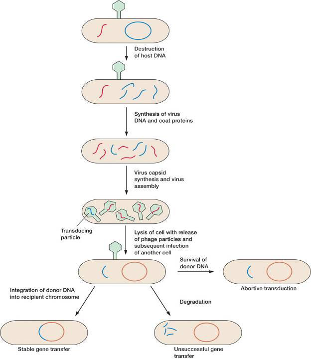

+   普遍性转导的三种后果
    +   完全转导
        +   进入受体的外源DNA通过与细胞染色体的重组交换而形成稳定的转导子
    +   流产转导
    +   外源DNA被降解,转导失败

##### 流产转导

不能整合到细胞染色体上,以游离的状态存在于细胞中,通过细胞分裂只能传给一个子细胞,这种方式叫做流产转导

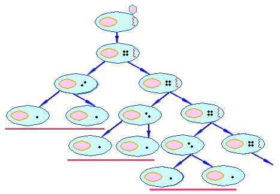

##### 局限转导

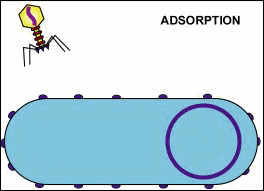

噬菌体只能将供体菌特定的一个或几个基因转移到受体菌中的转导现象

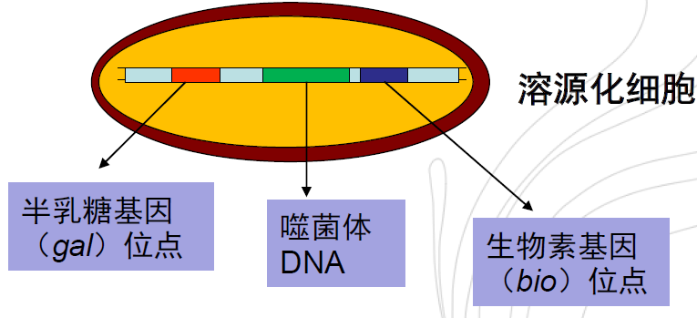

>    导致局限性转导的一般都是温和噬菌体,他们在供体菌的染色体上具有特定的整合位点.A原噬菌体位于K12菌株染色体上半乳糖利用基因(gal)和生物素合成基因(bio)之间.

当$\lambda$原噬菌体脱离染色体而成为游离噬菌体时,约有$10^{-6}$个原噬菌体发生错误切离而形成缺陷噬菌体.这种缺陷噬菌体要么带有$gal$基因,称为$\lambda\ dgal$;要么带有$bio$基因,称为$\lambda\ dbio$.

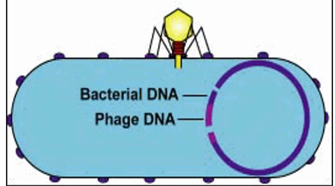

##### 低频转导

这种缺陷噬菌体亦是转导噬菌体,它具有感染能力,能整合到寄主染色体相同的位点上形成稳定的转导子.**所得转导子的频率比较低**,约为$10^{-6}$称为低频转导.

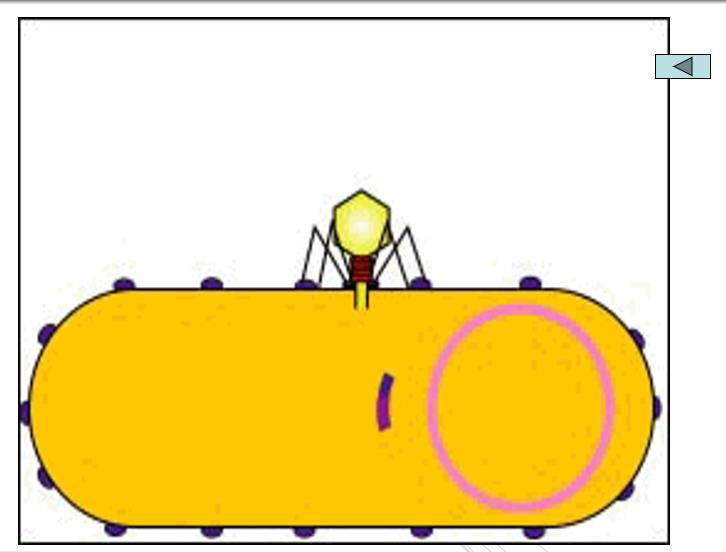

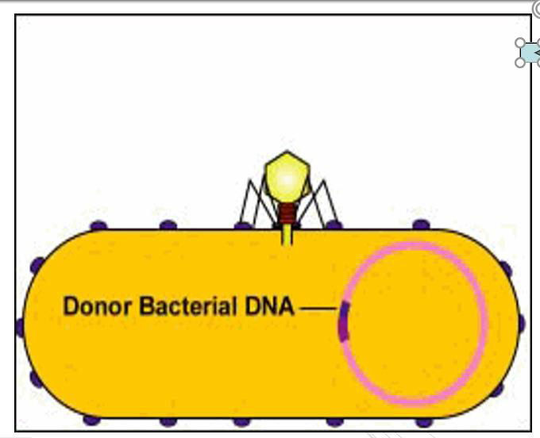

##### 高频转导

在局限转导中,若对双重溶源菌进行诱导,就会产生含50%左右的局限转导噬菌体的高频转导裂解物,用这种裂解物去转导受体菌,就可获得高达50%左右的转导子.

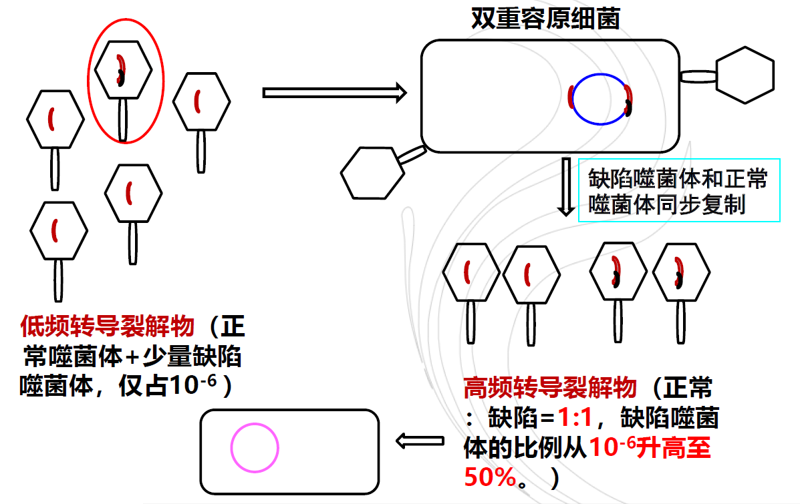

##### 局限转导与普遍转导的主要区别

+   局限转导中被转导的基因与噬菌体DNA一起被导入受体细胞中(错误切离)
    普遍性转导包装的可能全部是宿主菌的基因(错误包装).
+   局限性转导颗粒携带特定的染色体片段并将固定的个别基因导入受体
    普遍性转导携带的宿主基因具有随机性

### 接合

#### 定义

**接合(Conjugation)**:通过细胞与细胞的直接接触而产生的遗传信息的转移和重组过程

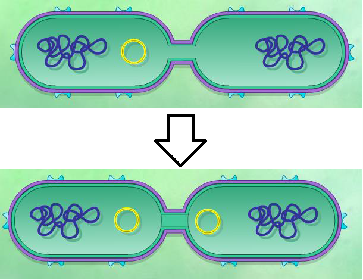e

#### 接合现象的发现

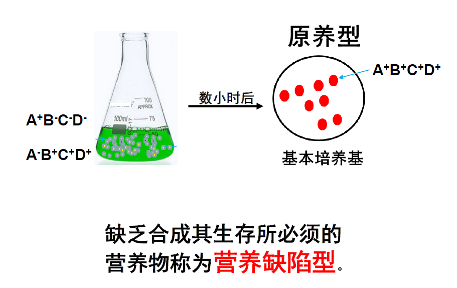

#### 结合的必要条件

证实接合过程需要细胞间的直接接触的

"U"型管实验(Bernard Davis,1950)

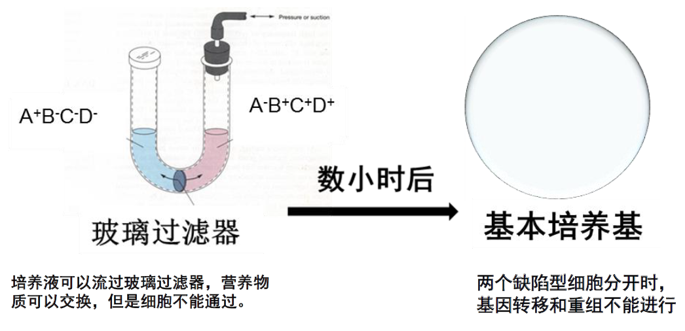

#### 接合机制(大肠杆菌)

接合作用是由一种被称为F因子的质粒介导,上面有编码细菌产生性菌毛及控制接合过程进行的20多个基因.

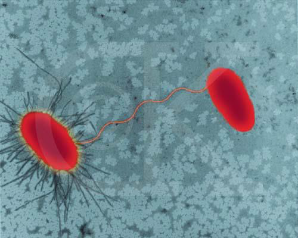

+   F因子特点
    +   可经接合作用而获得
    +   可通过一些理化因素(如EB或丝裂霉素等)的处理,而从细胞中消失
    +   在大肠杆菌中,F因子的DNA含量约占总染色体含量的$2\%$

##### F因子的四种细胞形式

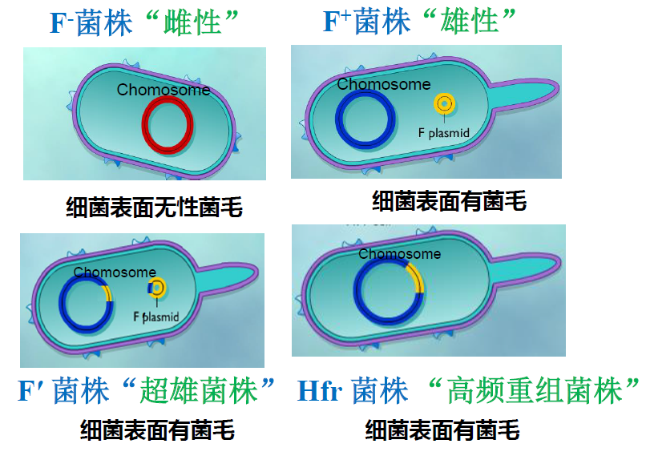

##### "$F^\times F^-$"  $\to$ "$F^+ +F^+$"

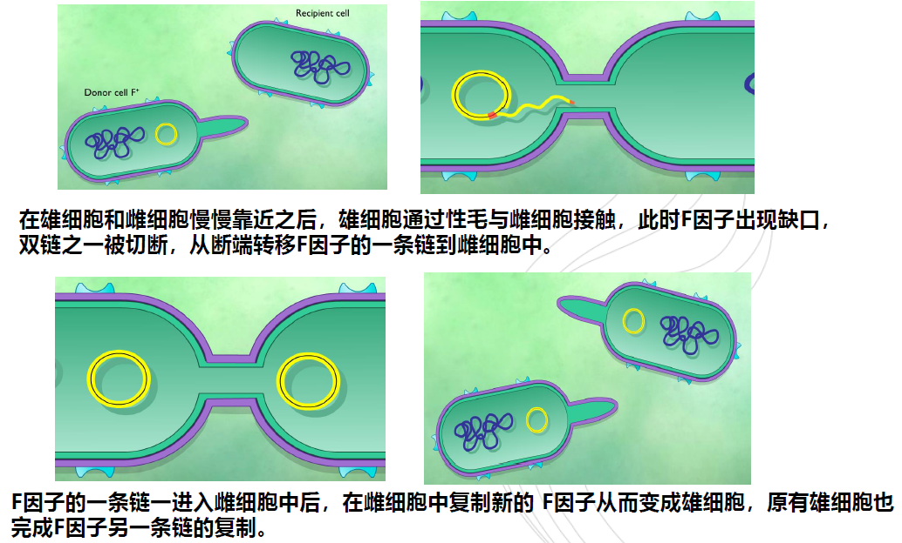

#### $Hfr\times F^-\to Hfr+F^-$

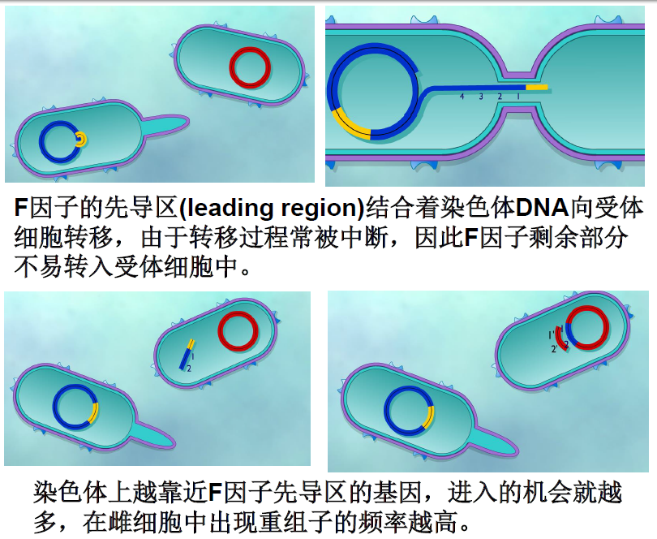

##### $F'\times F^- \to 初生F\ + 次生F'$

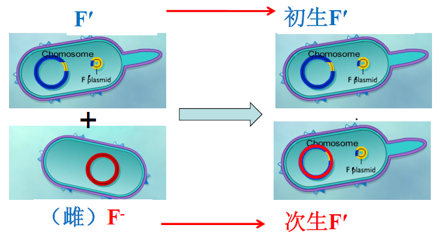

$F'$与雌细胞杂交时,供体的部分染色体基因由$F'$携带着一起转入受体细胞,受体既获得了$F$因子,又获得了来自$F'$菌株的若干遗传性状.以这种接合来传递供体菌基因的方式,称为$F$因子转导、性导

在次生的$F'$群体中,大约有$10\%$的$F'$因子重新整合到染色体组上,而恢复成$Hfr$菌.

### 原生质体融合

将遗传性状不同的两种菌的(包括种间、种内、及属间)原生质体融合成为一个新的重组子的技术.

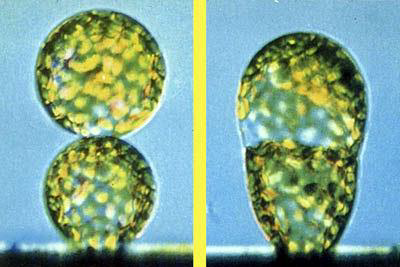

#### 原生质体融合步骤:

1.原生质体制备

2.原生质体融合和细胞壁再生

3.融合子的选择

微生物细胞融合的研究始于1976年

+   主要过程
    +   1、准备两个**有选择性遗传标记**的突变株(如营养缺陷型)
    +   2、在高渗溶液中**去除细胞壁**,离心聚集原生质体
    +   4、加入**促融合剂**促进融合
    +   5、在高渗溶液中稀释,涂在能使其再生细胞壁或进行分裂的培养基上,待形成菌落后,影印接种,将其接种到各种选择性培养基上,最后**鉴定**它们是否是重组子.

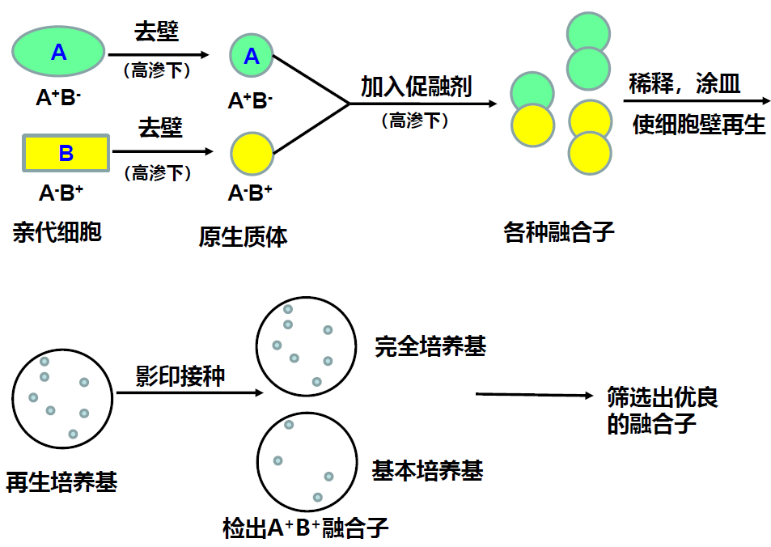

