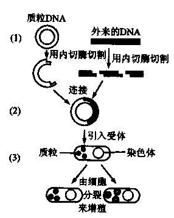
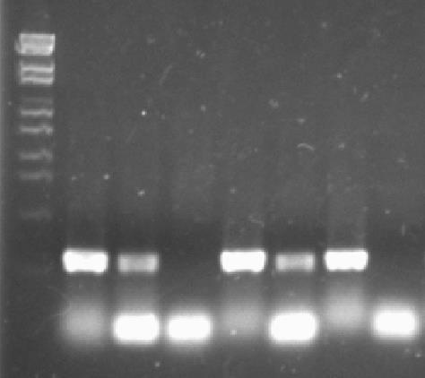
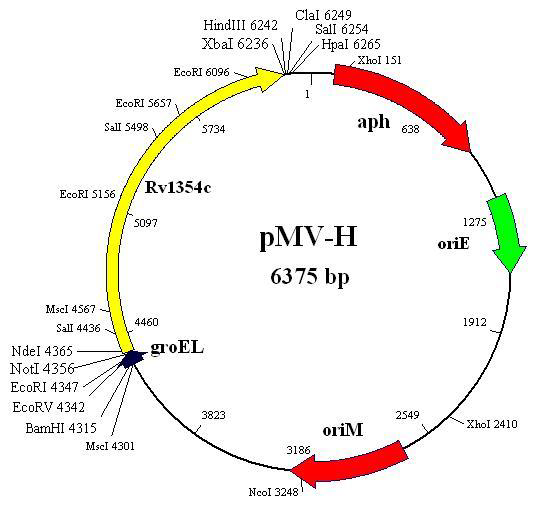
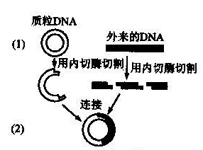
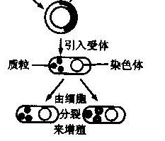

# 重组DNA技术

# 基因工程

运用重组技术在体外获得重组DNA分子,再借助载体,将DNA分子送到活细胞中进行稳定表达,进而获得具有新遗传性状的品种.

## 基因工程的基本操作

+   获得目的基因
+   选择克隆载体
+   体外重组
+   重组载体导入受体
+   筛选和鉴定

### 目的基因的获取

DNA的PCR扩增:聚合酶链式反应

+   引物（根据基因序列来设计）
+   模板$DNA$（从微生物中抽提）
+   $dNTP$
+   $rTaq$
+   $PCR\ buffer$
+   $ddH_2O$

>+   95℃变性
>+   约56℃退火
>+   72℃延伸

琼脂糖凝胶检测DNA扩增效率

### 选择合适的克隆载体

**克隆载体(cloning vector)**:负责将外源DNA片段运送到细胞中进行复制与扩增.

### 体外重组

首先,利用限制性核酸内切酶对DNA片段和载体进行特异性剪切,然后利用DNA连接酶将DNA片段和载体连接起来.

>**限制性核酸内切酶(restriction endonuclease)**:是指能识别双链DNA分子的特定序列,并在识别位点或其附近切割DNA的一类核酸内切酶.
>
>**DNA连接酶(DNA ligase)**:可以将限制性内切酶切割后的两个片段连接在一起.

### 重组载体导入受体

我们可以利用化学转化或电激转化的方法,将重组载体转化至受体细胞,利用选择培养基筛选重组子.

### 筛选和鉴定正确的重组子

从选择培养基上挑取转化子,抽质粒,PCR验证,送公司测序.

## 微生物在基因工程中的作用:

+   微生物提供了**克隆载体**
    +   质粒
    +   $\lambda$噬菌体、黏粒
+   微生物生产基因工程工具酶
    +   限制性核酸内切酶("剪刀")
    +   DNA连接酶("胶水")
+   微生物作为克隆载体的宿主
    +   原核生物宿主
        +   大肠杆菌
        +   枯草芽孢杆菌
    +   真核生物宿主
        +   酿酒酵母
+   微生物作为基因产物的重要表达载体
+   理论基础(主要来自对微生物的研究)
+   微生物的多样性提供了丰富而独特的基因资源

