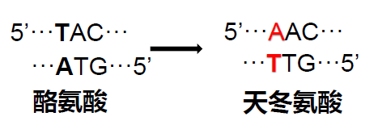
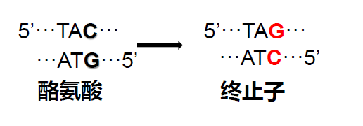
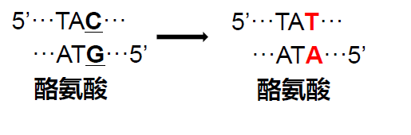
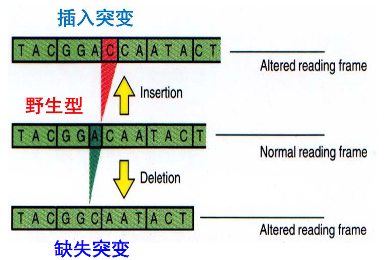
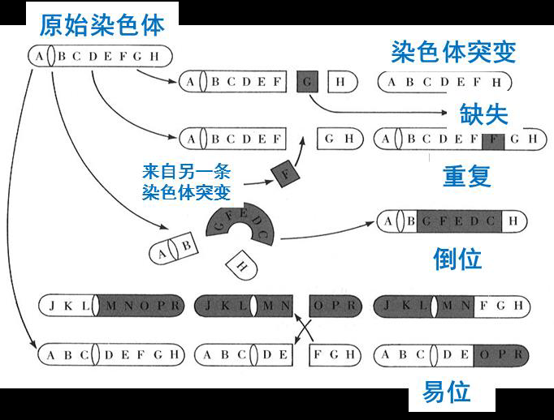
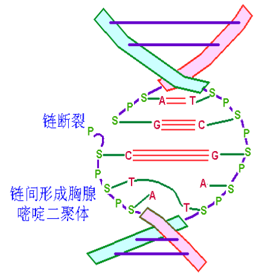
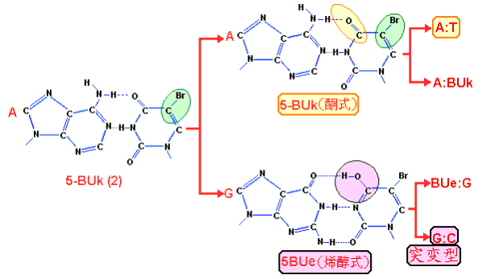
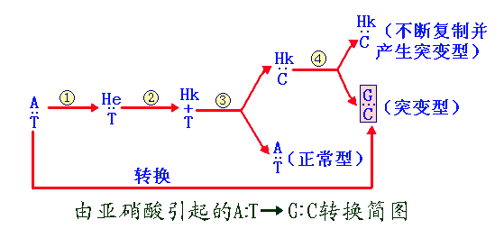
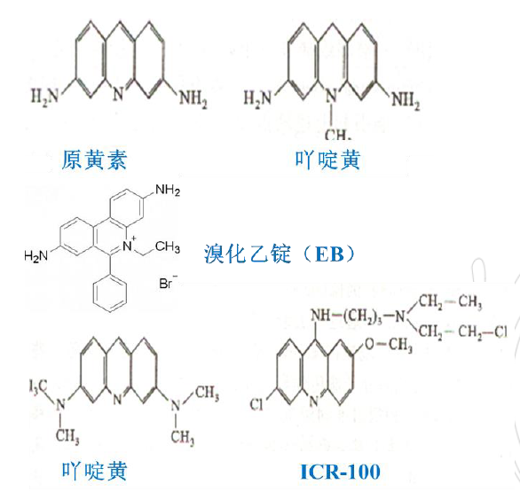

[TOC]

# 基因突变

# 基因突变的基本概念

## 基因突变的定义

**定义:**一个基因内部遗传结构或DNA序列的任何可遗传的改变,突变包括染色体畸变和点突变

+   基因突变
    +   狭义:点突变(一对或少数几对碱基的缺失、插入或置换)
    +   广义:点突变和染色体畸变(大片段染色体的缺失、重复、倒位)

$$
\Large 野生型(原始性状)\stackrel{基因突变}{\longrightarrow}突变型(新性状)
$$

## 基因突变的类型

+   **自发突变**:在自然条件下发生的基因突变
+   **诱发突变**:人工诱发产生的基因突变
+   **回复突变**:突变菌株以一定的频率发生突变,回复到出发菌株的状态

## 基因突变的结果

### 错义突变

突变产生的新密码子与原密码子编码的氨基酸不相同

### 无义突变

突变产生的新密码子是终止密码子，导致翻译提前终止

>   **终止密码子**:UAA,UGA,UAG

### 同义突变

突变产生的新密码子与原密码子编码的氨基酸相同

## 自发突变的分子机制

### 自发突变的特性

+   随机性
    +   突变跟环境因子无对应性
+   稀有性
    +   其频率很低,一般在10-到10-5
+   可诱变性
    +   诱变剂可提高突变率.
+   独立性
    +   各种性状改变的基因突变彼此是独立的
+   稳定性:
    +   突变是可以稳定遗传的
+   可逆性
    +   突变菌株可以发生回复突变,恢复到原有表型

### 自发突变的分子基础

碱基**互变异构体**的存在导致形成不同的碱基配对

$\Large 腺嘌呤氨基式(A-T)\longrightarrow腺嘌呤亚氨基式(A-C)$

>   结果:导致$AT\to GC$

## 诱发突变的机制

### 碱基的置换(转换、颠换)

碱基与碱基之间的交换导致突变的发生.

+   转换(transition)
    +   嘌呤被另一种嘌呤替代或嘧啶被另一嘧啶替代

+   颠换(transversion)
    +   嘌呤被嘧啶替代或嘧啶被嘌呤替代

### 移码突变

添加或缺失核苷酸,引起阅读框错误

### 染色体畸变

生物细胞中染色体在结构上发生的变化:缺失,重复,插入,易位,倒位.

>    染色体在数目:指染色体整倍或者非整倍的变化

## 常见的微生物突变体类型

按表型变化,可分为营养突变型、形态突变型、生化突变型、抗性突变型、条件致死突变型.

### 营养缺陷型

由于基因突变使得野生型菌株丧失合成一种或几种生长因子的能力,导致其在**基本培养基上无法生长**的突变类型

>   负选择标记

### 抗性突变型

对某种化学药物或物理因子产生抗性的突变型.

### 条件致死突变型

在某一条件下可以生存,而在另一条件下致死的突变型(如温度敏感型,如一类大肠杆菌突变株在42℃下致死,在25-30 ℃下生存).

### 形态突变型

指菌体或菌落形态发生改变的突变型(如原本是光滑的,变成有褶皱的)

### 代谢突变型

如毒力、糖发酵能力、代谢产物的种类和产量以及对某种药物的依赖性突变型等.

# 诱发突变的原理

## 诱发突变的定义

**诱发突变**:利用物理、化学和生物因素人工诱发产生的基因突变.

诱发突变与自发突变没有本质的差别,诱发突变可以大大提高突变率

## 物理诱变

紫外线、激光、离子束、X射线、r射线等

### 紫外线引起DNA突变的机制

$$
\large 嘧啶\stackrel{UV}{\longrightarrow}嘧啶二聚体
$$
二聚体出现会引起双链结构扭曲变形,妨碍双链的解开,阻碍碱基间的正常配对,从而有可能引起突变或死亡.

## 化学诱变

### 碱基类似物

是一类分子结构与DNA中的碱基非常相似的化合物

5-BUK和T有类似的分子结构,以酮式或烯醇式两种形式存在,以酮式存在时与A配对,以烯醇式存在时与G配对.

### 化学修饰碱基的诱变剂

>    亚硝酸可使碱基发生氧化脱氨,使腺嘌呤变成次黄嘌呤.

### 嵌入诱变剂 - 引起移码突变

叶啶类化合物的分子多数是扁平的,能够插入到DNA的碱基对之间,使原来相邻的两个碱基对彼此分开,若DNA正在进行复制,很容易插入一个或两个碱基,引起移码突变.

