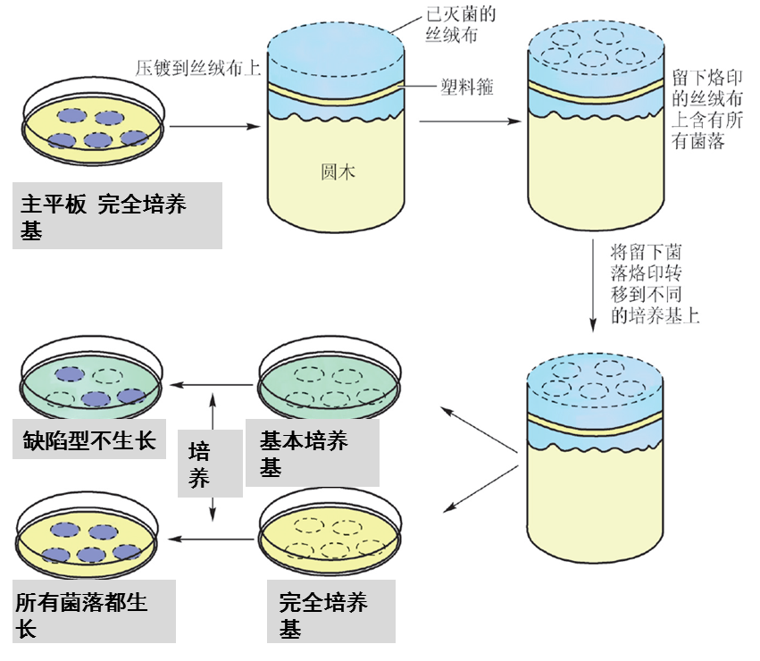

# 微生物诱变育种

**诱变育种**:指利用各种诱变剂处理微生物细胞,提高基因的随机突变率,通过一定的筛选方法获得所需要的高产优质菌株.

+   使用简便有效,使用安全的诱变剂
    +   物理因素
        +   紫外线,X射线等
+   选用优良的触发菌株
+   处理单细胞或单孢子悬浮液
+   使用最佳的处理剂量(一般将致死率控制在$70\%$)
+   设计高效率筛选方案
    +   突变株的筛选
        +   产量突变株的筛选
        +   抗药性突变株的筛选
        +   营养缺陷型突变株的筛选
    +   设置一定的条件,允许突变体生长而野生型不能生长

$$
\large诱变\longrightarrow\stackrel{\underbrace{富集培养(抗生素法)}}{淘汰野生型}\longrightarrow\stackrel{\underbrace{影印平板法}}{检出营养缺陷型
}\longrightarrow\stackrel{\underbrace{生长谱法}}{鉴定营养缺陷型
}
$$

## 淘汰野生型,浓缩营养缺陷型

### 抗生素法

常用的有青霉素法和制霉菌素法

将诱变处理后的细菌接种到含有一定浓度抗生素的基本培养液中,野生型能生长被杀死,营养缺陷型不能生长则被保留而达到浓缩的目的

### 菌丝过滤法

仅适用于真菌

### 差别杀菌法

对于产孢子(或芽孢)的微生物

## 营养缺陷型的检出

### 逐个检出法

将诱变处理后的细胞涂布到完全培养基上，待形成单个菌落后，将这些菌落逐个地分别点种到基本培养基和完全培养基上，对比，挑基本培养基上不长的。

### 限量补充培养法

将处理后的细胞接种在含有微量蛋白胨的基本培养基上，野生型逐渐长成较大的菌落，缺陷型长成较小的菌落，若需筛选某一特定的营养缺陷型，加入某一特定物质即可。

### 影印接种法

## 营养缺陷型的鉴定

### 生长谱法

+   营养缺陷型细胞离心,无菌水清洗
+   稀释后与基本培养基混合,倒平板
+   将平板分区,按区加上微量待鉴定缺陷型所需的营养物(滤纸片法)
+   经培养后观察,若发现某一营养物周围有生长圈,就说明此菌为该营养物的营养缺陷型突变株.