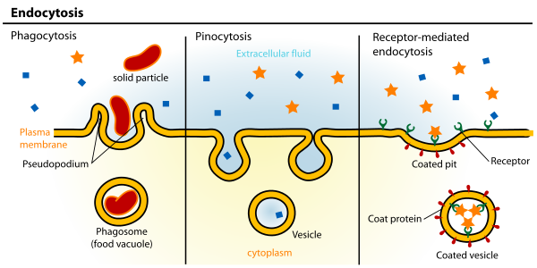
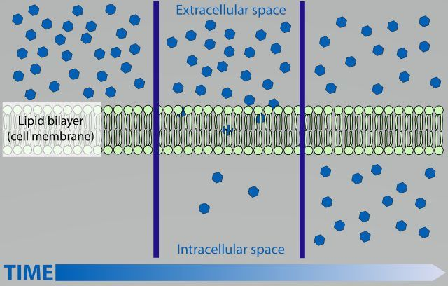
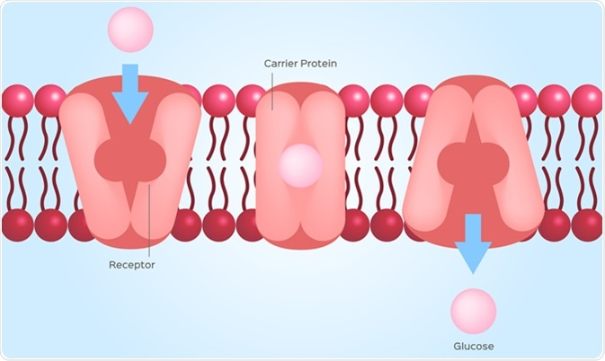
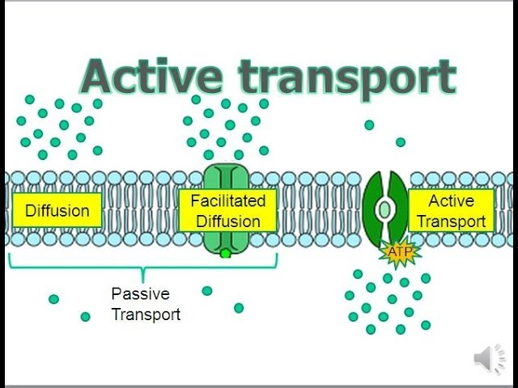
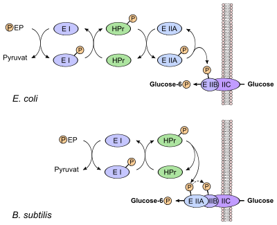

# 微生物摄取营养物质的主要方式

## 胞吞作用

胞外物质通过质膜包裹，质膜内陷并形成膜包被的囊泡，囊泡与质膜脱离进入胞内并在胞内产生一系列的生理活动和生理功能

## 渗透吸收(主要方式)

+   各种营养物质直接通过细胞膜的渗透和选择性吸收进入细胞

### 简单扩散(Simple diffusion)

+   主要依靠膜内外两侧营养物质的浓度差,由高浓度向低浓度运输,最后达到平衡.
+   运输过程不消耗能量,也不发生化学变化,且是非特异性的.
+   简单扩散不是微生物吸收营养物质的主要方式,以这种方式运输的物质主要是$H_2O、CO_2、O_2、$甘油$、$某些氨基酸分子,盐类等.

### 促进扩散(Facilitated Diffusion)

#### 特点

+   需要载体蛋白的参与;
+   高度的立体专一性;
+   不需要能量;
+   载体蛋白能促进物质运输加快进行,但营养物质仍不能逆浓度梯度吸收;
+   通过促进扩散进入细胞的营养物质主要有$SO_4^{2-}、PO_4^{3-}、$糖等.

### 主动运输(Active Transport)

#### 特点

+   需要载体蛋白的参与;
+   高度的立体专一性;
+   需要消耗能量,并且可以逆浓度梯度运输.
+   是一种广泛存在于微生物中的主要物质运输方式.微生物在生长与繁殖过程中所需要的多数营养物质如氨基酸、乳糖$、Na^+、K^+、Ca^{2+}$等主要是通过主动运输的方式运输的.

### 基团运输(Group Translocation)

#### 特点

+   既需要载体蛋白又需要消耗能量的物质运输方式
+   有一个复杂的运输酶系统来完成物质的运输
+   底物在运输过程中发生化学结构变化
+   主要存在于厌氧细菌和兼性厌氧细菌中
+   主要用于糖的运输以及脂肪酸、核苷、碱基等物质的运输

