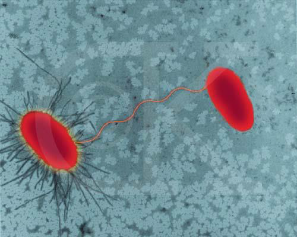
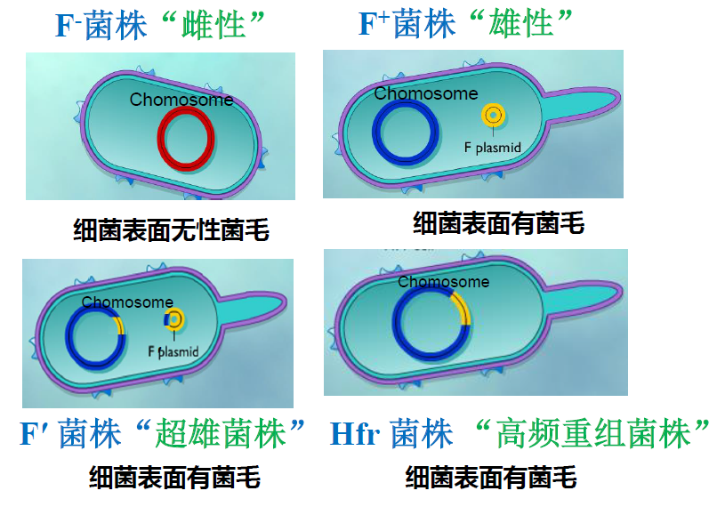
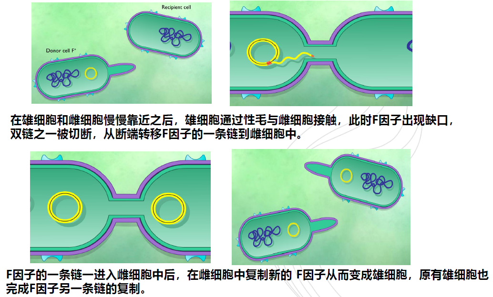
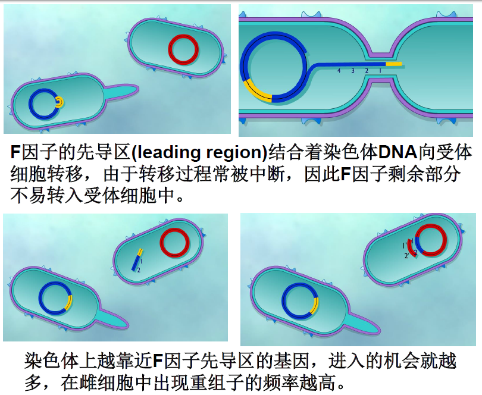
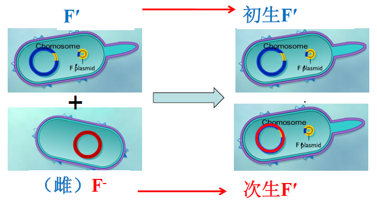

第七章

# **接合(Conjugation)**

通过细胞与细胞的直接接触而产生的遗传信息的转移和重组过程

接合作用是由一种被称为F因子的质粒介导,上面有编码细菌产生性菌毛及控制接合过程进行的20多个基因.

+   F因子特点
    +   可经接合作用而获得
    +   可通过一些理化因素(如EB或丝裂霉素等)的处理,而从细胞中消失
    +   在大肠杆菌中,F因子的DNA含量约占总染色体含量的$2\%$

##### 大肠杆菌F因子的四种细胞形式

##### "$F^\times F^-$"  $\to$ "$F^+ +F^+$"

#### $Hfr\times F^-\to Hfr+F^-$

##### $F'\times F^- \to 初生F\ + 次生F'$

$F'$与雌细胞杂交时,供体的部分染色体基因由$F'$携带着一起转入受体细胞,受体既获得了$F$因子,又获得了来自$F'$菌株的若干遗传性状.以这种接合来传递供体菌基因的方式,称为$F$因子转导、性导

在次生的$F'$群体中,大约有$10\%$的$F'$因子重新整合到染色体组上,而恢复成$Hfr$菌.

第八章

# 固氮微生物类型和代表种类

## 自生固氮菌

自生固氮菌是微生物独自生活时进行的固氮作用，不依赖于植物和其他微生物。

### 代表类型

+   固氮菌属（$Azotobacter$）
+   类芽胞杆菌属和梭菌属

## 联合固氮菌

该类微生物生活在植物根的表面或黏质鞘套内，有的甚至可以进入根的皮层细胞之间，同植物关系密切，但不形成特殊结构。

### 代表类型

固氮螺菌属（$Azospirillum$）

## 共生固氮菌

只有同植物共生时表现出旺盛的固氮活性。

### 代表类型

根瘤菌属，弗兰克氏菌属、鱼腥蓝细菌属。

