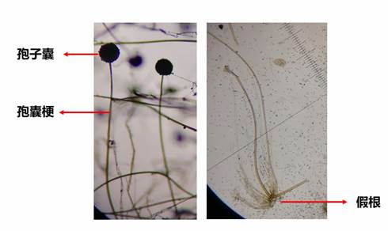
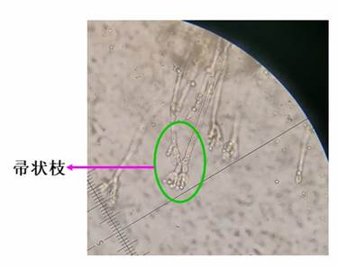
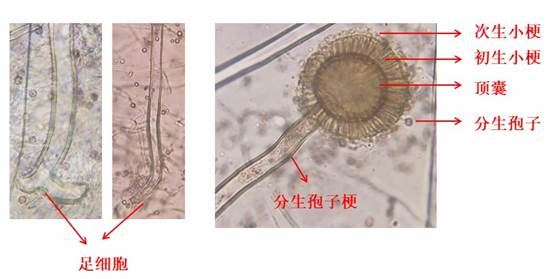
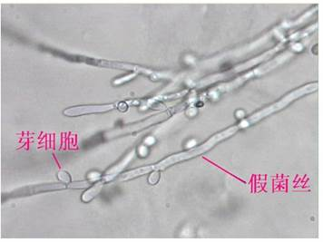
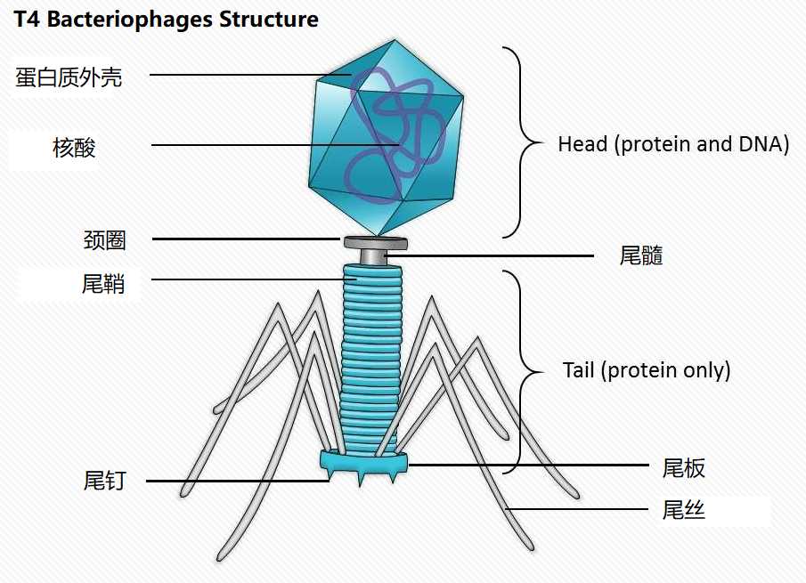
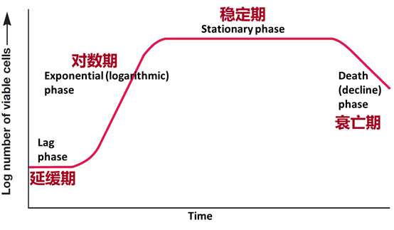
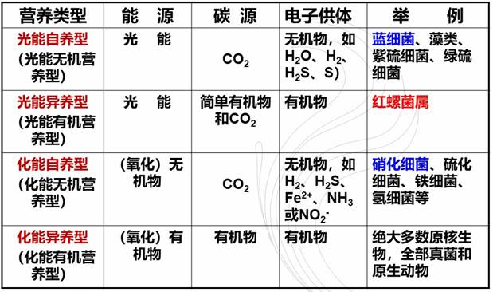
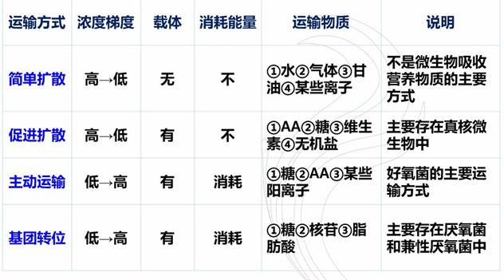

# **绪论、微生物细胞及原核微生物**

**1.** **简述** **Antony van Leeuwenhoek** **、Louis Pasteur、Robert Koch、Alexander Fleming主要科学贡献。**

答：
1)列文虎克首次观察到了细菌；

2)巴斯德是微生物生理学的奠基人，彻底否定了“自然发生学说”，证实发酵是由微生物所引起的，发明了巴氏消毒法，发明了用接种减毒细菌来预防鸡霍乱，牛羊炭疽病，并首次制成了狂犬疫苗；

3) 科赫的贡献：科赫是细菌学的奠基人，建立了培养微生物的方法，分离到多种传染病的病原菌，创立了病原微生物的科赫法则。

4）弗莱明发现了青霉素

 

**2.** **结合生活实际或所学专业知识，简述微生物与人类的关系。**

答：微生物与人类关系的重要性，你怎么强调都不过分，微生物是一把锋利的双刃剑，它们在给人类带来巨大利益的同时，也带来残忍的破坏。一方面，我们可以利用有益微生物为人类造福，在工业上，我们利用微生物酿酒，生产调味品，酶制剂，有机酸，核酸，甚至可以冶金等。在农业上，我们利用根瘤菌接种剂提高土壤肥力，通过构建固氮植物来改进植物特性，利用生物杀虫剂来防治粮食作物的病虫害，提高作物产量。在医药卫生上，用微生物生产的抗生素拯救了无数人的生命，医用上的很多生化药品也是微生物制得的，用微生物制成的疫苗，使许多疾病的蔓延得到控制。日常生活中常喝的酸奶、吃的酱腌菜、腐乳、米酒等都是微生物加工后提供的风味；银耳、木耳、蘑菇、平菇是我们餐桌上的美味佳肴；灵芝、冬虫夏草是治病良药。另一方面，微生物也会对人类造成严重伤害。一些有害细菌和病毒会造成人畜疾病，如口蹄疫，鸡瘟，新型冠状病毒，埃博拉病毒，SARS病毒等。许多细菌、真菌和病毒都能引起植物病害，造成农作物减产甚至颗粒无收。粮食霉烂，食品变质，商品腐烂都是微生物危害的结果。

**3.** **简述革兰氏染色操作步骤、实验结果。**

答：革兰氏染色的操作步骤是：结晶紫初染，碘液媒染，乙醇脱色(关键步骤)，番红复染；

实验结果：$G^+$呈紫色，$G^-$菌呈红色。

**4.** **简述革兰氏阳性细菌与阴性细菌细胞壁结构和组成差异，及革兰氏染色原理。**

答**：$G^+$和$G^-$结构和组成差异：**$G^+$细菌细胞壁由肽聚糖和磷壁酸组成，$G^-$细菌有外壁层和内壁层组成，外壁层主要是脂多糖(LPS)，脂蛋白和类脂，内壁层则是肽聚糖。

>   脂多糖:包括脂质A(毒性中心),中心多糖,特异侧链

**革兰氏染色原理：**G+的细胞壁主要由肽聚糖组成的网状结构组成，壁厚，类脂质含量低，用乙醇脱色时细胞壁脱水，使得肽聚糖层的网状结构孔径缩小，通透性降低，结晶紫-碘的复合物不易细胞而保留在胞内，经脱色和复染后仍保留初染时的蓝紫色。G-细菌细胞壁含有较多易被乙醇溶解的类脂质，而且肽聚糖层较薄，交联度低，故用乙醇脱色时溶解了类脂质，增加了细胞壁通透性，初染的结晶紫-碘的复合物易于渗出就被脱色，番红复染后就呈红色。

**5.** **革兰氏阳性细菌肽聚糖化学组成。**

答：双糖单位：N-乙酰葡萄糖胺（NAG），N-乙酰胞壁酸（NAM），NAG和NAM通过β-1,4糖苷键进行连接。

四肽尾：L-Ala(丙氨酸), D-Glu(谷氨酸), L-Lys(赖氨酸), D-Ala(丙氨酸)

肽桥：甘氨酸五肽(链接L-赖氨酸与D-丙氨酸)

革兰氏阴性菌的四肽尾与革兰氏阳性菌不同的是L-Lys换为二氨基庚二酸(DAP)

革兰氏阴性菌的肽桥是肽键

**6.** **介绍细菌的质粒、芽胞、荚膜、鞭毛的定义、基本结构、功能、特点。**

答：**质粒**是独立存在于染色体外或附加在染色体上的遗传物质。质粒通常是闭合环状的，不含细胞的初级代谢信息，而含有细胞的次级代谢信息，控制细菌的某一遗传性状，可作为基因的转移载体，质粒的特点是能自我复制，稳定遗传，无质粒的细菌可以获得质粒，也可消除，含有相同复制原点的质粒不能共存于同一细胞中，质粒可携带供体细胞的基因进行转移。

**芽胞**是某些细菌在其生长发育后期，在细胞内形成一个圆形或椭圆形，厚壁，含水量极低、抗逆性极强的休眠体。芽胞的亚显微构造包括核芯、皮层、芽胞衣、胞外壁。功能：抗热、抗干燥、抗辐射和抗毒素。特点：芽胞是整个生物界抗逆性最强的生命体，芽胞是细菌的休眠体，在合适条件下可以重新转换为营养体。产芽胞的细菌多为杆菌，也有球菌，芽胞的有无、形态、大小和着生位置是细菌分类和鉴定的重要指标。

>   营养物质浓度低,代谢物浓度高时产生

**荚膜**：包被于某些细菌细胞壁外的一层厚度不定的胶状物质，具有较好结构而不易洗掉，粘性较大，紧密附着在细胞壁外。功能：(含水量高)抗干燥；抗白细胞的吞噬，抗噬菌体的吸附；(主要成分是多糖)贮存养料；作为透性屏障和离子交换系统，使细胞免受金属离子的毒害；表面附着作用；根瘤菌和豆科植物之间的信息识别。特点：与染料的亲和力差，增强致病性，储备多糖。

**鞭毛**：从细胞质膜和细胞壁中伸出细胞外由蛋白质组成的丝状结构，使细菌具有运动性。结构：由鞭毛丝、鞭毛钩和基体组成。功能：运动性。特点：鞭毛纤细，直径为15-20nm，只有借助电子显微镜才能看到，

 

**7.** **简述菌种命名规则。**

答：每一种微生物都用属和种命名，由2个拉丁词组成，属名和种名用斜体表示，属名在前，首字母大写，种名在后，用小写字母。

 

 

**8.** **名词解释：菌落、菌株、纯培养。**

答：**菌落**是指单个微生物在适宜的固体培养基表面或内部生长、繁殖到一定程度，形成肉眼可见的、有一定形态结构的子细胞群体。

**菌株**：是由一个细胞或一个孢子在人工培养基上繁殖而来的群体。

**纯培养**：从一个细胞经过培养繁殖而得到的后代。

**9.** **简述Carl Woese生物分类的三域学说。**

答：Carl Woese根据16s rRNA或18s rRNA将自然界的生命分为三域：细菌域、古菌域和真核生物域。

**10.** **简述古菌与细菌的差异。**

答：在形态上有的差别极大，有的古菌细胞呈扁平直角几何状；中间代谢上，有的古菌细胞含有独特的辅酶，如F420；许多古菌有内含子，而细菌没有；膜结构和成分上，古菌细胞含有二醚而不是酯键；生活环境上，许多古菌喜高温，而大多数细菌不是耐热型的。多数古菌严格厌氧。古菌比细菌进化缓慢，保留了较原始的特性。

**11.从分类地位、形态特征、生理代谢、与人类、环境的关系几个方面介绍Rhizobium、Vibrio cholerae、Escherichia coli、Streptomyces、Lactobacillus、Bacillus thuringiensis、Anabaena。**

| **菌种**                                   | **分类地位**                                 | **形态特征**                                             | **生理代谢**                                                 | **与人类、环境的关系**                                       |
| ------------------------------------------ | -------------------------------------------- | -------------------------------------------------------- | ------------------------------------------------------------ | ------------------------------------------------------------ |
| *Rhizobium*（根瘤菌）                      | 变形细菌门、根瘤菌属                         | 细胞呈杆状，  在根瘤内以类菌体形式存在，呈棒状、T形或Y形 | 好氧型，化能有机营养型。在体内将分子态氮还原为铵态氮，输送到植物其他部位进行同化。 | 可与豆科植物进行共生固氮，减少氮肥的使用，保护环境。         |
| *Vibrio cholerae*（霍乱弧菌）              | γ变形细菌纲、弧菌目、弧菌科、弧菌属          | 菌体短小呈逗点状                                         | 兼性厌氧，能发酵                                             | 可引起霍乱，主要表现为剧烈的呕吐，腹泻，失水，死亡率很高。   |
| *Escherichia coli*（大肠杆菌）             | 变形细菌门、肠杆菌科，埃希氏菌属             | 小杆状                                                   | 兼性厌氧，发酵糖类产酸产气，具周生鞭毛，能运动               | 一般不致病，但当它转移至非正常的部分时也可致病，如引起肾炎、膀胱炎和泌尿道感染。 |
| *Streptomyces*（链霉菌）                   | 放线菌门，链霉菌属                           | 分支丝状体                                               | 多数好氧，化能有机营养，大部分腐生，少数寄生。               | 抗生素的主要生产菌，某些放线菌为人畜或植物的病原菌。         |
| *Lactobacillus*（乳杆菌）                  | 厚壁菌门，芽胞杆菌纲，乳杆菌目，乳杆菌属。   | 小杆菌，不产鞭毛，无芽胞，                               | 兼性厌氧                                                     | 可以进行同型乳酸发酵                                         |
| *Bacillus thuringiensis*（苏云金芽胞杆菌） | 厚壁菌门，芽胞杆菌纲，芽胞杆菌目，芽胞杆菌属 | 椭圆形杆状，短链或长链状排列                             | 好氧，化能异养，具周生鞭毛，能运动，产芽胞。                 | 产生生物杀虫剂，用于害虫的防治                               |
| *Anabaena*（鱼腥蓝细菌）                   | 蓝细菌门，鱼腥蓝细菌属                       | 细胞呈球形，在平行面上分裂形成链状丝藻体，有异性胞       | 光能营养，光合作用产氧。                                     | 红萍鱼腥蓝细菌生活在红萍体腔中，能固氮，故红萍可做饲料和肥料。 |

 

**12.** **翻译Azotobacter、Thiobacillus、Mycoplasma、Rickettsia、Chlamydia、Clostridium、Staphylococcus、Methanobacterium**

答：依次为固氮菌，硫杆菌，支原体，立克次氏体，衣原体，梭菌，葡萄球菌，甲烷细菌属

# **真核微生物和病毒**

**1、**    **无隔膜菌丝，有隔膜菌丝各见于哪几类真菌。**

答：无隔膜菌丝常见于绵霉，根霉，毛霉等**低等真菌**；有隔膜菌丝常见于链孢霉，青霉、曲霉**高等真菌**。

**2.真菌菌丝的变态有哪几种。**

答：匍匐枝和菌根(假根)(根霉)，吸器(寄生细胞内)，附着胞(寄生细胞外)、附着枝、菌核(休眠体,储藏营养物质)、菌环和菌网(捕虫)，子座、子实体(产生有性孢子)

**3. 真菌无性孢子类型，各见于哪个类群。**

游动孢子，如卵菌门的绵霉；`->水生`

孢囊孢子，如接合菌门的根霉和毛霉；`->孢子囊-孢囊梗`

分生孢子，如半知菌门的青霉和曲霉；`->帚状枝;孢子-初生小梗-次生小梗-顶囊` `分生孢子梗`

厚垣孢子，如总状毛霉；

节孢子, 如白地霉

**4.** **真菌有性生殖过程，有性孢子类型，各见于哪个类群。**

答：真菌的有性生殖过程为：**质配**、**核配**和**减数分裂**；

有性孢子类型：卵孢子、接合孢子、子囊孢子和担孢子

卵孢子可见于卵菌门的绵霉，
接合孢子可见于接合菌门的根霉和毛霉，
子囊孢子可见于子囊菌门的酵母菌属和脉胞菌属、赤霉属和虫草属；
担子菌可见于担子菌门的伞菌属、木耳属等。

**5.** **简介Ainsworth在1966年提出的真菌分类体系。**

答：真菌独立为真菌界，下有壶菌门、接合菌门、子囊菌门、担子菌门和半知菌门。

**6.** **从分类、营养体形态、无性生殖、有性生殖、生活环境（或与人类关系）几个方面介绍以下真菌：节壶菌、毛霉与根霉、脉孢菌、酿酒酵母、伞菌、曲霉与青霉。**

| **菌种**   | **分类** | **营养体形态**                     | **无性生殖**           | **有性生殖** | **生活环境（与人类的关系）**                                 |
| ---------- | -------- | ---------------------------------- | ---------------------- | ------------ | ------------------------------------------------------------ |
| 节壶菌     | 壶菌门   | 单细胞，球形                       | 游动孢子               | 休眠孢子囊   | 水生、腐生、少数寄生，引起植物病害                           |
| 毛霉与根霉 | 接合菌门 | 菌丝体                             | 孢囊孢子               | 接合孢子     | 腐生或寄生，土壤、空气中都有，有的可用于发酵，有的可引起食物霉变，变质 |
| 脉胞菌     | 子囊菌门 | 气生菌丝有横隔，呈二叉式分枝       | 分生孢子               | 子囊孢子     | 是遗传研究的好材料，制成稻草曲，用作饲料。玉米轴上很容易滋生这种真菌。 |
| 酿酒酵母   | 子囊菌门 | 单细胞，圆形或椭圆形               | 芽殖或裂殖 `假丝` | 子囊孢子     | 分布广泛，最喜欢生长在含糖较高的水果、蔬菜上。用途广泛，除酿酒外，可用于发面做馒头、面包。 |
| 伞菌       | 担子菌门 | 菌丝有隔膜，分为初生菌丝和次生菌丝 | 无性过程不发达或不发生 | 担孢子       | 分布广泛，营腐生或寄生，与人类关系密切，有的是植物的病原菌，有的可食用或药用。 |
| 曲霉与青霉 | 半知菌门 | 菌丝体有横隔和分枝                 | 分生孢子 `帚状枝` | 未发现       | 广泛分布，大多数是腐生菌，可引起食物霉变，也可用于工业菌种，生产抗生素等。 |

>   高级真菌菌丝有隔膜,如曲霉,青霉
>   低级真菌菌丝无隔膜,如根霉,毛霉

 

**7.** **实验课所观察的真菌要求能画出形态，并标注各结构名称。**

答：根霉：假根、孢子囊、孢囊梗，匍匐枝等；青霉：帚状枝，分生孢子；黑曲霉：顶囊，分生孢子梗，足细胞；假丝酵母：假菌丝、芽细胞。

**8.** **病毒基本结构及其化学组成。**

答：病毒的基本结构：主要由**壳体**和**核酸**组成，合称为**核衣壳**。有的在壳体外还有**包膜**和**刺突**。

化学组成：病毒蛋白、病毒核酸、糖类和脂类。

**9.** **病毒粒的壳体结构基本形态。**

答：病毒粒壳体结构的基本形态：螺旋对称、二十面体对称、复合对称。

**10.图示大肠杆菌T4噬菌体结构和各部分名称。**

**11.** **烈性噬菌体侵染宿主细胞的基本过程。**

答：吸附、侵入、复制、装配、释放。

**12.** **名词解释：烈性噬菌体 Virulent phage、温和噬菌体 lysogenic phage、原噬菌体 Prophage、溶源性 lysogeny、溶源细菌 Lysogenic bacterium、一步生长曲线 one step growth curve**

答：**烈性噬菌体**Virulent phage：侵入寄主细胞后，引起寄主细胞代谢发生改变，在寄主细胞内复制其核酸、蛋白质，装配成新的噬菌体，最终引起寄主细胞裂解而释放大量子代噬菌体

**温和噬菌体** lysogenic phage：噬菌体侵入细菌后，由于前者的基因组整合到后者的基因组上，并随后者的复制而得到同步复制，这种噬菌体的侵入并不引起宿主细胞的裂解

**原噬菌体** Prophage：已整合到宿主基因组上的噬菌体核酸

**溶源性** lysogeny：温和噬菌体感染细菌后，与其寄主细胞共存的现象

**溶源细菌** Lysogenic bacterium：含有温和噬菌体的寄主细胞

**一步生长曲线**（one step growth curve）:指能定量描述烈性噬菌体生长规律的实验曲线。

**13.** **什么是亚病毒，有哪几种。**

答：只含有核酸或者蛋白质其中一种成分的病毒，称之为亚病毒。 亚病毒的种类有：类病毒、阮病毒、卫星病毒和卫星核酸。

---

昆虫病毒病的一个相当普遍的特点是在被感染的动物细胞中形成**包含体**

---

**微生物的生长和环境条件**

**1.** **获得微生物纯培养的方法。**

答：稀释涂布平板法，稀释倒平板法，划线分离法，利用选择培养基分离，单细胞分离法

**2.** **绘制细菌生长曲线，注明每个阶段的名称，及各阶段细菌在数量、生理上的特点。**

答：如上图所示，**延缓期**：细胞数目基本不增加，合成代谢十分活跃，特别是合成一些必须酶类，细胞体积增大，原生质均匀一致，对外界不良环境较敏感，如NaCl的浓度，温度和抗生素等较敏感。

**对数期**：细胞数目呈指数增长。代时最短，生长速度最高；细胞进行平衡生长，故菌体各部分成分较均匀；酶系活跃，代谢旺盛。

**稳定期**：细胞新生速度等于细胞死亡速度。活菌数总量达到最大值，细胞储藏物开始形成，产芽胞细菌开始形成芽胞，有些菌开始合成次生代谢产物，如抗生素、维生素等。

**衰亡期**：个体死亡速度大于新生速度，整个群体呈现负增长。细胞形态多样，出现畸形，细胞开始自溶，芽胞开始大量释放。

**3.** **列举几种测定微生物数量的方法和各自特点。**

答：显微镜直接计数法和比浊法，只能测总菌数，不能区分是活菌还是死菌，优点是测量速度快；

稀释平板计数法、最大概率数法和滤膜法，均可以测量活菌数，稀释平板计数法应用最广泛，最大概率书法适用于测量活菌少或在固体培养基上不易生长的菌，滤膜法适用于测量空气、水体等含菌较少的样品。

**4.** **常用灭菌方法有哪些，灭菌条件和适用范围。**

答：常用灭菌方法有干热灭菌法和湿热灭菌法。干热灭菌法包括烘箱热空气法和火焰灭菌法。烘箱热空气法是指160-180℃处理2h，适用于玻璃、金属等耐热物品的消毒，优点是可以保持物品干燥。火焰灭菌法分为灼烧和焚烧两种。灼烧适用于耐烧物品（如接种针、金属器具、试管口和瓶口等）。焚烧是直接点燃或在焚烧炉内焚烧。适用于传染病畜禽及实验感染动物的尸体及其他污染的废弃物等。湿热灭菌法有高压蒸汽灭菌，121℃处理15-30min，可杀死细菌芽胞在内的所用微生物，是高温灭菌中最常见、最可靠的灭菌法。煮沸消毒法使指100℃，15min以上，适用于解剖用具、注射器及家庭餐具的消毒。间隙灭菌法指100 ℃,30-60min，间歇24h，再灭一次，重复3次，以杀死由芽胞萌发的营养体。巴氏消毒法是指用较低的温度处理牛奶、饮料，以杀死其中的病原菌如结核杆菌、伤寒杆菌等，但又不损害其营养和风味。分为低温维持巴氏消毒法：62-63 ℃，保持30分钟，高温瞬时巴氏消毒法，72℃保持15s，超高温巴氏消毒法：136-140℃保持1-2s。

**5.** **根据对氧气需求，微生物可分为哪几类。**

答：根据对氧气的需求，微生物可分为专性好氧菌，微好氧菌，兼性厌氧菌，耐氧厌氧菌，专性厌氧菌等五类。

**6.** **名词解释：代时、致死温度、最适生长温度。**

答：代时：细菌在对数期繁殖一代所需要的时间。

致死温度：细菌在10分钟内杀死细菌需要的高温界限。

最适生长温度：最适合微生物生长的温度。

**7.** **哪些物理、化学因素会影响微生物生长。**

答：影响微生物生长的物理和化学因素有：温度、pH、水活度及渗透压、O_2，Eh值，超声波，光及射线，化学物质。

 

**微生物的营养与代谢、**

**1．**    **微生物需要哪几类营养物质。**

答：微生物需要水，碳源、氮源、矿物质元素、生长因子(如维生素)和氧。

 

**2．**    **微生物四种营养类型各自特点和代表菌种。**

**3．**    **微生物吸收营养物质的有哪几种方式，和各自特点。**

**4.**  **配制培养基应遵循那些原则。**

答：目的明确，物理化学条件合适，营养物浓度和比例协调，灭菌处理，经济节约。

**5.**  **名词解释：生长因子、天然培养基、合成培养基、半固体培养基。**

答：**生长因子**：微生物不能从普通的碳源、氮源合成，必须从外界直接获取这种物质或其前体才能满足生长需要的小分子化合物，如维生素、碱基、氨基酸等。

**天然培养基**：含有化学成分不清楚或不恒定的天然有机物的培养基；

**合成培养基**：由化学成分完全已知的试剂配成的培养基；

**半固体培养基**：琼脂含量只有0.2%-0.5%，培养基呈现出在容器倒放时不致下流，但在剧烈震荡后则能破损的状态，这种固体培养基称为半固体培养基。

---

:star:实验设计: 

根据所学知识设计合适培养基将土壤样品中的大肠杆菌、苏云金芽胞杆菌、霉菌和自生固氮菌分离,获得纯培养.

+   大肠杆菌
    +   伊红美蓝培养基
+   苏云金芽孢杆菌
    +   氨苄青霉素培养基
+   霉菌
    +   含链霉素的马丁氏培养基
+   自生固氮菌
    +   不含氮源的培养基

---

**6.**  **光合磷酸化有哪几种类型，代表生物有哪些？**

答：光合磷酸化有非环式光合磷酸化，如蓝细菌；

环式光合磷酸化，如红螺菌属，绿菌属

噬盐菌的紫膜光合磷酸化：极端噬盐古菌

**7.**  **发酵、无氧呼吸和有氧呼吸的定义、特点。**

答：发酵的定义：在无氧等外源氢受体的条件下，底物脱氢后所产生的还原力[H]未经呼吸链传递而直接交某一内源性中间代谢物接受，以实现底物水平磷酸化产能的一类生物氧化反应；特点：底物水平磷酸产能；电子受体为中间代谢产物；底物氧化不彻底，只产生部分能量。

无氧呼吸的定义：以氧以外的其他氧化型化合物作为最终电子受体的氧化作用；特点：能量生成效率低于有氧呼吸。

有氧呼吸的定义：微生物氧化底物时以氧气作为最终电子受体的氧化作用；

特点：有氧存在，底物氧化得很彻底，产能效率高。

\8.  微生物进行合成代谢的三要素是什么？

答：ATP，还原力和小分子碳骨架。

**9.**  **丙酮酸代谢途径有哪些。**

答：丙酮酸的代谢途径：有氧条件下进入三羧酸循环，进一步氧化分解，产生ATP、还原力和小分子碳骨架；无氧条件下进行发酵作用，产生发酵产物并释放部分能量。

**10.** **细菌肽聚糖合成三个阶段各在细胞中什么部位进行，各生成什么产物。**

答：第一阶段在细胞质中，合成UDP-NAG和UDP-NAM-五肽

第二阶段在细胞膜上，合成完整的肽聚糖单体；

第三阶段在膜外细胞壁生长点处：合成肽聚糖

**11.** **名词解释：分解代谢、合成代谢、生物氧化、抗生素。**

答：分解代谢：是指营养物质分子分解成为较简单的小分子物质的过程，也称异化作用；

合成代谢是指营养物质分子合成为较为复杂的体内大分子化合物的代谢过程，也称为同化作用。

生物氧化：物质在生物体内经过一系列连续的氧化还原反应逐步分解并释放出能量的过程。

抗生素：是对其他种类微生物或细胞能产生抑制或致死作用的一大类有机化合物。

**微生物的遗传与变异**

**1.**    **证明DNA是遗传信息的载体有哪几个经典实验。**

答：肺炎链球菌的转化实验，烟草花叶病毒的拆开与重建实验，噬菌体感染实验

**2.**    **比较原核微生物和真核微生物基因组的不同。**

答：原核微生物和真核微生物基因组的不同之处如下表所示：

| 基因组性状 | 原核微生物          | 真核微生物                   |
| ---------- | ------------------- | ---------------------------- |
| 染色体     | 双链环状DNA，单倍体 | 典型的真核染色体结构，二倍体 |
| 遗传信息   | 连续                | 有间隔区                     |
| 操纵子     | 有                  | 无                           |
| 结构基因   | 单拷贝              | 有的多拷贝                   |
| 重复序列   | 少而短              | 多                           |

 

**3.**    **质粒的定义、类型。**

答：质粒是染色体外能独立自主复制的遗传成分，大多以环状双螺旋的DNA形式存在。

质粒的类型包括致育因子、抗性因子、细菌素质粒、降解质粒、共生质粒、毒性质粒。

**4.**    **名词解释：转座因子、基因、基因组、准性生殖。**

答：转座因子：具有在染色体不同部位间移动能力的遗传成分。

基因：基因是遗传的最小功能单位，它是一段特定的DNA序列。

基因组：一种生物的全部核苷酸序列，它同时包含了编码基因的序列和不编码任何基因的DNA序列。

准性生殖：真菌在无性繁殖过程中的一种遗传性状重新组合的机制，即不经过减数分裂就能导致基因重组的生殖过程。

**5.Transformation的定义、基本过程。**

答：转化是指外源DNA不经过任何媒介，直接吸收到受体细胞的过程。

基本过程：

A、 获得外源DNA片段

B、制备感受态细胞（CaCl2处理细胞或是10%的甘油处理细胞）；

C、热激转化或电转化。

**6. Transduction的定义，普遍转导和局限转导的差异。**

答：转导：指通过噬菌体介导的DNA在不同细菌细胞间转移和基因重组的现象。

普遍转导和局限转导的差异：

① 局限转导中被转导的基因与噬菌体DNA一起被导入受体细胞中（错误切离），

   普遍性转导包装的可能全部是宿主菌的基因（错误包装）。

②   局限性转导颗粒携带特定的染色体片段并将固定的个别基因导入受体

  普遍性转导携带的宿主基因具有随机性。

\7. **Conjugation****的定义，大肠杆菌有哪几种F质粒接合类型。**

答：接合：通过细胞与细胞的直接接触而产生的遗传信息的转移和重组现象。

大肠杆菌的F质粒接合类型：“F+×F-”→“F+ ＋ F+ ”；

“Hfr×F-” →“Hfr ＋ F- ”； “F′×F-” →“初生F′＋ 次生F′”

**8.** **真核生物基因重组有哪些方式。**

答：真核生物基因重组的方式：有性生殖（质配、核配及减数分裂）和准性生殖。

 

**微生物的生态**

**1.**  **微生物在生态系统中可起到那些作用**

答：微生物是物质循环中的重要成员，是有机物的主要分解者，是生态系统中的初级生产者，是物质和能量的贮存者，在地球生物演化中发挥重要作业。

**2.**  **名词解释：生物群落、根圈效应。**

答：生物群落：包括动物、植物和微生物。

根圈效应：生活在根圈中的微生物，在种类、数量和活性上都有所不同，表现出一定的特异性。

**3.**  **为什么说土壤是微生物生活的“天然培养基”。**

答：土壤含有丰富的矿物质元素，一定的水分，适宜的温度（15-25℃），良好的通气条件，合适的pH值（5.5-8.5），还有动植物和微生物残体。

**4.**  **微生物之间有哪几种相互关系，举例说明。**

答：微生物之间有8种相互关系：

中性关系： 休眠的芽胞、厚垣孢子之间

偏利关系：兼性厌氧微生物与厌氧微生物之间

协同关系：土壤中的纤维素分解菌和固氮菌之间

共生关系：地衣（蓝细菌和真菌共生）

寄生关系：噬菌体与细菌之间

竞争关系：**星杆藻和小环藻之间会竞争P元素**

捕食关系：原生动物捕食细菌

拮抗关系：产黄青霉产生的青霉素可以抑制G+细菌的生长。

 

**5.**  **举例说明微生物与植物间的相互关系。**

答：微生物与植物间的相互关系有：1）互生关系：根际微生物与植物根系之间的关系；2）共生关系：根瘤菌和豆科植物的根，真菌与植物的根（外生菌根和内生菌根）；3）寄生关系：病原真菌、细菌和病毒寄生在植物体内，引起植物病害。

**6.**  **固氮微生物类型和代表种类** 

答：自生固氮微生物，如固氮菌属，类芽胞杆菌属和梭菌属；

共生固氮微生物：如根瘤菌属，弗兰克氏菌属，鱼腥蓝细菌属

联合固氮微生物：如固氮螺菌属。

**7.**  **举例说明微生物与人和动物之间的关系。**

答：微生物与人和动物之间的关系：1）互生关系：人体肠道正常菌群与宿主之间；2）共生关系：牛羊等反刍动物的瘤胃和微生物之间的关系；3）寄生关系：冬虫夏草（子囊菌寄生在鳞翅目幼虫体内）

**8.**  **微生物在自然界的碳元素循环中起到哪些作用。**

答：将二氧化碳合成有机物，将含碳有机物分解成二氧化碳。

**9.**  **固氮作用、硝化作用、反硝化作用、氨化作用和硝酸盐的同化还原等过程的定义、反应方程式、由哪些微生物完成。**

答：固氮作用：大气中的分子态氮在生物体内由固氮酶还原成氨态氮的过程。由固氮微生物完成。

 

 

硝化作用：微生物将氨态氮氧化成硝酸盐的过程。由亚硝化细菌和硝化细菌完成。

反硝化作用：微生物将硝酸盐还原成分子态氮和一氧化氮的过程。由反硝化细菌完成。

氨化作用：微生物分解有机含氮化合物产生氨的过程。由氨化细菌完成。

硝酸盐的同化还原：氨态氮和硝态氮被微生物吸收，合成有机含氮化合物的过程。细菌和真菌都能完成。

