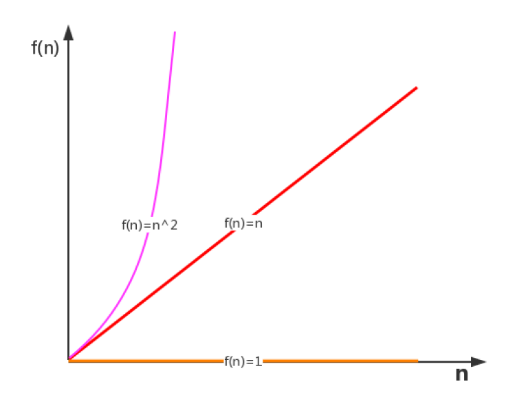
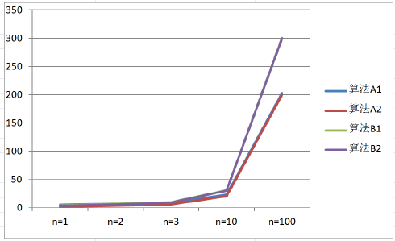
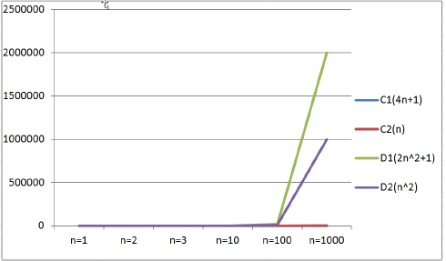
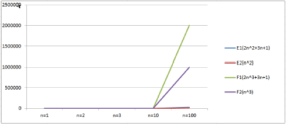
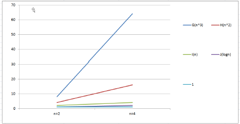
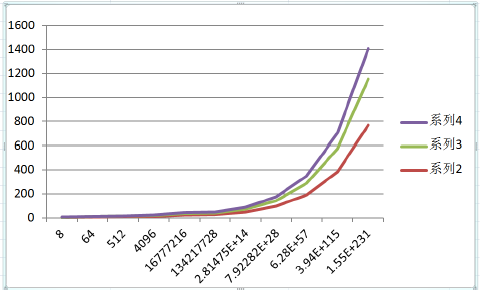
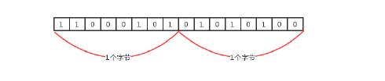
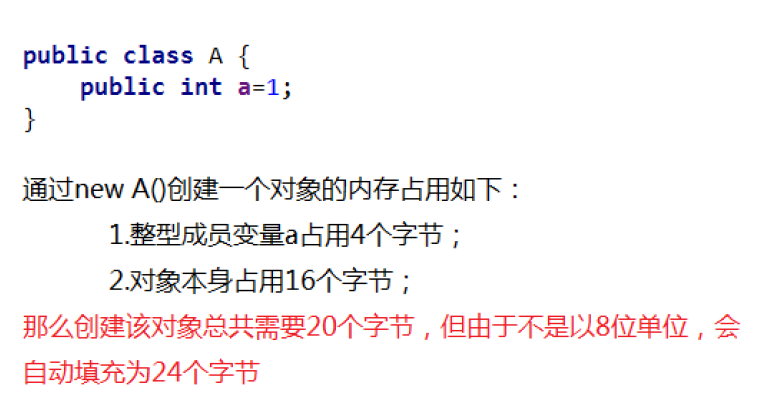

[TOC]

# 算法分析

前面我们已经介绍了，研究算法的最终目的就是如何花更少的时间，如何占用更少的内存去完成相同的需求，并且
也通过案例演示了不同算法之间时间耗费和空间耗费上的差异，但我们并不能将时间占用和空间占用量化，因此，
接下来我们要学习有关算法时间耗费和算法空间耗费的描述和分析。有关算法时间耗费分析，我们称之为算法的时
间复杂度分析，有关算法的空间耗费分析，我们称之为算法的空间复杂度分析。

## 算法的时间复杂度分析

我们要计算算法时间耗费情况，首先我们得度量算法的执行时间，那么如何度量呢？

### 事后分析估算方法

比较容易想到的方法就是我们把算法执行若干次，然后拿个计时器在旁边计时，这种事后统计的方法看上去的确不
错，并且也并非要我们真的拿个计算器在旁边计算，因为计算机都提供了计时的功能。这种统计方法主要是通过设
计好的测试程序和测试数据，利用计算机计时器对不同的算法编制的程序的运行时间进行比较，从而确定算法效率
的高低，但是这种方法有很大的缺陷：必须依据算法实现编制好的测试程序，通常要花费大量时间和精力，测试完
了如果发现测试的是非常糟糕的算法，那么之前所做的事情就全部白费了，并且不同的测试环境(硬件环境)的差别
导致测试的结果差异也很大。

```java
public static void main(String[] args) {
    long start = System.currentTimeMillis();
    int sum = 0;
    int n = 100;
    for (int i = 1; i <= n; i++) {
        sum += i;
    }
    System.out.println("sum=" + sum);
    long end = System.currentTimeMillis();
    System.out.println(end - start);
}
```

### 事前分析估算方法

在计算机程序编写前，依据统计方法对算法进行估算，经过总结，我们发现一个高级语言编写的程序程序在计算机
上运行所消耗的时间取决于下列因素

1.   算法采用的策略和方案
2.   编译产生的代码质量
3.   问题的输入规模(所谓的问题输入规模就是输入量的多少)
4.   机器执行指令的速度

由此可见，抛开这些与计算机硬件、软件有关的因素，一个程序的运行时间依赖于算法的好坏和问题的输入规模。
如果算法固定，那么该算法的执行时间就只和问题的输入规模有关系了。

我么再次以之前的求和案例为例，进行分析。

需求
计算1到100的和

第一种解法

```java
/**
     * 如果输入量为n为1，则需要计算1次;
     * 如果输入量n为1亿，则需要计算1亿次;
     */
public static void main(String[] args) {
    //执行1次
    int sum = 0;
    //执行1次
    int n = 100;
    //执行了n+1次
    for (int i = 1; i <= n; i++) {
        //执行了n次
        sum += i;
    }
    System.out.println("sum=" + sum);
}
```

第二种解法

```java
/**
  * 如果输入量为n为1，则需要计算1次
  * 如果输入量n为1亿，则需要计算1次
  */
public static void main(String[] args) {
    int sum = 0;//执行1次
    int n = 100;//执行1次
    sum = (n + 1) * n / 2;//执行1次  
    System.out.println("sum=" + sum);
}
```

因此，当输入规模为 $n$ 时，第一种算法执行了 $1+1+(n+1)+n=2n+3$ 次；第二种算法执行了 $1+1+1=3$ 次。如果我们把第一种算法的循环体看做是一个整体，忽略结束条件的判断，那么其实这两个算法运行时间的差距就是 $n$ 和 $1$ 的差距。
为什么循环判断在算法 $1$ 里执行了 $n+1$ 次，看起来是个不小的数量，但是却可以忽略呢？

我们来看下一个例子：需求：
计算 $100个1+100个2+100个3+\cdots 100个100$ 的结果
代码：

```java
public static void main(String[] args) {
    int sum = 0;
    int n = 100;
    for (int i = 1; i <= n; i++) {
        for (int j = 1; j <= n; j++) {
            sum += i;
        }
    }
    System.out.println("sum=" + sum);
}
```


上面这个例子中，如果我们要精确的研究循环的条件执行了多少次，是一件很麻烦的事情，并且，由于真正计算和的代码是内循环的循环体，所以，在研究算法的效率时，我们只考虑核心代码的执行次数，这样可以简化分析。

我们研究算法复杂度，侧重的是当输入规模不断增大时，算法的增长量的一个抽象(规律)，而不是精确地定位需要执行多少次，因为如果是这样的话，我们又得考虑回编译期优化等问题，容易主次跌倒。

我们不关心编写程序所用的语言是什么，也不关心这些程序将跑在什么样的计算机上，我们只关心它所实现的算法。这样，不计那些循环索引的递增和循环终止的条件、变量声明、打印结果等操作，最终在分析程序的运行时间时，最重要的是把程序看做是独立于程序设计语言的算法或一系列步骤。我们分析一个算法的运行时间，最重要的就是把核心操作的次数和输入规模关联起来。



### 函数渐进增长

#### 概念

给定两个函数 $f(n)$ 和 $g(n)$ , 如果存在一个整数 $N,$ 使得对于所有的 $n>N,f(n)$ 总是比 $g(n)$ 大 , 那么我们说 $f(n)$ 的增长渐近快于 $g(n)$ 

概念似乎有点艰涩难懂，那接下来我们做几个测试。

测试一：
	假设四个算法的输入规模都是$n$

1.	算法 $A1$ 要做 $2n+3$ 次操作,可以这么理解先执行 $n$ 次循环,执行完毕后,再有一个 $n$ 次循环,最后有 $3$ 次运算
2.	算法 $A2$ 要做 $2n$ 次操作
3.	算法 $B1$ 要做 $3n+1$ 次操作,可以这个理解:先执行 $n$ 次循环,再执行一个 $n$ 次循环,再执行一个 $n$ 次循环,最后有1次运算.
4.	算法 $B2$ 要做 $3n$ 次操作;


| 输入规模 | 算法 $A1(2n+3)$ 执行次数 | 算法 $A2(2n)$ 执行次数 | 算法 $B1(3n+1)$ 执行次数 | 算法 $B2(3n)$ 执行次数 |
| :---: | :---: | :---: | :---: | :---: |
| $n=1$ | $5$ | $2$ | $4$ | $3$ |
| $n=2$ | $7$ | $4$ | $7$ | $6$ |
| $n=3$ | $6$ | $10$ | $9$ | $9$ |
| $n=10$ | $20$ | $31$ | $30$ | $30$ |
| $n=100$ | $9$ | $200$ | $301$ | $300$ |



通过数据表格，比较算法A1和算法B1：
  当输入规模 $n=1$ 时，A1需要执行5次，B1需要执行4次，所以A1的效率比B1的效率低；
  当输入规模 $n=2$ 时，A1需要执行7次，B1需要执行7次，所以A1的效率和B1的效率一样；
  当输入规模 $n>2$ 时，A1需要的执行次数一直比B1需要执行的次数少，所以A1的效率比B1的效率高；   
所以我们可以得出结论：

**当输入规模 $\boldsymbol{n>2}$ 时，算法 A1 的渐近增长小于算法 B1 的渐近增长**

通过观察折线图，我们发现，随着输入规模的增大，算法A1和算法A2逐渐重叠到一块，算法B1和算法B2逐渐重叠到一块，所以我们得出结论：

**随着输入规模的增大，算法的常数操作可以忽略不计**

测试二
假设四个算法的输入规模都是 n

1.	算法C1需要做 $4n+8$ 次操作
2.	算法C2需要做 $n$ 次操作
3.	算法D1需要做 $2n^2$ 次操作
4.	算法D2需要做 $n^2$ 次操作



通过数据表格，对比算法C1和算法D1：

当输入规模 $n\leq 3$ 时，算法C1执行次数多于算法D1，因此算法C1效率低一些 
当输入规模 $n>3$ 时，算法C1执行次数少于算法D1，因此，算法D2效率低一些，   所以，总体上，算法C1要优于算法D1.

通过折线图，对比对比算法C1和C2：
	随着输入规模的增大，算法C1和算法C2几乎重叠

通过折线图，对比算法C系列和算法D系列：
	随着输入规模的增大，即使去除 $n^2$ 前面的常数因子，D系列的次数要远远高于C系列。  

因此，可以得出结论：
  随着输入规模的增大，与最高次项相乘的常数可以忽略

测试三：
假设四个算法的输入规模都是 $n$

​	算法E1:
 	 $2n^2+3n+1$

​	算法E2：
 	 $n^2$

​	算法F1：
 	 $2n^3+3n+1$

​	算法F2：
 	 $n^3$

那么上述算法，哪个更快一些？



通过数据表格，对比算法E1和算法F1：

  当n=1时，算法E1和算法F1的执行次数一样；
  当n>1时，算法E1的执行次数远远小于算法F1的执行次数；

所以算法E1总体上是由于算法F1的

通过折线图我们会看到，算法F系列随着n的增长会变得特块，算法E系列随着n的增长相比较算法F来说，变得比较慢，所以可以得出结论

​	**最高次项的指数大的，随着n的增长，结果也会变得增长特别快**

测试四
假设五个算法的输入规模都是 $n$

​	  算法G
​	  $n^3$

​	  算法H
​	  $n^2$

​	  算法I
​	  $n$

​	  算法J
​	  $\log n$

​	  算法K
​	  $1$

那么上述算法，哪个效率更高呢？



通过观察数据表格和折线图，很容易可以得出结论

​		算法函数中 $n$ 最高次幂越小，算法效率越高

总上所述，在我们比较算法随着输入规模的增长量时可以有以下规则

1.	算法函数中的常数可以忽略
2.	算法函数中最高次幂的常数因子可以忽略
3.	算法函数中最高次幂越小 算法效率越高

### 算法时间复杂度
#### 大O记法
定义

在进行算法分析时，语句总的执行次数 $T(n)$ 是关于问题规模 $n$ 的函数，进而分析 $T(n)$ 随着 $n$ 的变化情况并确定 $T(n)$ 的量级。算法的时间复杂度，就是算法的时间量度，记作 $:T(n)=O(f(n)).$ 它表示随着问题规模 $n$ 的增大，算法执行时间的增长率和 $f(n)$ 的增长率相同，称作算法的渐近时间复杂度，简称时间复杂度，其中 $f(n)$ 是问题规模 $n$ 的某个函数

  在这里，我们需要明确一个事情：执行次数 = 执行时
  用大写 $O()$ 来体现算法时间复杂度的记法，我们称之为大O记法. 一般情况下 , 随着输入规模 $n$ 的增大 $,T(n)$ 增长最慢的算法为最优算法。

下面我们使用 $O$ 表示法来表示一些求和算法的时间复杂度

算法一

```java
public static void main(String[] args) {
    int sum = 0;//执行1次
    int n = 100;//执行1次
    sum = (n + 1) * n / 2;//执行1次
    System.out.println("sum=" + sum);
}
```

算法二

```java
public static void main(String[] args) {
    int sum = 0;//执行1次
    int n = 100;//执行1次
    for (int i = 1; i <= n; i++) {
        sum += i;//执行了n次
    }
    System.out.println("sum=" + sum);
}
```

算法三

```java
public static void main(String[] args) {
    int sum = 0;//执行1次
    int n = 100;//执行1次
    for (int i = 1; i <= n; i++) {
        for (int j = 1; j <= n; j++) {
            sum += i;//执行n^2次
        }
    }
    System.out.println("sum=" + sum);
}
```

如果忽略判断条件的执行次数和输出语句的执行次数，那么当输入规模为 $n$ 时，以上算法执行的次数分别为

算法一 $:3$ 次
算法二 $:n+3$ 次
算法三 $:n^2+2$ 次

如果用大 $O$ 记法表示上述每个算法的时间复杂度，应该如何表示呢？基于我们对函数渐近增长的分析，推导大 $O$ 阶的表示法有以下几个规则可以使用

1.	用常数1取代运行时间中的所有加法常数
2.	在修改后的运行次数中, 只保留高阶项
3.	如果最高阶项存在, 且常数因子不为1, 则去除与这个项相乘的常数

所以，上述算法的大O记法分别为

​	算法一 $:O(1)$
​	算法二 $:O(n)$
​	算法三 $:O(n^2)$

#### 常见的大O阶

##### 线性阶
一般含有非嵌套循环涉及线性阶，线性阶就是随着输入规模的扩大，对应计算次数呈直线增长，例如

```java
public static void main(String[] args) {
    int sum = 0;
    int n = 100;
    for (int i = 1; i <= n; i++) {
        sum += i;
    }
    System.out.println("sum=" + sum);
}
```


上面这段代码, 它的循环的时间复杂度为 $O(n),$ 因为循环体中的代码需要执行 $n$ 次

##### 平方阶

一般嵌套循环属于这种时间复杂度

```java
public static void main(String[] args) {
    int sum = 0, n = 100;
    for (int i = 1; i <= n; i++) {
        for (int j = 1; j <= n; j++) {
            sum += i;
        }
    }
    System.out.println(sum);
}
```

上面这段代码 $,n=100,$ 也就是说, 外层循环每执行一次, 内层循环就执行 $100$ 次, 那总共程序想要从这两个循环中出来，就需要执行 $100\times100$ 次, 也就是 $n$ 的平方次, 所以这段代码的时间复杂度是 O$(n^2)$

##### 立方阶

一般三层嵌套循环属于这种时间复杂度

```java
public static void main(String[] args) {
    int x = 0, n = 100;
    for (int i = 1; i <= n; i++) {
        for (int j = i; j <= n; j++) {
            for (int j = i; j <= n; j++) {
                x++;
            }
        }
    }
    System.out.println(x);
}
```

上面这段代码 $,n=100,$ 也就是说, 外层循环每执行一次, 中间循环循环就执行 $100$ 次, 中间循环每执行一次, 最内层循环需要执行 $100$ 次, 那总共程序想要从这三个循环中出来, 就需要执行 $100\times100\times100$ 次, 也就是 $n$ 的立方, 所以这段代码的时间复杂度是 $O(n^3)$

##### 对数阶

对数，属于高中数学的内容，我们分析程序以程序为主，数学为辅，所以不用过分担心。

```java
int i = 1, n = 100;
while (i < n) {
    i = i * 2;
}
```

由于每次 $i\times2$ 之后, 就距离 $n$ 更近一步, 假设有 $x$ 个 $2$ 相乘后大于 $n,$ 则会退出循环. 由于是 $2^x=n,$ 得到 $x=log(2)n,$ 所以这个循环的时间复杂度为 $O(\log n)$

对于对数阶，由于随着输入规模n的增大，不管底数为多少，他们的增长趋势是一样的，所以我们会忽略底数。



##### 常数阶

一般不涉及循环操作的都是常数阶，因为它不会随着 $n$ 的增长而增加操作次数。例如：

```java
public static void main(String[] args) {
    int n = 100;
    int i = n + 2;
    System.out.println(i);
}
```

上述代码，不管输入规模 $n$ 是多少，都执行 $2$ 次，根据大O推导法则，常数用1来替换，所以上述代码的时间复杂度为 $O(1)$

下面是对常见时间复杂度的一个总结

|     描述     | 增长的数量级 |   说明   |      举例      |
| :----------: | :----------: | :------: | :------------: |
|   常数级别   |     $1$      | 普通语句 |  将两个数相加  |
|   对数级别   |   $\log N$   | 二分策略 |    二分查找    |
|   线性级别   |     $N$      |   循环   |  找出最大元素  |
| 线型对数级别 |  $N\log N$   | 分治思想 |    归并排序    |
|   平方级别   |    $N^2$     | 双层循环 | 检查所有元素对 |
|   立方级别   |    $N^3$     | 三层循环 | 检查所有三元组 |
|   指数级别   |    $2^n$     | 穷举查找 |  检查所有子集  |

他们的复杂程度从低到高依次为：

  $O(1)<O(\log n)<O(n)<O(n \log n)<O(n^2)<O(n^3)$

根据前面的折线图分析，我们会发现，从平方阶开始，随着输入规模的增大，时间成本会急剧增大，所以，我们的算法，尽可能的追求的是 $O(1),O(\log n),O(n),O(n\log n)$ 这几种时间复杂度，而如果发现算法的时间复杂度为平方阶、立方阶或者更复杂的，那我们可以分为这种算法是不可取的，需要优化

#### 函数调用的时间复杂度分析

之前，我们分析的都是单个函数内，算法代码的时间复杂度，接下来我们分析函数调用过程中时间复杂度。

案例一

```java
public static void main(String[] args) {
    int n = 100;
    for (int i = 0; i < n; i++) {
        show(i);
    }
}

private static void show(int i) {
    System.out.println(i);
}
```

在`main`方法中，有一个`for`循环，循环体调用了`show`方法，由于`show`方法内部只执行了一行代码，所以`show`方法的时间复杂度为 $O(1),$ 那 `main ` 方法的时间复杂度就是 $O(n)$

案例二

```java
public static void main(String[] args) {
    int n = 100;
    for (int i = 0; i < n; i++) {
        show(i);
    }
}

private static void show(int i) {
    for (int j = 0; j < i; i++) {
        System.out.println(i);
    }
}
```

在`main`方法中，有一个`for`循环，循环体调用了`show`方法，由于`show`方法内部也有一个`for`循环，所以`show`方法的时间复杂度为 $O(n),$ 那`main`方法的时间复杂度为 $O(n^2)$

案例三

```java
public static void main(String[] args) {
    int n = 100;
    show(n);
    for (int i = 0; i < n; i++) {
        show(i);
    }
    for (int i = 0; i < n; i++) {
        for (int j = 0; j < n; j++) {
            System.out.println(j);
        }
    }
}

private static void show(int i) {
    for (int j = 0; j < i; i++) {
        System.out.println(i);
    }
}
```

在`show`方法中，有一个`for`循环，所以`show`方法的时间复杂度为 $O(n),$ 在`main`方法中，`show(n)`这行代码内部执行的次数为n，第一个`for`循环内调用了`show`方法，所以其执行次数为 $n^2,$ 第二个嵌套`for`循环内只执行了一行代码，所以其执行次数为 $n^2,$ 那么`main`方法总执行次数为 $n+n^2+n^2=2n^2+n$。根据大O推导规则，去掉n保留最高阶项，并去掉最高阶项的常数因子 $2$，所以最终`main`方法的时间复杂度为 $O(n^2)$

####  最坏情况

假如有一个需求

​	有一个存储了n个随机数字的数组，请从中查找出指定的数字。

```java
public int search(int num) {
    int[] arr = {11, 10, 8, 9, 7, 22, 23, 0};
    for (int i = 0; i < arr.length; i++) {
        if (num == arr[i]) {
            return i;
        }
    }
    return -1;
}
```

+   最好情况
    +   查找的第一个数字就是期望的数字，那么算法的时间复杂度为 $O(1)$
+   最坏情况
    +   查找的最后一个数字，才是期望的数字，那么算法的时间复杂度为 $O(n)$
+   平均情况
    +   任何数字查找的平均成本是 $O(\frac{n}{2})$

最坏情况是一种保证，在应用中，这是一种最基本的保障，即使在最坏情况下，也能够正常提供服务，所以，除非特别指定，我们提到的运行时间都指的是最坏情况下的运行时间。

##  算法的空间复杂度分析

计算机的软硬件都经历了一个比较漫长的演变史，作为为运算提供环境的内存，更是如此，从早些时候的512k,经历了1M，2M，4M...等，发展到现在的8G，甚至16G和32G，所以早期，算法在运行过程中对内存的占用情况也是一个经常需要考虑的问题。我么可以用算法的空间复杂度来描述算法对内存的占用。

### Java中常见内存占用

+   基本数据类型内存占用情况

| 数据类型 | 内存占用字节数 |
| :------: | :------------: |
|   byte   |       1        |
|  short   |       2        |
|   int    |       4        |
|   long   |       8        |
|  float   |       4        |
|  double  |       8        |
| boolean  |       1        |
|   char   |       2        |

+   计算机访问内存的方式都是一次一个字节



+   一个引用（机器地址）需要8个字节表示
    +   例如： `Date date = new Date()`,则`date`这个变量需要占用8个字节来表示

+   创建一个对象，比如`new Date()`，除了`Date`对象内部存储的数据(例如年月日等信息)占用的内存，该对象本身也有内存开销，每个对象的自身开销是16个字节，用来保存对象的头信息。
5.	一般内存的使用，如果不够8个字节，都会被自动填充为8字节：



+   java中数组被被限定为对象，他们一般都会因为记录长度而需要额外的内存，一个原始数据类型的数组一般需要24字节的头信息(16个自己的对象开销，4字节用于保存长度以及4个填充字节)再加上保存值所需的内存

### 算法的空间复杂度

了解了Java的内存最基本的机制，就能够有效帮助我们估计大量程序的内存使用情况。
算法的空间复杂度计算公式记作：$S(n)=O(f(n)),$ 其中 $n$ 为输入规模，$f(n)$ 为语句关于 $n$ 所占存储空间的函数。

案例
  对指定的数组元素进行反转，并返回反转的内容。

解法一

```java
public static int[] reverse1(int[] arr) {
    int n = arr.length;//申请4个字节
    int temp;//申请4个字节
    for (int start = 0, end = n - 1; start <= end; start++, end--) {
        temp = arr[start];
        arr[start] = arr[end];
        arr[end] = temp;
    }
    return arr;
}
```

解法二

```java
public static int[] reverse2(int[] arr) {
    int n = arr.length;//申请4个字节
    int[] temp = new int[n];//申请n*4个字节+数组自身头信息开销24个字节  
    for (int i = n - 1; i >= 0; i--) {
        temp[n - 1 - i] = arr[i];
    }
    return temp;
}
```

忽略判断条件占用的内存，我们得出的内存占用情况如下

+   算法一
    +   不管传入的数组大小为多少，始终额外申请4+4=8个字节；
+   算法二
      $4+4n+24=4n+28$

根据大O推导法则，算法一的空间复杂度为 $O(1),$ 算法二的空间复杂度为 $O(n),$ 所以从空间占用的角度讲，算法一要优于算法二。

由于Java中有内存垃圾回收机制，并且jvm对程序的内存占用也有优化（例如即时编译），我们无法精确的评估一个Java程序的内存占用情况，但是了解了Java的基本内存占用，使我们可以对java程序的内存占用情况进行估算。

由于现在的计算机设备内存一般都比较大，基本上个人计算机都是4G起步，大的可以达到32G，所以内存占用一般情况下并不是我们算法的瓶颈，普通情况下直接说复杂度，默认为算法的时间复杂度。

但是，如果你做的程序是嵌入式开发，尤其是一些传感器设备上的内置程序，由于这些设备的内存很小，一般为几kb，这个时候对算法的空间复杂度就有要求了，但是一般做java开发的，基本上都是服务器开发，一般不存在这样的问题。

