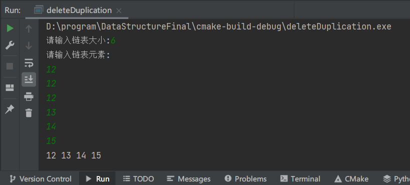

>   生信2001 张子栋 2020317210101

---

6.1 图的邻接表表示法和遍历算法的实现

```c
//
// Created by 张子栋 on 2021/12/10.
//

#include "stdio.h"
#include "malloc.h"
#include "stdlib.h"

#define MaxVertexNum 20
typedef struct node {
    int adjvex;
    struct node *next;
} EdgeNode;
typedef struct vnode {
    int vertex;
    EdgeNode *firstedge;
} VertexNode;
typedef VertexNode AdjList[MaxVertexNum];
typedef struct {
    AdjList adjList;
    int vexnum;
    int arcnum;
} ALGraph;

void CreateAlGraph(ALGraph *G) {
    int i, j, k;
    EdgeNode *s;
    G = (ALGraph *) malloc(sizeof(ALGraph));
    printf("请输入顶点数和边数（输入格式为：顶点数，边数）：\n");
    for (int i = 0; i < G->adjList[i].vertex; ++i) {
        scanf(" d, ", &(G->adjList[i].vertex));
        G->adjList[i].firstedge = NULL;
    }
    printf("请输入边的信息（输入格式为：i,j）\n");
    for (int k = 0; k < G->arcnum; ++k) {
        scanf("\n%d,%d", &i, &j);
        s = (EdgeNode *) malloc(sizeof(EdgeNode));
        s->adjvex = j;
        s->next = G->adjList[i].firstedge;
        G->adjList[i].firstedge = s;
        s = (EdgeNode *) malloc(sizeof(EdgeNode));
        s->adjvex = i;
        s->next = G->adjList[j].firstedge;
        G->adjList[j].firstedge = s;

    }
}

void PrintALGraph(ALGraph *G) {//输出邻接表存储
    int i;
    EdgeNode *p;
    for (i = 0; i < G->vexnum; i++) {
        printf("v%d", (G->adjList[i].vertex));   //输出顶点信息
        p = G->adjList[i].firstedge;
        while (p != NULL) {
            printf("-%d ", p->adjvex);
            p = p->next;
        }
        printf("^\n");
    }
}

void DFSAL(ALGraph *G, int i, int visited[MaxVertexNum]) {
    EdgeNode *p;
    printf("V%d ", G->adjList[i].vertex);
    visited[i] = 1;
    p = G->adjList[i].firstedge;
    while (p) {
        if (!visited[p->adjvex]) //若 vi 尚未访问，则以 v] 为出发点向纵深搜索
            DFSAL(G, p->adjvex, visited);
        p = p->next; //找 vi 的下一个邻接点
    }
}

void DFSTraverse(ALGraph *G) {
    int i, visited[MaxVertexNum];
    for (i = 0; i < G->vexnum; i++) {
        visited[i] = 0;
    }

    for (i = 0; i < G->vexnum; i++) {
        if (!visited[i]) {
            DFSAL(G, i, visited);
        }
    }
}

void BFSAL(ALGraph *G, int i, int visited[MaxVertexNum]) {
    EdgeNode *p;
    int w;
    int queue[MaxVertexNum], front = 0, rear = 1;
    printf("V%d ", G->adjList[i].vertex);
    visited[i] = 1;
    rear = (rear + 1) % MaxVertexNum;
    queue[rear] = i;
    while (front != rear) {
        front = (front + 1) % MaxVertexNum;
        w = queue[front];
        p = G->adjList[w].firstedge;
        while (p != NULL) {
            if (!visited[p->adjvex]) {
                printf("V%d ", p->adjvex);
                visited[p->adjvex] = 1;
            }
        }
    }
}

void BFSTraverse(ALGraph *G) {
    int i, visited[MaxVertexNum];

    for (i = 0; i < G->vexnum; i++) {
        visited[i] = 0;
    }
    for (i = 0; i < G->vexnum; i++) {
        if (!visited[i]) {
            BFSAL(G, i, visited);
        }
    }
}

main() {
    int t;
    ALGraph *G;
    CreateAlGraph(G);
    do {
        printf("请选择遍历方式：\n");
        printf("1 深度优先遍历\n");
        printf("2 广度优先遍历\n");
        printf("3 结束程序运行\n");
        scanf("%d", &t);
        switch (t) {
            case 1:
                printf("深度优先遍历序列：\n");
                DFSTraverse(G);
                printf("\n");
                break;
            case 2:
                printf("广度优先遍历序列：\n");
                BFSTraverse(G);
                printf("\n");
                break;
            case 3:
                exit(0);
                break;
            default:
                printf("输入错误，只能选择1或2！")；
        }

    } while (t <= 3);
}
```

运行结果:


---

**1.已知单链表A，编写一个算法，删除单链表中第一个最大元素。**

```C
//
// Created by 张子栋 on 2021/12/10.
//

#include "stdio.h"
#include "malloc.h"

typedef struct Node {
    int data;
    struct Node *next;
} LinkList;

void InitList(LinkList *&L) {
    L = (LinkList *) malloc(sizeof(LinkList));
    L->next = NULL;
}

void CreateListTail(LinkList *&L, int n) {
    LinkList *p, *r;
    int i, t;
    L = (LinkList *) malloc(sizeof(Node));
    r = L;
    for (i = 0; i < n; i++) {
        p = (LinkList *) malloc(sizeof(Node));
        scanf("%d", &t);
        p->data = t;
        r->next = p;
        r = r->next;
    }
    r->next = NULL;
}

void ListDelete(LinkList *&L) {
    LinkList *p, *q, *maxp, *maxq;
    p = L->next; //p=头结点的后一个结点
    q = L; //Node q=头结点
    maxp = p;
    maxq = q;
    while (p != NULL) {
        if (maxp->data < p->data) {
            maxp = p;
            maxq = q;
        }
        q = p;
        p = p->next;
    }
    maxq->next = maxp->next;
    free(maxp);
}

void Print(LinkList *L) {
    LinkList *p = L->next;
    while (p != NULL) {
        printf("%d ", p->data);
        p = p->next;
    }
    printf("\n");
}

int main() {
    int n;
    LinkList *L;
    printf("请输入链表大小:");
    scanf("%d", &n);
    printf("请输入链表元素:\n");
    InitList(L);
    CreateListTail(L, n);
    ListDelete(L);
    Print(L);
    return 0;
}
```

运行结果:


---

**2.已知单链表L, 编写一个算法，删除其重复的结点（只保留一个）。**

```C
//
// Created by 张子栋 on 2021/12/10.
//

#include "stdio.h"
#include "stdlib.h"

typedef struct Node {
    int data;
    struct Node *next;
} LinkList;

void InitList(LinkList *&L) {
    L = (LinkList *) malloc(sizeof(LinkList));
    L->next = NULL;
}

void CreateListTail(LinkList *&L, int n) {
    LinkList *p, *r;
    int i, t;
    L = (LinkList *) malloc(sizeof(Node));
    r = L;
    for (i = 0; i < n; i++) {
        p = (LinkList *) malloc(sizeof(Node));
        scanf("%d", &t);
        p->data = t;
        r->next = p;
        r = r->next;
    }
    r->next = NULL;
}

void Print(LinkList *L) {
    LinkList *p = L->next;
    while (p != NULL) {
        printf("%d ", p->data);
        p = p->next;
    }
    printf("\n");
}

//删除有序链表中的重复节点
void DeleteDuplication(Node **head) {
    if(head == NULL || *head == NULL)
        return;

    //指向当前正在处理的节点；
    Node* p = *head;
    //用于遍历p之后的节点；
    Node* q = NULL;
    Node* r = NULL;

    while(p != NULL){
        q = p;
        //若后面有节点与当前节点相同，将其删除
        while(q->next != NULL){
            if(q->next->data == p->data){
                //保存需要删掉的节点
                r = q->next;
                //需要删掉的节点的前后节点相接
                q->next = r->next;
                free(r);
            }
            else{
                q = q->next;
            }
        }
        p = p->next;
    }
}

int main() {
    int n;
    LinkList *L;
    printf("请输入链表大小:");
    scanf("%d", &n);
    printf("请输入链表元素:\n");
    InitList(L);
    CreateListTail(L, n);
    DeleteDuplication(&L);
    Print(L);
    return 0;
}


```

运行结果:



---

7.2 二叉排序树上的查找(创建/查找/插入)算法

```C
//
// Created by 张子栋 on 2021/12/10.
//

#include "stdio.h"
#include "malloc.h"

#define MAX 100
typedef int ElemType;
typedef struct Node {
    ElemType val;
    struct Node *lchild, *rchild;
} NODE;
NODE *BitRepTr;

NODE *Search(NODE *root, int key) {
    NODE *p;
    p = root;
    while (p) {
        if (p->val == key) {
            return p;
        }
        if (p->val > key) {
            p = p->lchild;
        } else {
            p = p->rchild;
        }
        return p;
    }
}

int Insert(NODE *root, int value) {
    NODE *p, *q, *par;
    int mark = 0;
    p = root;
    par = NULL;
    while (p != NULL && mark == 0) {
        par = p;
        if (p->val == value) {
            mark = 1;
        } else if (p->val > value) {
            p = p->lchild;
        } else if (p->val < value) {
            p = p->rchild;
        }
    }
    if (mark == 1) {
        return 0;
    }
    q = (NODE *) malloc((sizeof(NODE)));
    q->val = value;
    q->lchild = q->rchild = NULL;
    if (root == NULL) {
        root = q;
    } else if (par->val > q->val) {
        par->lchild = q;
    } else {
        par->rchild = q;
    }
    return 1;
}

int Delete(NODE *root, int value) {
    NODE *p, *s, *q;
    p = Search(root, value);
    if (p == NULL) {
        return (1);
    }
    if (!p->rchild) {
        q = p;
        p = p->lchild;
        free(q);
    } else if (!p->lchild) {
        q = p;
        p = p->rchild;
        free(q);
    } else {
        q = p;
        s = p->rchild;
        while (s->lchild) {
            q = s;
            s = s->lchild;
        }
        p->val = s->val;
        if (q != p) {
            q->lchild = s->rchild;
        } else {
            q->lchild = s->lchild;
        }
        free(s);
    }
    return (0);
}

void MidOrder(NODE *root) {
    if (root != NULL) {
        MidOrder(root->lchild);
        printf("%d ", root->val);
        MidOrder(root->rchild);
    }
}

int main() {
    NODE *root, *p;
    int k, i, val, n, num[MAX];
    printf("首先建立二叉排序树\n");
    printf("请输入结点个数\n");
    scanf("%d", &n);
    if (n < 1) {
        return -1;
    }
    root = (NODE *) malloc(sizeof(NODE));
    printf("请输入各结点的关键字值，以空格间隔\n");
    scanf("%d", &num[0]);
    root->val = num[0];
    root->lchild=NULL;
    root->rchild=NULL;
    for (i = 1; i < n; i++) {
        scanf("%d",&num[i]);
        Insert(root,num[i]);

    }
    printf("对二叉排序树进行中序遍历结果如下：\n");
    MidOrder(root);
    printf("\n");
    printf("  1----------------查找\n");
    printf("  2----------------插入\n");
    printf("  3----------------删除\n");
    printf("请选择(1-3):");
    scanf("%d",&k);
    switch (k) {
        case 1:
            printf("选择了查找\n");
            printf("请输入要查找的值:");
            scanf("%d",&val);
            if(Search(root,val)!=NULL){
                printf("找到了!\n");
            } else{
                printf("没有找到!\n");
            }
            break;
        case 2:
            printf("选择了插入!\n");
            printf("请输入要插入的值:");
            scanf("%d",&val);
            if(Insert(root,val)!=0){
                printf("插入成功!\n");
                printf("对新二叉排序树进行中序遍历结果如下:\n");
                MidOrder(root);
                printf("\n");
            } else{
                printf("插入失败,值为%d的节点已经存在!\n",val);
            }
            break;
        case 3:
            printf("选择了删除\n");
            printf("请输入要删除的值:");
            scanf("%d",&val);
            if (Delete(root,val)!=1){
                printf("删除成功!\n");
                printf("对新二叉排序树进行中序遍历结果如下:\n");
                MidOrder(root);
                printf("\n");
            } else{
                printf("删除失败,值为%d的结点不存在!\n",val);
            }
        default:
            printf("  1----------------查找\n");
            printf("  2----------------插入\n");
            printf("  3----------------删除\n");
    }
}
```

运行结果:

