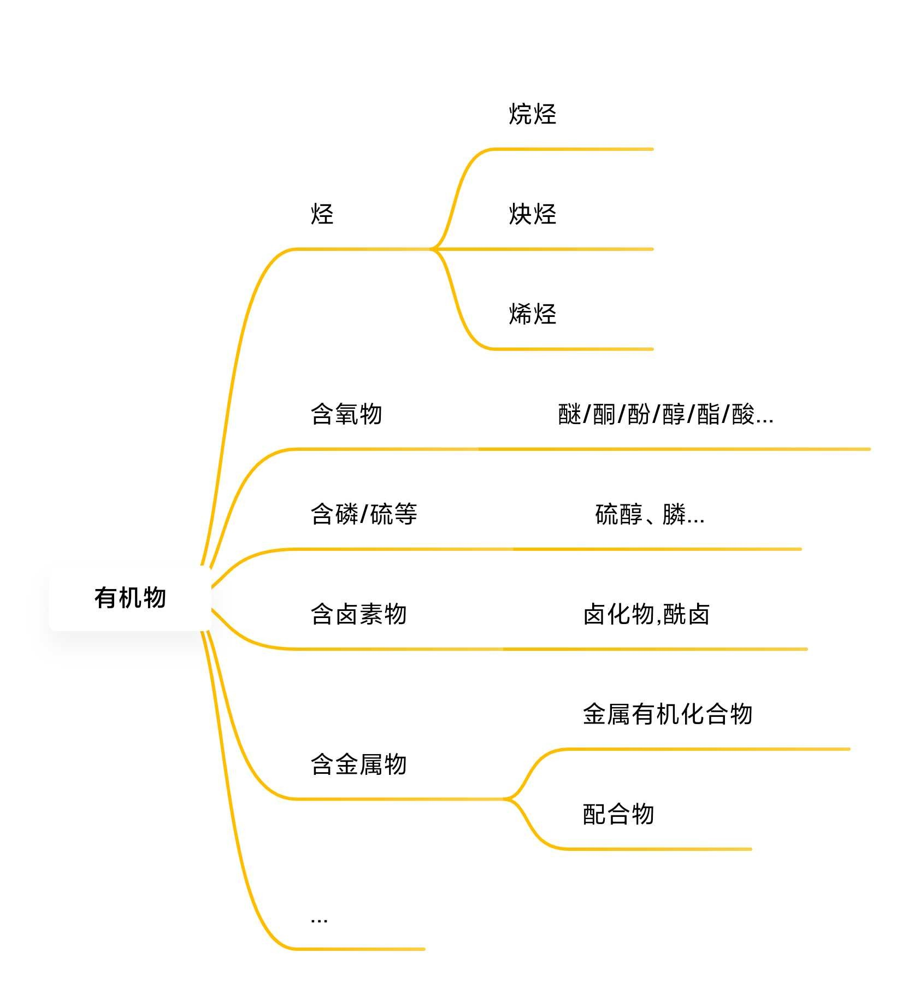
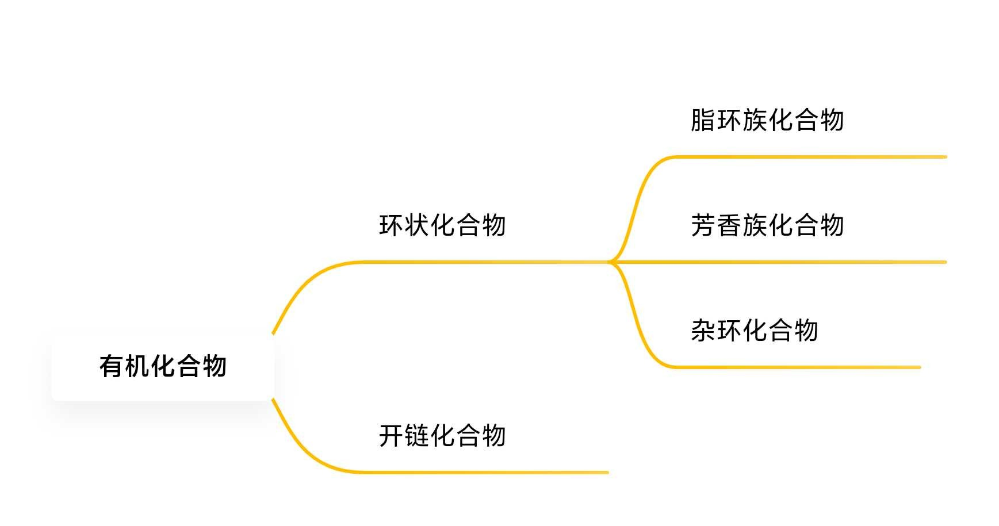
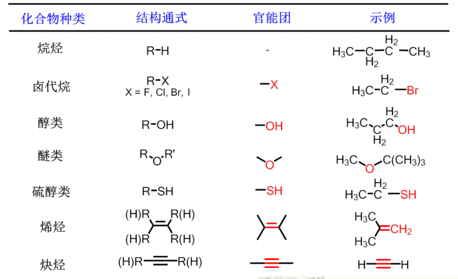

# 有机化学绪论

## 有机物的结构

从化学角度来看, 大多数物质, 其<u>基本组成都是原子</u>。

有机化合物多数都是<u>分子晶体</u> 

>  依靠分子间作用力或氢建来形成昌体. 氢键是一类特株的分子间作用カ, 可以归类为亚化学健

有机分子多数是由原子通过<u>共价键</u>结合的方式组成的。

## 有机物的性质/特点

+  常见的组成元素较单一
+  单键、双键、参键广泛存在, 稳定性和反应性共存
+  多数易燃，熔沸点较低, 难溶于水
+  反应较慢, 且有多种产物
+  结构变化多端，同分异构体、立体异构体大量存在
+  $\cdots$

## 有机物的分类

## 共价键理论及性质

##　共价键

通过共享电子对形成

**离子键**

电子得失，形成离子，靠静静电吸引

+  键长、键角

   >  甲烷中的键角约为109.5°

+  键能

   >  键能和离解能不同

+  键的极性

   >  用偶极矩表示. 分子的偶极矩使各个键的偶极矩的向量之和

+  断键方式

   >  异裂/均裂(自由基)/协同反应

+  八隅体

## 有机化学中的酸碱概念

## 质子酸碱理论

>  能够给出质子和接受质子

共轭酸,共轭碱
强酸,强碱生成弱酸,弱碱
酸性,碱性的度量

##　路易斯酸碱电子理论

给出电子的是碱，接受电子的是酸

任何化学反应都可以看作是广义的路易斯酸碱反应

