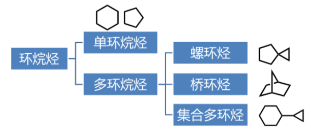

饱和脂肪烃

## 烃 烷烃

Hydrocarbon,碳化氢
直链烷烃的通式:$C_nH_{2n+2}$

### 同系物

具有同一个通式/结构和化学类型相似,组成上相差若干个亚甲基的系列化合物

### 同分异构

具有相同分子式,不同结构的物质

## 直链烷烃的命名

###　普通命名法(习惯命名法)

>  甲烷;乙烷;丙烷
>  正丁烷;异丁烷;新戊烷

## 常用名

>  立方烷;金刚烷;硬脂酸;肉桂醛

### 系统命名法

+  选主链(最长原则;取代最多原则)
+  编号(最低原则;末端原则)
+  写全称
   +  取代基的为此/个数/名称写在母体前
   +  为此用阿拉伯数字,个数用汉字,使用"-"
   +  复杂的取代基可用括号标出

### 环烷烃的命名

####　单环

+  在相应开链烃名称前加"环"

+  同时有大小环,大环为母体,小环为取代基;支链复杂时;环为取代基

#### 螺环烃

+  母体名称由环中所含碳原子总数表示,称"螺某烷"
+  螺字后的中括号以数字表示每个环中除螺原子以外的碳原子的个数,从小到大,以"$.$"隔开
+  环碳原子编号从小环中邻螺碳开始,经螺原子到大患,并遵循取代基为此最小原则

#### 桥环烷

环共用碳原子称为"桥头";一个桥头到另一个桥头的碳链称为"桥".

命名原则:

+  母体名称由环中碳总数表示,称为"n环**某**烷"
+  "二环"后的中括号中以数字表示除桥头外各桥碳数,从大到小顺序排列,中间以"$.$"隔开
+  从桥头快开始编号,从最长桥编到另一桥头,再沿次长桥编到开始桥头,最后是最短桥

## 烷烃的结构

烷烃中一般碳原子以$sp^3$杂化形式成键,键键之间夹角约为109.5度

## 烷烃的物理性质

>  物理性质
>
>  聚集态/熔点/沸点/密度/溶解性/折光性/蒸气压/硬度/导电性$\dots$

### 沸点

+  常温常压下
   1-4个碳的烷烃是气体
   5-16个是液体
   17及以上是固体

+  碳原子个数越少，则沸点差别越大。

### 熔点

和沸点的规律有少许不同。熔点与分子堆积的紧密程度相关。

+  偶数碳原子具备更好的对称性，晶格更紧密，熔点相对较高
+  若支链是无规则的，则熔点降低 $;$ 若支链使分子更对称，则熔点升高

### 密度

同温度下都小于水,极限值接近$0.8g/cm^3$

### 溶解性

非极性分子,几乎不溶于水等强极性溶剂,易溶于烃类/氯仿/苯等

## 烷烃的化学性质

较稳定,一般不与强酸强碱强氧化剂以及活泼金属作用

### 典型反应

+  和氧气作用(燃烧/催化氧化等)

+  卤代反应(自由基机理)
+  裂化反应(石油工业)

#### 和氧气作用

+  燃烧
   +  烷烃在空气中完全燃烧,生成二氧化碳和水
+  催化氧化
   +  在催化剂作用下,烷烃被部分氧化,生成酮/酸等

#### 裂化反应

+  无恙高温下烷烃裂解成低级烃,是石油工业的核心反应
+  乙烯/丙烯/丁二烯等都源于石油裂解

#### 卤代反应

+  常温下烷烃和氯/溴/碘均不反应,和氟爆炸性反应
+  光照或加热下,烷烃可以和氟/溴反应

### 反应的核心-自由基

>  产物中可能有多氯代物,以及乙烷取代物

### 环烷烃	

环烷烃的物理性质和烷烃有一定的区别：

+  环丙烷/环丁烷为气体
+  环戊烷至环十一烷是液体
+  环十二烷以上一般是固体

#### 沸点

随分子量升高而升高

#### 熔点

存在奇偶数区别. 偶数碳原子的环烷烃熔点更高.

#### 化学性质

**开环加成**

>  **环丙烷最活泼**

##### 开环加成

>  马氏规则

##### 取代反应

##### 氧化反应

>  单环烷烃由$n$个$CH_2$组成,在直链烷烃中,$C-C$键不受约束,其键角是$109.5$度,处于舒展状态
>
>  环丙烷中,三个$C-C$键为成环,必须被掰弯,从而产生张力,导致键强度下降,体系能量升高,这种张力称为角张力.角张力是导致小环不能稳定的因素(拜尔张力说)

+  环丙烷中三个碳原子必定位于同一平面
+  环丁烷以及更高级的环烷烃则情况略由不同
+  似乎环戊烷最稳定,但实际是环己烷.这是因为其碳原子并非共平面上,环己烷的碳原子的立体结构最接近直链碳,能量最低

#### 环烷烃的立体化学

环己烷是最重要的环烷烃之一,是没有张力的环烷烃.这取决于其空间结构

环己烷最稳定的是椅式构象,其次是船式构象

实际上还存在其他几种非稳定构想,如扭船式/半椅式等

##### 环己烷的取代

##### 十氢萘的结构

分为顺式和反式两种

