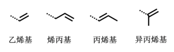

# 不饱和脂肪烃

# 不饱和脂肪烃的命名

## 简单烯/炔的命名

+  含C=C键的最长碳链 

+  "最低系列" : 让双键或叁键编号尽可能小 写出名字 "某烯"或"某炔"

## 环状烯烃的命名

以环某烯为母体,双键位次最低,取代基要编号. 有两个或两个以上的双键 , 双键的位置不能省

当结构比较复杂时,烯基也可以看作取代基,常见的烯基取代基命名如下:

# 烯烃的几何异构

满足两个条件

+  C=C的两个碳上有相同的取代
+  同一个碳上的取代不同

>  人为地将ABCD判定优先级(原子序数).优先基团在双键同侧定为Z式;不在同一边的定为E式

## 优先级的定义

+  原子序数大的有限
+  如果相同,则比较下一层次
+  双键视为两个单键
+  没有加和性

# 烯烃/炔烃的结构

## 烯烃的结构

>  灰色 : $sp^2$杂化

### 结构决定功能

+  富电子,易于发生供电子反应
+  可以稳定自由基/拉电子的取代基
+  顺反存在异构,生化活性区别较大

## 炔烃的结构

### 结构决定功能

+  富电子,易于发生供电子反应
+  叁键末端氢具备一定酸性
+  两个$\pi$键的结果使$\pi$键变强,因此相对于烯,炔的<u>亲电反应</u>较难,反而可以发生<u>亲核反应</u>
+  刚性结构

# 烯烃/炔烃的物化性质

## 物理性质

+  与烷烃类似
+  炔烃沸点稍高
+  熔沸点和几何异构有关
+  均难溶于水
+  4碳一下为气体

## 化学性质

### 烯烃的亲电加成

#### 环正离子机理

>  反面进攻正电中心,反式加成$Y^-$

#### 碳正离子机理

>$Y^-$从正反两面进攻正电中心,既有顺式加成也有反式加成

#### :star:马氏加成规则​

亲电加成中,亲电试剂带正电部分加到双键中$H$较多的碳原子上

>  ①:star:$HOBr$(次溴酸)正电部分 : $Br$
>
>  ②酸性条件下与水加成
>
>  ③与硫酸加成

##### 原因

马氏加成的关键是碳正离子,反应倾向生成较稳定的碳正离子

>  甲基/乙基 : 推电子基团(电子较多)
>  第一种反应中碳正离子周围只有一个推电子基团(乙基)
>  第二种反应中碳正离子周围有两个推电子基团(甲基),碳正离子更稳定

##### :star:碳正离子的稳定性

+  和自由基的稳定性类似
+  连有推电子基团,可以稳定碳正离子
+  碳正离子连的烃基越多,一般越稳定

##### 烯烃的亲电反应活性

电子云密度越高,越容易发生亲电加成
烯烃上含有推电子($+I$)基团,促进亲电加成;
烯烃上含有吸电子($-I$)基团,降低亲电活性
*$I$ : introdution,诱导*

>  :star:强吸电子基团: 三氟甲基,硝基,羧基,羰基$\dots$

练习:

>  2:不可以,会生成$2-$溴辛烷

#### 反马加成

$HBr$和烯烃在过氧化物条件下反应,通过自由基机理,可以得到反马加成产物

只有$HBr$可以发生反马加成,$HI,HCl$都不行

类反马加成:

>  第一步丙烯与氢化硼反应遵循马氏规则,第二步是氧化还原

### 烯烃的氧化

#### :star:碱性$KMnO_4$氧化

碱性$KMnO_4$氧化(冷,稀)
生成**邻二醇**

#### :star:酸性$KMnO_4$氧化

生成**羰基或羧酸**

#### :star:臭氧氧化

生成**酮或醛**(因为有锌粉还原)

练习:推测反应物的结构

#### 催化氧化

生成环氧化物等

### 烯烃加氢

在催化剂($Ni,Pt$等)下加氢变成烷烃

### 烯烃聚合

生产塑料等高分子
反应条件 : 烷基铝 + 四氯化钛

#### 异丁烯的二聚反应

>  阳离子聚合反应

### 烯烃的卤代

$\alpha-$氢在**高温**/$NBS$光照时卤化

>  :star:高温下不是加成反应,而是取代​
>
>  :star:$NBS$: $N-$溴代琥珀酰亚胺

# 炔烃

## 炔烃的化学性质

### 亲电加成

+  和烯烃类似,但是活性偏低

+  可以停留在第一步

+  符合马氏规则

### 加氢/其他加成

+  催化剂作用下氢化
+  和弱酸加成

### 末端炔的酸性

+  和钠/氨基钠反应
+  :star::star:和硝酸银氨/亚铜盐氨(一价银盐/一价铜盐)反应,生成**白色**的炔银或**红棕色**的炔铜沉淀
+  常用于鉴别端炔

# 共轭二烯烃

## 二烯烃分类

## 共轭二烯烃结构

:star::star::star:$p-\pi$共轭 : ①异丙基自由基 ②烯丙基碳正离子 ③烯丙基氯

## 丁二烯的反应

$1,3-$丁二烯的加成以$1,4-$加成为主,同时符合马氏规则

## :star:$D-A$反应

**顺式**丁二烯和单烯在光或热下反应,生成一个六元环

>  双烯反应,旧键的消失与新建的生成几乎同时发生

# Tree

