# 手性和旋光异构

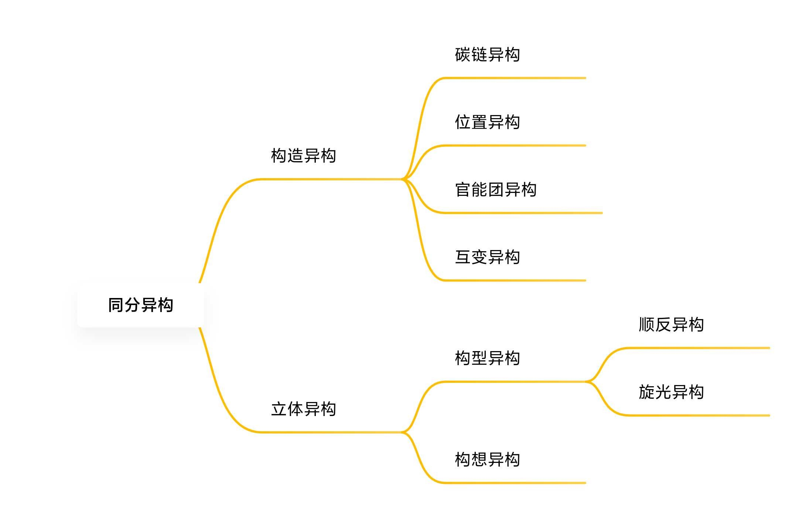

# 旋光

经过旋光活性物质的偏振光

+  物质能**使偏振光的振动平面旋转**的性质叫做**旋光性或光学活性**

+  旋光以$\alpha$来表示,单位为度(°)

## 旋光度和比旋光度

### 比旋光度

:star:当$L=1dm,\rho_B=1g/mL$时,$\Large[\alpha]_{\lambda}^t=\frac{\alpha}{\rho_B\cdot L}$

>  $\lambda$为光源波长,常用钠光的$589.3nm$
>  右旋的以$+$或$d$表示;左旋以$-$或$l$表示

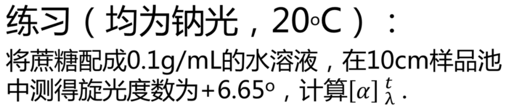
$$
\begin{aligned}
\quad[\alpha]_{\lambda}^t&=\frac{\alpha}{\rho\cdot L}\\
&=\frac{+6.65°}{0.1\cdot1}\\
&=+66.5°
\end{aligned}
$$

>  旋光仪不能分辨出$\alpha\pm n\times180°$的度数,这种情况下,可以将溶液稀释一定倍数,再读出旋光度. 根据稀释倍数来确定最终旋光度.

:star:有**对称面**或**对称中心**的分子都不具备旋光性

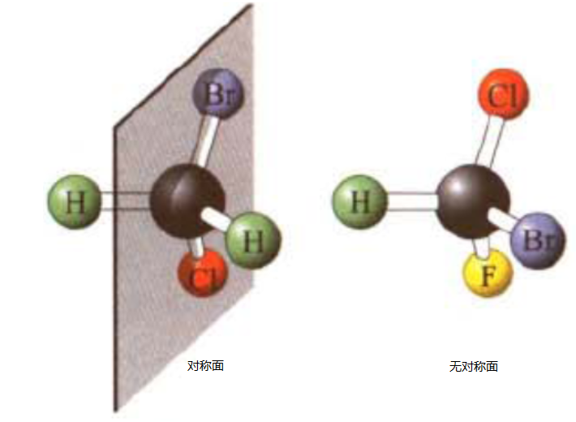

## 手性碳原子

碳的四个价键连接四个不同的原子或基团,这就叫做**手性碳**原子,或**不对称碳**原子

大多数有机物中,手性是因为存在手性碳,以*表示

+  只存在一个手性碳,分子必是手性
+  手性分子不一定含有手性碳
+  含多个手性碳,分子不一定有手性

### :star:**不含手性碳的手性分子**:

1.取代丙二烯型

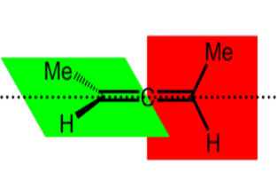

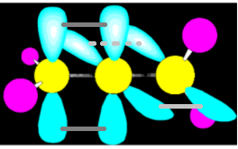

2.联苯型

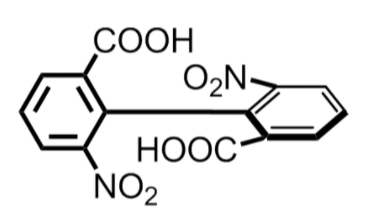

>  $\sigma$键旋转受阻

3.立体型

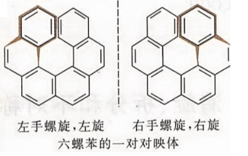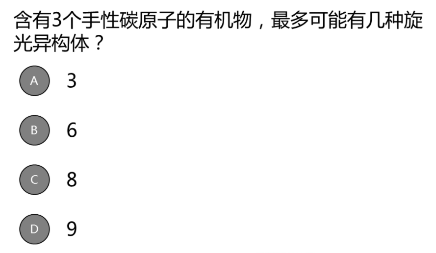

>  不是环状,末尾两个苯不相连

---

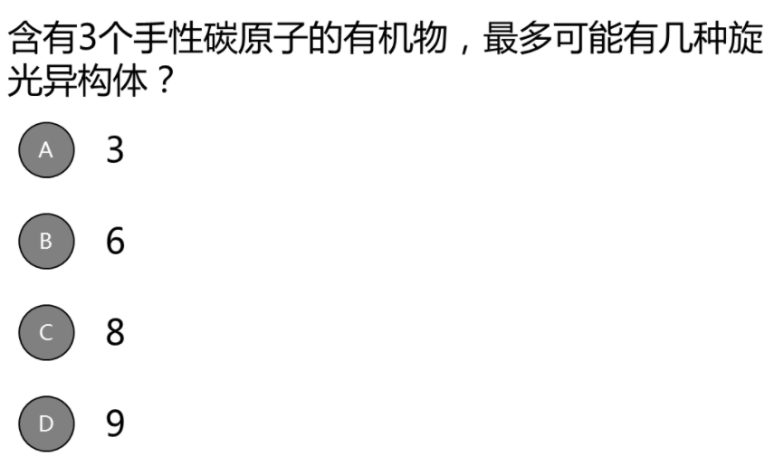

>  答案:C
>  $2^3=8$

# 对映体和消旋体

## 对映体

**对映异构体**:构造式相同,构型不同,且相互呈**镜像关系**的两种异构体

+  分子中含有一个手性碳
   +  必然有一对对映体
   +  等量的对映异构体混合,旋光性相抵消.被称为外消旋体,因此是混合物

+  分子中含两个手性碳

   +  这两个手性碳连接的基团不完全相同

      +  和母体存在另三种立体异构体,但只有一种可以和母体镜相对称,因此只有这一种叫对映异构体; 其余两种叫非对映异构体

         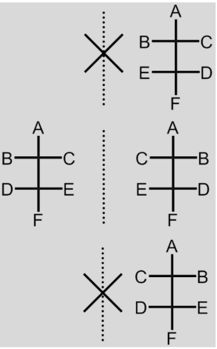

         >  2个手性碳,$2^2=4$种结构,其中只有两个对映异构

   +  两个手性碳连接的基团相同

      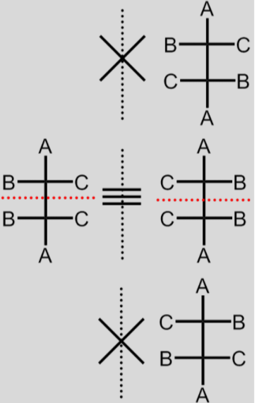

      +  母体分子内部存在对称面,因此没有旋光性,称为**内消旋体**
      +  若将母体分子部分对映,则形成另两种**非对应异构体**; 而这两种非对映异构体之间却又互为对映体

---

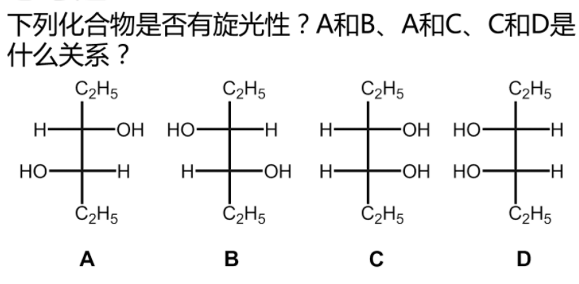

>  A有旋光性; B有旋光性; C没有旋光性; D没有旋光性
>  AB对映体,AC非对映体,CD非对映体

# 环状化合物的旋光异构

环烷烃中,顺反异构和旋光异构往往同时存在. 关键在于是否有对称面

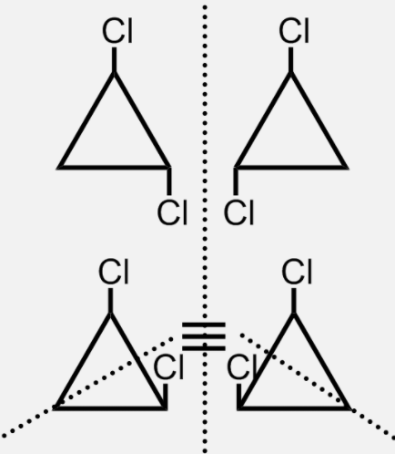

# 旋光异构的表示和标记

## 伞形式

靠近观察者的键画成楔形,远离的画成虚线

hu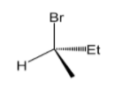

## 费歇尔式

横前竖后规则

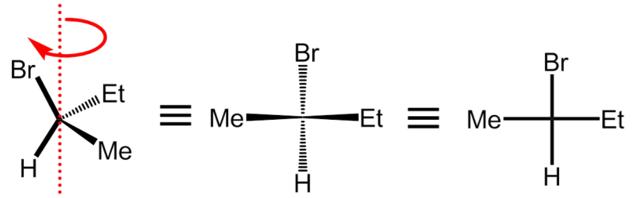

在更为规范的写法中,主碳链在竖直位置;编号最小的碳在最上面

+  离开纸面反转,该百年构型
+  纸面上旋转180度,不变
+  纸面上旋转90度,改变构型
+  奇数次交换得到的对映体;偶数次不变

## D/L构型法

人为规定甘油醛中OH在在右边位D,左边为L

## :star:绝对构型法R/S

又称为CIP体系. 按次序规则中的优先性$a>b>c>d$. $d$远离观察者$a,b,c$的排序如果是顺时针,$R$;
逆时针,$S$.

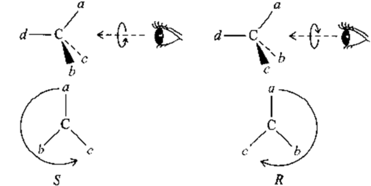

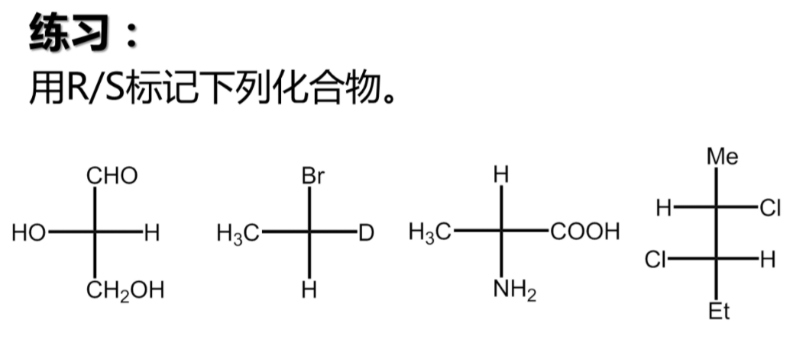

答案:$S\quad S\quad  S\quad  S\quad  S$

## *苏式,赤式

苏式,赤式常用来表示两个手性碳原子上各有一个或两个基团相同的化合物的构型
相同基团在碳链同侧:赤式, 在异侧:苏式

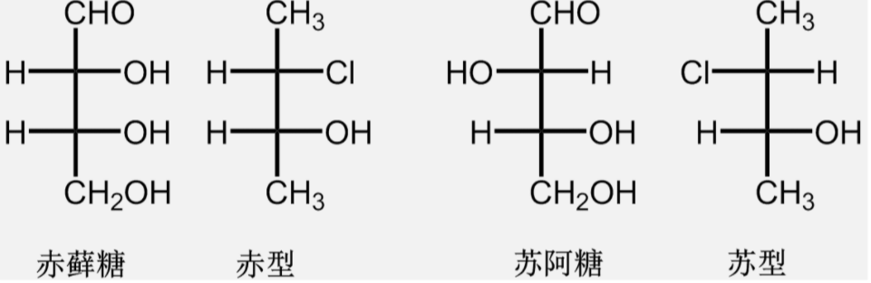

## 对映体纯度

+  光学纯度$(o.p.)$以旋光度为对象

+  对映体过量$(e.e.)$以构型数量为对象
   $$
   e.e.\%=\frac{|R-S|}{|R+S|}\times 100\%
   $$
   
+  非对映体过量$(d.e.)$

## 外消旋体的拆分

+  物理拆分:结晶后,小心地用肉眼辨认,并用镊子分开
+  化学拆分:变成非对映体. 非对映体地物化性质不相同,因此可以分开
+  手性柱拆分:常用于仪器分析

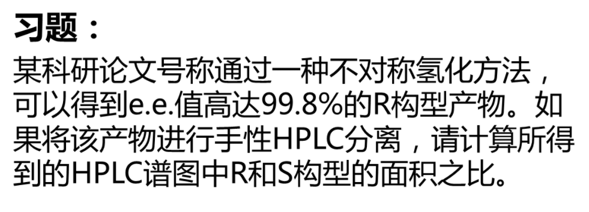