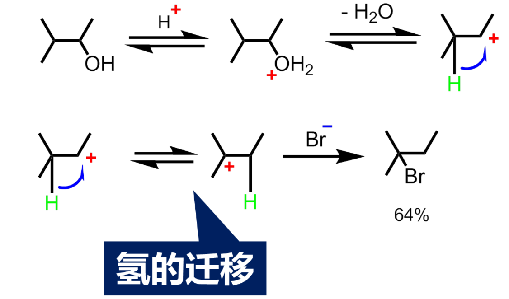

[TOC]

# Chapter07 醇、酚、醚

# 分类和命名

按烃基种类分

- 脂肪醇	乙醇
- 脂环醇	环戊醇 薄荷醇
    - 
- 芳香醇	苄醇

按羟基数目

- 一元醇
- 二元醇
- 多元醇

按羟基所连碳原子种类

- 伯醇（一级醇）
- 仲醇（二级醇）
- 叔醇（三级醇）

## 醇的命名

### 普通命名法

### 系统命名法

- 首先确定羟基是最主要的官能团
- 选择含羟基的最长碳链
- 如果是不饱和醇，主链应含双键或叁键，编号遵循最低原则

# 醇类化合物

醇：烃基+羟基

---

氢键:

---

醇的化学性质和羟基紧密相关

推电子基团减弱酸性
吸电子基团增强酸性

# 醇的化学性质

## 酸碱性

酸性：

---

碱性：利用这一性质，可以除去烷烃中少量的醇

yang盐中$\mathrm{C-O}$键变弱:

$\mathrm{O}$原子吸电子能力增大幅强，碳氧键中氧原子电子云密度大，碳氧键被活化，羟基容易被取代

## 卤代

### 被卤化氢卤代($\mathrm { S_N1}$)

酸性条件下

浓硫酸作为催化剂
浓硫酸没有起吸水作用，吸水不是催化剂的性质（吸水会让平衡右移）

反应活性：烯丙醇/苄醇>叔醇>仲醇>伯醇

对于伯醇的卤代，可能是$\mathrm {S_N2}$反应

仲、叔醇则可能是S1历程，经历碳正离子中间体，发生重排：

⭐碳正离子的重排

重排的目的是生成稳定的碳正离子

叔碳正离子能量低，稳定性高

### ⭐醇的鉴别

卢卡斯试剂

无水$\mathrm{ZnCl_2}$的浓盐酸溶液;鉴别低级醇

苄醇和烯丙基醇能生成稳定的碳正离子，容易生成碳正离子，反应快（同叔醇）

### ⭐被三(五)卤化磷、亚硫酰氯(二氯亚砜)等卤化

亚硫酰氯：良好的氯化试剂和脱水试剂(与水生成$\mathrm{SO_2}$和$\mathrm{HCl}$)

实验室中**常用的制备卤代烃**的方法

不经过碳正离子，避免重排

## 酯化

不仅和有机酸反应，也可以与无机酸反应，如硝酸酯，硫酸酯等

下图3硫酸二烃基酯

## 脱水反应

较低温度下得到醚，较高温度下得到烯

---

消除反应得到烯，遵循扎伊采夫规则

---

如果可能的话，优先生成共轭体系

### 威廉姆成醚反应

烷氧基负离子和卤代烃反应得到醚，这是合成非对称醚的有效方法

---

叔卤代烃和乙烯型卤化物不发生该反应(消去反应和低活性)

---

合成四氢呋喃

$1,4－$丁二醇/$1－$溴$－4－$丁醇

## ⭐氧化反应

### 一元醇的氧化

$\mathrm{\alpha-H}$被氧化为羟基，分子内脱水

伯醇被氧化为酸
伯醇有两个$\mathrm{\alpha-H}$

---

仲醇被氧化为酮
仲醇有一个$\mathrm{\alpha-H}$

---

叔醇难以被氧化
叔醇没有$\mathrm{\alpha-H}$

---

对$\mathrm{KMnO_4}$或$\mathrm { K_2Cr_2O_7}$颜色变化非常明显，可以用于检测乙醇(伯醇)

#### PCC氧化
三氧化铬的吡啶络合物可以高效地将伯仲醇氧化为醛酮，且不影响烯键

工业上更常见的氧化醇用的是催化脱氢
有机化学中，脱氢为氧化，加氢为还原

### 邻二醇的氧化

被高碘酸氧化，得到相应的醛或酮

**鉴别分子中是否含邻二醇结构**

醇羟基所连的碳－碳键断裂，断口各结合一个羟基，再失水

# 酚

## 酚的分类

按照羟基数目，可以分为一元酚、多元酚等

## 酚的命名

酚字前加上芳基的名称，其他取代基、位次放在前面

## 酚的结构

- 酚羟基采取$\mathrm{sp^2}$，有三个杂化轨道，其中一个和苯环成键，另一个和氢原子成键，剩余一个则是孤对电子
- 构成了一个大的$\mathrm{p-\pi}$共轭结构
- 电子云流向苯环，导致$\mathrm{C-O}$键加强，$\mathrm{O-H}$键减弱，因此苯酚中的氢更容易理解，具备弱酸性

### 酚的物理性质

- 形成氢键，沸点剧烈升高
- 室温下为固态或液态
- 无色固体或液体，但氧化后呈浅红色
- 常温下微溶于水，加热后可以混溶
- 密度大于水，毒性、腐蚀性

## 酚的化学性质

### 弱酸性

苯氧负离子的负电荷可以分散到苯环上，增加了稳定性，因此酸性增大

酸性：醋酸>碳酸>苯酚>水>乙醇

---

思考题:

对于苯酚，苯环上连有吸电子基会增强酸性，连有推电子基会减弱酸
为什么苦味酸是一种强酸
硝基是一个吸电子基团，诱导效应和共轭效应都使羟基氧上的负电荷更多地离域移向苯环，能生成更稳定的对硝基苯氧负离子

### 和$\mathrm{FeCl_3}$的显色反应

- 这是因为**酚以及烯醇结构**都可以和三氯化铁发生络合，得到各种颜色的络合物
- 这个反应很灵敏，可以用来判断是否有酚羟基或烯醇的存在
- ⭐苯酚与氯化铁呈蓝紫色(答题时写为显色，因为酚类不一定都显蓝紫色)

### 成醚反应

酚在碱性溶液中和卤代烃或硫酸酯反应生成相应的醚

[反应2] 亲核取代 硝基是强吸电子基团，苯环电子云移向硝基，苯环电负性与氯原子电负性差距大，氯原子被活化

### 酯化反应

一般和酰氯或酸酐和酚反应制备酯

酚和羧酸直接反应的速率慢

### 苯环上的亲电取代

苯酚是强活化的苯环，易发生亲电取代

羟基是推电子基团，导致苯环电子云密度增加
活化邻对位

[ 反应1 ]三溴苯酚是白色固体，这个反应迅速 可以鉴别苯酚

[ 反应2 ]产物分离 分子内氢键 分子间氢键

### 磺化反应

较低温度(动力学反应)下得到邻位取代产物，较高温度(热力学反应)下得到对位产物

### 氧化反应

酚在空气中就会被氧化为醌。酚羟基越多越容易被氧化

# 醚

## 醚的结构和命名

醚可以看作醇或酚中羟基上的氢被烃基取代的产物，可以分为单醚，混醚

分子中由碳环的称为环醚，氧原子在碳环中的醚称为内醚或环氧化合物

氧是$sp^3$杂化，醚是一类路易斯键，碱性比醇强

醚可以和酸形成yang盐，也可以和路易斯酸形成络合物，如$\mathrm{BF_3,AlCl_3, RMgX}$ 等，因此格氏试剂在醚中由较好的溶解性，常用薏米或四氢呋喃来制备格氏试剂

## 醚的物理性质

- 和同级别烷烃有类似的沸点，分子中有极性
- 低级的醚在水肿有一定的溶解性，但大多数醚不溶于水
- 环氧乙烷，1，4－二氧六环。四氢呋喃均可和水混溶。乙醚是一种常用的萃取剂

## 醚的化学性质

### 醚的碱性

三氯化铝、三氟化硼等路易斯酸剧烈水解，使用不便；一种方法就是溶于乙醚。

乙醚还是制备格氏试剂的优良溶剂。

### ⭐醚键的断裂

[ 反应必考 ]

- 共轭的碳氧键不断裂
- 位阻大的不断裂

### 醚的氧化

醚氧原子使得其$\alpha$碳上的自由基或碳正离子稳定性增加，因此$\alpha$位的$\mathrm{C-H}$易被氧气氧化为过氧化物

过氧化物是爆炸性的，因此久置的醚在蒸馏时需要加入金属钠

金属钠可以脱水(作为干燥剂)，还原过氧化物(作为还原剂)

## 环醚

### ⭐环氧乙烷

角张力大，容易开环加成

亲核试剂与碳成键，$\delta^+$碳断开碳氧键

⭐与格氏试剂反应可以延长碳链

### 冠醚

水溶性良好(氧原子电负性强，易与水形成氢键)

金属阳离子的富集(环中央)

