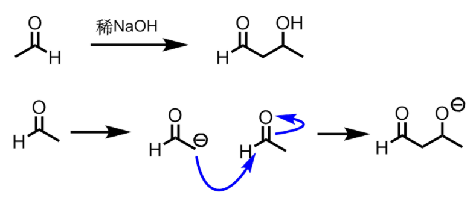

[TOC]

# 醛、酮

## 分类

**按烃基的类型**:脂肪族醛酮;脂环族醛酮;芳香族醛酮等.还可细分为饱和醛酮、不饱和醛酮等.

**按醛酮分子中羧基数目**:一元醛酮、多元醛酮等.

## 命名

以系统命名法为主

含羰基的最长碳链为主链
从较近的羰基开始编号
注意表明的位次
多元酮以汉字数字标示羰基数目.

## 结构

碳和氧都是$sp^2$杂化，形成极化的$\pi$键

## 物理性质

- 强极性；沸点比相应烷，醚高；但低于醇
- 可以和水形成氢键，低级醛酮水溶性较好
- 甲醛为气体，其他12碳以下的醛酮为液体；高级醛酮为固体
- 丙酮是一种良溶剂
- 二苯甲酮(无色固体)也用作干燥溶剂的指示剂(在无水溶剂中是深蓝色)

## 醛酮的化学性质

羰基、$\alpha-\mathrm{C}$上的氢

### ⭐亲核加成

⭐影响亲核加成的因素

- 诱导因素：羰基碳越缺电子，越容易进行
- 位阻因素：羰基碳两边的基团越小，越容易进行(位阻效应)
- 共轭因素：羰基碳和苯环共轭，越难进行

> 一般情况下，醛的反应活性比酮高(位阻因素)
(烃基的推电子效应(微弱)(诱导因素))

#### 和$\mathrm{HCN}$的加成

醛、脂肪族甲基酮、8碳以下环酮可以和HCN发生亲核加成

产物是氰醇,这是个可逆反应.**增长碳链**.

#### 和$\mathrm{NaHSO_3}$的加成

醛、脂肪族甲基酮、8碳以下的环酮可以和$\mathrm{NaHSO_3}$发生亲核加成

产物是$\alpha-$羟基磺酸钠.溶于水,但不溶于饱和$NaHSO_3$,溶液
和稀酸稀碱共热,又返回原来的醛酮,因此可以**鉴别**,也可以**提纯**.

#### 和水的加成

水和醛酮加成，生成不稳定的偕二醇

但是,羰基上连有强吸电子基,则偕二醇会是稳定的结构,可以分离出来.

#### 和醇的加成

##### 生成半缩醛(hemiacetal)和缩醛(acetal)

半缩醛有羟基,不稳定
缩醛较稳定,但是被酸催化水解为醛和醇.

---

虽然半缩醛不稳定,但是如果形成分子内五元或六元环,则相对稳定.

典型的例子就是糖

##### 生成缩酮(ketal)

一般酮难以和一元醇反应,但是在无水酸作用下可以和邻二醇生成缩酮.在酸性环境下又可以水解回到原来的酮

**这一反应常用来保护羰基**.

#### 和格氏试剂的加成

这是个不可逆反应.增长碳链的方法.

和甲醛得到**伯醇**
和其它醛得到**仲醇**
和酮得到**叔醇**

#### 和氨及其衍生物的加成

肟、缩氨脲大多是无色晶体

苯腙、2,4-二硝基苯腙一般为黄色或红色晶体;因此可以用于**鉴别醛酮**

晶体易提纯,稀酸作用下还可以水解生成原来的醛酮,因此还可以用于提纯醛酮

#### 和Wittig试剂反应

Wittigi试剂是一种中性内鎓盐,音译为叶立德,如磷叶立德、硫叶立德.

这是一类强的亲核试剂,和醛酮反应可以得到烯烃.反应过程不重排,产率也较高.

### $\alpha-\mathrm{C}$的反应

羧基是吸电子基,因此有$-I$效应,使$\alpha-C$上电子云密度降低$,\alpha-H$酸性增加,一定条件下可以被碱夺取,生成碳负离子.

#### 羟醛缩合

稀酸或稀碱催化下,含$\alpha-H$的醛或酮可以发生分子间的加成反应,得到$\beta-$羟基醛酮

$\beta-$羟基醛酮不稳定,受热易脱水生成$\alpha,\beta-$不饱和醛酮.这是一种很重要的有机中间体

**羟醛缩合是增长碳链的重要方法**

#### 卤代反应

醛酮的$\alpha-H$容易被**卤素**取代生成$\alpha-$卤代醛酮.碱可以催化这个反应.

乙酰基上三个氢都可以被卤代,在碱作用下迅速生成卤仿和相应的羧酸盐$\to$**卤仿反应**

如果是碘,则是**碘仿反应**

由于碘的NaOH溶液具氧化性,因此可以被氧化为乙酰基的结构也可以发生碘仿反应

### 氧化还原反应

醛可以被氧化为羧酸,酮一般不会被氧化,但在强氧化剂作用下会在羧基两侧断裂,生成羧酸混合物.
醛酮在一定条件下都会被还原成醇或烃基.

#### 醛的氧化

土伦试剂、费林试剂、本尼迪特试剂均可以将醛氧化成羧酸.

##### 土伦试剂

土伦试剂即**硝酸银氨溶液**;银离子可以把醛氧化成酸自身成为银镜.

土伦试剂对**所有醛**都反应.

##### 费林试剂

费林试剂是**两种溶液临时混合**而成:
A溶液是硫酸铜溶液
B溶液是酒石酸钾钠的NaOH溶液
使用时等量混合AB,得到深蓝色费林试剂.其中的`Cu(II)`可以把醛氧化成酸,自身变成**砖红色$Cu_2O$沉淀.**

费林试剂只氧化脂肪醛,不氧化芳香醛.

#### 酮的氧化

酮一般不被氧化,但是强氧化剂下,碳链在炭基两侧断裂,生成羧酸混合物.

#### 羰基的还原

醛酮中的羧基可以被还原

1,**催化加氢**,生成醇.(烯烃、卤素也会同时被还原)

2.$LiAIH_4$**还原**,提供$H^-$,得到醇.不能在水、醇中反应.

3.$NaBH_4$**还原**,得到醇.可以在水、醇中反应.

4.**克莱门森(Clemmensen)还原**:醛酮在锌汞齐和浓盐酸作用下被还原成亚甲基.

5.**武尔夫-吉日聂尔-黄鸣龙还原**:醛酮、水合肼、KOH在乙二醇中回流,羰基被还原成亚甲基

#### 坎尼扎罗反应

不含$\mathrm{\alpha-H}$的醛在浓碱作用下发生分子间的歧化反应,得到酸和醇

如果其中一种是甲醛,则主要是甲醛被氧化,另一种醛被还原成醇.(季戊四醇)

### 甲醛

#### 自身聚合

#### 和氨生成乌洛托品

# 醌

**醌**:含有环状共轭二酮结构的化合物

苯醌、蒽醌、萘醌、菲醌等.

醌不是芳香体系

## 醌的物理性质

一般醌都有颜色.是因为醌有较大的-T共轭体系,是生色团.

## 醌的加成

醌上有碳碳双键,可以发生亲电加成及D-A反应

可以发生$1,4-$加成反应

>    再芳香化

## 其他反应

### 亲核加成

和羟胺生成单肟或双肟

### 还原

对苯E易被还原成对苯二酚

>    标准电极(氢-醌电极)

