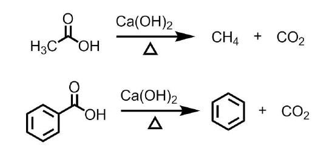

# Chap 09 羧酸及其衍生物

# 羧酸

分子中含有羧基$(\mathrm{-COOH})$的化合物

- 广泛存在于生命体中,是重要的生化物质
- 是重要的化工中间体-人造纤维
- 重要的食品添加剂
- 大量存在于医药分子结构中

## 羧酸的分类/命名

### 按照烃基类型

(饱和/不饱和)脂肪所或脂环酸;环芳酸

### 按照羧基个数

一元酸、多元酸

### 命名方式

+   开链脂肪酸的母体是含羧基的最长的碳链,且羧基碳处于链端,位次省略
+   脂环羧酸中,脂环基为取代基
+   二元羧酸以两个羧基所在的最长碳链为主体,称"某二酸"

其中，甲基丙烯酸也可命名为$2-$甲基$-2-$丙烯酸

因为羧酸存在广泛,因此许多羧酸都有俗名

## 羧酸的结构/物理性质

羧酸极性很大,分子间作用力也较醇/醛/酮等大,且易形成双分子缔合体,即二聚体

因此,羧酸熔/沸点很高.熔点变化与分子对称性有关,沸点则随分子量升高而增大.低级羧酸与水混溶,高级羧酸则难溶(烃基包围羧基).

## 羧酸的化学性质

羧基中,$\mathrm{C}$为$sp^2$杂化,羟基上$\mathrm{O}$的孤电子对与$\mathrm{C=O}$的$\pi$键可以发生$p-\pi$共轭

- 羟基电子云分散至羰基
- 羰基活性降低,羟基中H活性增大
- 羧基被亲核试剂进攻的能力降低,酸性增大

### 羧酸化学反应的位点

羧酸具备酸性,比碳酸强,比无机强酸弱

## 羧酸的酸性

⭐
推电子集团连接在羧基上,减弱酸性
吸电子基团连接在羧基上,增强酸性

三氟乙酸酸性强于硫酸,三氯乙酸酸性略强于硫酸

---

请比较下列酸的酸性（二元酸只考虑一级电离）

>    乙二酸>丙二酸>丁二酸>乙酸
>
>   推电子集团连接在羧基上,减弱酸性
>   吸电子基团连接在羧基上,增强酸性

## 羧酸衍生物的生成

羧基上的羟基可以被其他基团取代,生成羧酸衍生物,如酰卤/酯/酸酐/酰胺等

- 二氯亚砜:强氯化剂

生成酯的反应是可逆的

浓硫酸作为催化剂
浓硫酸没有起吸水作用,吸水会让平衡右移,不是催化剂的性质

## ⭐羧酸的热分解

**一元羧酸在碱性环境下加热**,羧基以二氧化碳的形式脱去,**得到烃**

长链羧酸在脱羧过程中,碳链不规则断裂

🌟二元酸受热分解有规律性

- 乙二酸、丙二酸脱羧得到一元酸
- 丁二酸、戊二酸热分解生成环状酸酐
- 己二酸、庚二酸脱羧会生成少一个碳的环酮

> 鉴别二元酸

脱去一个碳原子

## $\mathrm{\alpha-H}$的卤代

与酮羰基类似,羧酸的$\alpha-\mathrm{H}$也被活化,可以被卤素取代

一卤代乙酸中的卤素被氨基取代,生成氨基酸;也可以被羟基,氰基卤代,得到羟基酸/二酸等

>   关于溴乙酸乙酯：
>   是一种强烈刺激眼睛的无色透明液体。曾被用于制造军用毒气。也是一类重要的化工前体。

## 羧酸的还原

$LiAlH_4$的乙醚溶液可以把羧酸还原成伯醇。

近来有机化学家发现硼烷也可以将羧酸还原成伯醇，但是硼烷也可以和烯烃反应。

## 代表性化合物

甲酸、乙酸、草酸、己二酸、邻苯二甲酸、DHA(二十二碳六烯酸)、EPA(二十碳五烯酸)等.

# 羧酸衍生物

## 种类

羧酸的衍生物主要可分为

## 命名

+   **酰卤**:将对应的羧酸名称中的"酸"改成"酰$X$"($X$为氯、溴)
+   **酸酐**:其命名方式类似醚.内酸酐的名称为"某二(某)酸酐"
+   **酯**:根据来源酸和醇/酚称为"某酸某酯"
+   **酰胺**:如果生成的是$-NH_2$,型的酰胺,称"某酰胺";如果$N$上有取代,则需要把取代基名称标出

## 物理性质

**熔点**

+   一般低级酰卤、酸酐、酯是液体,酯通常具有香味
+   $-NH_2$型的酰胺为固体,但是N原子被甲基取代的酰胺熔点下降.

酰卤有刺激性气味;酸酐有酸味;酯是香的,酰胺是默默无闻的.

## 化学性质

### 水解反应

羧酸衍生物都会水解,生成羧酸(盐).

#### 酰氯的水解:

甲酰氯是不稳定的分子
低级酰氯和水剧烈反应,生成羧酸、氯化氢.
苯甲联氯水解要缓慢得多,加热才进行.

#### 酯的水解

酯在酸或碱催化条件下水解.

##### 酸性水解的机理

##### 碱性水解的机理

---

对于酯的水解，位阻越大，水解难度增大；连有吸电子基团，碱性水解越容易。

##### 水解反应的速率

酰卤$>$酸酐$>$酯$>$酰胺

### 醇解反应

醇类似水,也可以作为亲核试剂进攻羧酸衍生物,发生醇解反应.

#### 酰卤醇解

易于进行,得到酯和卤化氢.
常用于不活泼的羟基,如酚类的酯化.

有时还会加入碱,如吡啶来除去HCI,以加快反应进程.

#### 酸酐醇解

得到酯和羧酸

#### 酯的醇解

要在酸催化下加热才进行,且为可逆反应,因此又称酯交换.

### 氨(胺)解

氨或胺的碱性强于醇,因此是比醇更好的亲核试剂,可以和酰卤、酐、酯发生胺解.

含有N-H键的胺和酰卤剧烈反应,得到酰胺.

思考:
1.三乙胺可以发生胺解吗?

2.一般酰卤的胺解都会加入吡啶,为什么?

---

酸酐也会发生胺解,得到酰胺和**羧酸铵盐**.

酯会发生胺解,得到酰胺和醇.

