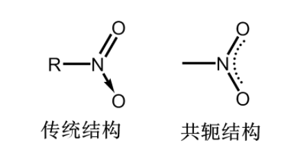

# 硝基化合物

烃分子中氢被硝基(-NO2)取代的化合物.
命名时,硝基作为取代基出现,其优先顺序低于烃基和卤素.

硝基化合物的结构

>   硝基是强吸电子基团

## 物理性质

+   密度基本上大于$1$,不溶于水,溶于有机溶剂或浓硫酸.
+   有毒,能够通过皮肤吸收
+   有特殊气味-苦或香

## 化学性质

+   受热易发生爆炸

+   :star:可以被还原剂($H_2$、$LiAIH_4$、金属/稀酸)
    还原成伯胺

+   具备酸性

    +   >   吸电子基团增强酸性

+   苯环上的硝基对其它基团的影响.

### 硝基化合物的酸性

硝基乙烷的$pK_a$约为$8.5$,酸性强于苯酚.

一方面是硝基的吸电子能力,更重要的是因为存在下列互变异构:

### 硝基对苯环上其它基团的影响

使邻对位基团活性增大
间位基团影响不大.

>   活化乙烯型卤化物

---

>   大幅增强酸性

# 胺类

## 胺

### 胺的分类和命名

胺可分为伯胺、仲胺、叔胺和季铵盐.

$-NH_2$:氨基
$-NHR$:亚氨基
$-NR_2$:次氨基

伯仲叔胺是以N来区分的,而伯仲叔醇以C来区分.

---

胺的命名次序高于烃基,低于羟基.

+   简单胺的命名,胺为母体,前面加上烃基种类和氨基数目;复杂胺则以烃为母体,氨为取代.
+   $N$上连有多个相同烃基,以二或三表明烃基数目.
+   烃基不同时,按次序规则,较小基团先写.
+   $N$上同时有芳基和脂肪烃基,芳胺为母体,脂肪基前加"$N$"
+   季铵则是将阴离子和取代基名称放在"铵"前.

>   :star:铵盐相关命名​

### 胺的结构

氨和胺都呈棱锥形,$N$在锥顶,其余取代基在锥底三个顶点上;同时,$N$上还有一对孤对电子.

理论上来讲,$N$上连有三种不同取代基时,分子有手性;
但实际上由于两种构型易互化,所以没有手性(室温下);
如果是非对称季铵盐,则具备手性.

## 胺的物理性质

+   低级、中级胺通常为气态或液态 ; 高级胺为固态.

+   低级脂肪胺有恶臭,如$1,4-$丁二胺称为腐胺, $1,5-$戊二胺称为尸胺

+   胺类,尤其是芳胺,毒性很大,易致癌
+   胺类可以形成氢键,沸点大于相应的烃和酗,小于醇和酸;低级胺可溶于水(氢键)
+   芳香胺易被氧化成深色物质;许多胺类还是染料的起始原料

### 胺的化学性质

#### 碱性

胺和氨由于$N$上有孤对电子,因此易接受质子,形成铵离子,呈碱性.

胺的碱性强弱受几个因素影响$N$上取代基的电性(推电子基团增强碱性,氮原子上连接的烷基越多,推电子效应越强)、$N$受到的位阻等.因此,胺碱性强弱排序为:
脂肪族仲胺$>$脂肪族伯胺$>$脂肪族叔胺$\quad >\quad $氨$\quad > \quad$芳香族伯胺$>$芳香族仲胺$>$芳香族叔胺

>   :star:
>   仲胺推电子能力较强,位阻相对小
>   伯胺推电子能力弱,位阻很小
>   叔胺推电子能力强,但位阻很大

##### 铵的碱性

铵盐一般易溶于水和醇,加入强碱又重新得到胺,因此常用于生物碱的提取.

铵根离子和碱金属类似,因此季铵碱和$NaOH$碱性类似,其制备方法是从季铵盐和氢氧化银得来.

+   比较下列化合物的碱性.

    +   丁胺 ; 氨 ; 苯胺 ; 对甲氧基苯胺 ; 三苯胺

        丁胺>氨>对甲氧基苯胺>苯胺>三苯胺

#### 胺的烃基化

胺作为亲核试剂,可以和卤代烃发生亲核取代,取代通常不会停留在第一阶段,而是得到各种取代,包括季铵盐的混合物.
卤代芳烃的被亲核性较弱,因此一般不发生这类反应,除非被活化.

#### 胺的酰基化和磺酰化

胺可以生成酰胺或磺酰胺.
可以用于氨基(胺)的保护、提纯、鉴定.

---

:star:鉴别播种叔胺

碱存在下,伯、仲胺可以和(对甲)苯磺酰氯反应得到磺酰胺,也称兴斯堡反应.

>   (对甲)苯磺酰氯中硫氧双键,强推电子基团

#### 和亚硝酸反应

亚硝酸和伯仲叔胺反应，得到不同产物

+   伯胺得到重氮盐,脂肪族重氮盐低温下即分解,定量放出氮气;芳香族重氮盐则温下稳定可继续用于有机合成.
+   仲胺得到黄色$N-$亚硝基胺,和稀酸继续共热,又得到原来的胺,因此可用于鉴别或分离.
+   叔胺得到可溶性的亚硝酸盐,芳香叔胺则会发生亲电取代,导入亚硝基.
+   这样也可以用于三种胺的鉴别和提纯.

:star:P200重氮盐反应产物,条件

#### 苯环上的亲电取代

为什么不能直接由苯胺制备对硝基苯胺?

+   易被氧化,酸化后是间位定位基

化学方法鉴别苯胺、苯酚和环已胺.

+   溴水
    +   苯胺,苯酚
        +   $FeCl_3$
    +   环己胺

## 重氮、偶氮化合物

分子中都含$N_2$基团,但结构不同:重氮只有一端和$C$相连,是盐类;偶氮则两端均和$C$相连,不是盐.

低温下用芳香族伯胺和亚硝酸来制备.
重氨基很活泼,易被$-OH,-X,-CN,-H$等取代,放出氮气.因此,可以被应用于各类偶联反应,制取酚、卤代芳烃、芳香晴等.

---

:star:重氮盐和酚或芳香胺发生偶联反应,得到偶氨化合物.取代一般在酚或胺的对位,对位被占则在邻位.

>   重氮盐变为偶氮化合物重要反应

# 酰胺

### 酰亚胺的酸性

### :star:伯酰胺的霍夫曼降解

减碳反应，可用于制备伯胺

:star:请设计至少三种方法,从苯合成苯胺.

+   硝基苯还原

+   氯苯高温高压和氨反应

+   苯$\to$甲苯$\to$苯甲酸$\to$苯甲酰胺霍夫曼降解$\to$苯胺

