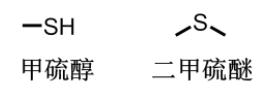
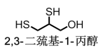
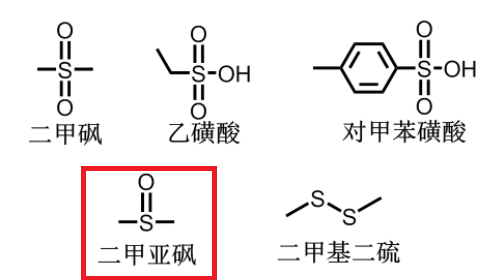

* 考0-3分

# 含硫化合物

+   硫醇,硫酸醚

+   二硫化物(过硫化物)

+   砜,亚砜
+   磺酸

## 硫化合物命名

简单硫醇、硫醚的命名,相当于将$S$看做$O$命名,并在相应的"醇"或""前加"硫"

有时也会将$-SH$视作疏基取代基

## 含硫化合物物理性质

低级硫醇气味难间

硫醇沸点较同级醇低得多(没有氢键),水溶性也要低得多

二甲亚砜是良好的溶剂

## 含硫化合物化学性质

### 硫醇、硫醚化学性质

#### **:star:<u>硫醇具有酸性</u>**

乙硫醇的酸性是乙醇的数千万倍;硫酚的酸性甚至比碳酸更强,能和碳酸氢钠反应放出二氧化碳.

*$H_2S$酸性较$H_2O$强;$HI$酸性较$HCl$强

#### **:star:<u>硫醇具有配位性</u>**

疏基中的硫还容易和许多重金属(如$Pb,Hg,Cu,Ag$等)配位,生成难溶化合物,因此可以用于治疗某些重金属中毒.二硫基丙醇就是一种常用的解毒药.

#### 硫醇、硫酚可以被氧化

硫醇、硫酚可以被氧化温和条件下得到二硫化物:碘或双氧水为氧化剂,或被氧气催化氧化剧烈条件下得到磺酸:如高锰酸钾、硝酸等.

#### 磺酸化学性质

酸性:是一种强酸,易溶于水

羟基被取代:如酯化、生成磺酰胺等

磺酸基被取代:磺酸基是一种好的离去基团可以被$-OH,-H,-CN$等取代.

### 含磷有机物

了解含磷有机物的命名、用途等

膦、磷、鏻的区别

