[TOC]

# 糖类

+   糖是地球上最广泛存在的有机物,其源于地球上最重要的化学反应-光合作用.
+   糖k(saccharide)又称碳水化合物(carbohydrate).
+   从结构上,糖就是其本身或水解后为多羟基醛或多羟基酮结构的化合物.按照能否水解,将糖分为单糖、寡糖和多糖.

## 单糖

按羰基,可分为醛糖和酮糖;按碳个数,又分为丙、丁、戊、己糖等.

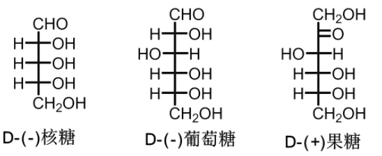

### 单糖的构型

+   除因酮糖外,所有单糖都含手性碳,其旋光异构个数为$2^n$个.
+   常以D、L表示糖的构型:从D-甘油醛转化而来,相应为D型;从L-甘油醛,则是L型.
+   判断依据:编号最大的手性碳,如果其羟基位于右端,则是D式;反之则是L式(前提:严格按照规范书写的结构式).自然界中以D式为主.

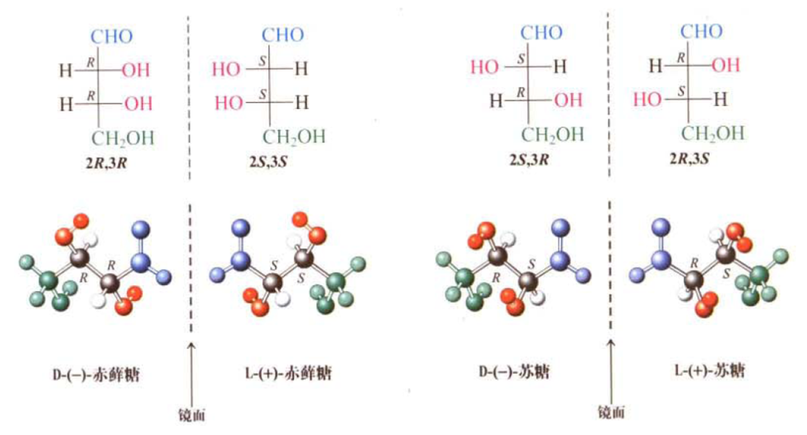

### 单糖的环状结构

+   现象一:葡萄糖存在羧基,却不能和$NaHSO_3$,溶液反应,且只和一分子醇发生缩醛反应

+   现象二:存在两种D-葡萄糖,一种从乙醇溶液中析出,一种从吡啶中析出;旋光各不相同,但是溶于水后,其旋光都逐渐变成$+52.70°$

>   推测:
>
>   1.发生分子内缩醛反应,得到半缩醛.

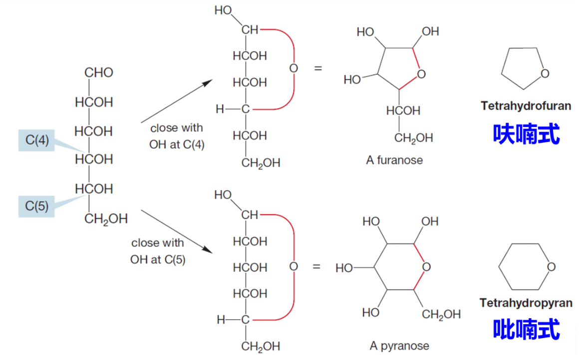

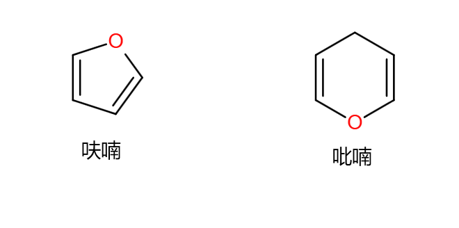

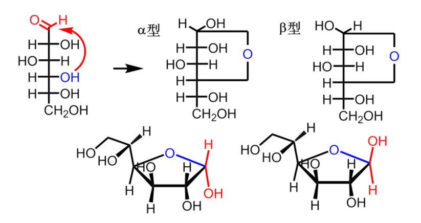

变旋的原因:
乙醇中结晶出的葡萄糖是a-葡萄糖;吡啶中结晶出的则是B-葡萄糖.溶解到水中后,两种结构发生互化,达到平衡.
由于开链结构极少,因此不发生NaHSO的反应,也只能和一分子醇发生缩醛反应.

### 哈沃斯式

费歇尔式难以恰当表示糖的环氧结构,因此用六元环的平面透视式来表示,称为哈沃斯式.

费歇尔$\to$哈沃斯:

1.将碳链往右放倒

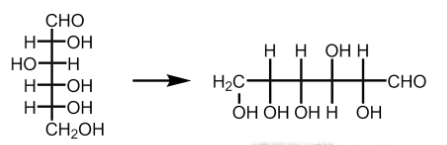

2.将碳链水平弯曲成六边形状

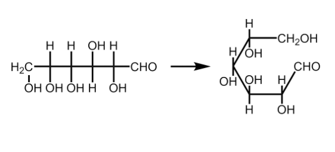

3.C4-C5轴旋转120°,成环.

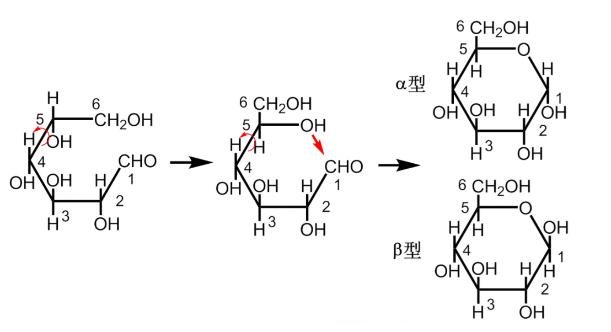

虽然葡萄糖以六元环为主,但五元环也是可能的,因此葡萄糖某一种构型的全称是

$\alpha-D-(+)-$吡喃葡萄糖

其它哈沃斯式的例子:

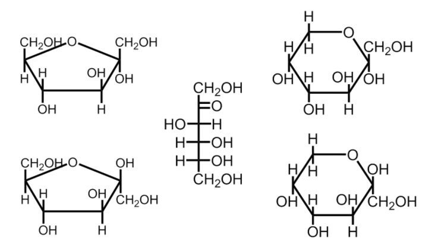

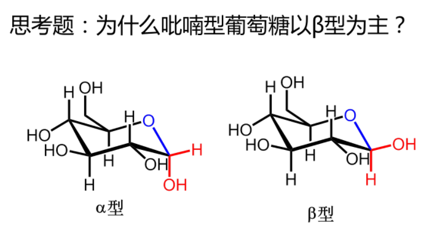

>   $\beta$能量低
>
>   $\alpha$能量高
>
>   温度升高,$\alpha$型占比变多

## 单糖性质

### 物理性质

一般是无色晶体,易溶于水,绝大多数有甜味.高熔点,高沸点

### 化学性质

具有醇、醛(酮)的某些性质;也有糖类特有的性质.在溶液中,开链式虽占比少,但活泼,许多反应都是通过开链式进行的.

#### 显色反应

##### *莫立许(Molish)反应

糖水溶液中加入a-蔡酚乙醇溶液,然后小心注入浓硫酸,不振荡试管,则在两液面间形成紫色环,也称紫环反应.所有糖都会发生反应.

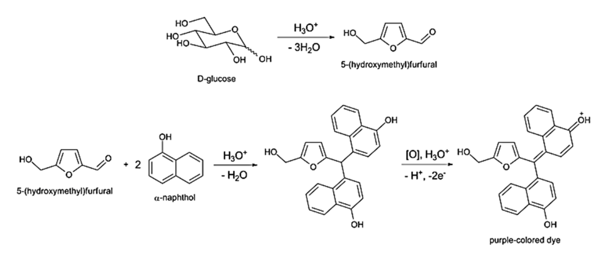

##### 西列瓦诺夫(Seliwanoff)反应

糖水溶液中加入盐酸和间苯二酚.酮糖很快显红色,而醛糖和多糖则需要时间较久.可鉴别酮糖.

>   :star:可以鉴别酮糖和醛糖

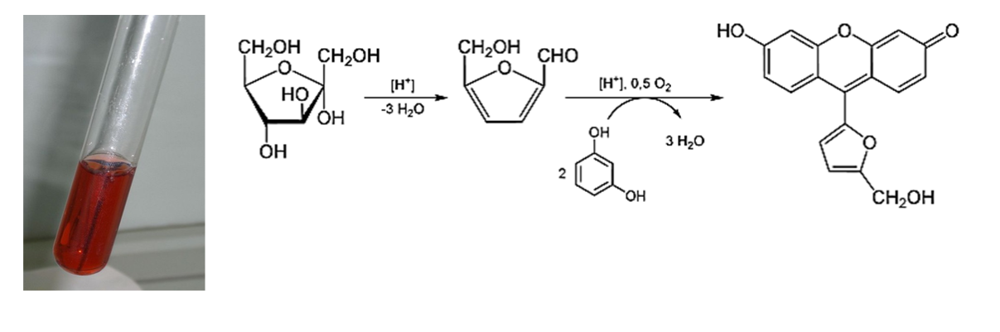

##### 蒽酮反应

糖类都能和酮、浓硫酸作用生成蓝绿色物质，可用于糖类定性定量分析。也称蒽酮比色法。

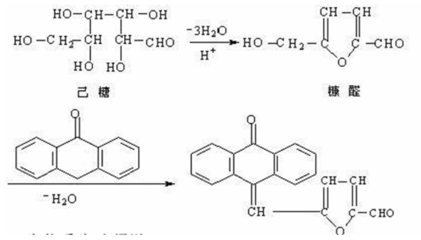

#### 异构化

用碱处理单糖水溶液，能够得到某些差向异构体的平衡混合物。如：稀碱处理D-葡萄糖得到D-葡萄糖、D-甘露糖和D-果糖的混合物。

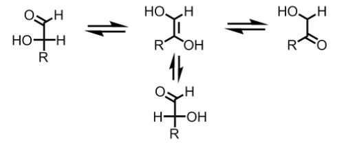

#### 氧化

单糖有还原性，氧化条件不同，产物也不同。

##### 土伦试剂,费林试剂

醛糖和酮糖都能被氧化，得到银镜或氧化亚铜，醛基变成酸，因此称为还原糖。

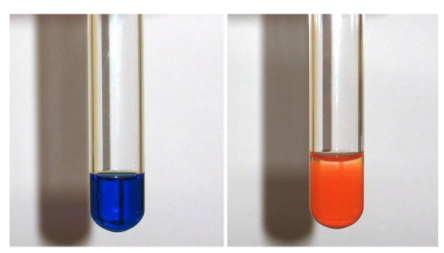

普通单糖都是还原糖。部分酮糖是因为碱性环境下的酮-烯醇互化变成醛糖而被氧化的。

##### 被溴水氧化

醛糖被氧化,酮糖则不行.这是因为溴水呈酸性,不会发生酮-烯醇互化.
这一反应可以用于**鉴别酮糖、醛糖.**

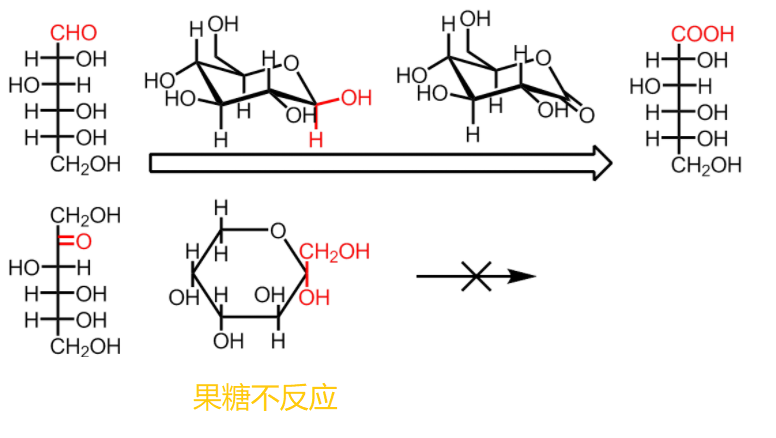

##### 硝酸氧化

比溴水强,能把醛糖氧化为糖二酸.

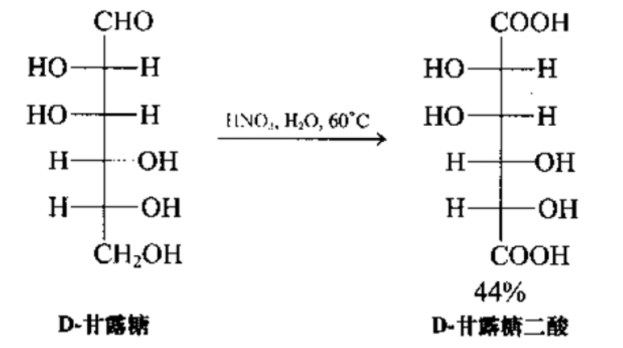

##### 高碘酸氧化

>   :star:邻二醇可以被高碘酸氧化

C-C键的断裂。反应定量进行，通过产物可以研究糖的结构。

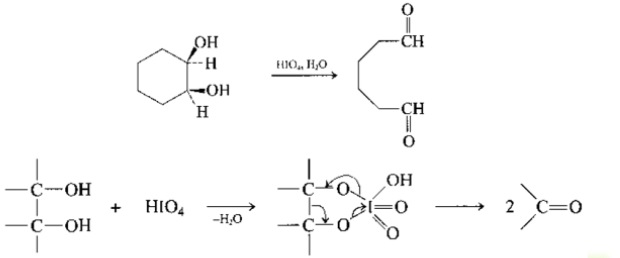

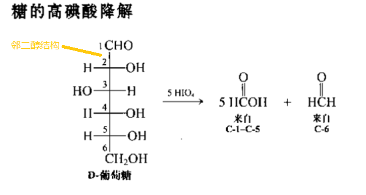#### 还原

>   邻二醇结构:醛与水加成

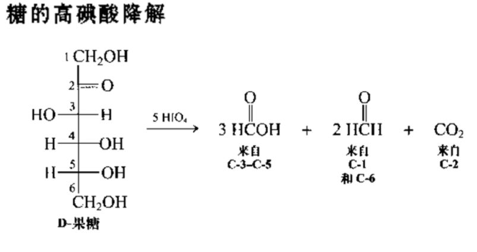

#### 还原

单糖被氢气/铂还原得到多元醇。D-葡萄糖得到山梨醇，D-甘露糖得到甘露醇，D-果糖得到甘露醇和山梨醇的混合物。

>   +   醛糖还原得到纯净物
>   +   酮糖还原得到混合物
>       +   2号手性碳

这些醇称为糖醇，存在于植物中。

#### 成脎

单糖和苯肼作用，羰基得到苯腺，然后$\alpha-$羟基和过量苯胖继续反应，得到脎.

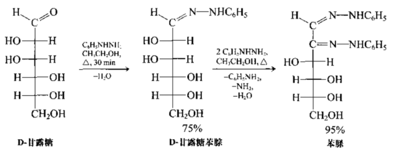

一旦成脎，则不再继续反应。且只在C1和C2上进行。

糖脎是黄色结晶，因此可以用于单糖的**鉴定**。

#### 成酯,成醚

醇羟基可以和酸成酯，也可以被甲基化成醚。

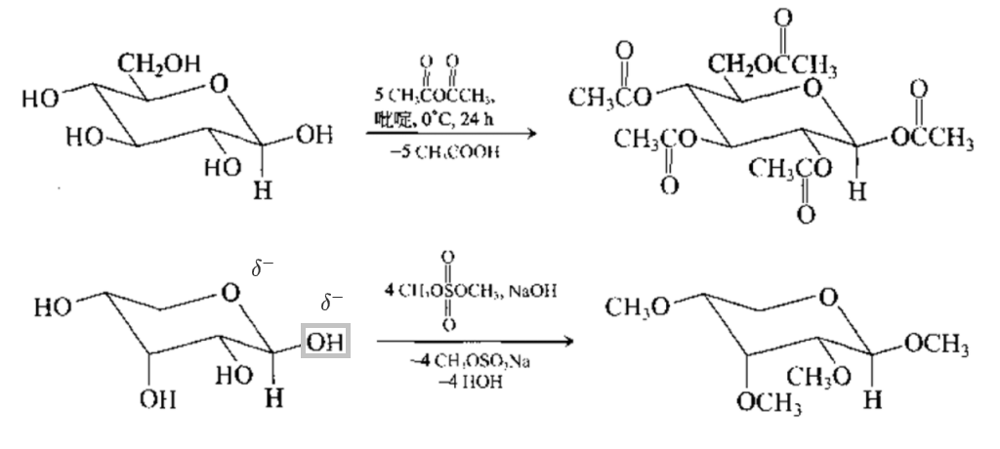

---

+   哈沃斯式

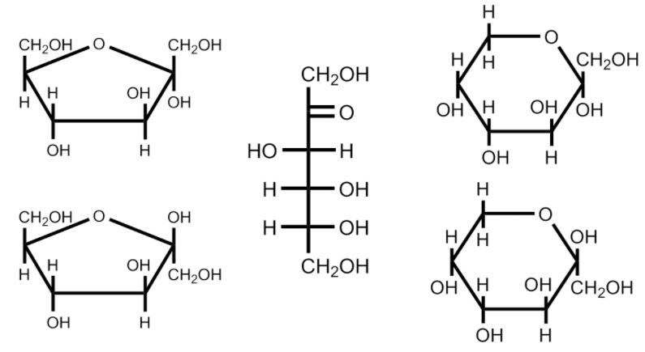

---

### 糖苷

单糖环状结构中的半缩醛羟基,可以和醇、酚等脱水,得到缩醛结构,称为糖苷;全名为某糖某苷.

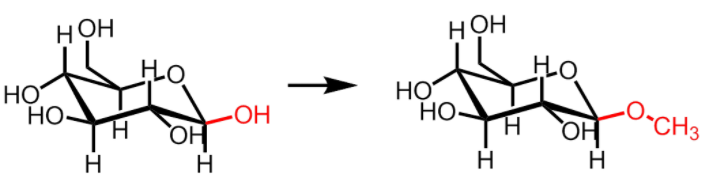

>   右:葡萄糖甲苷

### 二糖

+   二糖是一种低聚糖,可看做是单糖脱水得到的糖苷.分为还原糖和非还原糖.	
    +   如果两分子糖都通过**半缩醛羟基**缩水成键,则不会变旋,是非还原糖
    +   如果只有一分子是半缩醛羟基,另一分子为醇羟基,则还剩余一个半缩醛羟基,可以被氧化,可以成,成苷,可以变旋,是还原糖.

#### 还原性二糖

##### 麦芽糖

一分子$\alpha-D-$葡萄糖的**半缩醛羟基**和另一分子D-葡萄糖中C4位的**醇羟基**缩合脱水得到的二糖.是一种$\alpha-D-$葡萄糖苷.

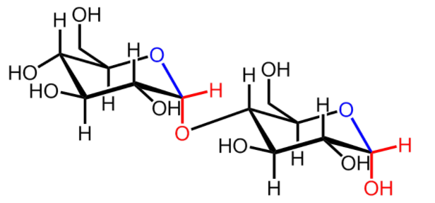

麦芽糖水解得到两分子葡萄糖，可做糖果。其结构中的半缩醛羟基可以是$\alpha$型，也可以是$\beta$型。在溶液中可以经过变旋达到平衡。

##### 纤维二糖

纤维素水解产物.和麦芽糖的唯一区别是苷键类型不同-麦芽糖是$\alpha-1,4-$苷键,纤维二糖是$\beta-1,4-$苷键.但都是还原性糖.

##### 乳糖

一分子$\beta-D-$吡喃半乳糖的**半缩醛羟基**和一分子D-吡喃葡萄糖C4**醇羟基**失水得到.是$\beta-1,4-$糖苷键.

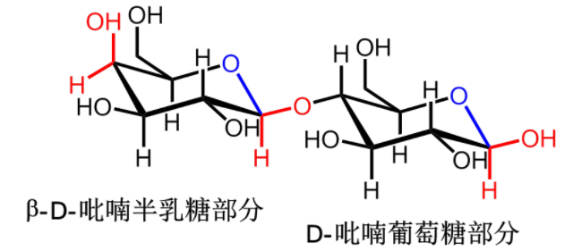

>   平伏糖苷键,较稳定

#### 非还原性二糖

##### 蔗糖

广泛存在于植物中.由一分子$\alpha-D-$吡喃葡萄糖的**半缩醛羟基**和一分子$\beta-D-$呋喃果糖的**半缩醛羟基**脱水,通过$1,2-$糖苷键结合.

蔗糖是非还原性糖.稀酸或蔗糖酶作用水解.

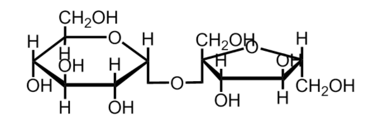

### 多糖

天然高分子.由多个单糖的半缩醛羟基和醇羟基缩合脱水得来.一般**不溶于水,无甜味无变旋,无还原,无成脎**

**按结构分为两类:**
**均多糖,**由同种单糖组成,如淀粉、纤维素、糖原
**杂多糖**,两种及以上的单糖组成,如果胶质、黏多糖.

#### 淀粉

白色无定形粉末，是植物营养物质之一。由**直链淀粉**（10-30%）和**支链淀粉**（70-90%）
组成。

直链淀粉溶于热水，淀粉酶水解得到麦芽糖，进一步稀酸水解得到D-葡萄糖。

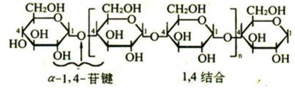

直链淀粉是规整的$\alpha-1,4-$苷键连接而成.尽管如此,其分子非线性,而是由于分子内氢键,呈类似电话线的卷曲状

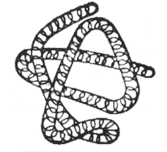

直链淀粉遇碘显深蓝色，常用于检验淀粉或碘。加热会褪色。

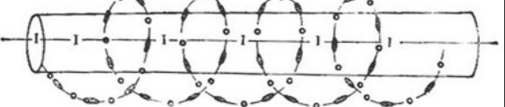

支链淀粉不溶于水,只能溶胀,遇碘呈紫红色.分子中不仅有$\alpha-1,4-$糖苷键,还有$\alpha-1,6-$糖苷键.

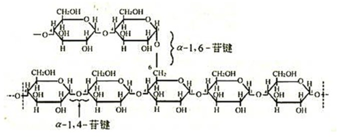

支链淀粉被水解后,得到麦芽糖和异麦芽糖

淀粉分子中只有末端可能有半缩醛羟基,因此几乎没有还原性.

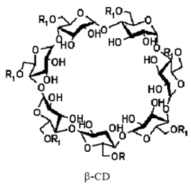

淀粉水解是逐步的,中间体是各种糊精,与碘呈现不同的颜色.

#### 糖原

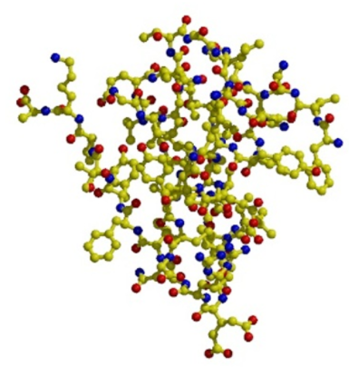

糖原,又称动物淀粉主要存在于肝脏、肌肉中.主要调节血液中葡萄糖浓度.

可看做高度支化的淀粉.

#### 纤维素

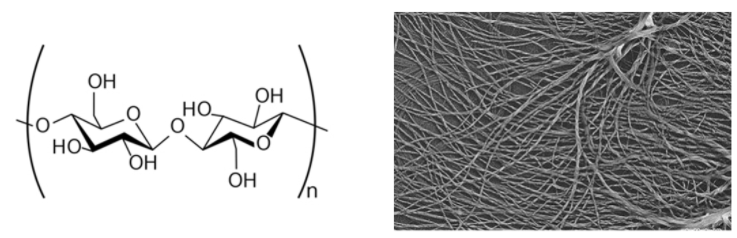

由$\beta-D-$葡萄糖通过$\beta-1,4-$苷键形成的线性分子,酸水解最终产物是葡萄糖.

纤维素很难水解,其规模化温和可控水解至今仍然是世界性难题.

>   平伏$\beta-$糖苷键之间的脱水

