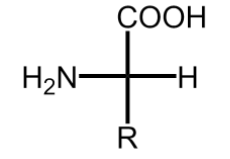

[TOC]

# 氨基酸

+   蛋白质构成生命的物质基础,氨基酸又是蛋白质的基础结构.

+   按照氨基、羧基相对位置不同,分为$\alpha-$、$\beta-$、$\gamma-$、$\delta-$等氨基酸.天然蛋白质水解后都是a-氨基酸.

+   天然存在的氨基酸只有两百多种,组成蛋白质的则只有三十余种.

氨基酸通式为$\mathrm{RCH(NH_2)COOH},$除甘氨酸外都具备手性,且**几乎全部为L型**.

>   天然的糖几乎全部为D型

氨基酸通常用$D/L$表示构型,且主要使用俗名,如甘氨酸、组氨酸等.
根据分子中<u>氨基、羧基数目</u>,可分为中性氨基酸、酸性氨基酸、碱性氨基酸.

>   不是所有氨基酸都有手性(甘氨酸)

>   

---

思考题:
1.天然氨基酸大多数是L型,那么对应的绝对构型是什么?是否是一定对应的?

>   $S$构型

2.天然糖分子大多数是D型,而氨基酸则是L型.这仅仅是巧合吗?

>   石炜的猜测:糖与氨基酸转化为SN2反应,发生构型的转化

## 氨基酸的物理性质

一般为无色晶体，高熔点，易溶于水，（除甘氨酸）具旋光性。

谷氨酸钠盐是一种广泛的调味品。

## 氨基酸的化学性质

氨基酸具两性特征-酸碱兼具.

### 两性特征

与强酸或强碱都能生成盐.在强酸环境下,羧基电离被抑制,以氨基电离为主,带正电荷
碱性环境下则相反.

### :star2: 等电点

**必考**

可以生成内盐,表观呈中性,此时环境的$pH$.简写为$pI$

一般氨基酸,羧基电离强于氨基,需要微酸性来抑制羧基电离,达到等电点.因此等电点<7

各氨基酸PI不同,可用于氨基酸的分离.

### *氨基和亚硝酸反应

$-NH_2$可以和亚硝酸反应,得到羟基酸和水,放出氮气.

氨气中有一半来自于氨基酸,因此可以用于氨基酸的定量分析,也称**范斯莱克(van Slyke)氨基测定法**.

### *氨基和甲醛反应

生成N-亚甲基氨基酸,氨基碱性降低,可以选择性对拨基进行滴定.

### 氨基的烃化

氨基和RX作用得到N-烃基化的氨基酸.如2,4二硝基氟苯,其产物呈黄色,可用于氨基酸的比色测定.

### 氧化脱氨

氨基可以被双氧水或高锰酸钾氧化,生成亚氨基酸,水解得到酮酸.这是生物体内氨基酸代谢的重要过程.

### 羧基的成酯、成酐、成酰胺、还原、脱羧等反应

脱羧生成的胺具有难间的气味,因此这也是蛋白质腐败发臭的主要原因.

### 和水合茚三酮的显色反应

氨基酸和水合茚三酮在碱性溶液中共热,最终得到蓝紫色物质(脯氨酸或羟氨酸为黄色).可用于检验氨基酸.

