# 第二章 饱和脂肪烃

## 直链烷烃的命名

###　普通命名法(习惯命名法)

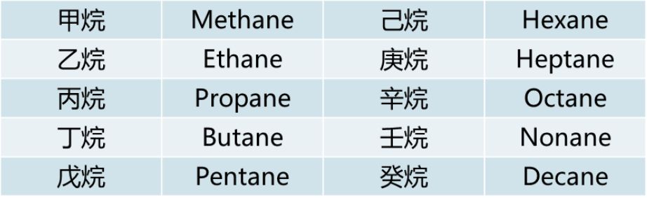

>  甲烷;乙烷;丙烷
>  正丁烷;异丁烷;新戊烷

## 常用名

>  立方烷;金刚烷;硬脂酸;肉桂醛

### 系统命名法

+  选主链(最长原则;取代最多原则)
+  编号(最低原则;末端原则)
+  写全称
    +  取代基的为此/个数/名称写在母体前
    +  为此用阿拉伯数字,个数用汉字,使用"-"
    +  复杂的取代基可用括号标出

### 环烷烃的命名

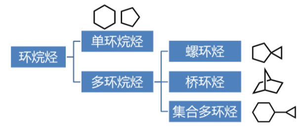

####　单环

+  在相应开链烃名称前加"环"

+  同时有大小环,大环为母体,小环为取代基
    支链复杂时,环为取代基

#### 螺环烃

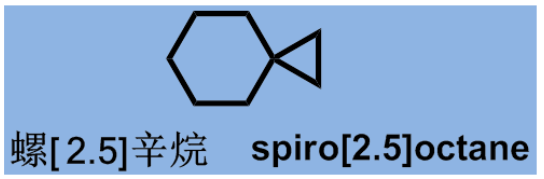

+  母体名称由环中所含碳原子总数表示,称"螺某烷"
+  螺字后的中括号以数字表示每个环中除螺原子以外的碳原子的个数,**从小到大**,以"$.$"隔开
+  环碳原子编号**从小环中邻螺碳开始**,经螺原子到大环,并遵循取代基位次最小原则
+  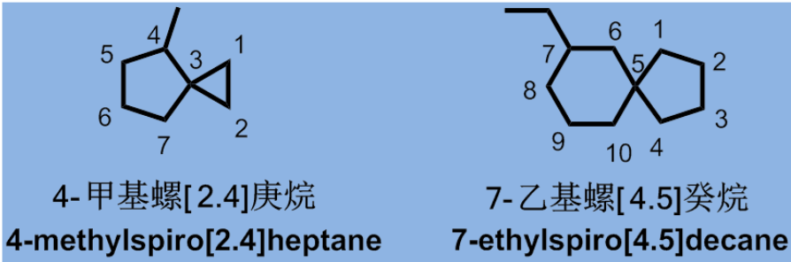

#### 桥环烷

环共用碳原子称为"桥头"
一个桥头到另一个桥头的碳链称为"桥".

命名原则:

+  母体名称由环中碳总数表示,称为"$n$环**某**烷"
+  "二环"后的中括号中以数字表示除桥头外各桥碳数,**从大到小**顺序排列,中间以"$.$"隔开
+  从桥头快开始编号,从最长桥编到另一桥头,再沿次长桥编到开始桥头,最后是最短桥

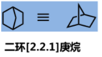

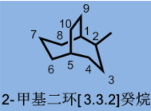

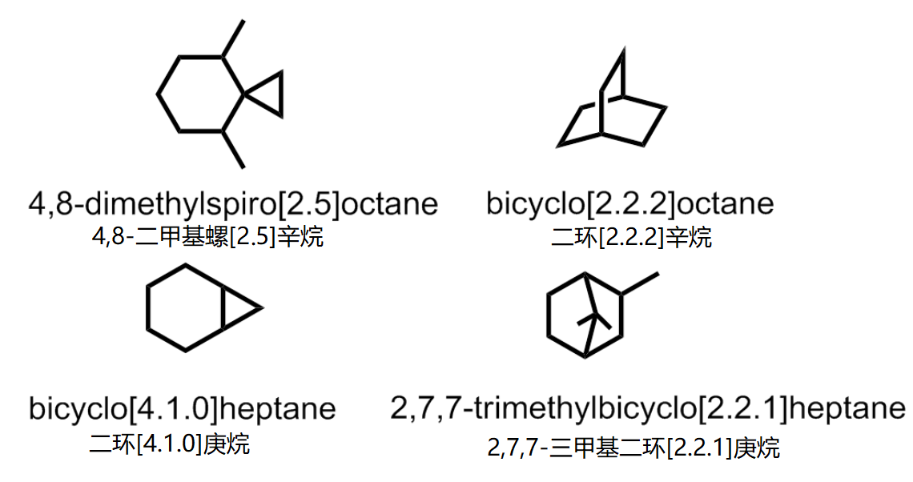

# 第三章 不饱和脂肪烃

## 简单烯/炔的命名

+  含C=C键的最长碳链 

+  "最低系列" : 让**双键或叁键编号尽可能小**写出名字 "某烯"或"某炔"

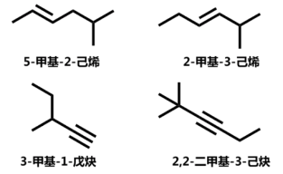

## 环状烯烃的命名

以环某烯为母体,**双键位次最低**,取代基要编号. 有两个或两个以上的双键 , 双键的位置不能省

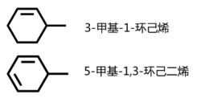

当结构比较复杂时,烯基也可以看作取代基,常见的烯基取代基命名如下:

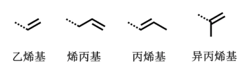

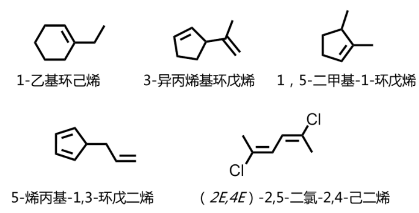

****