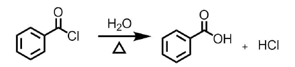

1.以下有机结构中，不能使溴水褪色的是

A.甲基环丙烷	**B.环己烷**	C.环丁烷	D.乙烯

>   A.甲基环丙烷
>   	环丙烷角张力大

>   B.环己烷
>   	没有角张力

>   C.环丁烷
>   		角张力大

>   D.乙烯
>   	亲电加成

---

2·下列烯烃和HBr加成反应条件中，可能得到反马加成产物的是

**A.过氧化物存在**  	B.用HI代替HBr 

C.温度降至0℃		D.使用极性溶剂

>**A.过氧化物存在** 
>	$HBr$和烯烃在过氧化物条件下反应,通过自由基机理,可以得到反马加成产物
>
>B.用HI代替HBr 
>	只有$HBr$可以发生反马加成,$HI,HCl$都不行

---

3·下列化合物中可以和氯化亚铜氨溶液反应得到沉淀的是

A.乙烷 	B.乙烯	**C.乙炔**	D.甲烷

>   端炔的性质
>   与氯化亚铜氨生成砖红色沉淀
>   与硝酸银铵生成白色沉淀
>
>   此外,端炔还具有酸性,可以和钠/氨基钠反应

---

4，下列结构发生亲电取代最快的是

A.苯	B.氯苯	**C.苯酚**	D.硝基苯

>影响苯环亲电取代的是苯环上的电子密度
>
>关于吸电子基团见Chapter04苯环亲电取代规则
>
>+   推电子基团会提高苯环电子密度
>    推电子基团特征:与苯环相连的原子通过单键与其他原子/基团相连
>    +   氯和羟基都是推电子基团
>        +   氯是弱推电子基团
>        +   羟基是强推电子基团
>+   吸电子基团会降低苯环电子密度
>    吸电子基团特征:与苯环相连的原子通过双键/叁键与其他原子/基团相连或苯环相连的原子带正电(三甲铵基)
>    +   硝基是强吸电子基团

---

5·以下说法正确的是
A.糖分子都有手性
B.氨基酸分子都有手性
**C.某手性分子的非对映体可能有多个**
D.D型糖表示旋光方向为右旋

>   除酮糖外,所有单糖分子都有手性
>
>   甘氨酸没有手性
>
>   某手性分子的非对映体可能有多个
>
>   D-L型判断依据:编号最大的手性碳,如果其羟基位于右端,则是D式;反之则是L式(前提:严格按照规范书写的结构式).自然界中以D式为主.
>   详见Chapter13单糖的构型

---

6·对于卤代烃而言，取代和消除互为竞争反应。更有利于消除反应的条件是
A.使用~~大极性溶剂~~ 	**B.增大碱的位阻** 	C.降低卤代烃位阻 	D.适当~~降低~~温度*(升高)*

>   ### 影响消除反应的因素
>
>   1. 结构因素
>       被进攻的,**位阻越大**,不利取代,**利于消除**
>   2. 温度
>       **升温利于消除**(消除的活化能越大)
>   3. 溶剂极性
>       极性强,利于亲核取代
>       **极性弱,利于消除**
>   4. 进攻的试剂碱性
>       碱性增强,$S_N$和$E$均加速,但$E$加速更显著
>   5. 碱的浓度
>       不影响单分子反应
>       加速双分子反应
>
>   ⭐升温/弱极性溶剂/强浓碱利于(大位阻的)卤代烷的消除

---

7·下列反应中可能重排的是
A.苯和2-氯丙烷 	B.$SOCl_2$氯代$1-$丁醇 	C.苯和乙酸酐	**D.$1-$丁醇和浓$HBr$**

>   +   第四章芳香烃
>
>       +   傅氏烷基化的重排
>
>       +   
>
>       +   **重排机理 : 碳正离子**
>
>           
>
>   +   第七章 醇酚醚
>
>       +   被卤化氢卤代($\mathrm { S_N1}$)
>
>       +   仲、叔醇则可能是S1历程，经历碳正离子中间体，发生重排：
>
>           
>
>           ⭐碳正离子的重排
>
>           叔碳正离子能量低，稳定性高
>
>           
>
>           

---

8，以下物质不能发生碘仿反应的是

**A.1-丁醇**	B.2-丁醇	C.丙酮	D.乙酰乙酸乙酯

>   #### 醛酮卤代反应
>
>   醛酮的$\alpha-H$容易被**卤素**取代生成$\alpha-$卤代醛酮.碱可以催化这个反应.
>
>   乙酰基上三个氢都可以被卤代,在碱作用下迅速生成卤仿和相应的羧酸盐$\to$**卤仿反应**
>
>   如果是碘,则是**碘仿反应**
>
>   
>
>   由于碘的NaOH溶液具氧化性,因此可以被氧化为乙酰基的结构也可以发生碘仿反应
>
>   
>
>   ---
>
>   乙酰乙酸乙酯同时具备酮和酯的性质

---

9，以下结构酸性最强的是

A.苯甲酸	B.乙酸	C.碳酸	**D.$\alpha$-羟基乙酸**

>   推电子基团连接在羧基上,减弱酸性
>   吸电子基团连接在羧基上,增强酸性

---

10，以下物质芳香性最弱的是

A.吡啶	B.吡咯	C.噻吩	**D.呋喃**

>   下图必考

>   吡咯呋喃芳香性弱

---

11，以下物质中碱性最强的是

A.四氢呋喃	**B.四氢吡咯**	C.对甲氧基苯胺	D.苯胺

>   ### 胺的化学性质
>
>   #### 碱性
>
>   胺和氨由于$N$上有孤对电子,因此易接受质子,形成铵离子,呈碱性.
>
>   胺的碱性强弱受几个因素影响$N$上取代基的电性(推电子基团增强碱性,氮原子上连接的烷基越多,推电子效应越强)、$N$受到的位阻等.因此,胺碱性强弱排序为:
>   脂肪族仲胺$>$脂肪族伯胺$>$脂肪族叔胺$\quad >\quad $氨$\quad > \quad$芳香族伯胺$>$芳香族仲胺$>$芳香族叔胺
>
>   >   :star:
>   >   仲胺推电子能力较强,位阻相对小
>   >   伯胺推电子能力弱,位阻很小
>   >   叔胺推电子能力强,但位阻很大
>
>   ##### 铵的碱性
>
>   铵盐一般易溶于水和醇,加入强碱又重新得到胺,因此常用于生物碱的提取.
>
>   铵根离子和碱金属类似,因此季铵碱和$NaOH$碱性类似,其制备方法是从季铵盐和氢氧化银得来.
>
>   +   比较下列化合物的碱性.
>
>       +   丁胺 ; 氨 ; 苯胺 ; 对甲氧基苯胺 ; 三苯胺
>
>           丁胺>氨>对甲氧基苯胺>苯胺>三苯胺

---

12，以下物质和水反应最剧烈的是

**A.乙酰氯**	B.苯甲酰氯	C.苯甲酸酐	D.乙腈

>   #### 酰氯的水解:
>
>   甲酰氯是不稳定的分子
>   **低级酰氯和水剧烈反应**,生成羧酸、氯化氢.
>   苯甲联氯水解要缓慢得多,加热才进行.
>
>   

---

13.不能和土伦试剂直接反应的是*(非还原糖)*

A.果糖	B.葡萄糖	**C.蔗糖**	D.纤维二糖

>   ##### 土伦试剂
>
>   土伦试剂即**硝酸银氨溶液**;银离子可以把醛氧化成酸自身成为银镜.
>
>   土伦试剂对**所有醛**都反应.
>
>   ---
>
>   醛糖和酮糖都能被氧化，得到银镜或氧化亚铜，醛基变成酸，因此称为还原糖。

---

14，关于氨基酸等电点，不正确的说法是

A.等电点简写为pl 

C.等电点环境下氨基酸溶解性最小

**B.外界pH高于等电点时，氨基酸带正电荷**

D.中性氨基酸等电点略小于7

>   ### 等电点
>
>   **必考**
>
>   可以生成内盐,表观呈中性,此时环境的$pH$.简写为$pI$
>
>   一般氨基酸,羧基电离强于氨基,需要微酸性来抑制羧基电离,达到等电点.因此等电点<7
>
>   各氨基酸PI不同,可用于氨基酸的分离.

---

三、判断（在表格里以√、×表示正确及错误。每小题 1 分，共 10 分） 

√1.所有的有机物都含碳元素。 

---

×2.烯烃和炔烃都是不饱和结构，容易发生~~亲核加成~~反应。 

>   亲电加成,原因是不饱和键富电子
>
>   炔烃由于有两个$\pi$键,亲核反应活性低于烯烃

---

√3.路易斯酸可以催化苯环的亲电取代反应。 

×4.硝酸银和卤代烃的反应遵循 SN2 反应机理。 

√5.酚羟基活性较弱，一般难以和羧酸成酯，需要和酰卤反应得到酯。 

√6.乙酰乙酸乙酯中，羰基和酯基之间的碳上的氢具有一定的酸性，碱性环境下可以和卤代烃反应。 

×7.羟醛缩合就是指~~醇羟基和醛~~的亲核加成再缩合脱水的反应。 

>   #### 羟醛缩合
>
>   稀酸或稀碱催化下,含$\alpha-H$的醛或酮可以发生分子间的加成反应,得到$\beta-$羟基醛酮
>
>   生成物中有羟基和醛基
>
>   
>
>   **羟醛缩合是增长碳链的重要方法**

---

×8.吡咯中的$ N $原子采取 $sp^2$ 杂化，$p $轨道上有孤对电子，容易给出，表现出碱性。 

>   :star:吡咯氮原子上没有能体现碱性的电子, 而表现出微弱酸性

---

√9.果糖是酮糖，在西列瓦诺夫显色反应中呈现出红色。 

---

√10.氨基酸电泳实验中，pI 小于电泳液 pH 的氨基酸*(带负电)*会向正极移动。

