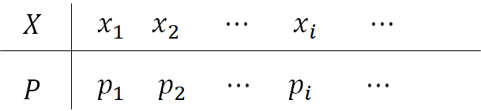

# 第一节 一维离散型随机变量的分布律

# 随机变量

**基本思想**
将样本空间数量化,即用数值表示试验的结果

## 随机变量

由试验结果决定而取某一数值的变量

## 一维随机变量的例子

- 抛硬币试验   
       若为正面，令$\mathrm{X=1}$
       若为反面，令$\mathrm{X=0}$
   有限离散
- 一盒中有$5$黄$3$白共$8$个球,有放回地每次取一个,取到黄球后不再取,取的次数为$\mathrm{\{1,2,3,\cdots,n,\cdots\}}$
无穷离散
- 一均匀陀螺上一半均匀刻$[0,1),$另一半是$1,$旋转后停下时,接触桌面的刻度为$[0,1]$
连续

随机变量本质上为实值函数$\mathrm{X=X(\omega):\Omega\to R}$

$随机事件$是从静态的观点来研究随机现象，而$随机变量$则是动态观点。

概率论能从计算一些孤立事件的概率发展为一个更高的理论体系，其基础概念是随机变量

## 多维随机变量的例子

- 二维
两个一维随机变量构成的有序数组
例如某班同学的身高,体重$\mathrm{(X,Y)}$
- 三维
三个一维随机变量构成的有序数组
例如例如某班同学的身高,体重,血压$\mathrm{(X,Y,Z)}$

## 随机变量的分类

$$按维数分类\begin{cases}一维\\高维(二维,三维,\cdots)\end{cases}$$

$$\begin{cases}离散型\\非离散型\begin{cases}连续型\\非离散非连续型\end{cases}\end{cases}$$

# 一维离散型随机变量的分布律

## 一维离散型随机变量

可以取有限多个或无限可数多个数值的一维， 称为一维离散型随机变量

## 分布律

$\mathrm{P\{X=x_i\}=p_i (i=1,2,3,⋯)}$或

称为$X$的分布率(概率分布,概率函数)

## 性质

- $0\leq p_i\leq1$
- $\sum p_i=1$

思考：
设$𝑟.𝑣.𝑋$的分布律为$𝑃\{𝑋=𝑘\}=𝑘𝑎，𝑘=1,2,3,4,5,$求常数$𝑎$

$$\because \sum p_i = 1\therefore a=\frac{1}{15}$$

---

# 一维随机变量的几个重要分布

## 两点分布

若的概率分布为

或$𝑃\{𝑋=𝑘\}=(1−𝑝)^{1−𝑘} 𝑝^𝑘，𝑘=0,1,$则称$X$服从参数为$p$的两点分布，记为$𝑋\sim B(1,𝑝)$

---

**例**
从一大批种子中任取一粒种子做发芽试验，以$𝑋=1$ 表示种子发芽，以$𝑋=0$表示种子不发芽，若发芽率为$90\%$，则$𝑋\sim B(1,0.9)$

---

## 二项分布

$𝑋\sim 𝐵(𝑛,𝑝)$

$𝑃\{𝑋=𝑘\}=𝐶_𝑛^𝑘 𝑝^𝑘 (1−𝑝)^{𝑛−𝑘} (𝑘=0,1,⋯𝑛)$

### 意义

$𝑛$重独立伯努利试验中事件发生的次数

---

例
一大批种子发芽率为$90\%$，从中任取$10$粒，求
(1)恰有$8$粒发芽的概率；
(2)不小于$8$粒发芽的概率。

解:设这$10$粒种子中有$X$粒发芽

则:𝑋~𝐵(10,0.9)

(1) 

$$P\{X = 8\}=C_10^8 0.9^8×0.1^2≈0.1973$$

(2) 

$$\begin{aligned} 𝑃\{𝑋≥8\}&=𝑃\{𝑋= 8\}+𝑃\{𝑋= 9\}+𝑃\{𝑋= 10\}\\&
=C_{10}^8 0.9^8×0.1^2+C_{10}^9 0.9^9×0.1+C_{10}^{10}0.9^{10}\\&≈0.9298\end{aligned}$$

---

## 泊松分布

$𝑋\sim 𝑃(\lambda)$

$P\{X=k\}=\frac{\lambda^k}{k!}e^{-\lambda}\quad(k=0,1,\cdots,n\cdots)$

泊松分布是作为二项分布的近似，于1837年由法国数学家泊松引入

泊松分布适于描述单位时间内随机事件发生的次数。

如某一服务设施在一定时间内到达的人数，汽车站台的候客人数，自然灾害发生的次数等。

---

**例**
有$2500$名从事某种职业的职工参加人寿保险，据资料统计，这类人在一年中死亡率为$0.002$$,$参保者当年付$2$元保险费，若参保者死亡，其家属可获$2000$元补偿，求下列事件的概率
(1)一年中保险公司亏本；
(2)一年中保险公司获利不少于$1$万元。

$$\begin{aligned}n=2500\quad p=0.02\\死亡人数X\sim B(n,p)\end{aligned}$$

## 几何分布

$𝑋\sim 𝐺(𝑝)$

$$P\{X=k\}=p(1-p)^{k−1} (k=1,2,\cdots ,n\cdots)$$

### 意义

伯努利试验中事件首次发生时所需试验的次数

## 超几何分布

$𝑋\sim 𝐻(𝑛,𝑀,𝑁)$

$$P\{X=m\}=\frac{C_M^mC_{N-M}^{n-m}}{C_N^n}$$

### 性质

当$𝑁$较大，$𝑛$较小时

$$\frac{C_M^mC_{N-M}^{n-m}}{C_N^n}\approx C_n^m(\frac{M}{N})^m(1-\frac{M}{N})^{n-m}$$

# 一维随机变量的分布函数

### 定义

设$X$为一维随机变量$,x$是任意实数$,$则函数$F(x)=P\{X\leq x\}$，称为一维$𝑟.𝑣.𝑋$的分布函数（或累计概率分布函数）

$P(a<X\leq b)=F(b)−F(a)$

---

例
已知随机变量X的分布律

求$X$的分布函数,并画图

解:

$$\begin{aligned}F(x)&=\{X\leq x\}\\&=\begin{cases}0\qquad x<-1\\0.1\qquad -1\leq x<0\\0.1+0.2=0.3\qquad 0\leq x<2\\0.1+0.2+0.3=0.6\qquad 2\leq x<3\\1\qquad 3\leq x\end{cases}\end{aligned}$$

$X$的分布函数右连续

---

例
已知随机变量X的分布律

求X的分布函数

$$\begin{aligned}F(x)&={X\leq x}\\&=\begin{cases}0\qquad x<-1\\0.1\qquad -2\leq x<-1\\0.4\qquad -1\leq x< 1\\1\qquad 1\leq x\end{cases}\end{aligned}$$

---

特别地,对于离散型随机变量,其分布函数为

$$F(x)=P\{X\leq x\}=P\left(\bigcup_{x_k\leq x}\{X=x_k\}\right)=\sum_{x_{k\leq x}}P\{X=x_k\}$$

$$F(x)=\left\{ \begin{aligned}
&0&&x<x_1\\
&p_1&&x_1\leq x<x_2\\
&p_1+p_2&&x_1\leq x<x_3\\
&\cdots&&\cdots\\
&p_1+p_2+\cdots+p_{n-1}&&x_{n-1}\leq x<x_n\\
&p_1+p_2+\cdots+p_{n-1}=1\qquad&&x_n\leq x
\end{aligned}\right.$$

## 一维随机变量分布函数的性质

- $-∞<𝑥<+∞$是任意实数，$0≤F(𝑥)≤1$;

- 当$x_1<x_2$ 时，$𝐹(x_1)≤𝐹(x_2)$，即$𝐹(𝑥)$为$𝑥$的单调非减函数

- $$
    𝐹(−∞)=\lim_{x\to−∞}⁡F(x)=0;\\F(+∞)=\lim_{x\to +∞}⁡F(x)=1
    $$

    

- 

$$
\lim_{x\to x_0^+}F(x)=F(x_0),即F(x)处处右连续
$$

