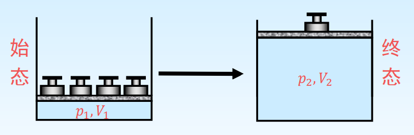

# 可逆过程与最大功

功可分为体积功($W_e$)和非体积功($W_f$).
**体积功**是体系在外力作用下因体积变化做的功,又称膨胀功或无用功.
**非体积功**是除了体积功以外的其他功,又称非膨胀功或有用功.

$$
\begin{gathered}
\delta W_{\mathrm{e}}=F \mathrm{~d} l \\
\delta W_{\mathrm{e}}=-F_{e} \mathrm{~d} l=-\left(\frac{F_{e}}{A}\right)(A \mathrm{~d} l)=-p_{e} \mathrm{~d} V \\
\text { 或 } W_{\mathrm{e}}=\int-p_{e} \mathrm{~d} V=-\sum p_{e} \mathrm{~d} V
\end{gathered}
$$

## 理想气体的体积功

+ 向真空膨胀/自由膨胀($Free\ Expansion$)

    + $$
        p_{e}=0\ \mathrm{pa} \quad \Rightarrow W_{e, 1}=\int-p_{e} d V=0 \mathrm{~J}
        $$

 +    等外压一次膨胀($p_e$保持不变)

       + 
       + 

+ 等外压二次膨胀

+ 可逆膨胀

