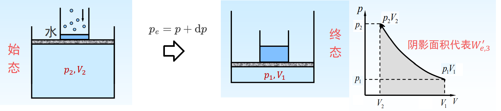

# 可逆过程与最大功

功可分为体积功($W_e$)和非体积功($W_f$).
**体积功**是体系在外力作用下因体积变化做的功,又称膨胀功或无用功.
**非体积功**是除了体积功以外的其他功,又称非膨胀功或有用功.

$$
\begin{gathered}
\delta W_{\mathrm{e}}=F \mathrm{~d} l \\
\delta W_{\mathrm{e}}=-F_{e} \mathrm{~d} l=-\left(\frac{F_{e}}{A}\right)(A \mathrm{~d} l)=-p_{e} \mathrm{~d} V \\
\text { 或 } W_{\mathrm{e}}=\int-p_{e} \mathrm{~d} V=-\sum p_{e} \mathrm{~d} V
\end{gathered}
$$

## 理想气体的体积功

### 膨胀

#### 向真空膨胀/自由膨胀($Free\ Expansion$)

+ 

    + $$
        p_{e}=0\ \mathrm{pa} \quad \Rightarrow W_{e, 1}=\int-p_{e} d V=0 \mathrm{~J}
        $$

#### 等外压一次膨胀($p_e$保持不变)

 +    

 +    $$
      \begin{aligned}
      p_{e}&=p_{2} \\
      W_{e, 2}&=\int-p_{e} d V\\
      &=\int-p_{2} d V \\
      &=-p_{2}\left(V_{2}-V_{1}\right)
      \end{aligned}
      $$

#### 等外压二次膨胀

+ 

+ $$
    W_{e, 3}=-p^{\prime}\left(V^{\prime}-V_{1}\right)-p_{2}\left(V_{2}-V^{\prime}\right)
    $$

#### 可逆膨胀

+ 

+ 外压相当于一杯水,水不断缓慢蒸发,这样的膨胀过程是无限缓慢的,每一步都接近于平衡态.

+ $$
    \begin{aligned}
    W_{e, 4}=\int-p_{e} d V &=\int-(p(d p) d) \\
    &=\int-p d V \\
    &=\int-\frac{n R T}{V} d V\\
    &=n R T \ln \frac{V_{1}}{V_{2}}
    \end{aligned}
    $$

+ 

---

$$
\left|W_{e, 1}\right|<\left|W_{e, 2}\right|<\left|W_{e, 3}\right|<\left|W_{e, 4}\right|
$$

+   从同样的始态到同样的终态,由于途径不同,环境所得到功的数值并不一样,所以功与变化途径有关,是一个与途径有关的量.**功不是状态函数**,不是系统自身的性质,因此不能说"系统含有多少功".
+   功是被传递的能量,只有在**过程**发生时,才有意义,也只有联系某一具体的变化过程时,才有功的数值.

### 压缩

#### 等外压一次压缩

>   隐隐面积代表$W_{e,1}'$

$$
W_{e, 1}^{\prime}=-p_{1}\left(V_{1}-V_{2}\right)
$$

####  等外压二次压缩

$$
W_{e, 2}^{\prime}=-p^{\prime}\left(V^{\prime}-V_{2}\right)-p_{1}\left(V_{1}-V^{\prime}\right)
$$

>   整个过程所作的功为两步的加和

#### 可逆压缩

$$
W_{e, 3}^{\prime}=\int-p_{e} d V=n R T \ln \frac{V_{2}}{V_{1}}
$$

>   理想气体,等温过程

# 总结

+   可逆膨胀,系统对环境做最大功
    可逆压缩,环境对系统做最小功
+   体系经定温可逆膨胀与定温可逆压缩两个过程所做功大小相等符号相仿,经历一循环后 $W=0$ ,又因 $\Delta U = 0$ ,故 $Q = 0$,体系和环境均恢复原状,称为可逆过程
+   不可逆膨胀再压缩使体系复原, $\Delta U = 0$ ,但无论如何 , $W > 0 , Q < 0$ ,即环境不能复原

+   可逆过程
    +   体系经过某一过程从状态1变到状态2之后,如果能使体系和环境都恢复到原来的状态而未留下任何永久性的变化
        +   状态变化时**推动力与阻力**相差无限小，体系与环境始终无限接近于平衡态；
        +   过程中任何一个中间态都可以从**正,逆两个方向**到达
        +   体系变化一个循环后,**体系和环境均回复原态**,变化过程中无任何耗散效应
        +   等温可逆过程中,体系对环境作最大功,环境对体系作最小功

