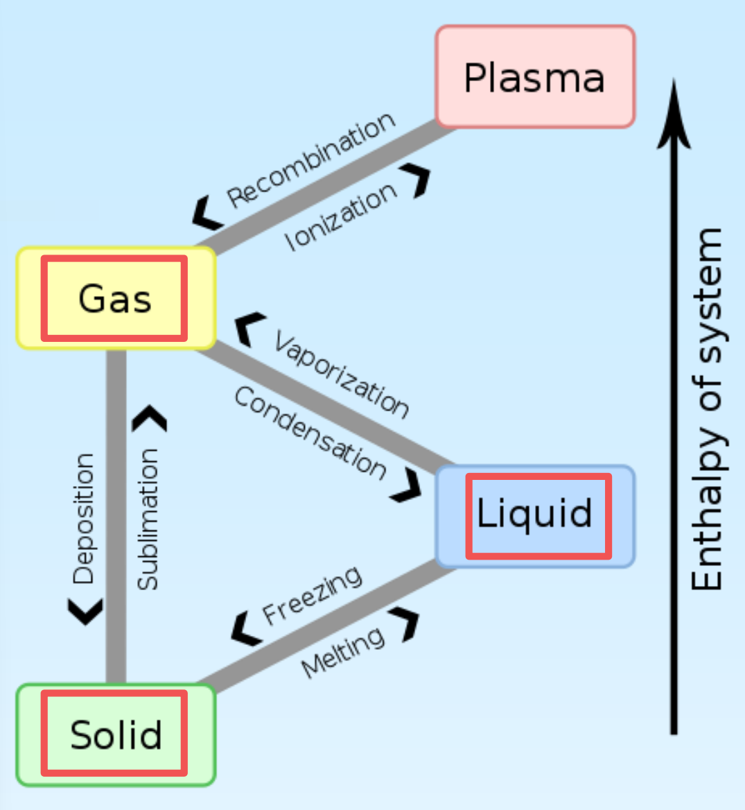
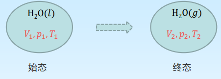

[TOC]

# 热与过程

## 定容热 $Q_V$

体系在定容, 非体积功等于0 的过程中与环境交换的热量

根据热力学第一定律
$$
\Delta U=Q+W=Q+W_{e}+W_{f}=Q-\int p_{e} \mathrm{~d} V+W_{f}=Q_{V}
$$
在 $\mathrm{d}V=0,W_f=0$ 的情况下 $\Delta U=Q_V$ 或 $\mathrm{d}U = \delta Q_V$

物理意义:
只做体积功的定容过程, 体系吸收的热等于热力学能的变化

## 定压热 $Q_p$

体系在定压, 非体积功等于 0 的过程中与环境交换的热量

根据热力学第一定律
$$
\Delta U=Q+W=Q+W_{e}+W_{f}=Q-\int p_{e} \mathrm{~d} V+W_{f}=Q_{p}-p \Delta V
$$
在 $\mathrm{d}p=0,W_f=0$ 的情况下
$$
\begin{aligned}
\Delta U&=Q_{p}-p \Delta V \\
U_{2}-U_{1}&=Q_{p}-p\left(V_{2}-V_{1}\right) \\
Q_{p}&=\left(U_{2}+p V_{2}\right)-\left(U_{1}+p V_{1}\right) \\
\quad&=\left(U_{2}+p_{2} V_{2}\right)-\left(U_{1}+p_{1} V_{1}\right)
\end{aligned}
$$
令 $H=U+pV\qquad Q_p=\Delta H $ 或 $\delta Q_p = \mathrm{d}H$

物理意义:
只做体积功的体系在定压过程中吸收的热等于焓的变化 

# 焓 $H$

$$
H=U+pV
$$

为了使用方便,因为在恒压、只做体积功的条件下,焓变等于恒压热效应.由于一般化学反应大都是在等压下进行,因此焙变容易求得,通过焓变可以求出其他状态函数的变化值.

## 焓的特点

+   焙是状态函数,广度性质.
+   焓具有能量的单位, “$J$” ,但具体数值无法确定.
+   定量, 单组分均匀体系中, $H=f(T,p)=f(T,V)=f(p,V)$

# 相 Phase

体系内部物理性质和化学性质完全均匀的部分

## 相变 Phase Transition

物质的聚集状态发生变化

## 可逆相变 Reversible Phase Transition

两相在一定温度时的相平衡压力下发生的相变化

+   在标准压力, 对应液体的沸点下, 进行的液体和气体的两相转变为可逆
+   在标准压力, 对应液体的凝固点下, 进行的凝聚相之间转变为可逆

## 相变热 Phase Transition Heat

定温, 定压条件下一定量物质在相变过程中体系吸收或放出的热量. 相变热就是相变过程体系的 $\Delta H$, 有蒸发热 $\Delta H$, 有蒸发热 $\Delta _{vap}H$, 融化热 $\Delta _{fus}H$, 升华热 $\Delta _{sub} H$

# 热容 Heat Capacity

使一定量的均相物质在无相变化和化学变化的条件下温度改变 $1K$ 所需的热, 用符号 C 表示. 广度性质, 单位 $J\cdot K^{-1}$
$$
C(T) \stackrel{\text { def }}{=} \frac{\delta Q}{ \mathrm{d} T}
$$
热容显然与系统所含的物质的量有关

## 摩尔热容

$$
C_{m}(T) \stackrel{\text { def }}{=} \frac{\delta Q}{n \mathrm{~d} T}
$$

强度性质, 单位 $J\cdot K^{-1}\cdot \mathrm{mol}^{-1}$
$$
\text { 定压: } \quad 定压热容C_{p}(T)=\frac{\delta Q_{p}}{\mathrm{d} T} \quad \Longrightarrow \quad 定压摩尔热容C_{p, m}(T)=\frac{\delta Q_{p}}{n \mathrm{d} T}\\
\text { 定容: } \quad 定容热容C_{V}(T)=\frac{\delta Q_{V}}{\mathrm{d} T} \quad \Longrightarrow \quad 定容摩尔热容C_{V, m}(T)=\frac{\delta Q_{V}}{n \mathrm{d} T}\\
$$

摩尔热容是温度的函数, 这种函数关系因物质、物态的不同而 有不同的形式。例如, 实际气体的等压摩尔热容与 $T$ 的关系有 如下经验式:
$C_{p, m}=a+b T+c T^{2}+\cdots \quad$ 或 $\quad C_{p, m}=a'+b' T+c' T^{-2}+\cdots \quad$

式中 $a, b, c, a^{\prime}, \cdots .$ 是经验常数, 由各种物质本身的特性决定, 可从热力学数据表中查找

如果体系不做有用功

定压: $C_{p, m}(T)=\frac{\delta Q_{p}}{n \mathrm{~d} T}=\frac{\mathrm{d} H}{n \mathrm{~d} T}=\frac{1}{n}\left(\frac{\partial H}{\partial T}\right)_{p} \Rightarrow \begin{aligned}&\Delta H=n \int C_{p, m} \mathrm{~d} T \\&\text { 限制条件: } \mathrm{d} p=0, W_{f}=0\end{aligned}$

定容: $C_{V, m}(T)=\frac{\delta Q_{V}}{n \mathrm{~d} T}=\frac{\mathrm{d} U}{n \mathrm{~d} T}=\frac{1}{n}\left(\frac{\partial U}{\partial T}\right)_{V} \Rightarrow \begin{gathered}\Delta U=n \int C_{V, m} \mathrm{~d} T \\ \text { 限制条件: } \mathrm{d} V=0, W_{f}=0\end{gathered}$

#  习题

1. 焓的定义 $H=U+p V$ 是在定压条件下推导出来的, 所以只 有定压过程才有焓变。（ $F$ ）
2. 焓的增加量 $\Delta H$ 等于过程中体系从环境吸收的热量。（ $F$ )
3. 373 К及 $101.325 \mathrm{kPa}$ 下, $1 \mathrm{~kg} \mathrm{H}_{2} \mathrm{O}(l), \mathrm{H}_{2} \mathrm{O}(g)$ 的体积分别 为 $1.043 \times 10^{-3} \mathrm{~m}^{3}$ 和 $1.673 \mathrm{~m}^{3}, \mathrm{H}_{2} \mathrm{O}(l)$ 蒸发热 为 $2.259 \times$ $10^{3} \mathrm{~kJ} \cdot \mathrm{kg}^{-1}$ 。
    计算
    (1) $373 \mathrm{~K}$ 及完全变成 $101.325 \mathrm{kPa下} 1 \mathrm{~mol} \mathrm{H}_{2} \mathrm{O}(l)\mathrm{H}_{2} \mathrm{O}(g)$ 时 的 $Q, W, \Delta U$ 及 $\Delta H$; 
    (2) $373 \mathrm{~K}$ 及 $101.325 \mathrm{kPa下} 1 \mathrm{~mol} \mathrm{H}_{2} \mathrm{O}(l)$ 向真空蒸发成与 (1)终态相同温度 及压力的 $\mathrm{H}_{2} \mathrm{O}(g)$ 时的 $Q, W, \Delta U$ 及 $\Delta H_{\text {。 }}$

>1.体系状态发生变化都有焓变
>2.加上条件:定压变化，非体积功等于0

3.

$$
\begin{array}{ll}
p_{1}=p_{2}=101.325 \mathrm{kPa} & V_{1}=1.043 \times 10^{-3} \mathrm{~m}^{3} \\
T_{1}=T_{2}=373 \mathrm{~K} & V_{2}=1.673 \mathrm{~m}^{3}
\end{array}
$$
定压 
$$
\begin{aligned}
Q&=\Delta H\\
&=18 \times 10^{-3} \mathrm{~kg} \times 2.259 \times 10^{3} \mathrm{~kJ} \cdot \mathrm{kg}^{-1}\\
&=40.66 \mathrm{~kJ}\\
\\
W&=-p \Delta V \\
&=-101.325 \times\left(1.673-1.043 \times 10^{-3}\right) \times 18 \times 10^{-3} \mathrm{~kJ} \\
&=-3.06 \mathrm{KJ}\\
\\
\Delta U&=Q+W\\
&=37.60 \mathrm{KJ}
\end{aligned}
$$
(2) 始终态与1相同，真空膨胀

## 理想气体

严格遵从状态方程( $pV=nRT$ )的气体, 从微观角度来看是指: 分子本身的体积和分子间的作用力忽略不计, 并且分子之间及分子与器壁之间发生的碰撞不造成动能损失.

>   注意
>
>   +   理想气体并不存在. 实际气体中, 凡是本身不易被液化的气体, 它们的性质很近似理想气体, 如氢气和氦气.
>   +   一般可认为温度不低于 $0,$ 压强不高于$101kPa$ 时的气体为理想气体. 把实际气体近似看作理想气体, 对研究问题非常用.
>   +   当气体处于高压, 低温条件下, 状态变化较显著地偏离状态方程, 需要按实际情况加以修正, 常用的一种修正方程叫做范德瓦耳斯方程, 考虑了分子间相互作用以及分子本身的体积.

