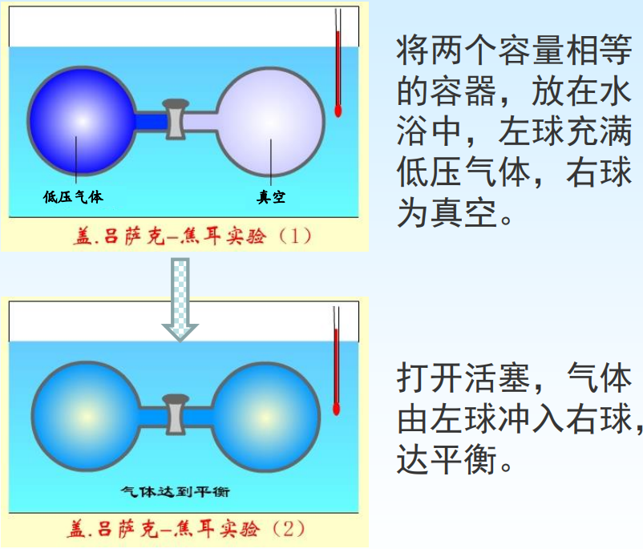

[TOC]

# 热与过程

## 定容热 $Q_V$

体系在定容, 非体积功等于 0 的过程中与环境交换的热量

根据热力学第一定律
$$
\Delta U=Q+W=Q+W_{e}+W_{f}=Q-\int p_{e} \mathrm{~d} V+W_{f}=Q_{V}
$$
在 $\mathrm{d}V=0,W_f=0$ 的情况下(定容, 不做非体积功) $\Delta U=Q_V$ 或 $\mathrm{d}U = \delta Q_V$

物理意义:
只做体积功的定容过程, 体系吸收的热等于热力学能的变化

## 定压热 $Q_p$

体系在定压, 非体积功等于 0 的过程中与环境交换的热量

根据热力学第一定律
$$
\Delta U=Q+W=Q+W_{e}+W_{f}=Q-\int p_{e} \mathrm{~d} V+W_{f}=Q_{p}-p \Delta V
$$
在 $\mathrm{d}p=0,W_f=0$ 的情况下(定压, 不做非体积功)
$$
\begin{aligned}
\Delta U&=Q_{p}-p \Delta V \\
U_{2}-U_{1}&=Q_{p}-p\left(V_{2}-V_{1}\right) \\
Q_{p}&=\left(U_{2}+p V_{2}\right)-\left(U_{1}+p V_{1}\right) \\
\quad&=\left(U_{2}+p_{2} V_{2}\right)-\left(U_{1}+p_{1} V_{1}\right)
\end{aligned}
$$
令 $H=U+pV\qquad Q_p=\Delta H $ 或 $\delta Q_p = \mathrm{d}H$

物理意义:
只做体积功的体系在定压过程中吸收的热等于焓的变化 

为标记 $U+pV$ , 定义新的状态函数 $H$, $H$ 无法求出具体的值, 但是 焓变 $\Delta H$ 可以表示 只做体积功的体系在定压过程中吸收的热量

#  焓 $H$

$$
H=U+pV
$$

为了使用方便, 因为在恒压, 只做体积功的条件下, 焓变等于恒压热效应. 由于一般化学反应大都是在等压下进行, 因此焓变容易求得, 通过焓变可以求出其他状态函数的变化值.

## 焓的特点

+   焓是状态函数, 广度性质.
+   焓具有能量的单位, “$J$” , 但具体数值无法确定.
+   定量, 单组分均匀体系中, $H=f(T,p)=f(T,V)=f(p,V)$

# 相 Phase

体系内部物理性质和化学性质完全均匀的部分

## 相变 Phase Transition

物质的聚集状态发生变化

## 可逆相变 Reversible Phase Transition

两相在一定温度时的相平衡压力下发生的相变化

+   在标准压力, 对应液体的沸点下, 进行的液体和气体的两相转变为可逆
+   在标准压力, 对应液体的凝固点下, 进行的凝聚相之间转变为可逆

## 相变热 Phase Transition Heat

**定温**, <u>定压</u>条件下一定量物质在相变过程中体系吸收或放出的热量. 相变热就是相变过程体系的 $\Delta H$, 有蒸发热 $\Delta H$, 有蒸发热 $\Delta _{vap}H$, 融化热 $\Delta _{fus}H$, 升华热 $\Delta _{sub} H$

>   定压, 不做非体积功时, 体系吸收的热量等于 $\Delta H$ ​

# 热容 Heat Capacity

使一定量的**均相**物质在**无相变化和化学变化**的条件下温度改变 $1K$ 所需的热, 用符号 $C$ 表示. 广度性质, 单位 $J\cdot K^{-1}$
$$
C(T) \stackrel{\text { def }}{=} \frac{\delta Q}{ \mathrm{d} T}
$$
热容显然与系统所含的物质的量有关

## 摩尔热容

$$
C_{m}(T) \stackrel{\text { def }}{=} \frac{\delta Q}{n \mathrm{~d} T}
$$

强度性质, 单位 $J\cdot K^{-1}\cdot \mathrm{mol}^{-1}$
$$
\text { 定压: } \quad 定压热容C_{p}(T)=\frac{\delta Q_{p}}{\mathrm{d} T} \quad \Longrightarrow \quad 定压摩尔热容C_{p, m}(T)=\frac{\delta Q_{p}}{n \mathrm{d} T}\\
\text { 定容: } \quad 定容热容C_{V}(T)=\frac{\delta Q_{V}}{\mathrm{d} T} \quad \Longrightarrow \quad 定容摩尔热容C_{V, m}(T)=\frac{\delta Q_{V}}{n \mathrm{d} T}\\
$$

摩尔热容是温度的函数, 这种函数关系因物质、物态的不同而有不同的形式。例如, 实际气体的等压摩尔热容与 $T$ 的关系有 如下经验式:
$C_{p, m}=a+b T+c T^{2}+\cdots \quad$ 或 $\quad C_{p, m}=a'+b' T+c' T^{-2}+\cdots \quad$

式中 $a, b, c, a^{\prime}, \cdots .$ 是经验常数, 由各种物质本身的特性决定, 可从热力学数据表中查找

如果体系不做有用功

定压: $C_{p, m}(T)=\frac{\delta Q_{p}}{n \mathrm{~d} T}=\frac{\mathrm{d} H}{n \mathrm{~d} T}=\frac{1}{n}\left(\frac{\partial H}{\partial T}\right)_{p} \Rightarrow \begin{aligned}&\Delta H=n \int C_{p, m} \mathrm{~d} T \\&\text { 限制条件: } \mathrm{d} p=0, W_{f}=0\end{aligned}$

定容: $C_{V, m}(T)=\frac{\delta Q_{V}}{n \mathrm{~d} T}=\frac{\mathrm{d} U}{n \mathrm{~d} T}=\frac{1}{n}\left(\frac{\partial U}{\partial T}\right)_{V} \Rightarrow \begin{gathered}\Delta U=n \int C_{V, m} \mathrm{~d} T \\ \text { 限制条件: } \mathrm{d} V=0, W_{f}=0\end{gathered}$

#  习题

1. 焓的定义 $H=U+p V$ 是在定压条件下推导出来的, 所以只有定压过程才有焓变。（ $F$ ）
2. 焓的增加量 $\Delta H$ 等于过程中体系从环境吸收的热量。（ $F$ )
3. $373~K$ 及 $101.325 ~\mathrm{kPa}$ 下, $1 ~\mathrm{~kg} ~\mathrm{H}_{2} \mathrm{O}(l), \mathrm{H}_{2} \mathrm{O}(g)$ 的体积分别 为 $1.043 \times 10^{-3} \mathrm{~m}^{3}$ 和 $1.673 \mathrm{~m}^{3}, \mathrm{H}_{2} \mathrm{O}(l)$ 蒸发热 为 $2.259 \times$ $10^{3} \mathrm{~kJ} \cdot \mathrm{kg}^{-1}$ 。
    计算
    (1) $373 \mathrm{~K}$ 及完全变成 $101.325~ \mathrm{kPa下} 1 \mathrm{~mol}~ \mathrm{H}_{2} \mathrm{O}(l)$ 完全变成 $~\mathrm{H}_{2} \mathrm{O}(g)$ 时的 $Q, W, \Delta U$ 及 $\Delta H$; 
    (2) $373 \mathrm{~K}$ 及 $101.325 ~\mathrm{kPa下} 1 \mathrm{~mol}~ \mathrm{H}_{2} \mathrm{O}(l)$ 向真空蒸发成与(1)终态相同温度及压力的 $\mathrm{H}_{2} \mathrm{O}(g)$ 时的 $Q, W, \Delta U$ 及 $\Delta H_{\text {。 }}$

>1.   体系状态发生变化都有焓变
>2.   加上条件: 定压变化, 非体积功等于 0

3.

$$
\begin{array}{ll}
p_{1}=p_{2}=101.325 \mathrm{kPa} & V_{1}=1.043 \times 10^{-3} \mathrm{~m}^{3} \\
T_{1}=T_{2}=373 \mathrm{~K} & V_{2}=1.673 \mathrm{~m}^{3}
\end{array}
$$
定压
$$
\begin{aligned}
Q&=\Delta H\\
&=18 \times 10^{-3} \mathrm{~kg} \times 2.259 \times 10^{3} \mathrm{~kJ} \cdot \mathrm{kg}^{-1}\\
&=40.66 \mathrm{~kJ}\\
\\
W&=-p \Delta V \\
&=-101.325 \times\left(1.673-1.043 \times 10^{-3}\right) \times 18 \times 10^{-3} \mathrm{~kJ} \\
&=-3.06 \mathrm{KJ}\\
\\
\Delta U&=Q+W\\
&=37.60 \mathrm{KJ}
\end{aligned}
$$
(2) 始终态与1相同，真空膨胀

## 理想气体

严格遵从状态方程( $pV=nRT$ )的气体, 从微观角度来看是指: 分子本身的体积和分子间的作用力忽略不计, 并且分子之间及分子与器壁之间发生的碰撞不造成动能损失.

>   注意
>
>   +   理想气体并不存在. 实际气体中, 凡是本身不易被液化的气体, 它们的性质很近似理想气体, 如氢气和氦气.
>   +   一般可认为温度不低于 $0,$ 压强不高于$101kPa$ 时的气体为理想气体. 把实际气体近似看作理想气体, 对研究问题非常用.
>   +   当气体处于高压, 低温条件下, 状态变化较显著地偏离状态方程, 需要按实际情况加以修正, 常用的一种修正方程叫做范德瓦耳斯方程, 考虑了分子间相互作用以及分子本身的体积.

### 盖-吕萨克-焦耳实验

#### 实验现象

水浴温度没有变化。

#### 实验结论

(1) 以气体为体系, $\mathrm{d} T=0, Q=0$
(2) 体系没有对外做 功, $W=0$ 。
(3) $\Delta U=0$

---

#### 热力学能与温度的关系

设理想气体的热力学能是 $T, V$ 的函数
$$
U=U(T, V) \quad \Longrightarrow \quad \mathrm{d} U=\left(\frac{\partial U}{\partial T}\right)_{V} \mathrm{~d} T+\left(\frac{\partial U}{\partial V}\right)_{T} \mathrm{~d} V
$$
由上述实验得知，对理想气体自由膨胀过程:
$$
\begin{aligned}
\mathrm{d} T&=0, \mathrm{~d} U=0 \\

\left( \frac{\partial U}{\part p}\right)_T\mathrm{d}p&=0\\
\\
\mathrm{~d} p &\neq 0\\
\\
\Rightarrow\left(\frac{\partial U}{\partial V}\right)_{T}&=0
\end{aligned}
$$
**理想气体**在等温时, 改变体积, 其热力学能不变。

---

设理想气体的热力学能是 $T, p$ 的函数
$$
U=U(T, p) \quad \Longrightarrow \quad \mathrm{d} U=\left(\frac{\partial U}{\partial T}\right)_{p} \mathrm{~d} T+\left(\frac{\partial U}{\partial p}\right)_{T} \mathrm{~d} p
$$
由上述实验得知，对理想气体自由膨胀过程:
$$
\begin{aligned}
&\mathrm{d} T=0, \mathrm{~d} U=0 \\
&\left.\qquad \begin{array}{r}
\left(\frac{\partial U}{\partial p}\right)_{T} \mathrm{~d} p=0 \\
\mathrm{~d} p \neq 0
\end{array}\right\}\left(\frac{\partial U}{\partial p}\right)_{T}=0
\end{aligned}
$$
**理想气体**在等温时, 改变压力，其热力学能不变。

>   理想气体的热力学能只是温度的函数, 不随体系体积和压力的变化而变化.

---

#### 焓与温度的关系

根据焓的定义式
$$
H=U+pV \quad \Longrightarrow \quad \mathrm{d}H=\mathrm{d}U+\mathrm{d}(pV)
$$
理想气体状态方程式
$$
\begin{aligned}
&\left.\begin{array}{l}
p V=n R T \\
\text { 又因为 } \quad \mathrm{d} T=0
\end{array}\right\} \mathrm{d}(p V)=0\\
&\left(\frac{\partial H}{\partial V}\right)_{T}=\left(\frac{\partial U}{\partial V}\right)_{T}+\left(\frac{\partial(p V)}{\partial V}\right)_{T} \quad \Longrightarrow\left(\frac{\partial H}{\partial V}\right)_{T}=0\\
&\text { 同理 } \Rightarrow\left(\frac{\partial H}{\partial p}\right)_{T}=0
\end{aligned}
$$

>   理想气体的焓也只是温度的函数, 与体积和压力的变化无关

### 理想气体热力学能变和焓变的计算

$$
\begin{aligned}
\mathrm{d}U &=\left ( \frac{\partial U}{\partial T}\right)_V  \mathrm{d}T+\left ( \frac{\partial U}{\partial T}\right)_T \mathrm{d}V\\
\mathrm{d}U&=\left ( \frac{\partial U}{\partial T}\right)_V\mathrm{d}T\\
&=\left ( \frac{\partial Q_V}{\partial T}\right)_V\mathrm{d}T\\
&=C_V\mathrm{d}T\\
&=nC_{V,m}\mathrm{d}T\\
\Longrightarrow \quad \Delta U&=n\int C_{V,m}\mathrm{d}T
\end{aligned}
$$

$$
\begin{aligned}
\mathrm{d}H &=\left ( \frac{\partial H}{\partial T}\right)_p  \mathrm{d}T+\left ( \frac{\partial H}{\partial p}\right)_T \mathrm{d}p\\
\mathrm{d}H&=\left ( \frac{\partial H}{\partial T}\right)_p\mathrm{d}T\\
&=\left ( \frac{\partial Q_p}{\partial T}\right)_p\mathrm{d}T\\
&=C_p\mathrm{d}T\\
&=nC_{p,m}\mathrm{d}T\\
\Longrightarrow \quad \Delta H&=n\int C_{p,m}\mathrm{d}T
\end{aligned}
$$

>   不受定容, 定压的限制

### 总结

+   无论是理想气体还是非理想气体, 由于一般默认为不做非体积功
    +   定容 $\Delta U = n \int C_{V,m} \mathrm{d}T$
    +   定压 $\Delta H = n \int C_{p,m} \mathrm{d} T$
+   对于理想气体
    +   $\Delta U = n \int C_{V,m} \mathrm{d}T$          $\Delta H = n \int C_{p,m} \mathrm{d} T$
    +   不受定容定压条件限制

---

### $C_V$ 与 $C_p$ 的关系

复合函数的偏微分
$$
\begin{gathered}
U=U(T, V) \\
\mathrm{d} U=\left(\frac{\partial U}{\partial T}\right)_{V} \mathrm{~d} T+\left(\frac{\partial U}{\partial V}\right)_{T} \mathrm{~d} V
\end{gathered}
$$

$$
\begin{aligned}
V &=V(T, p) \\
\mathrm{d} V &=\left(\frac{\partial V}{\partial T}\right)_{p} \mathrm{~d} T+\left(\frac{\partial V}{\partial p}\right)_{T} \mathrm{~d} p
\end{aligned}
$$

$$
\begin{aligned}
\mathrm{d} U &=\left(\frac{\partial U}{\partial T}\right)_{V} \mathrm{~d} T+\left(\frac{\partial U}{\partial V}\right)_{T}\left[\left(\frac{\partial V}{\partial T}\right)_{p} \mathrm{~d} T+\left(\frac{\partial V}{\partial p}\right)_{T} \mathrm{~d} p\right] \\
&=\left[\left(\frac{\partial U}{\partial T}\right)_{V}+\left(\frac{\partial U}{\partial V}\right)_{T}\left(\frac{\partial V}{\partial T}\right)_{p}\right] \mathrm{d} T+\left(\frac{\partial U}{\partial V}\right)_{T}\left(\frac{\partial V}{\partial p}\right)_{T} \mathrm{~d} p \\
&=\left[\left(\frac{\partial U}{\partial T}\right)_{V}+\left(\frac{\partial U}{\partial V}\right)_{T}\left(\frac{\partial V}{\partial T}\right)_{p}\right] \mathrm{d} T+\left(\frac{\partial U}{\partial p}\right)_{T} \mathrm{~d} p
\end{aligned}
$$

$$
\begin{gathered}
U=U(T, p) \quad \mathrm{d} U=\left(\frac{\partial U}{\partial T}\right)_{p} \mathrm{~d} T+\left(\frac{\partial U}{\partial p}\right)_{T} \mathrm{~d} p \\
\mathrm{~d} U=\left[\left(\frac{\partial U}{\partial T}\right)_{V}+\left(\frac{\partial U}{\partial V}\right)_{T}\left(\frac{\partial V}{\partial T}\right)_{p}\right] \mathrm{d} T+\left(\frac{\partial U}{\partial p}\right)_{T} \mathrm{~d} p \\
\left(\frac{\partial U}{\partial T}\right)_{p}=\left(\frac{\partial U}{\partial T}\right)_{V}+\left(\frac{\partial U}{\partial V}\right)_{T}\left(\frac{\partial V}{\partial T}\right)_{p}
\end{gathered}
$$

$$
\begin{aligned}
C_{p}-C_{V}&=\left(\frac{\partial H}{\partial T}\right)_{p}-\left(\frac{\partial U}{\partial T}\right)_{V} \\
&=\left(\frac{\partial(U+p V)}{\partial T}\right)_{p}-\left(\frac{\partial U}{\partial T}\right)_{V} \\
&=\left(\frac{\partial U}{\partial T}\right)_{p}+p\left(\frac{\partial V}{\partial T}\right)_{p}-\left(\frac{\partial U}{\partial T}\right)_{V} \\
\\
\left(\frac{\partial U}{\partial T}\right)_{p}&=\left(\frac{\partial U}{\partial T}\right)_{V}+\left(\frac{\partial U}{\partial V}\right)_{T}\left(\frac{\partial V}{\partial T}\right)_{p} \\
\\
C_{p}-C_{V}&=\left(\frac{\partial U}{\partial T}\right)_{V}+\left(\frac{\partial U}{\partial V}\right)_{T}\left(\frac{\partial V}{\partial T}\right)_{p}+p\left(\frac{\partial V}{\partial T}\right)_{p}-\left(\frac{\partial U}{\partial T}\right)_{V} \\
&=\left[\left(\frac{\partial U}{\partial V}\right)_{T}+p\right]\left(\frac{\partial V}{\partial T}\right)_{p}
\end{aligned}
$$

>   没有任何限制条件, 固体, 液体, 气体都适用

1.   对于理想气体
     $$
     \begin{aligned}
     \left(\frac{\partial U}{\partial V}\right)_{T}&=0 \\
     \left(\frac{\partial V}{\partial T}\right)_{p}&=\frac{n R}{P}
     \end{aligned}
     $$

     $$
     C_{p}-C_{V}=n R \Rightarrow C_{p, m}-C_{V, m}=R
     $$

     

2.   对于液体, 固体
     $$
     \left(\frac{\partial V}{\partial T}\right)_{p} \approx 0 \quad \Rightarrow \quad C_{p} \approx C_{V}
     $$

3.   对于实际气体
     $$
     C_{p}-C_{V}=\left[\left(\frac{\partial U}{\partial V}\right)_{T}+p\right]\left(\frac{\partial V}{\partial T}\right)_{p}
     $$
     

