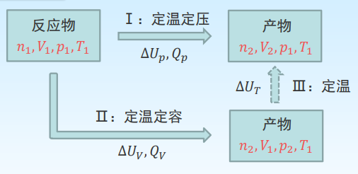
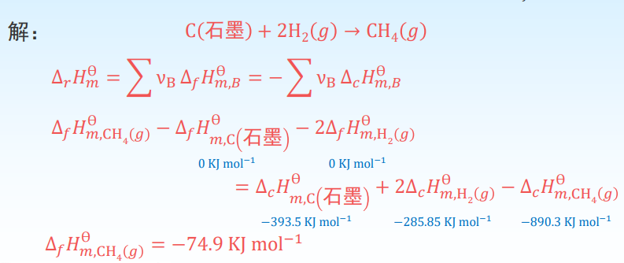
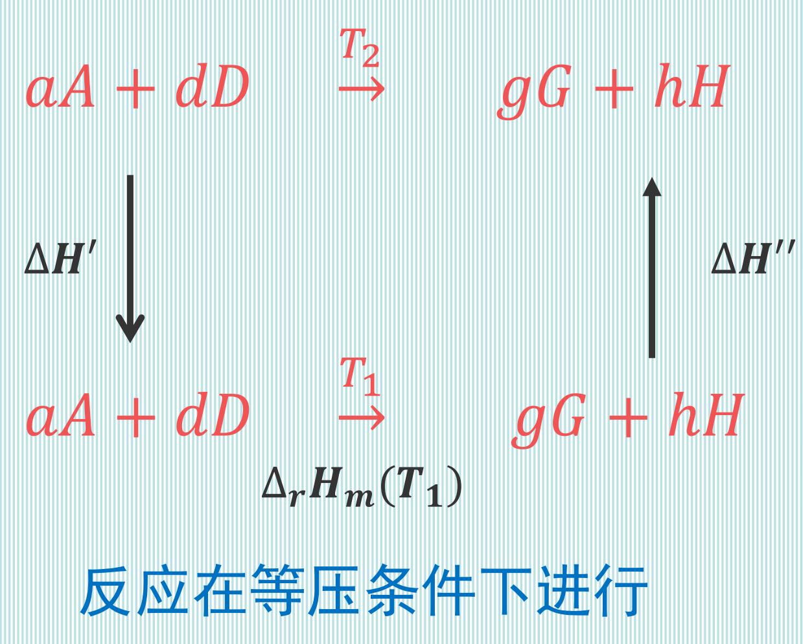
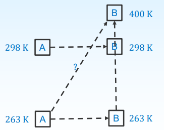

# 化学反应热

根据热力学第一定律，由于化学反应体系中反应物和产物 间热力学能的差异，导致该过程进行时，常伴随有吸热或放热现象。精确测定化学反应过程中热变化并研究其规律 的科学称为热化学(heat chemistry)。

只做体积功的化学反应系统，在反应物与产物温度相同的情 况下，化学反应过程中吸收或放出的热量称为化学反应热， 简称反应热。

+   反应热的取号仍采用热力学中的惯例，即系统（化学变化） 吸热为正值，放热为负值。 
+   定容条件下的反应热称为定容反应热 $𝑄_𝑉(∆𝑈)$，定压条件下 的反应热称为定压反应热 $𝑄_𝑝(∆𝐻)$。 
+   定容反应热更容易测量，定压反应热更有意义，因为实际 情况下大多数反应都是在定压条件下进行的。

## $Q_V$ 与 $Q_V$ 的关系

分析: 
$$
\left.\begin{array}{lll}
&\text { 对于途径 } \mathrm{I}: &Q_{p}=\Delta H=\Delta U_{p}+p \Delta V \\
&\text { 对于途径II }: &Q_{V}=\Delta U_{V} \\
&\text { 状态函数: } &\Delta U_{p}=\Delta U_{V}+\Delta U_{T}
\end{array}\right\} &Q_{p}-Q_{V}=\Delta U_{T}+p \Delta V
$$
$\Delta H_{m}-\Delta U_{m}=\sum v_{B}(g) R T$ 是如何推出来的? $\Delta H_{m}$ 和 $\Delta U_{m}$ 表示的 是反应进度为 $1 \mathrm{~mol}$ 时的焓变和热力学能变。
$$
a A+d D \rightarrow g G+h H
$$
反应进度为 $\quad \Delta \xi=-\large\frac{\Delta n_{A}}{a}=-\frac{\Delta n_{D}}{d}=\frac{\Delta n_{G}}{g}=\frac{\Delta n_{H}}{h}$ 

当反应进度为 $1 \mathrm{~mol}$
$$
\begin{aligned}
&\Delta n_{A}=-a ; \Delta n_{D}=-d \\
&\begin{aligned}
\Delta n_{G} &=g ; \Delta n_{H}=h \\
\Delta n &=\Delta n_{G}+\Delta n_{H}+\Delta n_{D}+\Delta n_{A} \\
&=-a+(-d)+g+h \\
&=v_{A}+v_{D}+v_{g}+v_{h}=\sum v_{B}(g)
\end{aligned}
\end{aligned}
$$

---

# 习题

$1 \mathrm{~mol}$ 丙二酸 $\mathrm{CH}_{2}(\mathrm{COOH})_{2}$ 晶体在弹式量热计中充分燃烧, 生成 二氧化碳和液态的水, $298 \mathrm{~K}$ 时放出热量 $886.5 \mathrm{~kJ}$, 求 $1 \mathrm{~mol}$ 丙 二酸在 $298 \mathrm{~K}$ 时的定压反应热。
解: 题中所述燃烧反应的化学方程式为
$$
\mathrm{CH}_{2}(\mathrm{COOH})_{2}(s)+2 \mathrm{O}_{2}(g) \rightarrow 3 \mathrm{CO}_{2}(g)+2 \mathrm{H}_{2} \mathrm{O}(l)
$$
反应前后气体物质的量的变化为
$$
\begin{aligned}
\Delta n=(3-2) \mathrm{mol} &=1 \mathrm{~mol} \\
Q_{p}=Q_{V}+\Delta n R T &=-886.5 \times 10^{3} \mathrm{~J}+1 \times 8.314 \times 298 \mathrm{~J} \\
&=-884.02 \mathrm{~kJ}
\end{aligned}
$$

---

相同量 $\mathrm{Fe}$ 与 $\mathrm{HCl}$ （盐酸）反应, 在密闭容器中放热多还是在 开口容器中放热多?

解: 题中所述的化学方程式为
$$
\mathrm{Fe}(s)+2 \mathrm{HCl}(l) \rightarrow \mathrm{FeCl}_{2}(l)+\mathrm{H}_{2}(g)
$$
因为 
$$
\quad \sum v_{B}(g)=1
$$
所以 
$$
\quad Q_{p, m}-Q_{V, m}=R T
$$
又 $Q_{p, m}$ 和 $Q_{V, m}$ 都是负数

故 $\left|Q_{p, m}\right|<\left|Q_{V, m}\right|$ 在密闭容器中反应时放热多

## 热化学方程式

热化学方程式(thermochemical equation): 表示化学反应与热 效应关系的方程式。

+   必须注明反应条件(温度, 压力, 聚集态等). 对温度和压力, 若无特别注明, 通常认为反应在 $T=298 \mathrm{~K}, p=p^{\theta}$ 下进行。
+   对于具有不同晶型的固体物质, 要注明物质的晶型。溶液中的反应要求注明物质的浓度。
+   如果参加反应的各物质均处于标准态, 则反应的焓变称为标准摩尔焓变, 用 $\Delta_{r} H_{m}^{\theta}$ 表示

$$
\mathrm{H}_{2}(g)+\frac{1}{2} \mathrm{O}_{2}(g)=\mathrm{H}_{2} \mathrm{O}(g) ; \quad \Delta_{r} \mathrm{H}_{m}^{\theta}=-241.818 \mathrm{~kJ} \mathrm{~mol}^{-1}\\
\mathrm{H}_{2}(g)+\frac{1}{2} \mathrm{O}_{2}(g)=\mathrm{H}_{2} \mathrm{O}(l) ; \quad \Delta_{r} \mathrm{H}_{m}^{\Theta}=-285.830 \mathrm{~kJ} \mathrm{~mol}^{-1}
$$

## 赫斯定律

赫斯定律 (Hess's law): 一个化学反应, 无论是一步完成还是分几步完成, 其反应热是相同的. 即对该反应体系, 其反应热 只与始态和终态有关, 而与变化的途径无关。

$\left.\begin{array}{ll}\text { 在等容条件下 } & Q_{V}=\Delta U \\ \text { 在等压条件下 } & Q_{p}=\Delta H\end{array}\right\} \quad U$ 和 $H$ 都是状态函数

实验定律, 是热力学第一定律在热化学中的必然结果。

应用: 对于进行得太慢的或反应程度不易控制而无法直接测定反应热的化学反应, 可以用 Hess 定律, 利用容易测定的反应热 来计算不容易测定的反应热。

如 $\mathrm{C}(s)+\frac{1}{2} \mathrm{O}_{2}(g)=\mathrm{CO}(g)$ 的摩尔反应焓很难测定, 但碳完全燃烧 生成二氧化碳以及一氧化碳氧化变为二氧化碳的摩尔反应焓却 容易得到
$$
(1)\mathrm{C}(s)+\mathrm{O}_{2}(g)=\mathrm{CO}_{2}(g) ; \quad \Delta_{r} H_{m}^{\ominus}(1)=-393.5 \mathrm{~kJ} \mathrm{~mol}^{-1}\\
(2)\mathrm{CO}(g)+\frac{1}{2} \mathrm{O}_{2}(g)=\mathrm{CO}_{2}(g) ; \quad \Delta_{r} H_{m}^{\ominus}(2)=-283.0 \mathrm{~kJ} \mathrm{~mol}^{-1}
$$
假设 $\mathrm{C}(s)+\frac{1}{2} \mathrm{O}_{2}(g)=\mathrm{CO}(g)$ 为方程式3, 根据Hess定律
$$
\Delta_{r} H_{m}^{\Theta}(3)=\Delta_{r} H_{m}^{\Theta}(1)-\Delta_{r} H_{m}^{\Theta}(2)=-110.5 \mathrm{~kJ} \mathrm{~mol}^{-1}
$$

## 反应热

只做体积功、等压的化学反应热效应等于反应的焓变, 也就是 等于产物的焓的总和减去反应物焓的总和
$$
\Delta_{r} H=\left(\sum_{\mathrm{B}} H_{B}\right) \text { 产物 }-\left(\sum_{\mathrm{B}} H_{B}\right)_{\text {反应物 }}
$$
由于各物质的焓的绝对值无法求得, 为此化学热力学选择了一 个相对标准求出各种物质的相对焓值. 标准压力 $p^{\theta}(100 \mathrm{kPa})$ 下的纯物质状态:
1.固体 标准压力 $p^{\theta}$ 下最稳定的晶体状态
2.液体 标准压力 $p^{\theta}$ 下纯液体状态
3.气体 标准压力 $p^{\theta}$ 下纯气体物质并具有理想气体性质的状态

**标准摩尔生成焓**(standard molar enthalpy of formation): 在指定温度标准状态下, 由元素的最稳定单质生成 $1 \mathrm{~mol}$ 化合物时的反应热, 称为该物质的标准摩尔生成焓, 以 $\Delta_{f} H_{m}^{\theta}$ 表示。

+   一个化合物的生成焓并不是这个化合物的焓的绝对值, 它是相对 于合成它的单质的相对焓变。
+   规定指定温度及标准压力下, 元素最稳定单质的标准摩尔生成焓为 $0$ 。
+   氢的最稳定单质是 $\mathrm{H}_{2}(g)$; 氧的最稳定单质是 $\mathrm{O}_{2}(g)$;

- 碳的最稳定单质是石墨(非金刚石); 磷的最稳定单质是白磷(非红磷)

1.如果一个反应中各个物质的生成焓都已经知道, 则可以求整 个化学反应的 $\Delta_{r} H_{m}^{\ominus}$ 。
$$
2 A+D \rightarrow G+3 H
$$
可得 
$$
\Delta_{r} H_{m}^{\Theta}=\Delta_{f} H_{m, G}^{\Theta}+3 \Delta_{f} H_{m, H}^{\Theta}-2 \Delta_{f} H_{m, A}^{\theta}-\Delta_{f} H_{m, D}^{\ominus}
$$
或对任意的反应 
$$
\quad 0=\sum v_{B} B
$$
可得
$$
\Delta_{r} H_{m}^{\Theta}=\sum v_{\mathrm{B}} \Delta_{f} H_{m, B}^{\Theta}
$$

---

2.有很多化合物不能直接由单质合成, 但可通过Hess定律间 接求其生戍焓。
$$
(1) \mathrm{CH}_{3} \mathrm{COOH}(l)+2 \mathrm{O}_{2}(g)=2 \mathrm{CO}_{2}(g)+2 \mathrm{H}_{2} \mathrm{O}(l) ; \quad \Delta_{r} H_{m}^{\ominus}(1)\\
(2) \mathrm{C}(s)+\mathrm{O}_{2}(g)=\mathrm{CO}_{2}(g) ; \quad \Delta_{r} H_{m}^{\Theta}(2)\\
(3) \mathrm{H}_{2}(g)+\frac{1}{2} \mathrm{O}_{2}(g)=\mathrm{H}_{2} \mathrm{O}(l) ; \quad \Delta_{r} H_{m}^{\Theta}(3)\\
$$

由 $\{(2)+(3)\} \times 2-(1)$ 得

$$
(4) 2 \mathrm{C}(s)+2 \mathrm{H}_{2}(g)+\mathrm{O}_{2}(g)=\mathrm{CH}_{3} \mathrm{COOH}(l)\\
\Delta_{r} H_{m}^{\ominus}(4)=\left\{\left(\Delta_{r} H_{m}^{\Theta}(2)+\Delta_{r} H_{m}^{\Theta}(3)\right) \times 2\right\}-\Delta_{r} H_{m}^{\ominus}(1)=\Delta_{f} H_{m}^{\Theta}\left(\mathrm{CH}_{3} \mathrm{COOH}\right)
$$

---

**标准摩尔燃烧焓**(standard molar enthalpy of combustion): $1 \mathrm{~mol}$ 物质在指定温度及标准状态下，完全燃烧生成指定产物 的反应热, 称为该物质的标准摩尔燃烧焓, 以 $\Delta_{c} H_{m}^{\theta}$ 表示。 指定产物通常规定为:
$$
\begin{array}{ccc}\mathrm{C} \rightarrow \mathrm{CO}_{2}(g) & \mathrm{H} \rightarrow \mathrm{H}_{2} \mathrm{O}(l) & \mathrm{S} \rightarrow \mathrm{SO}_{2}(g) \\ \mathrm{N} \rightarrow \mathrm{N}_{2}(g) & \mathrm{Cl} \rightarrow \mathrm{HCl}(a q) & \text { 金属单质→游离态 }\end{array}
$$

+   显然, 根据标准摩尔燃烧焓的定义, 所指定产物如 $\mathrm{CO}_{2}(g)$ ,  $\mathrm{H}_{2} \mathrm{O}(l)$ 等的标准摩尔燃烧焓, 在任何温度时, 其值均为零。
+   氧气是助燃剂, 燃烧焓也等于零。

化学反应的焓变值等于各反应物燃烧焓的总和减去各产物燃烧 焓的总和。
$$
a A+d D \rightarrow g G+h H
$$
可得 $\Delta_{r} H_{m}^{\ominus}=a \Delta_{c} H_{m, A}^{\ominus}+d \Delta_{c} H_{m, D}^{\ominus}-g \Delta_{c} H_{m, G}^{\ominus}-h \Delta_{c} H_{m, H}^{\ominus}$
或 $\quad \Delta_{r} H_{m}^{\theta}=-\sum v_{B} \Delta_{c} H_{m, B}^{\ominus}$
例如, 在 $298.15 \mathrm{~K}$ 和标准压力下, 有反应:
$$
\begin{aligned}
&\begin{array}{ccc}
&(\mathrm{COOH})_{2}(s)+&2 \mathrm{CH}_{3} \mathrm{OH}(l) \rightarrow&\left(\mathrm{COOCH}_{3}\right)_{2}(s)+&2 \mathrm{H}_{2} \mathrm{O}(l) \\

&\text { (A) } & \text { (B) } & \text { (C) } & \text { (D) }
\end{array} \\
&\Delta_{r} H_{m}^{\ominus}=\Delta_{c} H_{m, A}^{\ominus}+2 \Delta_{c} H_{m, B}^{\ominus}-\Delta_{c} H_{m, C}^{\ominus}
\end{aligned}
$$

---

# 习题

已知 $\mathrm{CH}_{4}(g), \mathrm{H}_{2}(g), \mathrm{C}$ (石墨) 的 $\Delta_{c} H_{m}^{\theta}$ 分别为 $-890.3 \mathrm{~kJ} \mathrm{~mol}^{-1}$, $-285.85 \mathrm{~kJ} \mathrm{~mol}^{-1}$ 和 $-393.5 \mathrm{~kJ} \mathrm{~mol}^{-1}$, 求 $\mathrm{CH}_{4}(g)$ 的生成热 $\Delta_{f} H_{m}^{\theta}$ 。

解:

## 基尔霍夫定律

$$
\begin{aligned}
\Delta_{r} H_{m}\left(T_{2}\right)&=\Delta_{r} H_{m}\left(T_{1}\right)+\Delta H^{\prime}+\Delta H^{\prime \prime} \\
&=\Delta_{r} H_{m}\left(T_{1}\right)+\int_{T_{1}}^{T_{2}}\left(\sum v_{B} C_{p, m, B}\right)_{反} \mathrm{~d} T 
+\int_{T_{1}}^{T_{2}}\left(\sum v_{B} C_{p, m, B}\right)_{\text {生 }} \mathrm{d} T \\
&=\Delta_{r} H_{m}\left(T_{1}\right)+\int_{T_{1}}^{T_{2}} \sum v_{B} C_{p, m, B} \mathrm{~d} T\\
\sum v_bC_{p,m,B}&=\Delta C_p\\
\Delta_rH_m(T_2)&=\Delta_rH_m(T_1)+\int_{T_1}^{T_2}\Delta C_p\mathrm{d}T
\end{aligned}
$$

---

基尔霍夫定律的微分式:
$$
\left(\frac{\partial H}{\partial T}\right)_{p}=C_{p} \quad \Longrightarrow \quad \mathrm{d} \Delta_{r} H_{m}=\Delta C_{p} \mathrm{~d} T
$$
基尔霍夫定律的积分式:
$$
\Delta_{r} H_{m}\left(T_{2}\right)=\Delta_{r} H_{m}\left(T_{1}\right)+\int_{T_{1}}^{T_{2}} \Delta C_{p} \mathrm{~d} T
$$
当温度变化范围不大时,可认为 $\Delta C_{p}$ 为常数:
$$
\Delta_{r} H_{m}\left(T_{2}\right)=\Delta_{r} H_{m}\left(T_{1}\right)+\Delta C_{p}\left(T_{2}-T_{1}\right)
$$
如 $\Delta C_{p}$ 与温度有关, 则需将 $\Delta C_{p}$ 与 $T$ 的函数关系式代入求 $\Delta_{r} H_{m}\left(T_{2}\right)$

---

# 习题

已知下列反应各物质的 $\Delta_{f} H_{m}^{\theta}(298 \mathrm{~K}), C_{p, m}$ 数据, 求该反应在500 K 时的 $\Delta_{r} H_{m}^{\theta}$ 。
$$
\begin{array}{cccc} 
&&\mathrm{SO}_{2}(g)+&\frac{1}{2} \mathrm{O}_{2}(g) \rightarrow &\mathrm{SO}_{3}(g) \\
&\Delta_{f} H_{m}^{\theta} / \mathrm{KJ} \cdot \mathrm{mol}^{-1} & -296.9 & & -395.2 \\
&C_{p, m} / \mathrm{J} \cdot \mathrm{K}^{-1} \cdot \mathrm{mol}^{-1} & 42.5 & 31.42 & 57.32
\end{array}
解:
$$

$$
\begin{aligned}
298 \mathrm{~K} \text { 时 } \quad \Delta_{r} H_{m}^{\ominus}&=\sum v_{\mathrm{B}} \Delta_{f} H_{m, B}^{\ominus}=(-395.2+296.9) \mathrm{kJ} \cdot \mathrm{mol}^{-1}=-98.3 \mathrm{~kJ} \cdot \mathrm{mol}^{-1} \\
500 \mathrm{~K} \text { 时 } \quad \Delta_{r} H_{m}^{\Theta}(500)&=\Delta_{r} H_{m}^{\ominus}(298)+\int_{298}^{500} \Delta \mathrm{C}_{\mathrm{p}} \mathrm{dT}\\
&=-98.3 \times 10^{3} \mathrm{~J} \cdot \mathrm{mol}^{-1}
+\left(57.32-42.5-\frac{1}{2} \times 31.42\right) \times(500-298) \mathrm{J} \cdot \mathrm{mol}^{-1} \\
&=-98.48 \times 10^{3} \mathrm{~J} \cdot \mathrm{mol}^{-1}
\end{aligned}
$$

---

对于反应 $A \rightarrow B$, 在 $298 \mathrm{~K}$ 时, $A$ 和 $B$ 的 $\Delta_{f} H_{m}^{\theta}$ 分别为 $a$ 和b, 热容分别 为 $C_{p, m, A}$ 和 $C_{p, m, B}$, 当反应物 $\mathrm{A}$ 的温度为 $263 \mathrm{~K}$, 产物 $\mathrm{B}$ 的温度为 $400 \mathrm{~K}$ 时, 该反应的热量为多少? (所有变化过程压力不变)

解:

$$
\begin{array}{ll}
298 \mathrm{~K} \text { 时 } & \Delta_{r} H_{m}^{\ominus}(298 \mathrm{~K})=\mathrm{b}-\mathrm{a} \\
263 \mathrm{~K} \text { 时 } & \Delta_{r} H_{m}^{\ominus}(263 \mathrm{~K})=\mathrm{b}-\mathrm{a} +\left(C_{p, m, B}-C_{p, m, A}\right) \times(-35)
\end{array}
$$
所求反应热量为:
$$
\begin{aligned}
\Delta_{r} H_{m}^{\Theta} &=\Delta_{r} H_{m}^{\Theta}(263 \mathrm{~K})+C_{p, m, B}(400-263) \\
&=b-a+102 C_{p, m, B}+35 C_{p, m, \mathrm{~A}}
\end{aligned}
$$
