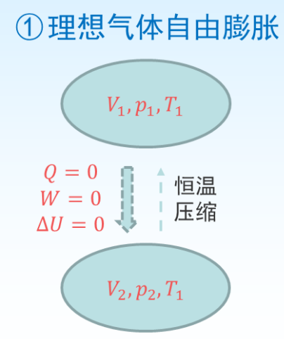
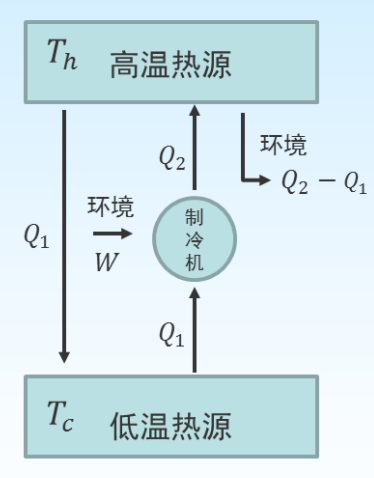

# 自发过程的特定

## 自发过程

不需要外力推动就能自动发生的过程

### 特点

一旦发生, 总是沿单向进行, 达到一定限度即平衡时才停止变化, 而其逆向变化则绝对不能自动发生.

自发过程的逆过程不能自动发生, 但并不意味着完全不能逆转, 在有外力作用下是可以使过程反向进行的. 但体系恢复到原态, 环境却不能复原, 自发变化乃热力学的不可逆过程.

### 理想气体自由膨胀

理想气体从状态 $(V_1,p_1,T_1)$ 自由膨胀到状态$(V_2,p_2,T_2),$ 可经一个恒温压缩过程使体系恢复原状.

但环境没有恢复原态, 总的结果是:循环一周后,环境付出了 $W$ 的功,得到了 $Q$ 的热,发生了功转变为热, 环境留下了痕迹.

### 热传导过程

+   当两热源接触, 有 $Q$ 的热量自动由高温热源传向低温热源.
+    在两热源之间安装一制冷机, 做功 $W,$ 将 $Q _1$ 的热量从低温热源取出, 传给高温热源的热量即为 $Q _2=  W+  Q_1,$ 结果是高温热源多出 $Q _2-  Q _1$ 的热量.
+    如果再从高温热源取出 $ Q _2-  Q _1$ 的热量传给环境, 则循环一周体系( 高温热源) 完全恢复了原态.
+    环境未恢复原态, 付出了 $W$ 的功, 得到了 $Q _2-  Q _1$ 的热, 发生了功转变为热, 环境留下了痕迹

# 热力学第二定律

## Clausius 说法

热不能自动地由低温热源传到高温热源而不发生其他变化.

## Kelvin 说法

不可能从单一热源取热使之全部变为功而不产生其他变化.

>   第二类永动机是不可能造成的

热力学第二定律是决定过程变化方向和限度的共同准则

