# 熵增加原理及化学反应方向

## 卡诺循环与卡诺定理

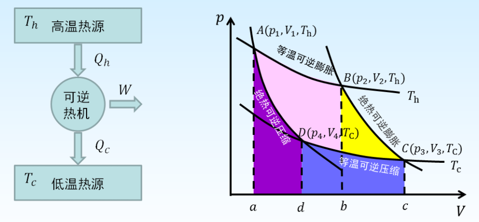
$$
\eta=-\frac{W}{Q_{h}}=\frac{Q_{h}+Q_{c}}{Q_{h}}=\frac{T_{h}-T_{c}}{T_{h}}
$$

### 等温可逆膨胀

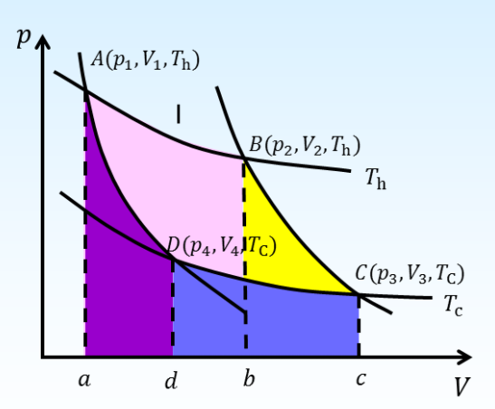

系统与高温热源接触, 作等温可 逆膨胀, 由状态 $\mathrm{A}\left(p_{1}, V_{1}, T_{h}\right)$ 到状 态 $\mathrm{B}\left(p_{2}, V_{2}, T_{h}\right)$
$$
\begin{aligned}
&\Delta U_{1}=0 \qquad Q_{h}=-W_{1} \\
&W_{1}=-\int_{V_{1}}^{V_{2}} p \mathrm{~d} V=n R T_{h} \ln \frac{V_{1}}{V_{2}}
\end{aligned}
$$

### 绝热可逆膨胀

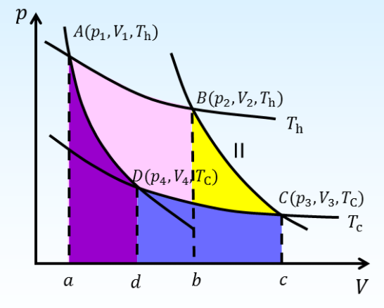

​	

系统离开热源, 作绝热可逆膨胀, 由 状 态 $\mathrm{B}\left(p_{2}, V_{2}, T_{h}\right)$ 到状态$\mathrm{C}\left(p_{3}, V_{3}, T_{c}\right)$
$$
\begin{aligned}
&Q_{2}=0 \\
&W_{2}=\Delta U_{2}=\int_{T_{h}}^{T_{c}} n C_{v, m} \mathrm{~d} T
\end{aligned}
$$

### 等温可逆压缩

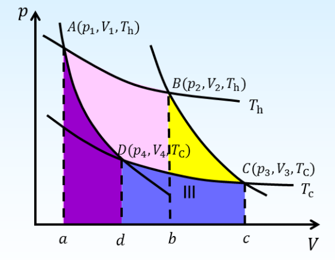

系统与低温热源接触, 作等温可逆压缩, 由状态 $\mathrm{C}\left(p_{3}, V_{3}, T_{c}\right.$ )到状态 $\mathrm{D}( \left.p_{4}, V_{4}, T_{c}\right)$
$$
\begin{aligned}
&\Delta U_{3}=0 \quad Q_{c}=-W_{3} \\
&W_{3}=-\int_{V_{3}}^{V_{4}} p \mathrm{~d} V=n R T_{c} \ln \frac{V_{3}}{V_{4}}
\end{aligned}
$$

### 绝热可逆压缩

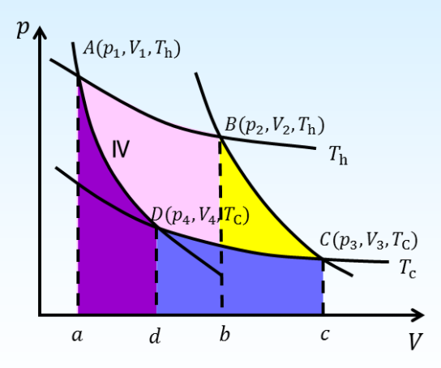

系统离开热源, 作绝热可逆压缩, 由状态 $\mathrm{D}\left(p_{4}, V_{4}, T_{c}\right)$ 到状态 $\mathrm{A}\left(p_{1}, V_{1}, T_{h}\right)$
$$
\begin{aligned}

&Q_{4}=0 \\
&W_{4}=\Delta U_{4}=\int_{T_{c}}^{T_{h}} n C_{v, m} \mathrm{~d} T
\end{aligned}
$$

---

1. $Q_{h}=-W_{1}=-n R T_{h} \ln \frac{V_{1}}{V_{2}}$
2. $Q_{2}=0 \quad W_{2}=\int_{T_{h}}^{T_{c}} n C_{v, m} \mathrm{~d} T$
3. $Q_{c}=-W_{3}=-n R T_{c} \ln \frac{V_{3}}{V_{4}}$
4. $Q_{4}=0 \quad W_{4}=\int_{T_{C}}^{T_{h}} n C_{v, m} \mathrm{~d} T$

卡诺循环 $\Delta U=0 \quad Q=-W$
而 $Q=Q_{h}+Q_{c}$
$$
\mathrm{W}=n R T_{h} \ln \frac{V_{1}}{V_{2}}+n R T_{c} \ln \frac{V_{3}}{V_{4}}
$$
根据绝热过程方程式
$$
\begin{gathered}
T_{h} V_{2}^{\gamma-1}=T_{c} V_{3}^{\gamma-1} \\
T_{h} V_{1}^{\gamma-1}=T_{c} V_{4}^{\gamma-1} \\
\longrightarrow \quad W=n R\left(T_{h}-T_{c}\right) \ln \frac{V_{1}}{V_{2}} \\
\eta=-\frac{W}{Q_{h}}=\frac{Q_{h}+Q_{c}}{Q_{h}}=\frac{T_{h}-T_{c}}{T_{h}}
\end{gathered}
$$
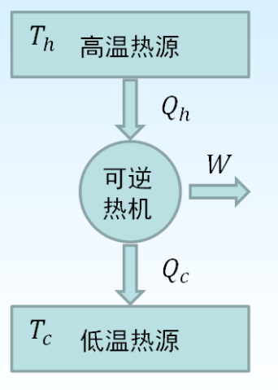
$$
\eta=\frac{T_{h}-T_{c}}{T_{h}}
$$
卡诺热机讨论:
一卡诺热机的效率只与两热源的温度有关, 高温热源温度越高，低温热源温度越低, 热机效率越大。
- 低温热源 $T_{c} \neq 0\mathrm{K}$ , 故 $\eta<1$; 功和热是不等价的。
- 转化效率不能为负, 也就告诉我们热不能 自动从低温物体传到高温物体。

### 卡诺定理

所有工作于两个一定温度热源之间的热机, 卡诺热机的效率最高.
$$
\eta\leq\eta_R
$$
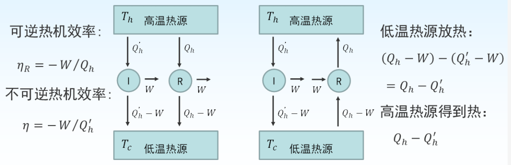

## 可逆过程热温商与熵变

根据Cannot热机效率
$$
\frac{Q_{h}+Q_{c}}{Q_{h}}=\frac{T_{h}-T_{c}}{T_{h}}
$$
整理得
$$
\frac{Q_{h}}{T_{h}}+\frac{Q_{c}}{T_{c}}=0 \quad \text { 式中}\frac{Q}{T}\text{称为热温商}
$$
即卡诺循环中, 热温商的代数和等于零。

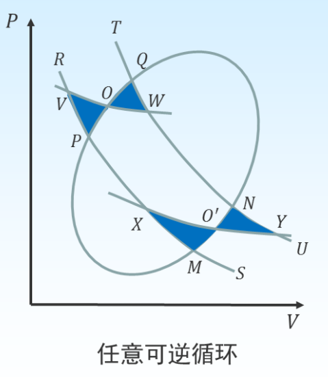

+   考虑其中的任意过程 $P Q$, 通过 $P 、 Q$ 两点作两条绝热可逆线 $R S$ 和 $T U$, 然后在 $P Q$ 间通过 $O$ 点画一条等温可逆线 $V W$, 使 $P V O$ 面积等于 $O W Q$ 面积。
+   同理在弧线 $M N$ 上也可以作类 似处理, 使 $M X O^{\prime}$ 面 积等于 $O^{\prime} Y N$ 面积。

>   $V W Y X$ 所构成的卡诺循环与 $P Q N M$ 环程所做的功是等同的。

---

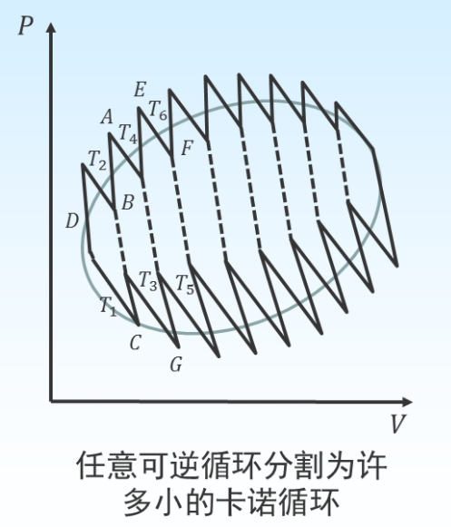

+   同样用若干彼此极为接近的绝热线和等温线,把整个封闭曲线划分为许多小的卡诺循环.

对任意小卡诺循环
$$
\frac{\delta Q_1}{T_1}+\frac{\delta Q_2}{T_2}=0
$$

+   当每一个卡诺循环取的无限小,并且相邻两个小卡诺循环的绝热可逆线抵消.在极限情况下,这些众多小卡诺循环的总效应和封闭曲线相当.

所有的卡诺循环热温商加起来
$$
\left(\frac{\delta Q_{1}}{T_{1}}+\frac{\delta Q_{2}}{T_{2}}\right)+\cdots+\left(\frac{\delta Q_{i-1}}{T_{i-1}}+\frac{\delta Q_{i}}{T_{i}}\right)=0
$$
或: 
$$
\quad \sum_{i} \frac{\delta Q_{i}}{T_{i}}=0 \quad \oint \frac{\delta Q_{R}}{T}=0
$$
任意可逆循环过程，热温商之和为零。 
$$
\oint \frac{\delta Q_{R}}{T}=\int_{A}^{B}\left(\frac{\delta Q_{R}}{T}\right)_{\mathrm{I}}+\int_{B}^{A}\left(\frac{\delta Q_{R}}{T}\right)_{\mathrm{II}}=0
$$
即
$$
\quad \int_{A}^{B}\left(\frac{\delta Q_{R}}{T}\right)_{\mathrm{I}}=\int_{A}^{B}\left(\frac{\delta Q_{R}}{T}\right)_{\text {II }}
$$
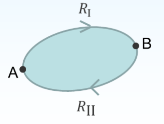

体系可逆地由A到B, 沿不同途径的热温商积分值相等, 与途径无关。

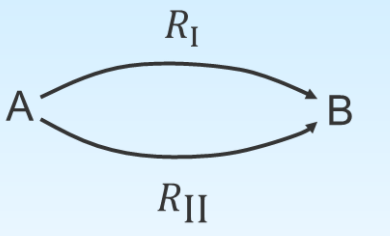
$$
\int_{A}^{B}\left(\frac{\delta Q_{R}}{T}\right)_{\mathrm{I}}=\int_{A}^{B}\left(\frac{\delta Q_{R}}{T}\right)_{\mathrm{II}}
$$
具有状态函数的特点

若以 $S_{B}$ 、 $S_{\mathrm{A}}$ 分别代表体系始终态的熵, 则体系的熵变为
$$
\Delta S=S_{B}-S_{A}=\int_{A}^{B} \frac{\delta Q_{R}}{T} \quad \mathrm{~d} S=\frac{\delta Q_{R}}{T}
$$
樀是体系的性质, 状态函数, 单位 $J \cdot K^{-1}$ 。

## 不可逆过程热温商与熵变

卡诺定理: 所有工作于两个一定温度热源之间的热机，卡诺热机的效率高。
$$
\eta_{I R}<\eta_{R}
$$
不可逆热机的效率为
$$
\quad \eta_{I R}=-\frac{W}{Q_{h}}=\frac{Q_{h}+Q_{c}}{Q_{h}}=1+\frac{Q_{c}}{Q_{h}}
$$
可逆热机的效率为
$$
\quad \eta_{R}=\frac{T_{h}-T_{c}}{T_{h}}=1-\frac{T_{c}}{T_{h}}
$$
因此
$$
1+\frac{Q_{c}}{Q_{h}}<1-\frac{T_{c}}{T_{h}} \quad \frac{Q_{c}}{T_{c}}+\frac{Q_{h}}{T_{h}}<0
$$
不可逆热机的热温商之和小于 $0$

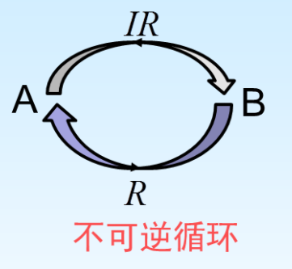
$$
\begin{aligned}
&\sum_{i}\left(\frac{\delta Q_{i}}{T_{i}}\right)_{i R}<0 \\
&\sum_{A}^{B}\left(\frac{\delta Q_{i}}{T_{i}}\right)_{i R, A \rightarrow B}+\int_{B}^{A} \frac{\delta Q_{R}}{T}<0 \\
&\sum_{A}^{B}\left(\frac{\delta Q_{i}}{T_{i}}\right)_{i R, A \rightarrow B}<\int_{A}^{B} \frac{\delta Q_{R}}{T}=S_{B}-S_{A}
\end{aligned}
$$
不可逆过程的热温商之和小于体系的熵变

## 热力学第二定律数学表达式

$$
\sum_{A}^{B} \frac{\delta Q}{T} \leq \Delta S \quad \text { 或 } \quad \frac{\delta Q}{T} \leq \mathrm{d} S
$$

>   克劳修斯不等式

+   根据克劳修斯不等式,通过比较变化过程的 $\Delta S$ 与热温商之和可判断变化的方向.
+   过程的热温商比体系的熵变小得越多,说明过程的不可逆性越强.
+   不可逆过程的熵变计算需要设计可逆过程求算.

对于孤立系统, 系统与环境之间没有能量的交换
$$
\frac{\delta Q}{T}\leq\mathrm{d}S\Longrightarrow \mathrm{d}S\geq0
$$

+   孤立体系内发生的一切可逆过程,熵值不变;发生的一切不可逆过程,熵会变大,直到熵值最大,体系到达平衡态.

实际情况下,总是将体系和与体系有关的环境加在一起构成孤立体系
$$
\Delta S_{iso}=\Delta S_{sys}+\Delta S_{sur}\qquad \Delta S_{环}=-\frac{Q_体}{T_环}
$$

>   环境为无限大的热源,其变化可认为是可逆的

## 热力学第二定律的本质

### Kelvin说法:

不可能从单一热源取热使之全部变为功而不产生其他变化.

>    功转化为热的过程是规则运动转化为无规则运动,是向混乱度增加的方向进行

### Clausius说法

热不能自动地由低温热源传到高温热源而不发生其他变化.

>   热的传递同样是相对有序变为相对无序,向混乱度增加的方向进行

---

+   一切不可逆过程都是向混乱度增加的方向进行

## 习题

1. 任一体系经一循环过程回到始态, 则不一定为零的是 $(D)$
A. $\Delta G\quad$B. $\Delta S\quad$C. $\Delta U\quad$D. $Q$
2. 绝热过程 $Q=0$, 又 $\mathrm{d} S=\frac{\delta Q}{T}$, 所以 $\left.\mathrm{d} S=0 \quad(\mathrm{F}\right)$
3. 体系经一不可逆循环过程其 $\Delta S_{\text {体}}>0 \quad(\mathrm{F})$
4. 某一过程的热效应与温度相除，可以得到该过程的熵变  $(\mathrm{F})$ 
5. 非理想气体的卡诺循环, $\Delta H(=0), \Delta U(=0), \Delta S (=0)$ 
6. 当理想气体反抗一定的外压做绝热膨胀时，则（ $D$ ）
A. 熵总是不变
B. 热力学能总是不变
C. 焓总是增加
D. 热力学能总是减小

7. 绝热不可逆膨胀过程（ $C$ ）
A. $\Delta S_{\text {体 }}<0, \Delta S_{\text {环 }}=0, \Delta S_{\text {孤 }}<0$
B. $\Delta S_{\text {体 }}=0, \Delta S_{\text {环 }}=0, \Delta S_{\text {孤 }}=0$
C. $\Delta S_{\text {体 }}>0, \Delta S_{\text {环 }}=0, \Delta S_{\text {孤 }}>0$
D. $\Delta S_{\text {体 }}<0, \Delta S_{\text {环 }}>0, \Delta S_{\text {孤 }}<0$
8. 环境的熵变等于 （ $\mathrm{C}$ ）
A. $\frac{\delta Q_{\text {体 }}}{T_{\text {环 }}}\quad$B. $-\frac{\delta Q_{\text {环 }}}{T_{\text {环 }}}\quad$C. $-\frac{\delta Q_{\text {体 }}}{T_{\text {环 }}}\quad$B. $-\frac{\delta Q_{\text {体 }}}{T_{\text {体 }}}\quad$

## 熵变的计算

1.判断过程是否可逆,若为可逆过程,可应用基本公式直接计算;若为不可逆过程,则需在指定始、终态间虚拟合理的可逆过程间接计算.
$$
\Delta S = \int\frac{\delta Q_R}{T}
$$

2.如果要判断变化的自发性,则还要计算环境的熵变,并与体系的熵变一起构成总熵变,再根据熵判据做出判断.
$$
\Delta S_环 = -\frac{Q_体}{T_环}
$$

### 理想气体简单状态变化过程的熵变

#### 等温过程的熵变

始态 $\left(p_{1}, V_{1}, T_{1}\right) \quad \stackrel{\Delta S}{\Longrightarrow}\quad$终态 $\left(p_{2}, \quad V_{2}, \quad T_{1}\right)$

不管是否是可逆过程,当做可逆过程处理. 对于 $n\ mol$ 理想气体的等温可逆过程而言, $\Delta U=0$
$$
\begin{aligned}
&Q_{R}=-W=n R T \ln \frac{V_{2}}{V_{1}}=n R T \ln \frac{p_{1}}{p_{2}} \\
&\Delta S=\frac{Q_{R}}{T}=n R \ln \frac{V_{2}}{V_{1}}=n R \ln \frac{p_{1}}{p_{2}}
\end{aligned}
$$

#### 等压过程的熵变

始态 $\left(p_{1}, V_{1}, T_{1}\right) \quad \stackrel{\Delta S}{\Longrightarrow}\quad$终态 $\left(p_{1}, \quad V_{2}, \quad T_{2}\right)$

不管是否是可逆过程,当做可逆过程处理.对于 $n\ mol$ 理想气体的等压可逆过程而言
$$
\begin{gathered}
\delta Q_{R}=n C_{p, m} \mathrm{~d} T \\
\Delta S=\int_{T_{1}}^{T_{2}} \frac{\delta Q_{R}}{T}=\int_{T_{1}}^{T_{2}} \frac{n C_{p, m} \mathrm{~d} T}{T}=n C_{p, m} \ln \frac{T_{2}}{T_{1}}
\end{gathered}
$$

#### 等容过程的熵变

始态 $\left(p_{1}, V_{1}, T_{1}\right) \quad \stackrel{\Delta S}{\Longrightarrow}\quad$终态 $\left(p_{2}, \quad V_{1}, \quad T_{2}\right)$

不管是否是可逆过程,当做可逆过程处理.对于 $n\ mol$ 理想气体的等压可逆过程而言
$$
\begin{gathered}
\delta Q_{R}=n C_{\mathrm{V}, m} \mathrm{~d} T \\
\Delta S=\int_{T_{1}}^{T_{2}} \frac{\delta Q_{R}}{T}=\int_{T_{1}}^{T_{2}} \frac{n C_{V, m} \mathrm{~d} T}{T}=n C_{V, m} \ln \frac{T_{2}}{T_{1}}
\end{gathered}
$$

#### $p,V,T$ 都改变的过程

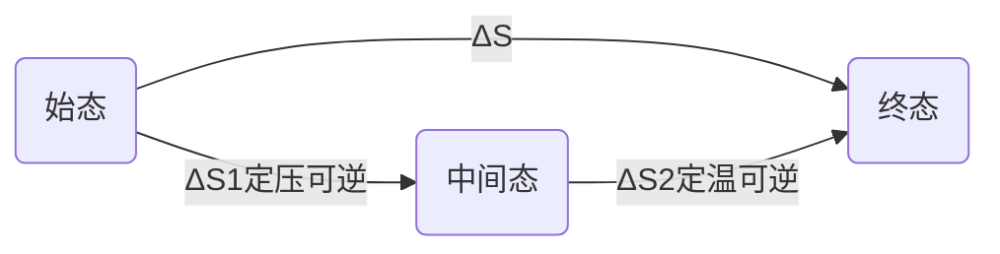

>   始态: $p_1,V_1,T_1$
>
>   中间态: $p_1,V,T_2$
>
>   终态: $p_2,V_2,T_2$

$$
\begin{aligned}
\Delta S_{1}&=\int \frac{\delta Q}{T}=\int \frac{d H}{T}=\int \frac{n C_{p, m} \mathrm{~d} T}{T}=n C_{p, m} \ln \frac{T_{2}}{T_{1}} \\
\Delta S_{2}&=\int \frac{\delta Q}{T}=-\int \frac{\delta W}{T}=n R \ln \frac{p_{1}}{p_{2}} \\
\Delta S&=\Delta S_{1}+\Delta S_{2}=n C_{p, m} \ln \frac{T_{2}}{T_{1}}+n R \ln \frac{p_{1}}{p_{2}}
\end{aligned}
$$

---

>   

