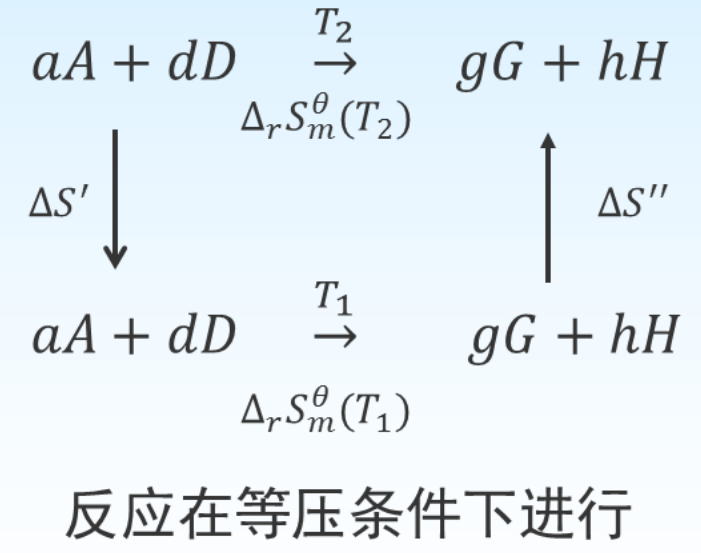

[toc]

# 热力学第三定律

在热力学温度零度时，任何纯物质的完美晶体的樀值都等于零
$$
\lim _{T \rightarrow 0} S_{T}=0 \quad \text { 或 } \quad S_{0 K}=0
$$
完美晶体：质点形成完全有规律的点阵结构，以一种几何方式 去排列原子或分子, 而内部无任何缺陷的晶体。
在定压下从 $0 K$ 升温到 $T$, 且无相变的情况下，过程的樀变就等 于物质在温度 $T$ 时的樀值 $S_{T}$, 即：
$$
\Delta S=S_{T}-S_{0} \mathrm{~K}=S_{T}=\int_{0}^{T} n C_{p, m} \frac{d T}{T}
$$
如果要求某物质在沸点以上某温度 $T$ 时的熵变, 则积分不连续, 要加上在熔点 $\left(T_{f}\right)$ 和沸点 $\left.（ T_{b}\right)$ 时的相应熵变, 其积分公式 可表示为:
$$
S(T)=S(0)+\int_{0}^{T_{f}} \frac{n C_{p, m} \text {,固 }}{T} \mathrm{~d} T+\frac{\Delta_{\text {melt }} H}{T_{f}}+\int_{T_{f}}^{T_{b}} \frac{n C_{p, m} \text {,液 }}{T} \mathrm{~d} T+\frac{\Delta_{v a p} H}{T_{b}}+\int_{T_{b}}^{T} \frac{n C_{p, m, 气}}{T} \mathrm{~d} T
$$
$S_{T}$ 指的是物质在指定状态下的规定熵, 如果指定状态是标准态, 且为1mol纯物质, 则称为标准熵, 用 $S_{m}^{\theta}(T)$ 表示。
$$
S_{m}^{\theta}(T)=S(0)+\int_{0}^{T_{f}} \frac{C_{p, m}, \text { 固 }}{T} \mathrm{~d} T+\frac{\Delta_{\text {melt }} H_{m}}{T_{f}}+\int_{T_{f}}^{T_{b}} \frac{C_{p, m} \text {,液 }}{T} \mathrm{~d} T+\frac{\Delta_{\text {vap }} H_{m}}{T_{b}}+\int_{T_{b}}^{T} \frac{C_{p, m, 气}}{T} \mathrm{~d} T
$$
标准压力, $298.15 K$ 时, 各物质的标准熵可查。

---

标准状态下化学反应的熵变

$$
\begin{aligned}
a A+d D &\rightarrow g G+h H \\
\Delta_{r} S_{m}^{\theta}&=\sum_{B} v_{B} S_{m, B}^{\theta} \\
\Delta_{r} S_{m}^{\theta}\left(T_{2}\right) &=\Delta_{r} S_{m}^{\theta}\left(T_{1}\right)+\int_{T_{1}}^{T_{2}} \frac{\sum v_{B} C_{p, m, \mathrm{~B}}}{T} \mathrm{~d} T
\end{aligned}
$$
