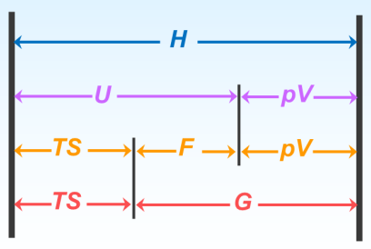
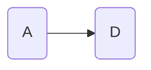

# G与温度, 压力的关系

## 热力学函数间的关系

由热力学第一定律和第二定律引出了 $U$ 和 $S$ 了两个最基本的热力学函数, 并根据需要定义了三个组合的状态函数 $H,F,G$

$$
\begin{aligned}
H&=U+pV\\
G&=U+pV-TS\\
&=H-TS\\
F&=U-TS
\end{aligned}
$$

## 热力学基本关系式

$$
\mathrm{d} U=\delta Q-p_{e} \mathrm{~d} V\\
可逆条件下 \quad P_{e} \mathrm{~d} V=p \mathrm{~d} V \quad \delta Q=T \mathrm{~d} S\\
因此\\
 \begin{array}{rl}(1)\mathrm{d} U= & T \mathrm{~d} S-p \mathrm{~d} V & H=U+p V \\ & \mathrm{~d} H=\mathrm{d} U+p \mathrm{~d} V+V \mathrm{~d} p\end{array}\\
(2) \mathrm{d} H=T \mathrm{~d} S+V \mathrm{~d} p \quad G=H-T S\\
(3) \mathrm{d} G=V \mathrm{~d} p-S \mathrm{~d} T \quad F=U-T S \mathrm{d} F=\mathrm{d} U-T \mathrm{~d} S-S \mathrm{~d} T\\
(4) \mathrm{d} F=-p \mathrm{~d} V-S \mathrm{~d} T
$$

## 吉布斯自由能随温度的变化

$$
\mathrm{d} G=V \mathrm{~d} p-S \mathrm{~d} T
$$
定压下 
$$
\begin{gathered}
\mathrm{d} G=V \mathrm{~d} p-S \mathrm{~d} T \\
\text{定压下}\left(\frac{\partial G}{\partial T}\right)_{p}=-S \quad G=H-T S \\
\left(\frac{\partial G}{\partial T}\right)_{p}=-\frac{H-G}{T} \Rightarrow\left(\frac{\partial G}{\partial T}\right)_{p}-\frac{G}{T}=-\frac{H}{T}\\
在等式两边各除以 T\\
\frac{\left(\frac{\partial G}{\partial T}\right)_{p}}{T}-\frac{G}{T^{2}}=-\frac{H}{T^{2}} \\\\
{\left[\frac{\partial\left(\frac{G}{T}\right)}{\partial T}\right]_{p}=-\frac{H}{T^{2}}}
\end{gathered}
$$
对于任意相变化或化学变化

$$
\begin{aligned}
\Delta G&=G_{D}-G_{A} \\
\left(\frac{\partial \Delta G}{\partial T}\right)_{p}&=\left(\frac{\partial G_{D}}{\partial T}\right)_{p}-\left(\frac{\partial G_{A}}{\partial T}\right)_{p}\\&=-S_{D}+S_{A} \\
\\
即\left(\frac{\partial \Delta G}{\partial T}\right)_{p}&=-\Delta S
\end{aligned}
$$

$$
\begin{aligned}
根据定义式\quad G&=H-T S \\
在定温下有\quad \Delta G&=\Delta H-T \Delta S \\
即\quad\left.\begin{array}{l}
-\Delta S=\frac{\Delta G-\Delta H}{T} \\
\left(\frac{\partial \Delta G}{\partial T}\right)_{p}=-\Delta S
\end{array}\right\}&\left(\frac{\partial \Delta G}{\partial T}\right)_{p}=\frac{\Delta G-\Delta H}{T} \\
\text{在等式两边各除以T,重排后得}\quad
&\frac{\left(\frac{\partial \Delta G}{\partial T}\right)_{p}}{T}-\frac{\Delta G}{T^{2}}=-\frac{\Delta H}{T^{2}} \\
&{\left[\frac{\partial\left(\frac{\Delta G}{T}\right)}{\partial T}\right]_{p}=-\frac{\Delta H}{T^{2}} \quad \text { Gibbs-Helmholtz方程 }}
\end{aligned}
$$

$$
\left[\frac{\partial\left(\frac{\Delta G}{T}\right)}{\partial T}\right]_{p}=-\frac{\Delta H}{T^{2}} \quad \Longrightarrow \quad \mathrm{d}\left(\frac{\Delta G}{T}\right)=-\frac{\Delta H}{T^{2}} \mathrm{~d} T
$$
两边求积分得
$$
\quad \frac{\Delta G_{2}}{T_{2}}-\frac{\Delta G_{1}}{T_{1}}=\int_{T_{1}}^{T_{2}}-\frac{\Delta H}{T^{2}} \mathrm{~d} T
$$
若已知 $\Delta H$ 与温度的关系，则可由 $T_{1}$ 时相变化或化学变化的 $\Delta G_{1}$ 求得 $T_{2}$ 时相变化或化学变化的 $\Delta G_{2}$ 。
当温度区间变化不大时, $\Delta H$ 近似为常数
$$
\frac{\Delta G_{2}}{T_{2}}=\frac{\Delta G_{1}}{T_{1}}+\Delta H\left(\frac{1}{T_{2}}-\frac{1}{T_{1}}\right)
$$

## 吉布斯自由能随压力的变化

根据式
$$
\mathrm{d} G=V \mathrm{~d} p-S \mathrm{~d} T
$$
定温下 
$$
\mathrm{d} G=V \mathrm{d} p
$$
积分
$$
\int_{G_{1}}^{G_{2}} \mathrm{~d} G=\int_{p_{1}}^{p_{2}} V \mathrm{~d} p \quad\Rightarrow\quad \Delta G=\int_{p_{1}}^{p_{2}} V \mathrm{~d} p
$$
对理想气体 
$$
\quad \Delta G=\int_{p_{1}}^{p_{2}} \frac{n R T}{p} \mathrm{~d} p=n R T \ln \frac{p_{2}}{p_{1}}
$$
对液体或固体 
$$
\quad \Delta G=V \Delta p
$$
## 习题

下列各过程的 $\Delta U, \Delta S, \Delta H, \Delta G$ 何者为零:
(1)某实际气体经过不可逆循环过程;
(2)理想气体定温膨胀;
(3)某实际气体绝热可逆膨胀;
(4)水在沸点下蒸发为蒸气。

>   (1)均为0;
>   **循环**
>
>   (2) $\Delta U, \Delta H ;$
>
>   (3) $\Delta S$;
>
>   (4) $\Delta G$

