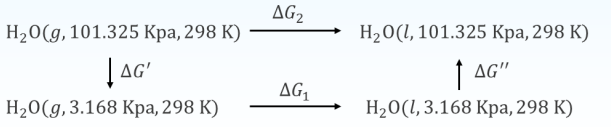
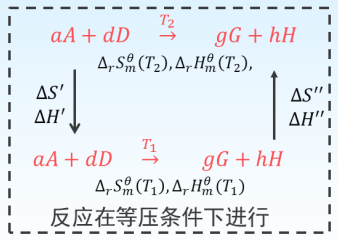
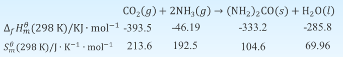

# ΔG的计算

## 简单的 $p,V,T$ 变化过程

### 等温过程

1.   由 $G$ 的定义求算: 因为 $G=H-T S$, 在等温条件下 $\Delta G=\Delta H-T \Delta S$, 所以求出该过程对应的 $\Delta H$ 和 $\Delta S$, 便可 得到 $\Delta G$ 。

2.   由力学基本公式求算: 依据基本公式 $\mathrm{d} G=V \mathrm{~d} p-S \mathrm{~d} T$ 可 知, 对于等温过程, 有 
     $$
     \left(\frac{\partial G}{\partial p}\right)_{T}=V
     $$
     因此:
     $$
     \quad \mathrm{d} G=V \mathrm{~d} p \quad or \quad \Delta G=\int_{p_{1}}^{p_{2}} V \mathrm{~d} p
     $$
     若知道 $V$ 与 $p$ 的函数关系，就能对上式积分求 $\Delta G$

对于理想气体
$$
\Delta G=\int_{p_{1}}^{p_{2}} \frac{n R T}{p} \mathrm{~d} p=n R T \ln \frac{p_{2}}{p_{1}}=n R T \ln \frac{V_{1}}{V_{2}}
$$
对于液体或固体，它们的体积 $V$ 随压力变化很小, 因此可当做 常数，从而得到:
$$
\Delta G=V\left(p_{2}-p_{1}\right)
$$
### 非等温过程

依据 
$$
G=H-T S
$$
有 
$$
\Delta G=\Delta H-\Delta(T S)=\Delta H-\left(T_{2} S_{2}-T_{1} S_{1}\right)
$$
 所以求得 $T_{1}$ 和 $T_{2}$ 温度下的规定熵及该过程的 $\Delta H$, 便可得到非等温过程的 $\Delta G$ 。

## 习题

在定温定压下（$101.325~Kpa$, $298 \mathrm{~K}$ ）, $1 \mathrm{~mol} \mathrm{O}_{2}$ 和 $1 \mathrm{~mol} \mathrm{~N}_{2}$ 混合，设 $\mathrm{N}_{2}$ 和 $\mathrm{O}_{2}$ 为理想气体, 求 $\Delta S, \Delta H, \Delta G$
解: 在定温条件下
$$
\Delta G=\Delta H-T \Delta S
$$
理想气体混合 
$$
\begin{aligned}
\quad \Delta H&=0 \mathrm{~J}\\
\Delta S&=-n R \sum_{B} x_{B} \ln x_{B}\\
&=11.52 \mathrm{~J} \mathrm{~K}^{-1} \\
\Delta G&=-3.433 \mathrm{KJ}
\end{aligned}
$$

---

1 mol单原子理想气体, 从始态100 Кpa, $273.15$ K经等压可逆过程使 体积加倍, 计算该过程的Q, $W, \Delta U, \Delta S, \Delta H$ 和 $\Delta G 。$ 已知该气体在 始态时的熵 $S_{1}=100 \mathrm{~J} \cdot\mathrm{~K}^{-1}$ 。
解：等压下体积加倍 
$$
\begin{aligned}
\quad \frac{V_{2}}{ V_{1}}&=\frac{T_{2}}{T_{1}}=2 \quad T_{2}=546.3 \mathrm{~K}\\
\\
Q&=\Delta H=n C_{p, m} \Delta T\\
&=1 \times 2.5 \times 8.314 \times 273.12 \mathrm{~J}\\
&=5677.42 \mathrm{~J} \\
\\
\Delta U&=n C_{V, m} \Delta T=1 \times 1.5 \times 8.314 \times 273.12 \mathrm{~J}\\
&=3406.45 \mathrm{~J} \\
\\
W&=\Delta U-Q=3406.45 \mathrm{~J}-5677.42 \mathrm{~J}\\
&=-2270.97 \mathrm{~J} \\
\\
\Delta S&=n C_{p, m} \ln \frac{T_{2}}{T_{1}}\\
&=1 \times 2.5 \times 8.314 \times \ln 2 \mathrm{~J} \cdot \mathrm{K}^{-1}\\
&=14.41 \mathrm{~J} \cdot \mathrm{K}^{-1} \\
\\
S_{2}&=\Delta S+S_{1}\\
&=14.41 \mathrm{~J} \cdot \mathrm{K}^{-1}+100 \mathrm{~J} \cdot \mathrm{K}^{-1}\\
&=114.41 \mathrm{~J} \cdot \mathrm{K}^{-1} \\
\\
\Delta G&=\Delta H-\left(T_{2} S_{2}-T_{1} S_{1}\right)\\
&=-2.95 \times 10^{4} \mathrm{~J}
\end{aligned}
$$

## 相变过程

定温, 定压且不做非体积功的可逆相变 $\Delta G=0$
对于不可逆相 变, 需设计可逆过程来计算 $\Delta G$ 

$1 \mathrm{~mol}, 101.325Kpa, 298 K$  的过冷水汽变成同温同压下的液态水, 已知该温下水的饱和蒸气压为 $3.168 \mathrm{Kpa}$, 水的摩尔体积 $V_{m}=0.018 \mathrm{dm}^{3} \cdot \mathrm{mol}^{-1}$, 计算过程的 $\Delta G$, 判断过程的自发性 

设计可逆过程

$$
\begin{aligned}
\Delta G^{\prime}&=n R T \ln \frac{p_{2}}{p_{1}}\\
&=1 \times 8.314 \times 298 \times \ln \frac{3.168}{101.325} \mathrm{~J}\\
&=-8586 \mathrm{~J}\quad 可逆过程\\
\Delta G_{1}&=0 \mathrm{~J} \quad\\
\Delta G^{\prime \prime}=\int_{p_{1}}^{p_{2}} V \mathrm{~d} p &=n V_{m}\left(p_{2}-p_{1}\right) \\
&=1 \times 0.018 \times(101.325-3.168) \mathrm{J} \\
&=1.8 \mathrm{~J}\\
\Delta G_{2}&=\Delta G^{\prime}+\Delta G_{1}+\Delta G^{\prime \prime}\\
&=-8584 J\\
&自发过程
\end{aligned}
$$

## 化学反应

### 1

计算化学反应的 $\Delta_{r} G_{m}^{\theta}$, 可先由各物质的 $\Delta_{f} H_{m}^{\theta}$ 或 $\Delta_{c} H_{m}^{\theta}$ 和 $S_{m}^{\theta}$ 计 算出反应的 $\Delta_{r} H_{m}^{\theta}$ 和 $\Delta_{r} S_{m}^{\theta}$, 再根据公式 $\Delta_{r} G_{m}^{\theta}=\Delta_{r} H_{m}^{\theta}-T \Delta_{r} S_{m}^{\theta}$

$$
\begin{aligned}
&\Delta_{r} H_{m}\left(T_{2}\right)=\Delta_{r} H_{m}\left(T_{1}\right)+\int_{T_{1}}^{T_{2}} \Delta C_{p} d T \\
&\Delta_{r} S_{m}^{\theta}\left(T_{2}\right)=\Delta_{r} S_{m}^{\theta}\left(T_{1}\right)+\int_{T_{1}}^{T_{2}} \frac{\sum v_{B} C_{p, m, B}}{T} \mathrm{~d} T
\end{aligned}
$$
通过 $Gibbs-Helmholtz$ 方程，测另一个温度下的$ \Delta_{r} G_{m}^{\theta}$

---

已知下列反应各物质的 $\Delta_{f} H_{m}^{\theta}(298 \mathrm{~K}), S_{m}^{\theta}(298 \mathrm{~K})$ 数据,

(1) 计算 298 K时的 $\Delta_{r} G_{m}^{\theta}$, 并判断反应能否自发进行;
(2) 计算 350 К时的 $\Delta_{r} G_{m}^{\theta}$, 并判断反应能否自发进行（假设 $\Delta_{r} S_{m}^{\theta}$ 不随温度变化）;
(3) 估计 $\left(\mathrm{NH}_{2}\right)_{2} \mathrm{CO}(s)$ 自发分解的最低温度。

解：(1) 计算298 K时的 $\Delta_{r} G_{m}^{\theta}$, 并判断反应能否自发进行
$$
\begin{gathered}
\Delta_{r} H_{m}^{\theta}(298 \mathrm{~K})=\sum v_{\mathrm{B}} \Delta_{f} H_{m, B}^{\theta}(298 \mathrm{~K})=-133.1 \mathrm{~kJ} \cdot \mathrm{mol}^{-1} \\
\Delta_{r} S_{m}^{\theta}(298 \mathrm{~K})=\sum_{B} v_{B} S_{m, B}^{\theta}(298 \mathrm{~K})=-424 \mathrm{~J} \cdot \mathrm{K}^{-1} \cdot \mathrm{mol}^{-1} \\
\Delta_{r} G_{m}^{\theta}(298 \mathrm{~K})=\Delta_{r} H_{m}^{\theta}(298 \mathrm{~K})-T \Delta_{r} S_{m}^{\theta}(298 \mathrm{~K})=-6.77 \mathrm{~kJ} \cdot \mathrm{mol}^{-1}
\end{gathered}
$$
反应自发进行

解：(2) 计算 350 K时的 $\Delta_{r} G_{m}^{\theta}$, 并判断反应能否自发进行（假设 $\Delta_{r} S_{m}^{\theta}$ 不随温度变化）;
$$
\begin{gathered}
\int_{\Delta_{r} G_{m}^{\theta}(298 \mathrm{~K})}^{\Delta_{r} G_{m}^{\theta}(350 \mathrm{~K})} \mathrm{d} \Delta_{r} G_{m}^{\theta}=\int_{298 \mathrm{~K}}^{350 \mathrm{~K}}-\Delta_{r} S_{m}^{\theta} \mathrm{d} T \\
\Delta_{r} G_{m}^{\theta}(350 \mathrm{~K})-\Delta_{r} G_{m}^{\theta}(298 \mathrm{~K})=-\Delta_{r} S_{m}^{\theta}(350 \mathrm{~K}-298 \mathrm{~K}) \\
\Delta_{r} G_{m}^{\theta}(350 \mathrm{~K})=15.3 \mathrm{~kJ} \cdot \mathrm{mol}^{-1}
\end{gathered}
$$
反应不能自发进行

解：(3) 估计 $\left(\mathrm{NH}_{2}\right)_{2} \mathrm{CO}(s)$ 自发分解的最低温度。
$$
\begin{gathered}
\int_{\Delta_{r} G_{m}^{\theta}(298 \mathrm{~K})}^{0} \mathrm{~d} \Delta_{r} G_{m}^{\theta}=\int_{298 \mathrm{~K}}^{T}-\Delta_{r} S_{m}^{\theta} \mathrm{d} T \\
0-\Delta_{r} G_{m}^{\theta}(298 \mathrm{~K})=-\Delta_{r} S_{m}^{\theta}(T-298 \mathrm{~K}) \\
T=314 \mathrm{~K}
\end{gathered}
$$
当温度小于314 K时, $\left(\mathrm{NH}_{2}\right)_{2} \mathrm{CO}(s)$ 可自发分解

### 2

通过参加反应的各物质的标准摩尔生成Gibbs自由能来计算 反应的标准摩尔Gibbs自由能变量 $\Delta_{r} G_{m}^{\ominus}$ 

由稳定的单质生成 $1 \mathrm{~mol}$ 处于标准态的物质B时反应的Gibbs自由能变称为物 质B的标准摩尔生成Gibbs自由能
$$
\Delta_{r} G_{m}^{\ominus}=\sum v_{\mathrm{B}} \Delta_{f} G_{m, B}^{\ominus}
$$
### 3

通过电化学的方法, 设计可逆电池, 使反应在电池中进行。 然后根据如下关系式求 $\Delta_{r} G_{m}^{\ominus}$
$$
\Delta_{r} G_{m}^{\ominus}=-Z F E^{\ominus}
$$
