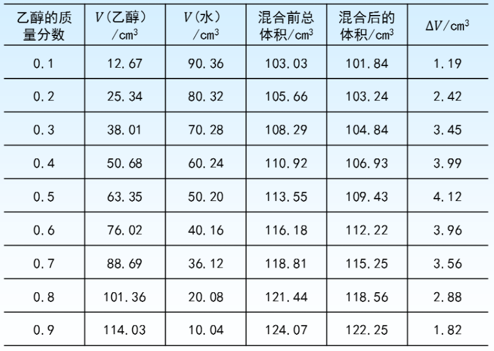

# 单组分系统

状态函数 $V , U , H , S , G , F$ 均为广度性质，其大小与物质的 量有关。设有物质B组成的单组分体系, 其物质的量为 $n_{B}$, 则 各摩尔热力学函数值的定义式分别为:
|函数|定义式|
|:---:|:---:|
|摩尔体积| $\quad V_{B, m}^{*}=\large\frac{V}{n_{B}} \quad$ |
|摩尔热力学能| $\quad U_{B, m}^{*}=\large\frac{U}{n_{B}}$|
|摩尔焓| $\quad H_{B, m}^{*}=\large\frac{H}{n_{B}} \quad$ |
|摩尔熵| $\quad S_{B, m}^{*}=\large\frac{S}{n_{B}}$|
|摩尔吉布斯自由能|$\quad G_{B, m}^{*}=\large\frac{G}{n_{B}}$ |
|摩尔亥姆霍兹自由能| $\quad F_{B, m}^{*}=\large\frac{F}{n_{B}}$|

对于一定量的单组分均匀系统, 只需要指定两个强度性质,其他强度性质就可以确定下来.
$$
U=U(T, p)=U(T, V)=U(S, V)=\cdots \\
\left .
\begin{array}
\mathrm{d} U=T \mathrm{~d} S-p \mathrm{~d} V \\
\mathrm{~d} H=T \mathrm{~d} S+V \mathrm{~d} p \\
\mathrm{~d} G=V \mathrm{~d} p-S \mathrm{~d} T \\
\mathrm{~d} F=-p \mathrm{~d} V-S \mathrm{~d} T
\end{array}
\right \}
\quad \Rightarrow
\left \{
\begin{array}{}
U=U(S, V) \\
H=H(S, p) \\
G=G(T, p) \\
F=F(T, V)
\end{array}
\right .
$$

(1) 选准了特征变量, 就可以从一个已知的热力学函数求得所 有其他热力学函数的值, 从而把热力学系统的平衡性质全 部确定下来。
$$
\begin{aligned}
已知 \quad\mathrm{d} G&=V \mathrm{~d} p-S \mathrm{~d} T \quad G=G(T, p) \\
则 \quad\left(\frac{\partial G}{\partial T}\right)_{p}&=-S \quad\left(\frac{\partial G}{\partial p}\right)_{T}=V \\
H&=G+T S=G-T\left(\frac{\partial G}{\partial T}\right)_{p} \\
U&=H-p V=G-T\left(\frac{\partial G}{\partial T}\right)-p\left(\frac{\partial G}{\partial p}\right)_{T}\\
F&=G-p V=G-p\left(\frac{\partial G}{\partial p}\right)_{T}
\end{aligned}
$$
(2) 当相应的特征变量固定不变时, 特性函数的变化值可用来 判断变化过程的可逆性和变化的方向性。对于组成不变的 封闭系统，不做非体积功时, 可以作为判据的有
$(\mathrm{d} S)_{U, V} \geq 0$
$(\mathrm{d} G)_{T, p} \leq 0$ 
$(\mathrm{d} F)_{T, V} \leq 0$

>   以上三个用的最多

$(\mathrm{d} U)_{S, V} \leq 0$
$(\mathrm{d} H)_{S, p} \leq 0$
$(\mathrm{d} S)_{H, p} \geq 0$

# 多组分系统

乙醇的密度是 $1.263 \mathrm{~g} \cdot\mathrm{~cm}^{-3}$, 水的密度是$1.004 \mathrm{~g} \cdot\mathrm{~cm}^{-3}$

+   溶液的体积不等于乙醇和水在纯态时的体积之和.
+   乙醇质量分数不一样,混合后溶液的体积与混合前液体的总体积差值也不一样.

在单组分体系中, 只需要两个变量就可以描述系统的状态, 即 $Z=Z(T, p)$ 。但在多组分体系中，每个状态函数的变量就不止 两个, 还与组成体系的各物质的物质的量有关。对于多组分体 系的任意广度性质 $Z(V, U, H, S, F, G)$
$$
Z=Z\left(T, p, n_{1}, n_{2}, \cdots, n_{k}\right)
$$
全微分展开
$$
\begin{aligned}
\mathrm{d} Z=&\left(\frac{\partial Z}{\partial T}\right)_{p, n_{1}, n_{2}, \cdots, n_{k}} \mathrm{~d} T+\left(\frac{\partial Z}{\partial p}\right)_{T, n_{1}, n_{2}, \cdots, n_{k}} \mathrm{~d} p+\left(\frac{\partial Z}{\partial n_{1}}\right)_{T, p, n_{2}, \cdots, n_{k}} \mathrm{~d} n_{1} \\
&+\left(\frac{\partial Z}{\partial n_{2}}\right)_{T, p, n_{1}, n_{3}, \cdots, n_{k}} \mathrm{~d} n_{2}+\cdots+\left(\frac{\partial Z}{\partial n_{k}}\right)_{T, p, n_{1}, n_{2}, \cdots, n_{k-1}} \mathrm{~d} n_{k}
\end{aligned}
$$
