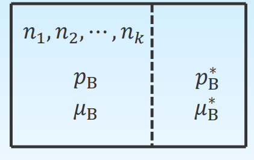

# 气体的化学势与标准态

## 单组分理想气体

$$
\begin{gathered}
\because \quad \mu=\left(\frac{\partial G}{\partial n_{\mathrm{B}}}\right)_{T, p} \quad \mathrm{~d} G=V \mathrm{~d} p-S \mathrm{~d} T \\
\therefore \quad\left(\frac{\partial \mu}{\partial p}\right)_{T}=\left[\frac{\partial}{\partial p}\left(\frac{\partial G}{\partial n_{\mathrm{B}}}\right)_{T, p}\right]_{T}=\left[\frac{\partial}{\partial n_{\mathrm{B}}}\left(\frac{\partial G}{\partial p}\right)_{T}\right]_{T, p}=\left[\frac{\partial V}{\partial n_{\mathrm{B}}}\right]_{T, p}=V_{m}^{*} \\
\quad \int_{\mu^{\theta}}^{\mu} \mathrm{d} \mu=\int_{p^{\theta}}^{p} V_{m}^{*} \mathrm{~d} p=\int_{p^{\theta}}^{p} \frac{R T}{p} \mathrm{~d} p \quad \text { (指定温度 } T \text { 下) } \\
\quad \quad \mu(T, p)-\mu^{\theta}\left(T, p^{\theta}\right)=R T \ln \frac{p}{p^{\theta}}
\end{gathered}
$$

单组分理想气体化学势的表达式
$$
\begin{gathered}
\mu(T, p)=\mu^{\theta}\left(T, p^{\theta}\right)+R T \ln \frac{p}{p^{\theta}} \\
\mu=\mu^{\theta}(T)+R T \ln \frac{p}{p^{\theta}}
\end{gathered}
$$
化学势 $\mu(T, p)$ 是 $T, p$ 的函数, $\mu^{\theta}\left(T, p^{\theta}\right)$ 是温度为 $T$ , 压力为 $p^{\theta}$ 时理想气体的化学势, 仅是温度的函数, 这个状态是气体的标准态.

## 混合理想气体

对于理想气体混合物, 设有一个盒子. 盒子左边是混合理想气体, 盒子右边是纯 B 理想气体, 中间半透膜只让 B 气体通过, 并且半透膜可以导热, 以维持双方温度相同.

达到平衡时 
$$
\quad \mu_{\mathrm{B}}^{*}=\mu_{\mathrm{B}}, p_{\mathrm{B}}^{*}=p_{\mathrm{B}} 
$$
 右边纯 $\mathrm{B}$ 气体的化学势为 
$$
\mu_{\mathrm{B}}^{*}=\mu_{\mathrm{B}}^{\theta}(T)+R T \ln \frac{p_{\mathrm{B}}^{*}}{p^{\theta}} \quad 
$$
 左边 $B$ 气体的化学势为: 
$$
\mu_{\mathrm{B}}=\mu_{\mathrm{B}}^{\theta}(T)+R T \ln \frac{p_{\mathrm{B}}}{p^{\theta}}
$$

理想气体混合物中气体 $B$ 的化学势表示式:
$$
\mu_{\mathrm{B}}=\mu_{\mathrm{B}}^{\theta}(T)+R T \ln \frac{p_{\mathrm{B}}}{p^{\theta}}
$$
其中 $p_{\mathrm{B}}$ 为 $\mathrm{B}$ 气体在混合气体中的分压; $\mu_{\mathrm{B}}^{\theta}(T)$ 为 $\mathrm{B}$ 气体在温度为 $T$ 、压力为 $p^{\theta}$ 时的标准态化学势。
对于理想气体混合物, 根据 Dalton 分压定律:
$$
p_{\mathrm{B}}=p x_{\mathrm{B}}
$$
代入上式可得:
$$
\mu_{\mathrm{B}}=\mu_{\mathrm{B}}^{\theta}(T)+R T \ln \frac{p x_{\mathrm{B}}}{p^{\theta}}=\mu_{\mathrm{B}}^{\theta}(T)+R T \ln \frac{p}{p^{\theta}}+R T \ln x_{\mathrm{B}}
$$

>   $\mu_{\mathrm{B}}^{\theta}(T)+R T \ln \frac{p}{p^{\theta}}$ 纯 B 气体在温度为 $T$, 压力为 $p$ 时的化学化学势

## 单组分非理想气体

$$
\begin{aligned}
\quad\left(\frac{\partial \mu}{\partial p}\right)_{T} &=V_{m}^{*} \\
p V \neq n R T & \quad \Longrightarrow\quad V_{m}^{*} \neq \frac{R T}{p}
\end{aligned}
$$
非理想气体的状态方程式可用卡末林-昂尼斯公式表示:
$$
\begin{aligned}
\quad p V_{m}^{*}&=R T+B p+C p^{2}+\cdots \\
V_{m}^{*}&=\frac{R T}{p}+B+C p+\cdots \\
\left(\frac{\partial \mu}{\partial p}\right)_{T}&=\frac{R T}{p}+B+C p+\cdots \\
\mu(T, p)&=\int V_{m}^{*} \mathrm{~d} p\\
&=\int\left(\frac{R T}{p}+B+C p+\cdots\right) \mathrm{d} p\\
&=R T \ln p+B p+\frac{C}{2} p^{2}+\cdots+I(T)
\end{aligned}
$$
积分常数 $I$ 是 $T$ 的函数, 可以从边界条件求得。当 $p \rightarrow 0 \mathrm{~Pa}$ 时
$$
\mu(T, p)=R T \ln p+I(T)
$$
这时候的气体就是理想气体
$$
\mu(T, p)=\mu^{\theta}\left(T, p^{\theta}\right)+R T \ln \frac{p}{p^{\theta}}
$$
比较上述两个式子, 可得
$$
I(T)=\mu^{\theta}\left(T, p^{\theta}\right)-R T \ln p^{\theta}
$$

---

$$
\mu(T, p)=\mu^{\theta}\left(T, p^{\theta}\right)+R T \ln \frac{p}{p^{\theta}}+Bp+\frac{C}{2}p^2+\cdots
$$

>   $\mu^\theta$ 是温度为 $T$ , 压力为 $p^\theta$ 并且具有理想气体性质的状态的化学势, 是个假象态.

用这种方法表示非理想气体的化学势, 极不方便. 为保持与理想气体化学势公式有一样简介形式, 可以令:
$$
\begin{aligned}
B p+\frac{C}{2} p^{2}+\cdots&=R T \ln \gamma \\
\mu(T, p)&=\mu^{\theta}\left(T, p^{\theta}\right)+R T \ln \frac{\gamma p}{p^{\theta}} \\
\text{let}\quad f = \gamma p\quad\Rightarrow\quad\mu(T, p)&=\mu^{\theta}\left(T, p^{\theta}\right)+R T \ln \frac{f}{p^{\theta}}
\end{aligned}
$$

>   $f$ 可看校正的压力, 称之为逸度(或有效压力), $\gamma$ 为逸度系数

## 混合非理想气体

混合理想气体中任意组分B的化学势
$$
\mu(T, p)=\mu_{\mathrm{B}}^{\theta}\left(T, p^{\theta}\right)+R T \ln \frac{p_{\mathrm{B}}}{p^{\theta}}
$$
同样, 根据半透膜平衡原理。对于混合非理想气体, 当平衡时, 双方的化学势与逸度相等。因此可以导出混合非理想气体中任 一组分的化学势为
$$
\mu(T, p)=\mu_{\mathrm{B}}^{\theta}\left(T, p^{\theta}\right)+R T \ln \frac{f_{\mathrm{B}}}{p^{\theta}}
$$

>   $f_B$ 组分 B 的逸度

$$
理想气体 \begin{cases}\text { 单组分 } & \mu=\mu^{\theta}(T)+R T \ln \frac{p}{p^{\theta}} \\ \text { 混合气体中 B 组分 } & \mu_{\mathrm{B}}=\mu_{\mathrm{B}}^{\theta}(T)+R T \ln \frac{p_{\mathrm{B}}}{p^{\theta}}   & \end{cases}
$$

$$
\text { 实际气体 }\left\{\begin{array}{ll}
\text { 单组分 } & \mu=\mu^{\theta}(T)+R T \ln \frac{f}{p^{\theta}} \\
\text { 混合气体中 B 组分 } & \mu_{\mathrm{B}}=\mu_{\mathrm{B}}^{\theta}(T)+R T \ln \frac{f_{\mathrm{B}}}{p^{\theta}}
\end{array}\right.
$$