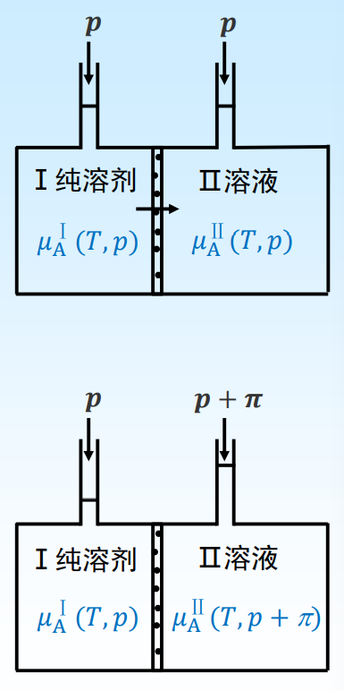
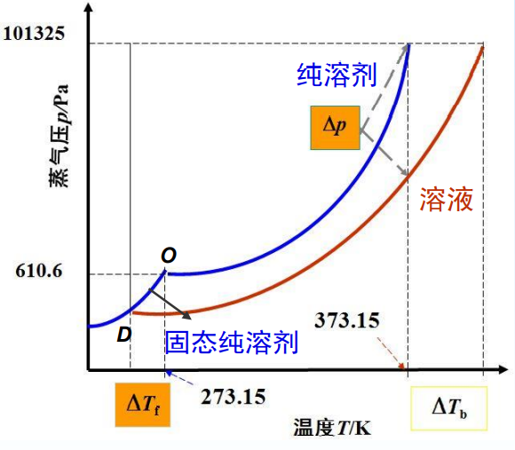
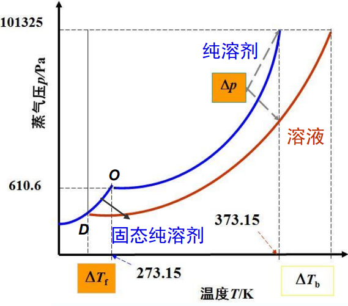

# 稀溶液的依数性

依数性质 (colligative properties): 指定溶剂的类型和数量后, 这些性质只取决于所含溶质粒子的数目, 而与溶质的本性无关. 溶质的粒子可以是分子、离子、大分子或胶粒, 这里只讨论粒子是分子的情况.

依数性的种类:

1. 产生渗透压 $\quad \pi=c_{B} R T$
2. 蒸气压下降 $\quad \Delta p=p_{A}^{*} x_{B}$
3. 凝固点降低 $\quad \Delta T_{f}=k_{f} b_{B}$
4. 沸点升高 $\quad \Delta T_{b}=k_{b} b_{B}$

# 渗透压

半透膜左边放纯溶剂, 右边放溶液。只 有溶剂能透过半透膜。
由于 
$$
\begin{aligned}
\mu_{\mathrm{A}}^{\mathrm{I}}(T, p)&=\mu_{\mathrm{A}}^{*}(T, p)\\
\mu_{\mathrm{A}}^{\mathrm{II}}(T, p)&=\mu_{\mathrm{A}}^{*}(T, p)+R T \ln x_{\mathrm{A}}
\end{aligned}
$$
$x_{\mathrm{A}}<1$, 纯溶剂的化学势 $\mu_{\mathrm{A}}^{\mathrm{I}}(T, p)$ 大于溶 液中溶剂的化学势 $\mu_{A}^{\mathrm{II}}(T, p)$, 所以溶剂 有自左向右渗透的倾向。
当渗透达到平衡时, 溶液与纯溶剂的液 面差引起的压力即为渗透压 $\pi$

$$
\begin{gathered}
\mu_{\mathrm{A}}^{\mathrm{I}}(T, p)=\mu_{\mathrm{A}}^{\mathrm{II}}(T, p+\pi) \\
\mu_{\mathrm{A}}^{*}(T, p)=\mu_{\mathrm{A}}^{*}(T, p+\pi)+R T \ln x_{\mathrm{A}} \\
\mu_{\mathrm{A}}^{*}(T, p+\pi)-\mu_{\mathrm{A}}^{*}(T, p)=-R T \ln x_{\mathrm{A}} \\
\text { 又因为 }\left(\frac{\partial \mu^{*}}{\partial p}\right)_{T}=V_{m, \mathrm{~A}}^{*} \Rightarrow \mu_{\mathrm{A}}^{*}(T, p+\pi)-\mu_{\mathrm{A}}^{*}(T, p)=\int_{p}^{p+\pi} V_{m, \mathrm{~A}}^{*} \mathrm{~d} p \\
\mu_{\mathrm{A}}^{*}(T, p+\pi)-\mu_{\mathrm{A}}^{*}(T, p)=\pi V_{m, \mathrm{~A}}^{*} \\
\ln x_{\mathrm{A}}=\ln \left(1-x_{\mathrm{B}}\right)=-x_{\mathrm{B}}+\frac{1}{2} x_{\mathrm{B}}^{2}-\frac{1}{3} x_{\mathrm{B}}^{3}+\cdots \approx-x_{\mathrm{B}} \\
\text { 由于 } \quad \pi V_{m, \mathrm{~A}}^{*}=-R T \ln x_{\mathrm{A}}=R T x_{\mathrm{B}}=R T \frac{n_{\mathrm{B}}}{n_{\mathrm{A}}+n_{\mathrm{B}}} \approx R T \frac{n_{\mathrm{B}}}{n_{\mathrm{A}}}
\end{gathered}
$$

$$
\pi=R T \frac{n_{\mathrm{B}}}{n_{\mathrm{A}} V_{m, \mathrm{~A}}^{*}}=R T \frac{n_{\mathrm{B}}}{V_{\mathrm{A}}} \approx c_{\mathrm{B}} R T
$$
1. $\pi$ 只取决于溶质的物质的量浓度 $c_{\mathrm{B}}$, 而与溶质本性无关;

2. 通过测 $\pi$ 可求溶质相对分子质量;
    将一定质量 $m_{\mathrm{B}}$ 的溶质溶于一定体积 $V$ 的溶剂中形成稀溶液, 测 $\pi$ ， 得:
$$
  c_{\mathrm{B}}=\frac{m_{\mathrm{B}} / M_{\mathrm{B}}}{V} \quad \pi=\frac{m_{\mathrm{B}} / M_{\mathrm{B}}}{V} R T \quad 溶质的相对分子质量 M_B\\
  M_{\mathrm{B}}=\frac{m_{\mathrm{B}}}{V \pi} R T
$$

## 蒸汽压下降

对于二组分稀溶液, 加入非挥发性溶质 B 雨后, 溶剂 A 的蒸汽压会下降.
$$
\Delta p=p_A^*-p_A=x_Bp_A^*
$$

## 凝固点降低

+   一定压力下,纯液体与它的固相平衡共存时的温度称为该液体的凝固点.
+   一定压力下,溶液与其固体溶剂平衡共存时的温度称为溶液的凝固点.
+   平衡时,固相和液相的蒸气压相等.

定温定压下, 溶液中的溶剂与固体纯溶剂两相平衡时
$$
\mu_{\mathrm{A}}^{l}\left(T, p, x_{\mathrm{A}}\right)=\mu_{\mathrm{A}}^{S}(T, p)
$$
在一定的压力下, 若浓度从 $x_{\mathrm{A}}$ 变为 $x_{\mathrm{A}}+\mathrm{d} x_{A}$, 则凝固点相应由 $T$ 变到 $T+\mathrm{d} T$, 重新建立平衡
$$
\mu_{\mathrm{A}}^{l}+\mathrm{d} \mu_{\mathrm{A}}^{l}=\mu_{\mathrm{A}}^{S}+\mathrm{d} \mu_{\mathrm{A}}^{S} \quad \mathrm{~d} \mu_{\mathrm{A}}^{l}=\mathrm{d} \mu_{\mathrm{A}}^{S}
$$
液相化学势是由溶液浓度和温度同时变化引起的, 固相化学势 则是由温度引起的
$$
\left(\frac{\partial \mu_{\mathrm{A}}^{l}}{\partial T}\right)_{p, x_{\mathrm{A}}} \mathrm{d} T+\left(\frac{\partial \mu_{\mathrm{A}}^{l}}{\partial x_{\mathrm{A}}}\right)_{p, T} \mathrm{~d} x_{\mathrm{A}}=\left(\frac{\partial \mu_{\mathrm{A}}^{S}}{\partial T}\right)_{p} \mathrm{~d} T
$$

$$
\begin{array}{ll}
\because & \left(\frac{\partial \mu_{\mathrm{A}}^{l}}{\partial T}\right)_{p, x_{\mathrm{A}}} \mathrm{d} T+\left(\frac{\partial \mu_{\mathrm{A}}^{l}}{\partial x_{\mathrm{A}}}\right)_{p, T} \mathrm{~d} x_{\mathrm{A}}=\left(\frac{\partial \mu_{\mathrm{A}}^{S}}{\partial T}\right)_{p} \mathrm{~d} T \\
\text { 又 } & \quad \begin{array}{l}
\mu_{\mathrm{A}}=\mu_{\mathrm{A}}^{*}+R T \ln x_{\mathrm{A}} \\
\left(\frac{\partial \mu_{\mathrm{A}}}{\partial T}\right)_{p, n}=-S_{\mathrm{A}, m}
\end{array} \\
\therefore \quad & -S_{m, \mathrm{~A}}^{l} \mathrm{~d} T+\frac{R T}{x_{\mathrm{A}}} \mathrm{d} x_{\mathrm{A}}=-S_{m, \mathrm{~A}}^{* S} \mathrm{~d} T \\
\therefore & \frac{R T}{x_{\mathrm{A}}} \mathrm{d} x_{\mathrm{A}}=\left(S_{m, \mathrm{~A}}^{l}-S_{m, \mathrm{~A}}^{* S}\right) \mathrm{d} T=\Delta S_{m}(\mathrm{~A}) \mathrm{d} T \\
\text { 又 } \because & \Delta G_{m}(\mathrm{~A})=\Delta H_{m}(\mathrm{~A})-T \Delta S_{m}(\mathrm{~A})=0 \\
\therefore & \Delta S_{m}=\frac{\Delta H_{m}(\mathrm{~A})}{T} \quad\Rightarrow \quad \frac{R T}{x_{\mathrm{A}}} \mathrm{d} x_{\mathrm{A}}=\frac{\Delta H_{m}(\mathrm{~A})}{T} \mathrm{~d} T
\end{array}
$$

对于稀溶液, $\Delta H_{m}(\mathrm{~A})$ 近似为 $\mathrm{A}$ 的熔化热 $\Delta_{f u s} H_{m}(\mathrm{~A})$
$$
\frac{R T}{x_{\mathrm{A}}} \mathrm{d} x_{\mathrm{A}}=\frac{\Delta H_{m}(\mathrm{~A})}{T} \mathrm{~d} T \quad \frac{1}{x_{A}} \mathrm{~d} x_{A}=\frac{\Delta_{f u s} H_{m}(\mathrm{~A})}{R T^{2}} \mathrm{~d} T
$$
对上式做定积分 
$$
\int_{1}^{x_{\mathrm{A}}} \frac{1}{x_{\mathrm{A}}} \mathrm{d} x_{\mathrm{A}}=\int_{T_{f}^{*}}^{T_{f}} \frac{\Delta_{f u s} H_{m}(\mathrm{~A})}{R T^{2}} \mathrm{~d} T
$$
$\Delta_{f u s} H_{m}(\mathrm{A})$ 看成与温度无关
$$
\ln x_{\mathrm{A}}=-\frac{\Delta_{f u s} H_{m}(\mathrm{~A})}{R}\left(\frac{1}{T_{f}}-\frac{1}{T_{f}^{*}}\right) \quad \Rightarrow \quad\ln x_{\mathrm{A}}=-\frac{\Delta_{f u s} H_{m}(\mathrm{~A})}{R}\left(\frac{T_{f}^{*}-T_{f}}{T_{f} \times T_{f}^{*}}\right)
$$

$$
\begin{gathered}
\ln x_{\mathrm{A}}=-\frac{\Delta_{f u s} H_{m}(\mathrm{~A})}{R}\left(\frac{T_{f}^{*}-T_{f}}{T_{f} \times T_{f}^{*}}\right) \\
\ln x_{\mathrm{A}}=\ln \left(1-x_{\mathrm{B}}\right)=-x_{\mathrm{B}}+\frac{1}{2} x_{\mathrm{B}}^{2}-\frac{1}{3} x_{\mathrm{B}}^{3}+\cdots \\
\approx-x_{\mathrm{B}}=-\frac{n_{\mathrm{B}}}{n_{\mathrm{A}}+n_{\mathrm{B}}} \approx-\frac{n_{\mathrm{B}}}{n_{\mathrm{A}}} \\
\begin{aligned}
\text { 令 } \Delta T_{f}=T_{f}^{*}-T_{f} \qquad T_{f} \times T_{f}^{*} \approx\left(T_{f}^{*}\right)^{2}
\end{aligned} \\
\therefore \quad-\frac{n_{\mathrm{B}}}{n_{\mathrm{A}}}=-\frac{\Delta_{f u s} H_{m}(\mathrm{~A})}{R} \frac{\Delta T_{f}}{\left(T_{f}^{*}\right)^{2}} \quad\Rightarrow\quad \Delta T_{f}=\frac{R\left(T_{f}^{*}\right)^{2}}{\Delta_{f u s} H_{m}(\mathrm{~A})} \frac{n_{\mathrm{B}}}{n_{\mathrm{A}}}
\end{gathered}
$$

$$
\begin{aligned}
\Delta T_{f} &=\frac{R\left(T_{f}^{*}\right)^{2}}{\Delta_{f u s} H_{m}(\mathrm{~A})} \frac{n_{\mathrm{B}}}{n_{\mathrm{A}}}=\frac{R\left(T_{f}^{*}\right)^{2}}{\Delta_{f u s} H_{m}(\mathrm{~A})} \frac{M_{\mathrm{A}} m_{\mathrm{B}}}{M_{\mathrm{B}} m_{\mathrm{A}}}=k_{f} b_{\mathrm{B}} \\
\text { 令 } \quad k_{f} &=\frac{R\left(T_{f}^{*}\right)^{2} M_{\mathrm{A}}}{\Delta_{f u s} H_{m}(\mathrm{~A})} \quad \frac{m_{\mathrm{B}}}{M_{\mathrm{B}} m_{\mathrm{A}}}=\frac{n_{\mathrm{B}}}{m_{\mathrm{A}}}=b_{\mathrm{B}}
\end{aligned}
$$
$k_{f}$ 为凝固点下降常数, $b_{\mathrm{B}}$ 为溶液的质量摩尔浓度

$$
\begin{array}{|c|c|c|c|c|c|}
\hline 溶剂 & 水 & 乙酸 & 苯 & 环己烷 & 嶚 \\
\hline T_{f}^{*} /{ }^{\circ} \mathrm{C} & 0 & 16.6 & 5.53 & 6.5 & 80.25 \\
\hline
k_{f} /\left(\mathrm{kg} \cdot \mathrm{k} \cdot \mathrm{mol}^{-1}\right) & 1.86 & 3.9 & 5.12 & 20 & 7\\
\hline
\end{array}
$$

## 沸点升高

+   液体蒸气压等于外压是的温度称为该液体的沸点.
+   在相同温度下, 非挥发稀溶液的蒸气压总是低于纯溶剂的蒸气压. 因此, 溶液的蒸气压等于外压所需的温度必定高于纯溶剂.

$$
\Delta T_b=k_bb_B\qquad k_b=\frac{R(T_b^*)^2M_A}{\Delta_{vap}H_m(A)}
$$

