# 两组分双液体系

对于二组分双液体系, $C=2，f=4-P$, $P$ 至少为 $1$ , 则 $f$ 最多为 $3$ (变量为 $T, p$ 和组成 $x$). 所以要表示二组分体系状态图, 需要用三个坐标的立体图表示. 

保持一个变量为常量, 从立体图得到平面图

+    保持温度不变, 得到 $p-x$ 图 较常用
    +   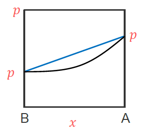
+   保持压力不变, 得到 $T-x$ 图 常用
    +   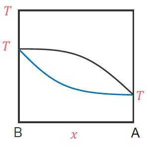
+   保持组成不变, 得到 $T-p$ 图 不常用

$$
双液系\begin{cases}
	完全互溶双液系\begin{cases}
		理想完全互溶双液系 \quad \small 苯和甲苯\\
		非理想完全互溶双液系\begin{cases}
		正偏差或负偏差不是很大的体系 \quad \small 甲醇和水\\
		正偏差很大的体系 \quad \small 乙醇和水\\
		负偏差很大的体系 \quad \small 硝酸和水
		\end{cases}
	\end{cases}\\
	部分互溶双液系\quad \small 苯胺和水\\
	完全不胡荣双液系\quad \small 溴苯和水
\end{cases}
$$

## 理想完全互溶双液系

定义: 两个纯液体可按任意比例互溶, 混合溶液中任一组分在全部浓度范围内蒸气压和组成的关系都符合拉乌尔定律的双液系.

设物质 $A$ 、 $B$ 组成理想溶液, $x_{A} , x_{B}$ 为 $A$ ,  $B$ 在液相中的组成, $y_{\mathrm{A}} , y_{\mathrm{B}}$ 为 ${A} , {~B}$ 在气相中的组成, $p_{\mathrm{A}}^{*} 、 p_{\mathrm{B}}^{*}$ 为纯 ${A}$ ,  纯 ${B}$ 在指定温度下的饱和蒸气压, $p$ 为系统的压力
$$
\left.\begin{array}{rl}
p_{\mathrm{A}}=p_{\mathrm{A}}^{*} x_{\mathrm{A}} \\
p_{\mathrm{B}}=p_{\mathrm{B}}^{*} x_{\mathrm{B}}
\end{array}\right\}\qquad \begin{aligned}
p=p_{\mathrm{A}}+p_{\mathrm{B}} &=p_{\mathrm{A}}^{*} x_{\mathrm{A}}+p_{\mathrm{B}}^{*} x_{\mathrm{B}} \\
&=p_{\mathrm{A}}^{*} x_{\mathrm{A}}+p_{\mathrm{B}}^{*}\left(1-x_{\mathrm{A}}\right) \\
&=p_{\mathrm{B}}^{*}+\left(p_{\mathrm{A}}^{*}-p_{\mathrm{B}}^{*}\right) x_{\mathrm{A}}
\end{aligned}
$$

$$
p=p_{\mathrm{B}}^{*}+\left(p_{\mathrm{A}}^{*}-p_{\mathrm{B}}^{*}\right) x
$$
如果 $A$ 为易挥发组分, $p_{\mathrm{A}}^{*}>p_{\mathrm{B}}^{*}$, 那么在一定温度下 $p-x$ 图则为

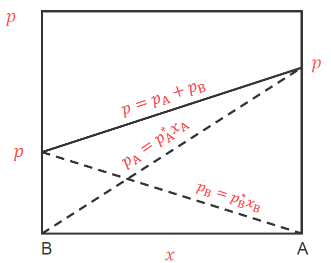

气液两相平衡共存时，气液两相组成不相同， $y_{A} 、 y_{B}$ 为 $A 、 B$ 在气相中的组成  
$$
Dalton 分压定律\left\{\begin{array}{l}y_{\mathrm{A}}=\frac{p}{p}=\frac{p_{\mathrm{A}}^{*} x}{p_{\mathrm{B}}^{*}+\left(p_{\mathrm{A}}^{*}-p_{\mathrm{B}}^{*}\right) x} \\ y_{\mathrm{B}}=\frac{p}{p}=\frac{p_{\mathrm{B}}^{*} x}{p_{\mathrm{B}}^{*}+\left(p_{\mathrm{A}}^{*}-p_{\mathrm{B}}^{*}\right) x}\end{array}\right.
$$
因此 $\quad \frac{y_A}{y_B}=\frac{p_A^*}{p_B^*} \frac{x_A}{x_B} \quad$ 由于 $A$ 为易挥发组分 $\frac{p_A^*}{p_B^*}>1$
$$
\left.\begin{array}{lc}\text { 因此 } & \frac{y_A}{y_B}>\frac{x_A}{x_B} \\ \text { 又因为 } & x_{\mathrm{A}}+x_{\mathrm{B}}=1, y_{\mathrm{A}}+y_{\mathrm{B}}=1\end{array}\right\} \begin{aligned}&y_{\mathrm{A}}>x \\&x_{\mathrm{B}}>y\end{aligned}
$$
易挥发组分在气相中的组成较大, 不易挥发组分在液相中的组成较大.
$$
\begin{aligned}
\text { 已知 } \quad \frac{y_{\mathrm{A}}}{y_{\mathrm{B}}}&=\frac{p_{\mathrm{A}}^{*} x_{\mathrm{A}}}{p_{\mathrm{B}}^{*}} \frac{x_{\mathrm{B}}}{\frac{y_{\mathrm{A}}}{1-y_{\mathrm{A}}}}=\frac{p_{\mathrm{A}}^{*}}{p_{\mathrm{B}}^{*}} \frac{x_{\mathrm{A}}}{1-x_{\mathrm{A}}} \\
x_{\mathrm{A}}&=\frac{y_{\mathrm{A}} p_{\mathrm{B}}^{*}}{p_{\mathrm{A}}^{*}-y_{\mathrm{A}} p_{\mathrm{A}}^{*}+y_{\mathrm{A}} p_{\mathrm{B}}^{*}} \\
\text { 已知 } \quad y_{\mathrm{A}}&=\frac{p_{\mathrm{A}}}{p}=\frac{p_{\mathrm{A}}^{*} x_{\mathrm{A}}}{p} \\
p&=\frac{p_{\mathrm{A}}^{*} x_{\mathrm{A}}}{y_{\mathrm{A}}}=\frac{p_{\mathrm{A}}^{*} p_{\mathrm{B}}^{*}}{p_{\mathrm{A}}^{*}-y_{\mathrm{A}} p_{\mathrm{A}}^{*}+y_{\mathrm{A}} p_{\mathrm{B}}^{*}}
\end{aligned}
$$
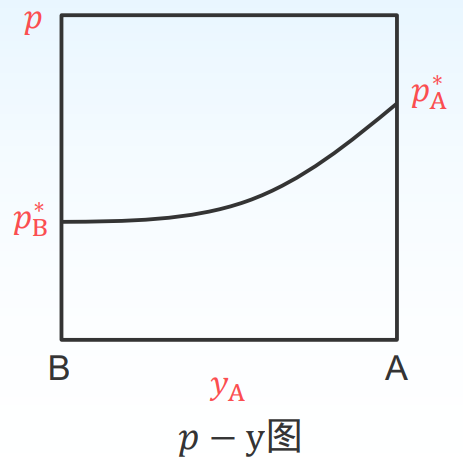

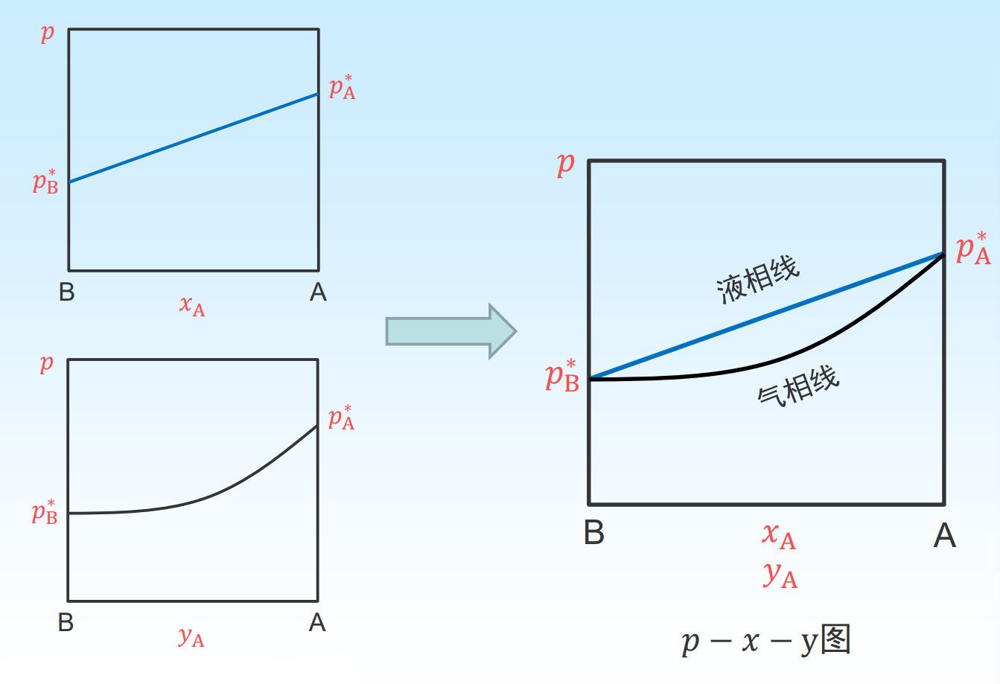

---

### $p-x$ 图

#### 静态分析

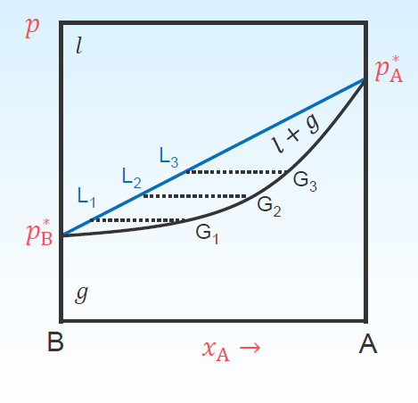

面 $l$ : 液相区, $f^{\prime}=2-1+1=2(p, x)$
面 $g:$ 气相区, $f^{\prime}=2-1+1=2(p, y)$
面 $g+l$ : 气液两相区, $f^{\prime}=2-2+1=1(p$ or $x)$
线 $\overline{L_{1} L_{3}}$ : 气液两相区, $f^{\prime}=2-2+1=1(p$ or $x)$
线 $\overline{G_{1} G_{3}}$ : 气液两相区, $f^{\prime}=2-2+1=1(p$ or $y)$
点 $p_{\mathrm{B}}^{*}$ : 气液两相区, $f^{\prime}=1-2+1=0$
点 $p_{A}^{*}$ : 气液两相区, $f^{\prime}=1-2+1=0$

#### 动态分析

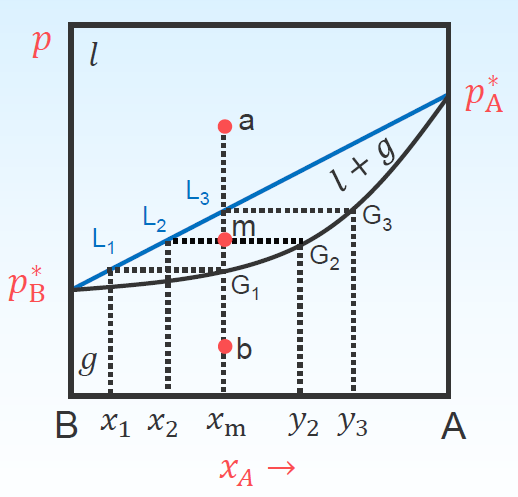

a点: $A$ 与 $B$ 的混合物, $x_{A}=x_{m}, x_{B}=1-$ $x_{\mathrm{m}}, y_{\mathrm{A}}=0, y_{\mathrm{B}}=0$
$\mathrm{a} \rightarrow L_{3}, \mathrm{~A}$ 与 $\mathrm{B}$ 的混合物等温降压, $x_{\mathrm{A}}=x_{\mathrm{m}}$ $L_{3}$ 点: 有气泡产生, $x_{\mathrm{A}}=x_{\mathrm{m}}, y_{\mathrm{A}}=y_{3}$ $L_{3} \rightarrow \mathrm{m}$, 气液平衡, 液体量减少, 气体量增大
$m$ 点: $x_{\mathrm{A}}=x_{2}, y_{\mathrm{A}}=y_{2}$
$m \rightarrow G_{1}$, 气液平衡, 液体量继续减少, 气 体量继续增大
$G_{1}$ 点: $x_{\mathrm{A}}=x_{1}, y_{\mathrm{A}}=x_{\mathrm{m}}$
$G_{1} \rightarrow b$, 只有气体, 没有液体, $y_{\mathrm{A}}=x_{\mathrm{m}}$

---

### $T-x$ 图

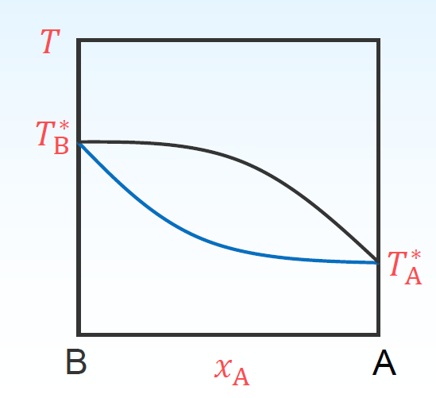

$T-x$ 图在讨论蒸馏时十分有用, 因为蒸馏通常在等压下进行. 而一般系统的压力就是大气压力, 当溶液的蒸气压等于大气压力时, 溶液沸腾, 这时的温度称为沸点. 因此 $T-x$ 图亦称为沸点 - 组成图.

$T-x$ 图可以从实验数据直接绘制, 也可以从已知的 $x$ 图求得.

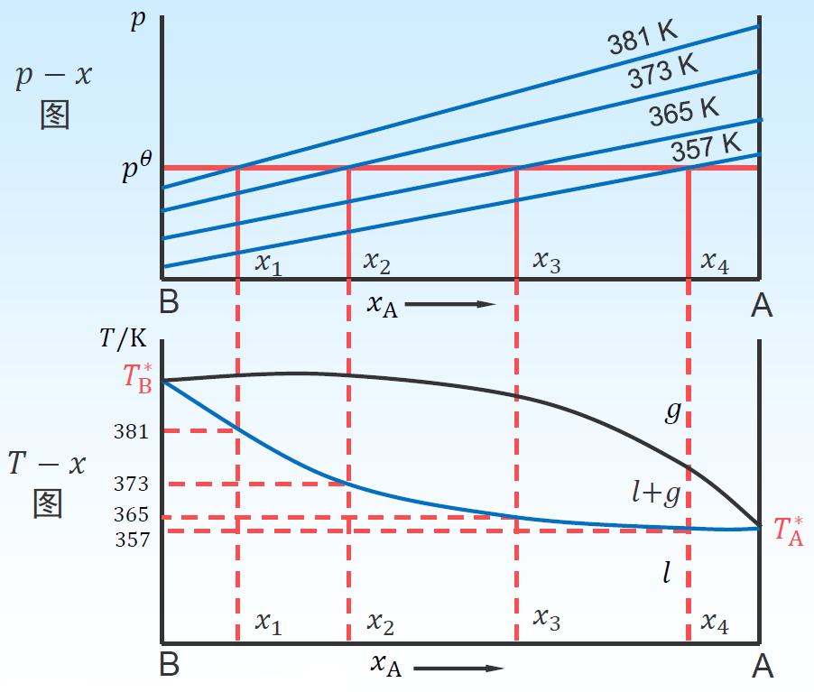

用 $y_{A}=\frac{p_{A}}{p}$ 的方法求出对应的气相组成 线。
在 $T-x$ 图上, 气相线在上, 液相线在下, 上面是气相区, 下面是液相区, 中间梭形区是气-液两相区 (与 $p-x$ 图中颠倒)。

#### 静态分析

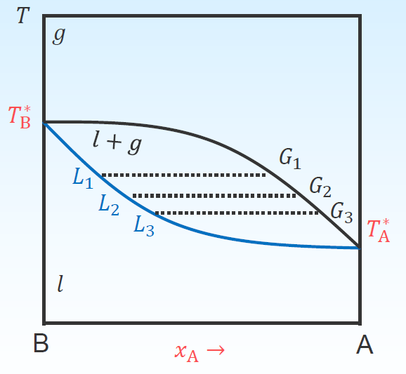

面 $l$ :液相区, $f^{\prime}=2-1+1=2(T, x)$
面 $g:$ 气相区, $f^{\prime}=2-1+1=2(T, y)$
面 $g+l$ : 气液两相区,$f^{\prime}=2-2+1=1(T$ or $x)$
线 $\overline{L_{1} L_{3}}$ : 气液两相区, $f^{\prime}=2-2+1=1(T$ or $x)$
线 $\overline{G_{1} G_{3}}:$ 气液两相区, $f^{\prime}=2-2+1=1(T$ or $y)$
点 $T_{\mathrm{B}}^{*}:$ 气液两相区, $f^{\prime}=1-2+1=0$
点 $T_{\mathrm{A}}^{*}$ : 气液两相区, $f^{\prime}=1-2+1=0$

#### 动态分析

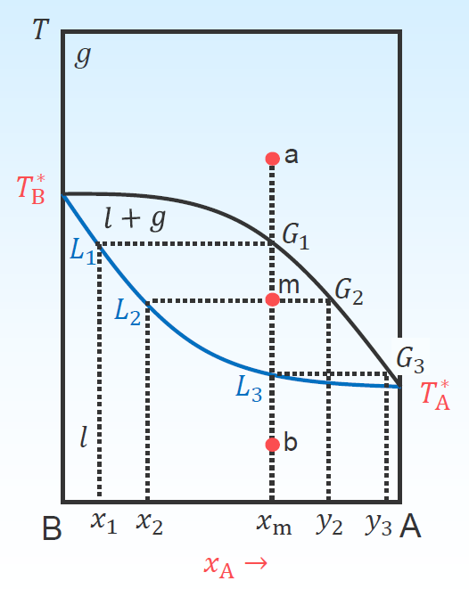

$\mathrm{a}$ 点: $\mathrm{A}$ 与 $\mathrm{B}$ 的气相混合物, $y_{\mathrm{A}}=x_{\mathrm{m}}$, $y_{\mathrm{B}}=1-x_{\mathrm{m}}$
$a \rightarrow G_{1}$, 等压降温, $y_{\mathrm{A}}=x_{\mathrm{m}}$
$G_{1}$ 点:有液体产生, $x_{\mathrm{A}}=x_{1}, y_{\mathrm{A}}=x_{\mathrm{m}}$ $G_{1} \rightarrow \mathrm{m}$, 气液平衡, 液体量增多, 气体量减小
$m$ 点: $x_{\mathrm{A}}=x_{2}, y_{\mathrm{A}}=y_{2}$
$m \rightarrow L_{3}$, 气液平衡, 液体量继续增多, 气体量继续减小。
$L_{3}$ 点: $x_{\mathrm{A}}=x_{\mathrm{m}}, y_{\mathrm{A}}=y_{3}$
$L_{3} \rightarrow b$, 只有液体, 没有气体, $x_{\mathrm{A}}=x_{\mathrm{m}}$

---

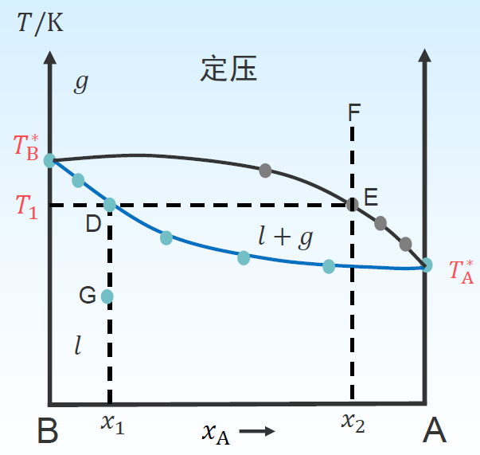

+   液体混合物 $G$ 恒压升温到 $T$ 的时候液体开始沸腾, $D$ 点称为泡点.
+   气相混合物 $F$ 恒压降温到 $T$ 的时候开始凝结出的液体, $E$ 点称为露点.
+   液相组成线也称之为泡点线, 气相组成线也称之为露点线.

---

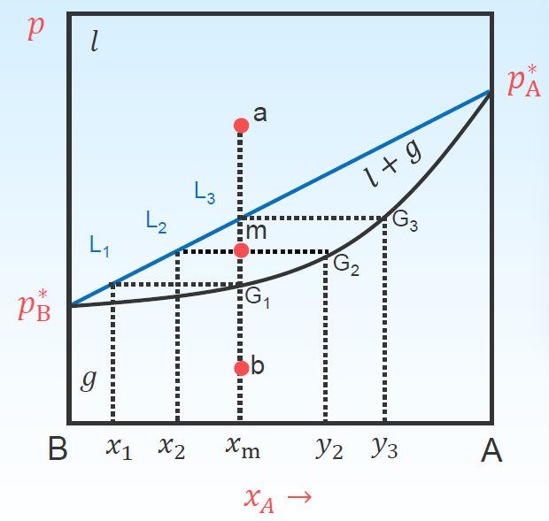

物系点: 表示总组成和状态的点 $(a,m,b)$

相点: 表示各相组成和状态的点 $(L_1,L_2,L_3,G_1,G_2,G_3)$

+   单相区内物系点即相点, 如 $a, b$
+   两相平衡区内物系点与相点分离. 两相区内, 只有物系点.

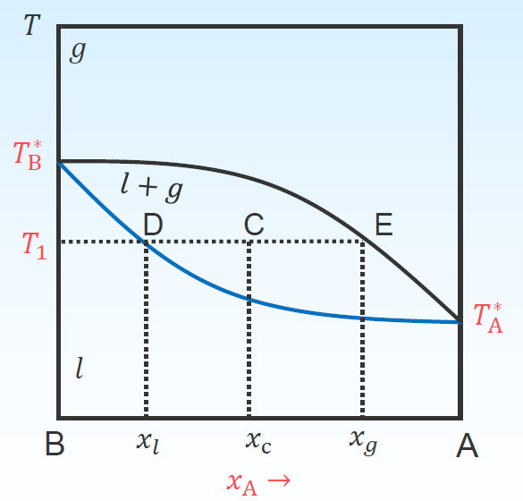

在 $T-x$ 图的两相区, 物系点 $C$ 代表了体系总的组成和温度. 通过 $C$ 点作平行于横坐标的等温线, 与液相和气相线分别交于 $D$ 点和 $E$ 点, 可得如下结论:
$$
杠杆规则\qquad n_l\times \overline{CD} = n_g\times\overline{CE}
$$
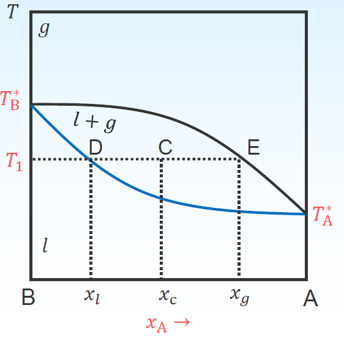

设体系总的物质的量 $n_{\text {总, }}$ 液相的物质的量 $n_{l}$, 气相的 物质的量 $n_{g}$, 物系点的组成 $x_{\mathrm{C}}$, 气相的组成 $x_{g}$, 液相的组成 $x_{l}$, 可以导出
$$
\begin{aligned}
&\left\{\begin{array}{l}
n_{\text {总 }} x_{\mathrm{C}}=n_{l} x_{l}+n_{g} x_{g} \\
n_{\text {总 }}=n_{l}+n_{g}
\end{array}\right. \\
&n_{l}\left(x_{\mathrm{C}}-x_{l}\right)=n_{g}\left(x_{g}-x_{\mathrm{C}}\right) \\
&n_{l} * \overline{C D}=n_{g} * \overline{C E}
\end{aligned}
$$

# 习题

已知 $90~^{\circ} \mathrm{C}$ 时, 甲苯 (A) 和苯 (B ) 的饱和蒸气压分别为 $54.22 ~\mathrm{kPa}$ 和 $136.12~\mathrm{kPa}$, 二者形成理想溶液。求（1）在 $90~^{\circ} \mathrm{C}$ 和 $101.325 \mathrm~{kPa}$ 下, 甲苯和苯所形成的气液平衡体系中两相的摩尔分数各为多少? (2) 由 $6 \mathrm{~mol}$ 苯和 $4 \mathrm{~mol}$ 甲苯构成上述体 系。气液两相物质的量各为若干?
解: (1) 
$$
\begin{aligned}
由于\quad  p&=p_{\mathrm{B}}^{*}+\left(p_{\mathrm{A}}^{*}-p_{\mathrm{B}}^{*}\right) x_{\mathrm{A}}\\
x_{\mathrm{A}}&=\frac{p-p_{\mathrm{B}}^{*}}{p_{\mathrm{A}}^{*}-p_{\mathrm{B}}^{*}}=\frac{101.325-136.12}{54.22-136.12}=0.4248 \\
x_{\mathrm{B}}&=1-x_{\mathrm{A}}=0.5752\\

y_{\mathrm{A}}&=\frac{x_{\mathrm{A}} p_{\mathrm{A}}^{*}}{p}=\frac{0.4248 \times 54.22}{101.325}=0.2273 \\
y_{\mathrm{B}}&=1-y_{\mathrm{A}}=0.7727

\end{aligned}
$$
(2)

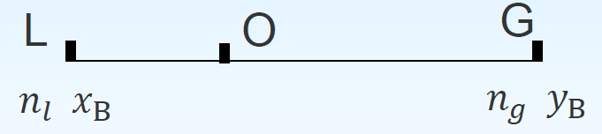
$$
\left.\begin{array}{l}
n_{l}+n_{g}=10 \mathrm{~mol} \\
n_{l} x_{\mathrm{B}}+n_{g} y_{\mathrm{B}}=6 \mathrm{~mol}
\end{array}\right\} \quad n_{l}=8.744 \mathrm{~mol}, n_{g}=1.256 \mathrm{~mol}
$$

---

## 蒸馏

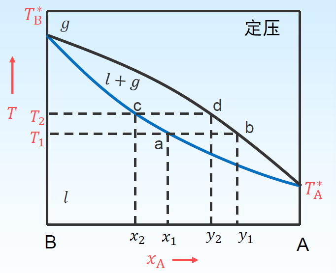

从相图中可知, 当气, 液两相平衡共存时, 气相中易挥发组分的含量总大于它在液相中的含量, 若将混合物加热至沸腾, 并将生成的蒸气在另一个容器中冷凝成液体, 这样就得到两种组成不同的溶液, 这种简单分离过程称为蒸馏.

简单蒸馏只能把双液系中的 $A$ 和 $B$ 粗略分开

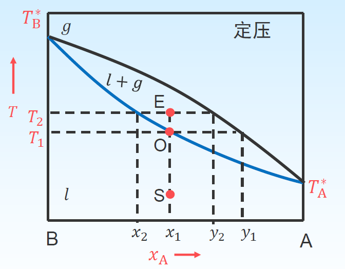

混合物起始在 $S$ 点,其组成为 $x_1$

加热到温度为 $T_1,$ 来到 $0$ 点, 这时对应气相组成为 $ y_1$, 液相组成为 $x_1$

当沸点升高到 $T_2,$ 来到点这时对应气相组成为 $y_2,$ 液相组成为 $x_2$

一次简单蒸馏, 接收在 $T_1$ 到 $T_2$ 间的馏出物, 馏出物组成在 $y_1$ 到 $y_2$ 之间

## 精馏

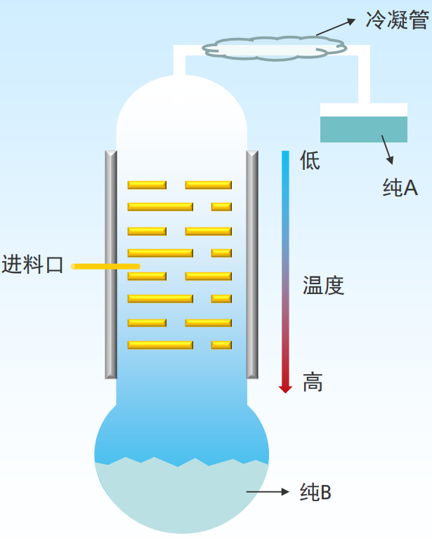

多次简单蒸馏的组合

精馏是通过精馏塔进行的, 塔底部是加热区, 温度最高, 塔顶温度最低. 从下到上温度逐渐降低.

精馏结果, 塔顶冷凝收集的是纯低沸点组分, 纯高沸点组分则留在塔底

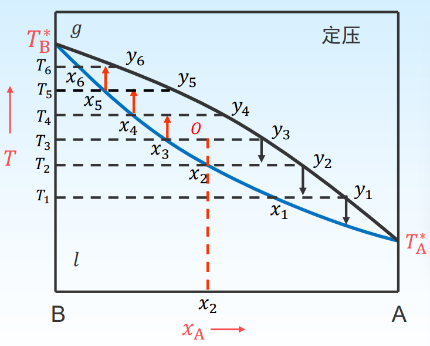

从塔中间 (温度为 $T_{3}$ ) 进料, 这时液、气相组成分别为 $x_{3}$ 和 $y_{3}\left(y_{3}>x_{2}\right)$ 。若把 $y_{3}$ 的 气相降温至 $T_{2}$, 气相部分冷 凝, 得到组成为 $x_{2}$ 的液相和 组成为 $y_{2}$ 的气相, 气相中 $\mathrm{A}$ 组分继续增大。如此反复操 作, 即可得到纯 $A$ 。同理, 逐渐缓慢升温也可得到纯 $B$ 。

## 对 Raoult 定律发生偏差

发生偏差的原因可能有:

1.   某一组分 A 本身有缔合现象, 与 B 组分混合时缔合分子解离, 分子数增加, 蒸气压也增加, 发生正偏差.
2.   A, B 分子混合时部分形成化合物,分子数减少, 使蒸气压下降, 发生负偏差.
3.   A, B 分子混合时, 由于分子间的引力不同, 发生相互作用, 使体积改变或相互作用力改变, 都会造成某一组分对 Raoult 发生偏, 这偏差可正可负.

>   凡是组分 A 发生正或负偏差, 则组分 B 也发生相同类型的偏差。

### 偏差不大的体系

#### 较小正偏差体系

若某一组分的蒸气压大于按拉乌尔定律的计算值, 但偏离不大, 称较小正偏差系统.

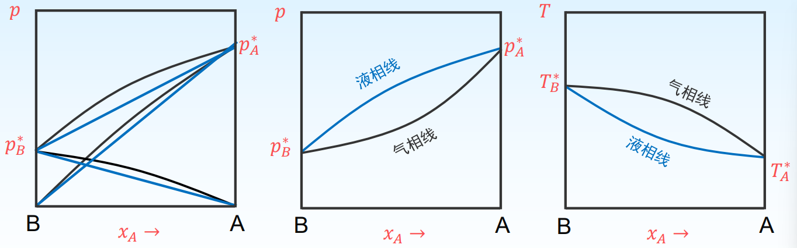

>   非理想完全互溶系发生较小正偏差系统的 $p-x$ 图和 $T-x$ 图

#### 较小负偏差体系

若某一组分的蒸气压小于按拉乌尔定律的计算值, 但偏离不大, 称较小负偏差系统.

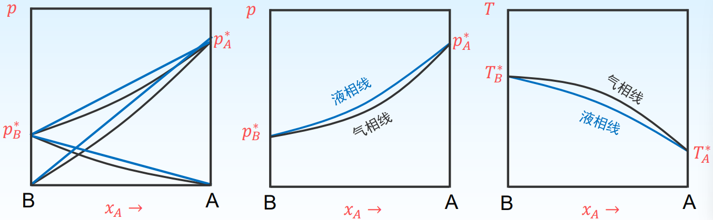

>    非理想完全互溶系发生较小负偏差系统的 $p-x$ 图和 $T-x$ 图

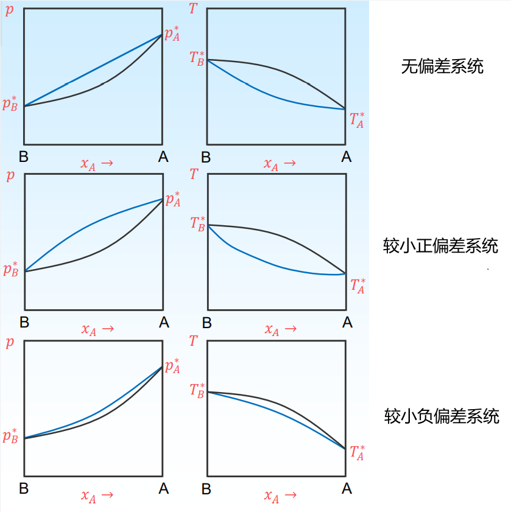

不论是较小正偏差系统还是较小负偏差系统, 溶液的总蒸气压还是介于两个纯组分蒸气压之间, 溶液的沸点也是介于两纯组分沸点之间. 这两类系统的 $p-x$ 图和 $T-x$ 图与理想双液系相图形状相似.

### 较大正偏差的体系

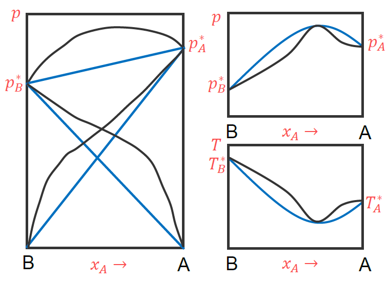

图形特点: $p-x$ 图上有最高点, $T-x$ 图上有最低点. 该点的温度称最低恒沸点, 对应的组成称最低恒沸物.

假如在液态混合物中增加某组分后, 蒸汽总压增加, 则该组分在气相中的含量大于它在液相中的含量.
Konovalov-Gibbs定律

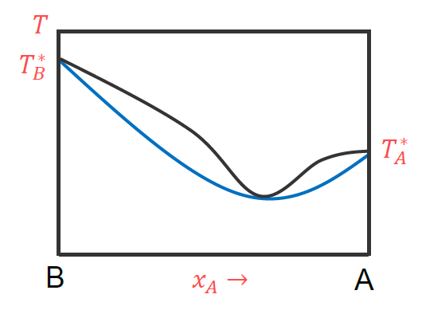

+   恒沸点处, 气液两相组成相同.
+   具有恒沸的混合物,无法通过蒸馏得到 $A, B$ 两种纯物质, 只能得到一种纯 $A$ (或 $B$)与恒沸混合物.
    +   组成处于恒沸点的左边, 精馏结果只能得到纯 $B$ 和恒沸混合物.
    +   组成处于恒沸点的右边, 精馏结果只能得到恒沸混合物和纯 $A$

### 较大负偏差的体系

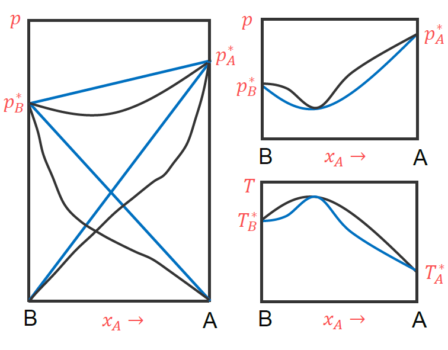

图形特点: $p-x$ 图上有最低点, $T-x$ 图上有最高点. 该点的温度称最高恒沸点对应的组成称最高恒沸物.

与较大正偏差系统一样, 精馏结果也只能得到一种纯 $A$ (或 $B$)与恒沸混合物, 取决于溶液的起始浓度, 不可能同时得到纯 $A$ 或纯 $B$.

# 习题

1. 外压升高时, 单组分体系的沸点将如何变化? ( A )
A. 升高;     B. 降低;     C. 不变;     D. 不一定
2. 克拉贝龙 - 克劳修斯方程可适用于 ( A )
A. $\mathrm{I}_{2}(s)=\mathrm{I}_{2}(g)$                                    B. $C$(石墨) $=C($ 金刚石 $)$
C. $\mathrm{I}_{2}\left(g, T_{1}, p_{1}\right)=\mathrm{I}_{2}\left(g, T_{2}, p_{2}\right)$         D. $\mathrm{I}_{2}(s)=\mathrm{I}_{2}(l)$
3. 单组分系统的相图中两相平衡线都可以用克拉贝龙方程定量描述。（ $T ）$
4. 对于二元互溶液系, 通过精馏方法总可以得到两个纯组分。 $(F)$
5. 在相图中总可以利用杠杆规则计算两相平衡时两相的相对量。 $(T)$

6. 恒沸物的组成不变.（ $F$ ）
7. 物质 $A$ 与 $B$ 可形成低共沸混合物 $E$, 已知纯 $A$ 的沸点小于纯 $B$ 的沸点, 若将任意比例的 $A+B$ 混合物在一个精馏塔中精馏, 在塔顶的馏出物是: ( $C$ )
A. 纯 $A$     B. 纯 $B$      C. 低共沸混合物      D. 都有可能
8. 具有最低恒沸温度的某二组分体系, 在其 $T-x$ 相图的最低点有( $A$ ).
A. $f=0, x_{g}=x_{l}$     B. $f=1, x_{g}=x_{l}$
C. $f=0, x_{g}>x_{l}$     D. $f=1, x_{g}>x_{l}$

