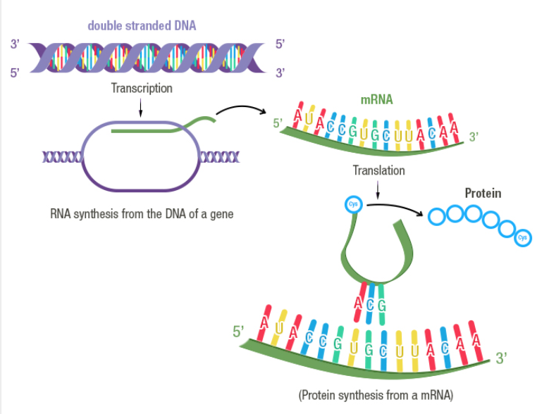
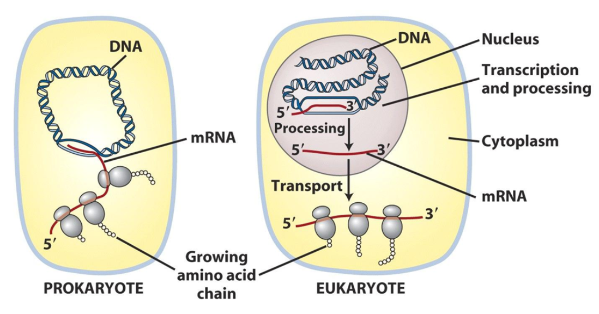
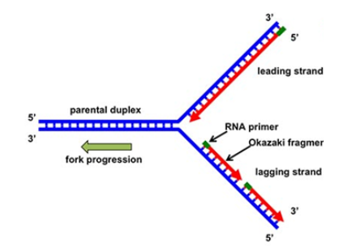
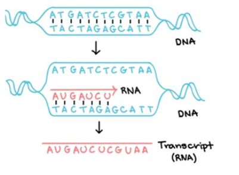
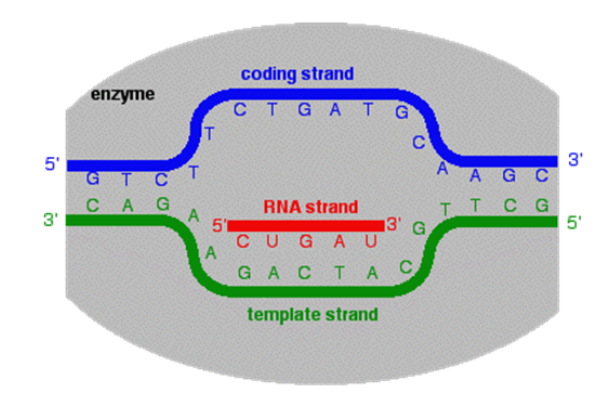
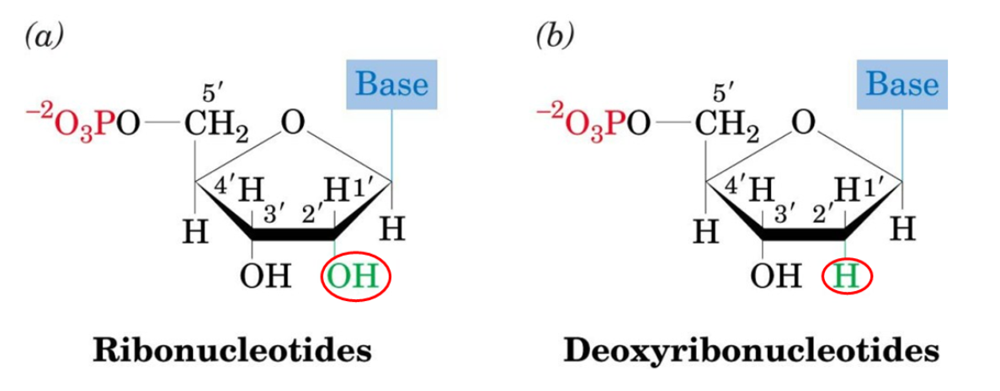
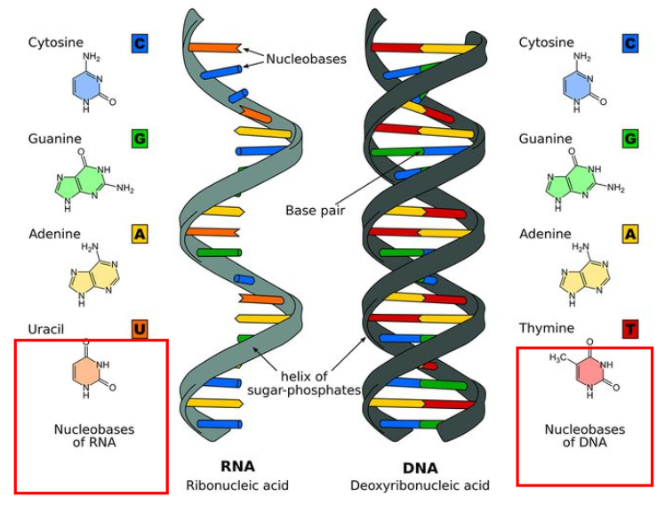
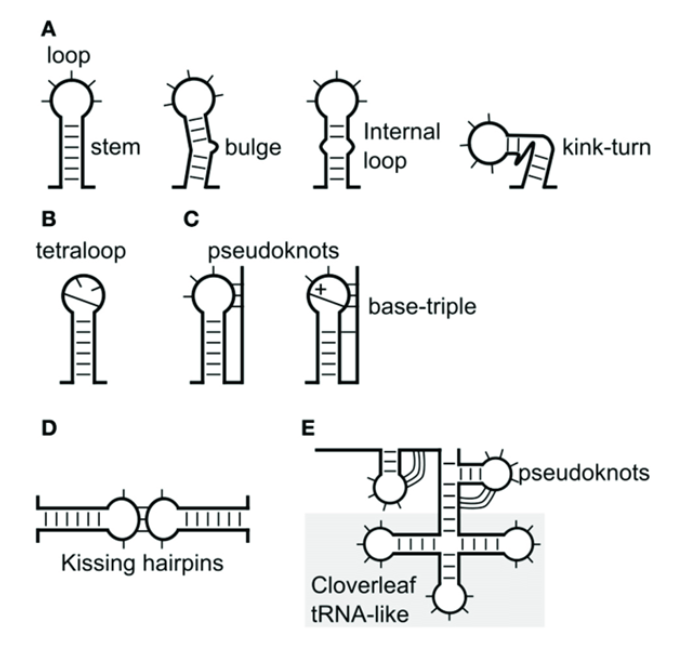
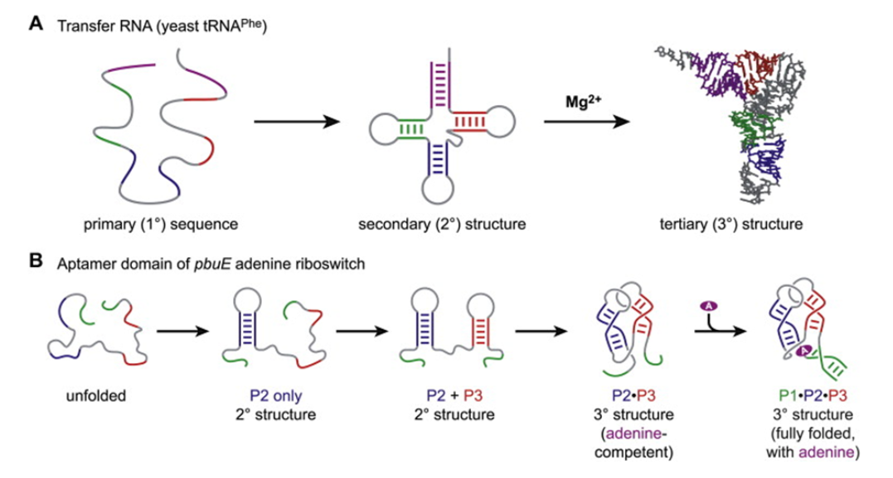
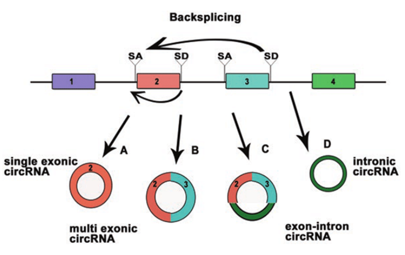

# 第三章 RNA 的转录

## 3.0 概论

### 基因表达 Gene Expression

基因通过一系列的步骤表现出其生物学功能的整个过程

- 转录 Transcription
  - 以 DNA 的一条链为模板合成互补 RNA 的过程

- 翻译 Translation
  - 依照 mRNA 的信息合成蛋白质的过程

### 复制和转录的异同点

- 相同点
  - 都以 DNA 为模板
  - 原料为核苷酸
  - 合成方向均为 5' to 3' 方向
  - 都需要依赖 DNA 的聚合酶
  - 遵守碱基互补配对规律
  - 产物为多聚核苷酸链

- 不同点

|      |           复制            |          转录           |
| :--: | :-----------------------: | :---------------------: |
| 原料 |           dNTP            |           NTP           |
| 引物 |           需要            |         不需要          |
| 方向 |      $5'\to3'$ 方向       |     $5'\to3'$ 方向      |
| 模板 | 单链 DNA / 两条链都作模板 | 单链 DNA / 一条作为模板 |
| 起点 |         复制起点          |         启动子          |
| 长度 |         DNA 全长          |          局部           |
| 终点 |          不一定           |         终止子          |

### 基因的编码链和模板链

- 编码链（Coding Strand）或称有意义链（Sense Strand）：与 **mRNA 序列相同**的那条 DNA 链
- 模板链（Template Strand）或称反义链（Antisense Strand）：根据碱基互补配对原则**指导 mRNA 合成**的 DNA 链

## 3.1 RNA 的结构与功能

### 3.1.1 RNA 的结构特点

- 2 号碳上羟基不脱氧
- 比 DNA 分子小的多，几十到几千核苷酸
  
- 多数单链
- 自身折叠，局部双螺旋
  
- 可折叠形成复杂三级结构
  
- cricRNA 分子环状封闭 不受外切酶影响 表达更稳定 不易降解
  

### 3.1.2 RNA 在细胞中的分布

mRNA

rRNA

tRNA

regulatory RNA

### 3.1.3 RNA 的功能

- 信息分子
  - 贮藏及转移遗传信息

- 功能分子
  - 蛋白质生物合成的主要参与者
  - 核酶
  - 基因表达的调控
  - 遗传物质

## 3.2 RNA 转录的基本过程

### 模板识别：RNA 聚合酶结合到 DNA 双链上，DNA 链的启动子区解链

- 转录是从 DNA 分子的特定部位开始的，这个部位是 RNA 聚合酶全酶识别和结合的部位，称为启动子
- 模板识别是指 RNA 聚合酶与启动子(Promoter) DNA 双链相互作用并与之结合的过程
- 启动子是 RNA 聚合酶识别、结合和开始转录的一段 DNA 序列，它好友 RNA 聚合酶特异性结合和转录起始所需的保守序列，启动子本身不被转录
- 原核细胞：RNA 聚合酶全酶能识别启动子区
- 真核细胞：RNA 聚合酶不能识别启动子区，需要转录调控银子按顺序结合到启动子上，RNA 聚合酶才能与之结合形成转录起始前复合物 PIC(Preinitiation Transcription Complex)
- TFII-D：首先与 TATA 区结合
- TFII-A：稳定 TFII-D 与 TATA 结合
- TFII-B：帮助 RNA 酶与启动子区结合
- TFII-F：与 RNA 酶结合
- TFII-E 与 TFII-H：促进转录开始
- 转录因子是一群能与基因 5' 端上游特定序列专一性结合，从而保证目的基因以特定的强度在特定的时间与空间标的的蛋白质分子

### 转录起始：短核苷酸链合成并释放

- 转录时不需要引物，由 RNA 聚合酶催化以 NTP 为底物连续合成 RNA
- 在 DNA 上开始转录的第一个碱基规定为 +1，与转录相反方向称上游，转录方向为下游；在上游方向与转录其实位点相邻的位置定为 -1
- 转录起始就是 RNA 链上第一个核苷酸键的产生
- 转录起始后直到形成 9 个核苷酸短链的过程是通过启动子阶段。一旦成功合成 9 个以上核苷酸并离开启动子区，就进入正常的延伸阶段
- 通过启动子的时间代表一个启动子的强弱

### 转录延伸：聚合酶合成 RNA

- RNA 聚合酶沿着模板链移动，解开聚合反应位点前方的 DNA 螺旋，新生 RNA 链不断伸长，并允许后面的 DNA 双链重新闭合

### 转录终止：RNA 聚合酶和 RNA 释放

- 终止子是转录终止的信号序列， 它引发延伸聚合酶从 DNA 上脱落，并且释放出已合成的 RNA 链
- 转了双儿终止依赖于 RNA 产物，而不是由特定的 DNA 序列决定
- 不依赖 $\rho$ 因子的终止子可以在不依赖辅助因子的情况下，终止细菌 RNA 聚合酶的转录
- 依赖 $\rho$ 因子的终止位点，未发现有特殊的 DNA 序列，但 $\rho$ 因子能与转录中的 RNA 结合
- $\rho$ 因子六聚体被约 70-80 nt 的 RNA 包绕，激活 $\rho$ 因子的 ATP 酶活性，并向 RNA 的 3' 端滑动，滑至 RNA 聚合酶附近时，RNA 聚合酶暂停聚合活性，使 RNA:DNA 杂化链解链，转录的 RNA 释放出来而终止转录

## 转录机器的主要成分

### RNA 聚合酶

- 特点
	- 依赖 DNA 的 RNA 聚合酶 DDRP
	- 以 DNA 为模板
	- 5'-3' 连续合成
	- 需要 $Mg^{2+}$ 或 $Mn^{2+}$ 
	- 缺乏外切酶活性，没有矫正功能
	- 不需要引物
- 原核生物 RNA 聚合酶
	- RNA 聚合酶的结构
	- RNA 聚合酶各亚基的功能
		- $\beta$ 亚基：由 $\rho\ B$ 编码（NTP 及新生 RNA 链），进行聚合作用
		- $\beta'$ 亚基：又
		- $\alpha$ 亚基
		- $\omega$ 亚基
		- $\sigma$ 亚基
		- 不是 RNA 链延伸必需的
		- 新生
		- 无 $\sigma$ 因子
		- 可重复使用
		- 核心酶覆盖大约 40 bp 的 DNA 区域，其中解链部分只有 $\approx 12-14\ bp$ 
		- 当 DNA 解旋成为模板是，每条链进入酶的不同部位。
		- RNA-DNA 杂合链的程度约 9 bp，比解旋的 DNA 稍短一些。
		- 当酶分子离开这一区域向前移动时，DNA 又重新形成双链。
		- 转录泡（Transcription bubble）是由 RNA 聚合酶核心酶、DNA 模板链以及转录形成的 RNA 新链三者结合形成的转录复合物。
		- 
- 真核生物 RNA 聚合酶
	- 真核生物的三种 RNA 聚合酶的特点
		- |RNA pol|位置|产物|相对活性|对 $\alpha$ - 鹅膏蕈的敏感性|
		- |---|---|---|---|---|
		- ||||||
	- 真核生物中已发现有 4 种 RNA 聚合酶
		- 细胞核 RNA 聚合酶 $\mathrm{I,\ II,\ III\ (RNA\ pol\ I,\ II,\ III)}$ 
		- 线粒体 RNA 聚合酶（类似原核生物的 RNA pol）
		- 它们专一地转录不同的基因
	- 真核生物 RNA 聚合酶 II 的结构及组成
		- RPB1/2 
		- 不同生物 3 类聚合酶有相似性
	- 转录因子
		- 反式作用因子（trans-acting factors） 能直接、简洁辨认和结合转录上游区段 DNA（顺式作用元件）的蛋白质
		- 转录因子（transcription factors）：直接或间接结合 RNA 聚合酶的反式作用因子。
		- 转录因子是真核基因转录所必需的
		- TF 的类型
			1. 通用的转录因子（普遍性转录因子）
				+ 结合与启动子核心序列
				+ TFIIA，TFIIB，TFIID，TFIIR，TFIIIA，TFIIIB，TFIIIC
			2. 基因特异性转录因子
				+ 结合于上游调控去 UPE 和增强子区
				+ SP1，CTF，Ap-1，Oct-2，CREB
			3. RNA 聚合酶 II 的通用转录因子
				+ 以 TF II X 来表示，其中 X 按A线先后用英文大写字母定名。
				+ 基因的转录还需要其它的转录因子的帮助，如结合在 UPE 和远端调控序列上的转录因子。
			+ TFIID 结合与 TATA box
				+ 其中一种亚基 TBP（TATA 结合蛋白，TATA binding protein），是参与各种 RNA pol 起始复合物装配的必要组分
				+ 其余亚基称为 TBP 相关因子
				+ 定位
				+ SL1
			+ 通用转录因子帮助聚合酶

## 启动子与转录起始

### 启动子区的基本结构

启动子（Promoter）是一段位于结构基因 $5'$ 端上游区的 DNA 序列，能活化 RNA 聚合酶，使之与模板 DNA 准确结合

转录起始位点：与新生 RNA 链第一个核苷酸相对应的 DNA 链上的碱基。

一段从启动子开始到终止子结束的 DNA 序列。细菌中，一个转录单元可以是一个基因，也可以是几个基因。

### 原核生物启动子

由 4 个区域组成：-35 序列，-10 序列，转录起点，-10 序列和 -35 序列间的距离
+ -35 序列：为 RNA 聚合酶 $\sigma$ 因子的识别位点。RNA 聚合酶与该位置接触在启动子区域形成封闭复合物
+ -10 序列：为 RNA 聚合酶牢固结合位置并在此解链。形成开放起始复合物。

 + -10 序列（Pribnow Box）
	 + `TATAAT` 或稍微有变化的形式，大致出现在 $-4\sim13\ bp$ 之间
	 + 决定着转录的方向，RNA 聚合酶在此部位与 DNA 结合形成稳定的复合物，Pribnow 框中 DNA 序列在转录方向上解开双螺旋结构，形成开放型起始结构。
	 + 它的功能是 RNA 聚合酶牢固结合的位点，是启动子的关键部位。
 + -35 序列（Sextama Box）
	 + 保守性 $T_{82}T_{84}G_{78}A_{65}C_{54}A_{45}$ 
	 + -35 序列的功能是 $\sigma$ 因子初始识别并结合的位点，与 RNA 聚合酶全酶有很高的亲和性。
	 + -35 序列在很大程度上决定了启动子的强度。

+ $\sigma$ 因子识别 -35 序列，使 RNA 聚合酶结合在启动子上，-35 区域的核苷酸结构极大的决定了启动子的强度
+ DNA 在 -10 序列处解链，由闭合起始复合物转变为开放起始复合物，其解链速度也决定了启动子的强度
+ -10 和 -35 序列是启动子的关键部位；RNA 聚合酶结合在此两区域的 DNA 碱基上；破坏启动子功能的突变有 $75\%$ 位于这两段序列中，另有 $25\%$ 突变发生在这两段序列附近。

+ -10 区与 -35 区的最佳距离
	+ 原核生物中，-10 区与 -35 区之间的距离大约是 $16-19\ bp$，小于 15 或大于 20 都会降低启动子活性。
	+ 间隔的序列不严格，但是距离的大小是决定启动子强度的因素之一。保持适当距离对 RNA 聚合酶的功能是必要的。
	+ 间隔序列对启动子功能相对并不十分重要；但在 $90\%$ 的启动子中，两序列之间的距离约 $17\ bp$，或者说像个 2 个螺旋左右，因而这两个位点大致在 DNA 双螺旋的同一侧。
	+ 不同启动子起动效率不同，分为强启动子（$1-2\ s$ 启动 1 次转录）和弱启动子（至少 $10\ min$ 才启动 1 此转录）。

### 启动子区的识别
启动子的功能即受 DNA 序列的影响，又受其构象的影响，推测 RNA 聚合酶并不直接识别碱基本身，而是通过氢键互补的方式加以识别。（类似酶与底物的结合）

### 真核生物启动子对转录的影响

+ RNA 聚合酶 II 的启动子
+ TATA box
+ 上游启动子元件（Upstream Promoter Element）：CAAT box, GC box, octamer box（八聚体框）
+ 远端调控区（Distal Regulation Region）：Enhancer 增强子，UASs 上游激活序列，Silencer 沉默子，Dehancer 减弱子，Insulator 绝缘子

+ TATA 区和上游启动子元件（CAAT 区或 GC区）的作用不同
	+ TATA 区负责转录精确起始，定位
	+ CAAT 区和 GC 区控制转录起始频率，CAAT 区对转录起始频率的影响最大。
TATA 区和相邻的 UPE 区之间插入核苷酸会使转录减弱
并不是每个基因的启动子都包含这 3 种序列

真核细胞中存在着大量特异性或组成型表达的、能够与不同基因启动子区 UPE 相结合的转录调控因子。
基因转录实际上是 RNA 聚合酶转录调控因子和启动子区各种调控元件相互作用的结果。

### 增强子 沉默子和绝缘子

+ 增强子：能强化转录起始的序列。不是启动子的一部分，但能增强或促进转录的起始，除去这两段序列会大大降低基因的饿转录水平，保留其中一段或取出插至 DNA 的任何部位，就能保持基因的正常转录。
+ 增强子很可能通过影响染色质 DNA- 蛋白质结构或改变超螺旋的密度而改变模板的整体结构，从而使得 RNA 酶更容易与模板 DNA 相结合，起始基因的转录。

+ 增强子的特点
	+ 具有远距离效应
	+ 无方向性
	+ 顺式调节
	+ 无物种和基因的特异性
	+ 具有组织的特异性
	+ 有相位性
		+ 其作用和 DNA 的构象有关
	+ 有的增强子可以对外部信号产生反应

沉默子位于基因两端的抑制基因表达所必需的序列。它可使距离启动子  $2.5\ kb$ 以上的区域形成异染色质区，表达抑制增强子的作用。
它被有关的反式作用因子作用。

绝缘子是一段具有特化染色质结构的区域，它能阻断增强子或沉默子对靶基因/启动子的增强或失活作用效应

+ 位于增强子和启动子之间时，可以阻断增强子与下游基本转录复合体的结合，从而消除增强子对启动子增强表达效应
+ 位于沉默子和启动子之间时，组织沉默子的异染色质化区域的延伸，从而阻断沉默子对下游靶基因的失活效应。

### 转录的抑制
+ DNA 模板功能抑制剂，通过 DNA 结合而改变模板的功能
+ RNA 聚合酶抑制剂，与 RNA 聚合酶结合而抑制其活力
+ 嘌呤和嘧啶类似物，抑制核酸前体的合成，或形成异常的核酸分子，影响其功能并导致突变
|抑制剂|靶酶|抑制作用|
|:---:|:---:|:---:|
|利福霉素|细菌全酶|$\beta$ 亚基结合，抑制起始|
