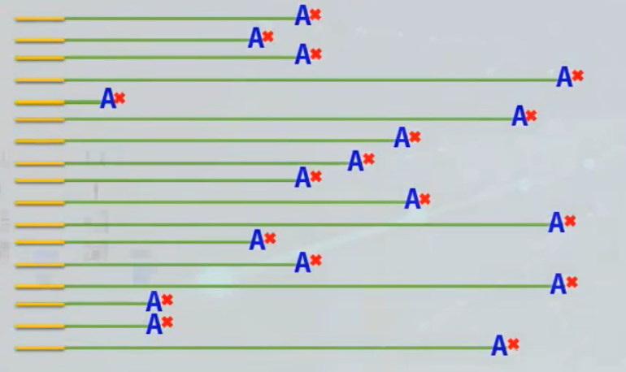
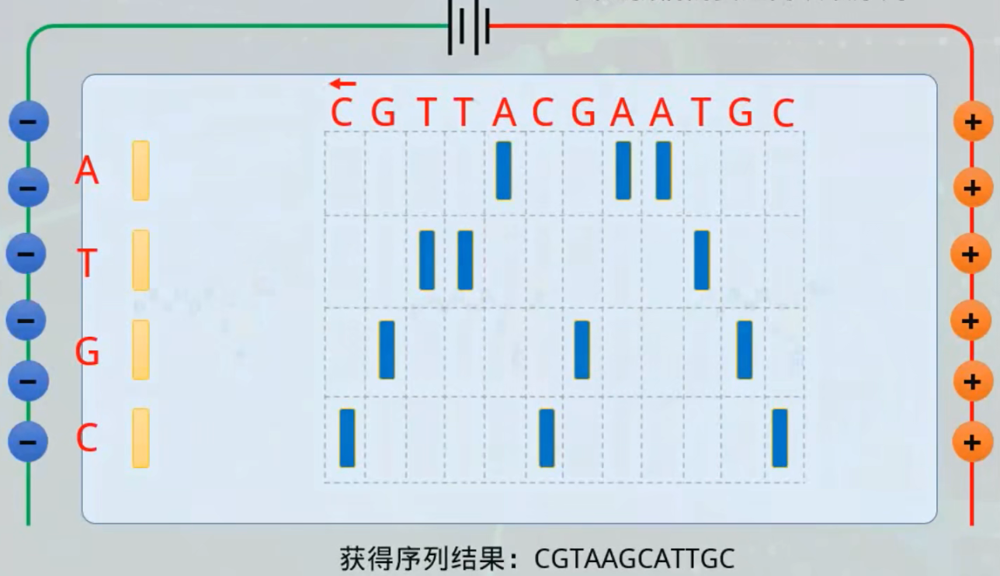
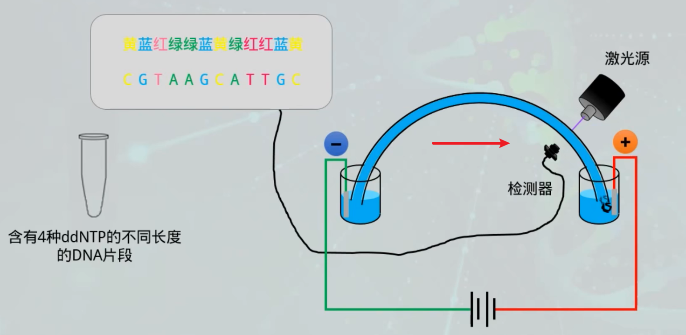
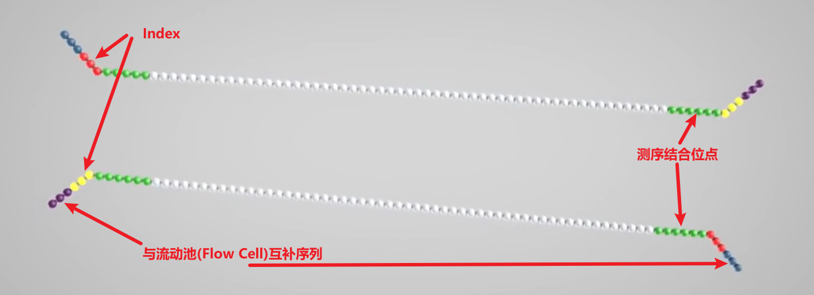
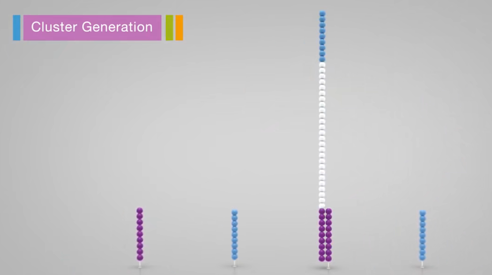
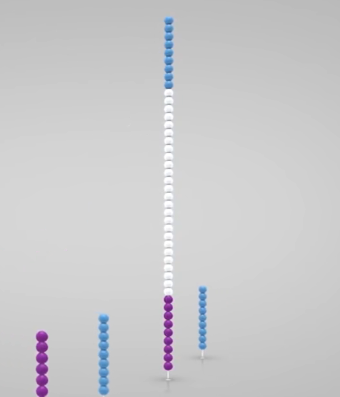
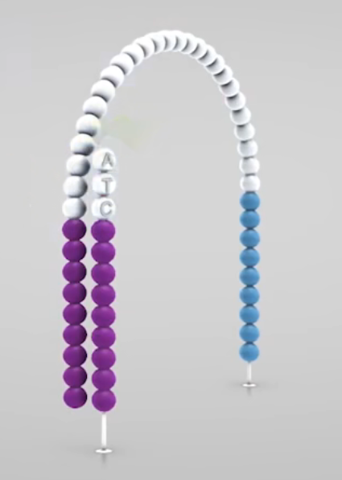

# 绪论

生物信息学：生物信息学是一门交叉学科。它包含了生物信息的获取、处理、存储、分发、分析和解释等在内的所有方面，它综合运用数学、计算机科学和生物学的各种工具，来阐明和理解大量数据所包含的生物学意义。

## 生物信息学发展简史

1. Watson and Crick DNA model （DNA 双螺旋模型）
2. Sanger sequences insulin protein （Sanger 测速仪胰岛素蛋白序列）
3. Sequence alignment algorithm （序列比对算法）
4. Sanger dideoxy DNA sequencing （Sanger 测序法）
5. First human genome draft （人类基因组草图）
6. Next generation sequencing （新一代/二代测序技术）

## 生物信息学的主要研究内容

+ 生物学数据的收集、存储、管理与提供（GenBanj $1.06\times10^{11}\ bps$）
+ 基因组序列信息的提取和分析（非编码区）
+ 功能基因组相关信息分析
+ 生物大分子结构模拟和药物设计
+ 生物信息分析的技术与方法研究
+ 分子进化与比较基因组学

## 生物信息学的主要研究方法

+ 基于数据挖掘（知识发现）的方法
+ 基于模拟分析的方法

### 核酸的蛋白质序列分析研究

+ DNA/RNA/蛋白序列

  + 由重复的核苷酸或氨基酸单元组成的线性高分子，具有高度有序并能完成特定生物学功能的三维结构。

+ 目的

  + 揭示序列蕴含的更高级的结构和功能信息。

+ 组要思想

  + 具有相似序列的分子，可能具有相似的三维结构和生物学功能
  + 首要任务：提取反应结构、功能性质的序列特征。

+ 主要方法

  + 基于数据挖掘或知识发现的方法

    + 统计方法

      + 从事物的外在数量上的表现区推断事物可能的规律性。
      + $\stackrel{(采样、实验设计)}{收集数据}\longrightarrow\stackrel{(建模、知识发现)}{分析数据}\longrightarrow\stackrel{(预测、分类)}{推理}$
      + 回归分析
        + 多元回归
        + 自回归
        + ……
      + 判别分析
        + 线性判别分析
        + 非线性判别分析
        + ……
      + 聚类分析
        + 系统聚类分析
        + 动态聚类分析
        + ……
      + 探索性分析
        + 主成分分析
        + 相关性分析
        + ……

    + 机器学习

      + 学习：系统通过执行某种过程而改进它的性能。

      + ```mermaid
        graph LR
        A[环境]-->B[学习单元]-->C[知识库]-->执行单元--反馈-->A
        ```

      + 规则归纳

        + AQ 算法 
        + ……

      + 决策树

      + 范例推理

        + 直接使用过去的经验或解法来求解给定的问题

      + 遗传算法

    + 神经网络

      + 模仿人脑神经网络的结构和某些工作机制，利用大量的神经元连成网络来实现大规模并行计算。通过学习，改变神经元之间的连接强度。
      + McCulloch-Pitts 模型
      + 多层感知器模型
      + 反传网络模型

## DNA 测序技术

### 第一代测序技术

第一代 DNA 测序技术用的是1975 年由桑格（Sanger）和考尔森（Coulson）开创的链终止法或者是 1976-1977 年由马克西姆（Maxam）和吉尔伯特（Gilbert）发明的化学法（链降解）。

在 1977 年，桑格测定了第一个基因组序列，是噬菌体 X174 的，全长 5375 个碱基。自此，人类获得了窥探生命遗传差异本质的能力，并以此为开端步入基因组学时代。

研究人员在 Sanger 法的多年实践之中不断对其进行改进。在2001年，完成的首个人类基因组图谱就是以改进了的 Sanger 法为其测序基础，Sanger 法核心原理是：由于 $ddNTP$ 的 $2’$ 和 $3’$ 都不含羟基，其在 DNA 的合成过程中不能形成磷酸二酯键，因此可以用来中断 DNA 合成反应，在 4 个 DNA 合成反应体系中分别加入一定比例带有放射性同位素标记的 $ddNTP$（分为：$ddATP,\ ddCTP,\ ddGTP,\ ddTTP$），通过凝胶电泳和放射自显影后可以根据电泳带的位置确定待测分子的 DNA 序列。

通过 4 组添加不同 $ddNTP$ 的反应，可以合成其实位置相同，最后一个碱基已知的不同长度的 DNA 片段，通过电泳技术将其分开后，可以根据最后一个碱基信息拼接整个序列的信息。



由于小片段在前，大片段在后，因此我们需要逆向读取序列。





+ 局限
  + 需要序列扩增及对电泳分离技术的依赖（难集成），使其难以进一步提升分析的速度和难以提高并行化程度，并且难以通过微型化降低测序成本。

### 第二代测序原理 Illumina Sequencing By Synthesis

+ 样本准备 Sample Prep

  + 提取样品 DNA，通过超声波随机打断
  + 使用酶将两端补平，使用 Klenow 酶在 $3'$ 端加一个 A 碱基（用于连接接头(adaptors)序列）
  + 添加特定接头序列
    + 测序结合位点 Sequencing binding site
    + 标签 Index / Barcode
      + 区分每个样品及正负链
    + 与流动池寡核苷酸互补区域 Regions complementary to the Flowcell oligos
    + 
  + 通过以上方法获得的 DNA 片段集合叫做 DNA 文库(DNA library)

+ 成簇 Cluster Generation

  + 即 DNA 被扩增的过程，在流动池(Flowcell)中完成，是一片带有 8 条通道(lanes)的玻璃载玻，每个通道内表面附有两种 DNA 引物(流动池序列)

  1. 引物与 DNA 片段的接头序列互补配对
     
  2. 通过聚合酶合成杂交片段后，加入 $\mathrm{NaOH}$ 使 DNA 双链变性，洗去原始模板链
     
  3. 桥式扩增
     
  4. 反向链被切断洗去，仅留下正向链。封锁 $3'$ 端防止特异性结合重新形成单链桥

+ 测序 Sequencing

  1. 在 Flowcell 中加入荧光标记的 $dNTP$ 和酶，由引物开始合成子链。
     由于 $dNTP \ 3'$ 端存在叠氮基会阻碍子链延伸，使得每个循环只能测得一个碱基。
     合成完一个碱基后，Flowcell 通入液体洗去多余的 $dNTP$ 和酶，使用显微镜激光扫描荧光信号。
     
  2. 加入化学试剂将叠氮基团与荧光基团切除，然后 Flowcell 再通入荧光标记的 $dNTP$ 和酶，由引物起始开始合成一个碱基。不断重复这个过程，完成第一次读取。
  3. 第一次读取完成后，洗去复制出的链
  4. 加入 Index 片段引物并测序，得到 index 序列
  5. 模板链 $3'$ 端去保护，完成双末端测序（得到 index，同时反向合成链）
     
  6. 变性后切除并洗去正向链，然后测序反向链

+ 数据分析 Data Analysis

  + 测序完成后会产生数百万个 reads，基于在样品准备时构建的 index 分类来自不同样本的序列。对于每个样品来说，具有相似延伸的碱基被聚在一起。正向和反向 read 配对生成连续序列。这些序列通过与参考基因组匹配后，实现完整序列的构建。

---

第二代测序技术的局限

读长短成了下一代测序平台的致命伤，这主要是 由于DNA簇中存在的光学信号移相造成的。另外，由于需要 序列扩增，不同长度的片段也不容易实现均一扩增。

