# 基于深度学习势能的改进蛋白质结构预测

​		蛋白质结构预测可以用来根据蛋白质的氨基酸序列确定蛋白质的三维结构。这个问题至关重要，因为蛋白质的结构在很大程度上决定了它的功能；然而，蛋白质的结构很难通过实验来确定。最近，利用遗传信息取得了相当大的进展。可以通过分析同源序列中的不同来推断哪些氨基酸残基相互接触来预测蛋白质结构。本文展示了可以通过训练神经网络来准确预测残基对之间的距离，这比接触预测传达了更多关于结构的信息。利用这些信息，我们构造了一个可以准确描述蛋白质形状的平均力势能。我们发现，所产生的势能可以通过一个简单的梯度下降算法来优化，以生成结构，而不需要复杂的采样过程。由此产生的系统名为 AlphaFold，即使对于同源序列较少的序列也能实现高精度。在最近的蛋白质结构预测关键评估(CASP13)中，AlphaFold 为 43 个自由建模域中的 24 个创建了高精度结构(模板建模(template modelling, TM)得分为 0.7 或更高)，而另一种方法使用采样和联系信息，仅在 43 个域中的 14 个域实现了这种精度。AlphaFold 代表了蛋白质结构预测方面的一大进步。我们希望这种提高的准确性能够深入了解蛋白质的功能和故障，特别是在没有通过实验确定同源蛋白质结构的情况下。

---

​		蛋白质是大多数生物过程的核心。由于蛋白质的功能依赖于其结构，了解蛋白质的结构一直是几十年来生物学中的一个重大挑战。虽然已经开发了几种实验结构确定技术，并在精度上进行了改进，但它们仍然困难且耗时。因此，几十年来的理论工作一直试图从氨基酸序列预测蛋白质结构。

​		CASP 是由结构预测团体运行的两年一次的蛋白质结构盲测预测评估，以基准精度方面的进展。2018 年，AlphaFold 与来自世界各地的 97 个团体一起进行 CASP13 评估。每组都为 84 个蛋白质序列提交了最多 5 个结构预测，这些蛋白质序列的实验确定的结构被隔离了。评估者将蛋白质分为 104 个结构域进行评分，并将每个结构域归类为易于基于模板的建模(TBM，其中具有相似序列的蛋白质具有已知结构，并且根据序列差异修改同源结构)或需要自由建模(FM，在没有同源结构的情况下)，以及中间(FM/TBM)类别。图 1a 显示，AlphaFold 比任何其他系统都更准确地预测更多的 FM 域，特别是在 0.6 - 0.7 TM 分数范围内。TM 得分-范围在0 到 1 之间-衡量拟议结构的整体(主干)形状与原有结构的匹配程度。评审员根据结构的总和、上限 z 分数对 98 个参与小组进行排名，并按类别分开。AlphaFold 在 FM 类别中的总分为 52.8 分(五局三胜)，而紧随其后的组别为 36.6 分(322 分)。结合 FM 和 TBM/FM 类别，AlphaFold 得分为 68.3，而之前的得分为 48.2。AlphaFold 能够高精度地预测以前未知的折叠(图 1b)。尽管 AlphaFold 只使用 FM 技术，不使用模板，但根据评审员的公式 0 - 上限 z - 分数，AlphaFold 在 TBM 类别中也得分很高，在排名前一的模型中排名第四，在五局三胜的模型中排名第一。AlphaFold 的准确性在很大程度上要归功于距离预测的准确性，这从相应接触预测的高精度中可见一斑(图 1C 和扩展数据图 2A)。

> 图 1 | AlphaFold 在 CASP13 评估中的表现。a，对于 AlphaFold 和其他 97 个组，对于给定的 TM 分数阈值预测的 FM(FM+FM/TBM) 域的数量。对于 CASP13 评估者确定的 6 个新构型，将 AlphaFold 的 TM 评分与其他组进行比较，并与自然结构进行比较。T1017s2-d1 的结构不公开。C，CASP13 中最可能的 L、L/2 或 L/5 接触的长域接触预测精度，其中 L 是区域的长度。将 AlphaFold 在 CASP13 中使用的以接触预测为阈值的距离分布与 CASP13 中两种排名最高的接触预测方法：498(RaptorX-Contact26) 和 032(TripletRes32) 提交的关于「所有组」目标的提交进行了比较，并更新了 T0953s2 的域定义。

​		因此，最成功的 FM 方法依赖于片段组装。在这些方法中，通过随机抽样过程来创建结构，例如模拟退火法，该随机抽样过程最小化从蛋白质数据库(PDB)中的结构提取的汇总统计得出的统计势能。在片段组装中，结构假设被重复修改，通常通过改变一小段的形状同时保留降低势能的改变，最终导致低势能结构。模拟退火法需要数千次这样的移动，并且必须重复多次才能很好地覆盖低势能结构。

​		近年来，通过使用在一组相关序列中发现的进化协变数据，结构预测的准确性得到了提高。通过搜索从 DNA 测序得到并与目标序列比对的蛋白质序列的大数据集来找到与目标序列相似的序列，以产生多序列比对(MSA)。两个氨基酸残基在 MSA 序列上位置的相关变化可以用来推断哪些残基可能相互接触。接触通常被定义为当 2 个残基的 $\beta$ - 碳原子彼此之间在 $8\ \AA$ 以内时发生接触。几种方法，包括神经网络，已经被用来根据从 MSA 计算的特征来预测一对残基接触的概率。通过修改统计势以指导折叠过程到满足更多预测接触的结构中，接触预测被结合到结构预测中。其他研究使用了残基之间距离的预测，特别是距离几何方法。无协变特征的神经网络距离预测被用来使进化成对距离依赖的统计潜能被用来对结构假设进行排序。此外，夸克管线对 TBM 使用了基于模板的距离剖面约束。

​		在这项研究中，我们提出了一种深度学习方法来预测蛋白质结构，其各个阶段如图 2a 所示。我们证明，通过训练神经网络(图 2b)对给定序列的蛋白质结构做出准确预测，并通过梯度下降最小化势能(图 2c)来准确预测结构本身，可以构建一个学习的、蛋白质特异的势能(图 2b)。神经网络预测包括主干扭转角和残基之间的成对距离。距离预测提供了比接触预测更具体的结构信息，并为神经网络提供了更丰富的训练信号。通过联合预测多个距离，网络可以传播距离信息，该距离信息遵循附近残基的协变、局部结构和残基一致性。预测的概率分布可以组合在一起，形成简单的、原则性的蛋白质特定势能。我们表明，在梯度下降的情况下，只需有限的采样就可以很容易地找到一组使这种蛋白质特有的势最小的扭转角。还表明，整个链可以同时优化，避免了像常见做法那样将长蛋白质分割成独立建模的假想区域的需要(见方法)。

​		AlphaFold 的中心组件是一个卷积神经网络，它根据 PDB 结构进行训练，以预测蛋白质残基的 $C_{\beta}$ 原子对 $ij$ 之间的距离 $d_{ij}$。根据蛋白质的氨基酸序列 $S$ 的表示和该序列的 MSA($S$) 得出的特征，该网络在结构上类似于用于图像识别任务的网络，预测 $L\times L$ 距离矩阵的任何 64×64 区域中的每个 $ij$ 对的离散概率分布 $P(d_{ij}|S,\ MSA(S))$，如图 2b 所示。通过组合覆盖整个距离图的这种预测而构建的全套距离分布预测称为距离图(来自距离直方图)。图 3c，d 中显示了对一个 CASP 蛋白质 T0955 的距离图预测示例。分布模式(图 3C)可以看到与真实距离(图 3b)非常接近。图 3d 显示了到一个残基(残基 29)的所有距离的示例分布。我们发现，对距离的预测与残基之间的真实距离有很好的相关性(图 3e)。此外，该网络还对其预测中的不确定性进行了建模(图 3f)。当 $s.d.$ 预测分布越低，预测越准确。这在图 3d 中也很明显，其中对距离分布(更高的峰值和更低的 $s.d.$)的预测更有信心。分布的距离)往往更准确，真实距离接近峰值。更广泛、更不可靠的预测分布仍然将概率分配给正确值，即使它不接近峰值。距离预测的高精度以及随后的接触预测(图 1c)来自神经网络设计及其训练、数据增强、特征表示、辅助损失、裁剪和数据精选(见方法)中的各种因素的组合。

> 图2|CASP13 目标 T0986s2 的折叠过程。CASP 靶 T0986s2，L=155，PDB：6N9V。a，结构预测的步骤。b，神经网络基于 MSA 特征预测整个 $L\times L$ 距离图，累积对 64×64 残基区域的单独预测。c，给出了一次梯度下降迭代(1,200 步)，TM得分和均方根偏差(r.m.s.d.)。根据步骤编号和结构的五个快照绘制。还显示了二级结构(来自 SST33)(蓝色螺旋，红色链)以及天然二级结构(NAT)、网络的二级结构预测概率和扭转角预测的不确定性(因为冯·米塞斯分布的 $\kappa^{-1}$ 与 $\varphi$ 和 $\psi$ 的预测相吻合)。虽然梯度下降的每一步都贪婪地降低了势能，但影响了大的全球构象变化，导致了一条紧密堆积的链。d、覆盖在原有结构上的最终第一份提交书(灰色)。e，相对于每个目标的梯度下降重复次数(对数标度)的最低势能结构的平均 TM 得分(在整个测试集上，n=377)。

​		为了生成符合距离预测的结构，我们通过对负对数概率拟合样条并对所有残数对求和来构造光滑势能 $V_{\text{distance}}$(见方法)。我们通过所有残基的主链扭转角($\varphi$，$\psi$)来参数化蛋白质结构，并建立了蛋白质几何的可微模型 $\bold{x}=G(\varphi,\ \psi)$ 来计算所有残基的 $C_{\beta}$ 坐标 ，从而计算每个结构的残基间距离 $d_{ij}=||\bold{x}_i-\bold{x}_j||$，并将 $V_{\text{distance}}$ 表示为 $\varphi$ 和 $\psi$ 的函数。对于含有 $L$ 残基的蛋白质，这个势能从边缘分布预测中累积 $L^2$ 项。为了纠正先验的过度表示，我们从对数域中的距离势中减去参考分布。参考分布对与蛋白质序列无关的距离分布 $P(d_{ij}|\text{length})$ 建模，并通过在相同结构上训练距离预测神经网络的小版本来计算，没有序列或 MSA 输入特征。对接触预测网络的单独输出头进行训练，以预测骨干扭转角 $P(\varphi_i,\psi_i|S,MSA(S))$ 的离散概率分布。在拟合了冯·米塞斯分布之后，这被用来将光滑的扭转模型项 $V_{\text{torsion}}$ 添加到势能。最后，为了防止立体碰撞，我们将 Rosetta 的 $V_{\text{score2\_smooth}}$ 分数添加到势能中，因为这包含了范德华项。我们对位势中的三项中的每一项都使用了乘法权重；然而，没有一种权重组合的表现明显优于同等权重。

​		由于组合势 $V_{\text{total}}(\varphi,\psi)$ 中的所有项都是 $(\varphi,\psi)$ 的可微函数，因此可以关于这些变量通过梯度下降来优化它。这里我们使用 L-BFGS。通过从 $P(\varphi_i,\psi|S,MSA(S))$ 中采样扭矩值来初始化结构。图 2c 说明了最小化势能的单一梯度下降轨迹，显示了这种贪婪优化过程如何导致精度的提高和大规模的构象变化。根据预测的扭角分布通过初始化来部分设置二级结构。总体精度(TM 得分)提高很快，经过几百步的梯度下降，结构的精度已经收敛到势能的局部最优值。

​		我们重复了从采样的初始化开始的优化，产生了一个低电势结构池，从该池中进一步的结构初始化被采样，并增加了主干扭转噪声(噪声重新启动)，导致更多的结构被添加到池中。仅在几百个循环后，优化收敛，最低势能结构被选为最佳候选结构。图 2e 显示了在梯度下降过程的多次重新开始时最佳得分结构的精度的进展，表明在几次迭代之后，优化已经收敛。有噪音的重新启动使具有比继续从预测的扭转分布中采样时略高的 TM 分数的结构被发现(平均为 0.641 分，而在我们的测试集中为 0.636 分，如扩展数据图4所示)。

​		图 4a 显示，距离图的精度(使用距离图的局部距离差测试(LDDT)测量；见方法)与最终实现的结构的 TM 分数有很好的相关性。图 4b 显示了改变势的结构的效果。完全去掉距离势，TM 得分为 0.266。通过平均相邻的箱来降低距离图表示的分辨率低于六个箱会导致 TM 分数降低。去除扭转势、参考校正或 $V_{\text{score2\_smooth}}$ 只会略微降低精度。用 Rosetta 进行最后的「松弛」(侧链堆积与梯度下降交错)，使用 Talaris2014 势和我们参考校正的距离势的样条线拟合的组合，增加了侧链原子坐标，并产生了 0.007 TM 分数的小幅平均改善。

​		我们表明，精心设计的深度学习系统可以提供准确的残基间距离预测，并可以用来构建代表蛋白质结构的蛋白质特定势。此外，我们还表明，这种势可以通过梯度下降来优化，以实现准确的结构预测。

> 图3|预测距离分布与实际距离的对比。a-d，CASP 目标 T0955，L=41，PDB 5W9F。a，原生结构显示与残基 29 的 $C_\beta$ 之间的距离在 $8\ \AA$ 以下。b、c、固有残基间距离(b)和距离预测模式(v)，突出显示残基29。d，预测残基 29 到所有其他残基的距离的概率分布。与原始距离对应的面元以红色突出显示，$8\ \AA$ 以黑色绘制。真实接触点的分布用绿色表示，非接触点的分布用蓝色表示。r，f，CASP 目标 T0990，L=552，PDB 6N9V。E，预测距离与所有残基对的真实距离的模式，距离 $\le 22\ \AA$， $s.d.>3.5 \AA$(n=28,678)。数据为平均值 $\pm\ s.d.$ 。为 $1\ \AA$ 箱计算。f，模距预测相对于 $s.d.$ 的误差。距离分布，不包括原生距离 $>22\ \AA$ 的配对(n=61,872)。数据为平均值 $\pm\ s.d.$ 。显示为 $0.25\ \AA$ 个箱。T0990 的真实距离矩阵和距离图如扩展数据图2b，c所示。

​		虽然调频预测很少接近实验结构的精度，但 CASP13 的评估表明，AlphaFold 系统达到了前所未有的调频精度，这种调频方法可以在不使用模板的情况下与模板建模方法的性能相媲美，并开始达到提供生物学见解所需的精度(见方法)。我们希望我们所拥有的方法可以进一步发展和应用于蛋白质科学的所有领域，对未知结构的序列进行更准确的预测。

> 图4|TM 分数与远距离图的准确性的关系，以及TM分数对势能的不同组成部分的依赖关系。对于CASP13 (n=500：所有领域的 5 个诱饵，不包括T0999)和TEST(n=377)数据集，TM得分与带有Pearson相关系数的距离图lDDT12的比较。
>
> b，测试集上的平均 TM 分数(n=377)与在对距离图进行下采样时使用的直方图箱的数量进行比较，与去除电位的不同分量或添加 Rosetta 松弛进行比较。

## 方法

​		扩展数据图1a显示了MSA构建、特征提取、距离预测、潜在构建和结构实现所涉及的步骤。

### 工具

​		以下工具和数据集版本用于CASP系统和后续实验：PDB 2018年3月15日；CATH 2018年3月16日；基于v.3.0-−3的HHblits(三次迭代，E=1×10−3)；HHpred网络服务器；Uniclust302017-10；PSI-BLAST v.2.6.0 nr数据集(截至2017年12月15日)(三次迭代，E=1×10 Align 3)；SST网络服务器(2019年3月)；BioPythonv.1.65；Rosetta v.3.5；用于结构可视化的PYMOL2.2.0；TM-Align 20160521。

### 数据

​		我们的模型是根据从PDB13中提取的结构进行训练的。我们利用CATH34 35%的序列相似性聚类代表来提取非冗余结构域。这产生了31,247个结构域，这些结构域被分成训练集和测试集(分别为29,427和1,820个蛋白质)，将来自同一同源超家族(在CATH分类中为H-Level)的所有结构域保持在相同的分区中。来自CASP11和CASP12的FM结构域的Cath超家族也被排除在训练集中。从测试集中，我们随机选择每个同源超家族一个结构域来创建377个结构域子集，用于这里的结果。我们注意到，这个集合的精度高于CASP13测试域。

​		CASP13提交结果来自CASP13结果页面，其中显示了CASP13数据集的其他结果，这些结果由CASP13 PDB文件上的CASP13 PDB文件按CASP域定义进行评分。从032组和498组提交的(RR文件)中重新计算接触预测准确性，与AlphaFold用于CASP13提交的散布图预测进行比较。接触预测概率是通过将每个分布中的概率质量相加到 $8\ \AA$ 以下而从分布图中获得的。

​		对于每个训练序列，我们使用HHblits36在Uniclust3035数据集中搜索相似的蛋白质序列并与训练序列比对，并使用返回的MSA生成具有每个残基的特定位置替换概率的轮廓特征以及协变特征-类似于CCMpred的正则化伪合法性训练的Potts模型的参数。CCMPred使用参数的Frobenius范数，但对于每个残基对$ij$，我们将该范数(1个特征)和原始参数(484个特征)都馈入网络。此外，我们为网络提供了明确表示MSA中的空白和删除的功能。为了使网络能够更好地对浅层MSA进行预测，并作为一种数据增强形式，在计算基于MSA的特征之前，我们从HHblits MSA中提取一半的序列样本。我们的训练集包含每个领域的10个这样的样本。我们使用PSI-BLAST提取额外的轮廓特征。

​		距离预测神经网络用以下输入特征(括号中表示的特征数目)进行训练。

+ HHblit比对数(标量)。
+ 序列长度特征：1-热氨基酸类型(21个特征)；特征：PSI-BLAST(21个特征)、HHblits特征(22个特征)、无间隙特征(21个特征)、HHblits偏差、HMM特征(30个特征)、Potts模型偏差(22个特征)；删除概率(1个特征)；残基指数(残基数量的整数索引，除多段结构域外，连续的，编码为5个最低有效位和一个标量)。
+ 序列长度平方特征：Potts模型参数(484个特征，使用Nester ov Momentum 0.99拟合500次梯度下降迭代，没有序列重新加权)；Frobenius范数(1个特征)；间隙矩阵(1个特征)。

​	**距离图预测。**利用深度神经网络对残基间距离进行预测。该结构是一个深度二维扩张的卷积剩余网络。以前，使用二维残差网络，其之前是用于接触预测的一维嵌入层。我们的网络是二维的，使用220个剩余块和扩张的卷积。如扩展数据图1b所示，每个剩余块由交错三个批次范数层的一系列神经网络层、两个1×1投影层、一个3×3膨胀卷积层和指数线性单元(ELU)40非线性部分组成。连续的层通过1、2、4、8像素的放大循环，以允许信息在裁剪区域内快速传播。对于最后一层，使用了特定于位置的偏置，以便通过残差偏移量(上限为32)和面元编号来索引偏置。

​		利用交叉熵损失，用随机梯度下降法训练网络。目标是量化残基的Cβ原子之间的距离(或甘氨酸的Cα原子)。我们将2-22ä的范围划分为64个相等的箱子。网络的输入由特征的二维阵列组成，其中每个i，j特征是i和j的一维特征以及i，j的二维特征的串联。

​		使用27个CASP11 FM域作为验证集，通过提前停止来交叉验证单独的训练运行。通过对27个CASP12FM域的交叉验证选择模型。

### 神经网络超参数

+ 7组，每组4块，256个通道，循环通过扩张1，2，4，8。
+ 48组，每组4块，128个通道，循环通过扩张1、2、4、8。
+ 优化：同步随机梯度下降。
+ 集群大小：4组，每组8GPU
+ 0.85 丢弃保持率
+ 非线性激活函数：ELU
+ 学习率：0.06
+ 辅助损失权重：二级结构：0.005；可及表面积：0.001。这些辅助损失在10万步后减少了10倍。
+ 学习速度在15万步、20万步、25万步和35万步时下降了50%。
+ 训练时间：60万步，约5天。

​		**图像裁剪。**为了限制内存使用和避免过拟合，网络总是在距离矩阵的64×64区域上进行训练和测试，即64个连续残基和另一组64个连续残基之间的成对距离。对于每个训练域，整个距离矩阵被分割成不重叠的64×64个作物。通过训练非对角线作物，可以模拟距离64个残基更远的残基之间的相互作用。每种作物由代表两个64个残基片段并置的距离矩阵组成。此前已经表明，联系人预测只需要一个有限的上下文窗口。我们注意到，靠近对角线i=j的距离预测编码了蛋白质的局部结构的预测，并且对于任何被剪切的区域，距离由由作物的i和j范围表示的两个片段的局部结构决定。用对应于i和j范围的对角线上的二维输入特征来增加输入提供了预测每个片段的结构以及它们之间的距离的附加信息。可以看出，如果片段结构可以被很好地预测(例如，如果它们被确信地预测为螺旋或片状)，那么片段之间单个接触物品的预测将强烈地限制所有其他对之间的距离。

​		每次在训练中使用一个领域时，随机化作物的偏移量会导致一种形式的数据增强，在这种形式下，单个蛋白质可以生成数千个不同的训练样本。通过向原子坐标添加与地面真实分辨率成比例的噪声来进一步增强这一点，从而导致目标距离的变化。数据增强(MSA二次采样和坐标噪声)与丢弃一起防止了网络对训练数据的过拟合。

​		为了预测所有L×L残基对的距离分布，将多个64×64作物组合起来。为了避免边缘效应，用不同的偏移量制作了几个这样的平铺，并将它们平均在一起，对作物中心附近的预测进行了较重的加权。为了进一步提高精确度，对来自四个独立模型的预测进行了平均，这些模型分别用略有不同的超参数进行独立训练。扩展数据图2b，c显示了三域CASP13目标T0990的真实距离和距离图预测模式的示例。

​		由于该网络具有丰富的表示能力，能够结合MSA的轮廓特征和协变特征，因此我们认为该网络可以直接用于预测二级结构。通过分别在i和j中对网络倒数第二层的二维激活分别进行均值和最大合并，我们在网络中添加了额外的一维输出头，该头部预测了由DSSP为j和i中的每个残基计算的八类二级结构标签。Q3(区分三个螺旋/薄片/线圈类)预测的结果准确率为84%，与最先进的预测相当。还可以预测每个残基的相对可达表面积(ASA)。

​		对于每个残基，一维联合激活也被用来独立地预测边缘Ramachandran分布$P(\varphi_i,\psi_i|S,MSA(S))$，作为近似10°(1,296个桶)的离散概率分布。在CASP13期间的实践中，我们使用了来自网络的散射图，该网络经过训练以预测散射图、二级结构和ASA。扭转预测来自第二个类似的网络，该网络被训练来预测曲线图、二级结构、ASA和扭转，因为前者已经得到了更彻底的验证。

​		扩展数据图3b显示散点图的准确性的一个重要因素(如先前利用接触预测系统所发现的)是$N_{eff}$，即MSA中的有效序列数目。这是在MSA中发现的序列数量，在62%的序列同一性水平上扣除冗余后，我们将其除以目标中的残基数量，这是MSA中协变信息量的指示。

​		**距离势。**距离图的概率是为离散的距离箱估计的；因此，为了构造可微势，用三次样条法对分布进行插补。由于最终面元累积了超过$22\ \AA$的所有距离的概率质量，并且较大的距离较难准确预测，因此仅将势能拟合至18？(通过交叉验证确定)，然后进行恒定外推。扩展数据图3c(底部)显示了改变距离直方图的分辨率对结构精度的影响。

​		为了预测参考分布，在相同的数据集上训练类似的模型。参考分布不是以序列为条件的，但为了考虑我们预测其间距离的原子，我们提供了一个二元特征$\delta_{\alpha\beta}$来指示残基是否是甘氨酸($C_\alpha$原子)($C_\beta$)和蛋白质的总长度。

​		距离势由距离的负对数似然性产生，对所有残基对i，j求和(补充式(1))。在有参考状态的情况下，这变成在完全条件模型和背景模型下的距离的对数似然比(补充公式(2))。

​		在预测的扭矩分布下，扭矩被建模为负对数似然。由于我们有边际分布预测，每个预测都可以是多模式的，因此很难联合优化扭矩。为了统一所有的概率质量，以模拟多峰分布的保真度为代价，我们将单峰冯·米塞斯分布拟合到边际预测。对所有残基I(补充式(3))求和。

​		最后，为了防止立体冲突，通过使用Rosetta的$V_{\text{score2\_smooth}}$引入了van der Waals项。扩展数据图3c(上图)显示了势中不同项对结构预测精度的影响。

​		**结构实现采用梯度下降法。**为了实现结构的最小化构建势，我们创建了理想蛋白质骨架几何的可微模型，给出了骨架原子坐标作为扭转角$(\varphi,\psi)$的函数：$X=G(\varphi,\psi)$。那么，要最小化的完全势是距离、扭转角和$\text{score2\_smooth}$(补充式(4))。虽然不能保证这些势具有相同的尺度，但项上的尺度参数是通过在CASP12FM域上的交叉验证来引入和选择的。在实践中，所有项的同等权重被发现会产生最好的结果。

​		由于$V_{\text{total}}$中的每一项关于扭角都是可微的，给定一组初始扭转角$\varphi,\psi$可以从预测的扭转边缘采样，我们可以使用诸如L-BFGS的梯度下降算法来最小化$V_{\text{total}}$。优化后的结构依赖于初始条件，所以我们用不同的初始化多次重复优化。保留了20个最低势能结构的池，一旦满了，我们就从那些在主干扭转上添加30°噪声的结构初始化90%的轨迹(剩余的10%仍然从预测的扭转分布中抽样)。在CASP13中，我们为每条链获得了5000次优化运行。图2c显示了TM分数相对于每个蛋白质的重新启动次数的变化。由于更长的链需要更长的时间来优化，因此这一工作负载在(50+L)/2个并行工人之间平衡。扩展数据图4显示了与计算时间类似的曲线，总是比较从预测的边际分布开始的样本扭矩与从先前结构池重新开始的样本。

​		**精确度。**我们将最终的结构与实验确定的结构进行比较，以使用TM分数、GDT_TS(全球距离测试，总分44)和r.m.s.d等度量来衡量它们的准确性。所有这些精度测量都需要候选结构和实验结构之间的几何对齐。另一种不需要对齐的精确度测量是lDDT45，它测量在$15\ \AA$以下的自然成对距离$D_{ij}$的百分比，带有序列偏移量≥r残基，在真值的公差范围内实现的候选结构(如$D_{ij}$)，跨0.5、1、2和$4\AA$(没有立体化学检查)的公差的平均值，如补充式(5)所示)。

​		由于距离图预测成对的距离，我们可以引入距离图lDDT(DLDDT)，这是一种类似于lDDT的度量，直接从距离图的概率计算，如补充公式(6)所示)。由于序列中邻近残基之间的距离通常较短，更容易预测，并且对确定整体折叠拓扑并不关键，因此我们设置r=12，仅考虑序列分离≥为12的残基之间的距离。由于我们预测$C_\beta$距离，因此在本研究中，我们使用$C_\beta$距离计算了LDDT和DLDDT。扩展数据图3a显示$lDDT_{12}$与所实现结构的$lDDT_{12}$具有很高的相关性(对于CASP13，Pearson's r=0.92)。

​		**没有结构域分割的全链。**将长度为L的蛋白质按每个残基的两个扭转角参数化，结构空间的维度增加到2L，因此，寻找大蛋白质的结构变得更加困难。传统上，这个问题是通过将较长的蛋白质链分裂成独立折叠的片断--称为结构域--来解决的。然而，单独从序列中分割结构域本身是困难的，而且容易出错。在这项研究中，我们避免了结构域分割，而是折叠了整个链。通常，MSA基于给定的区域分割；然而，我们使用滑动窗口方法，计算全链MSA来预测基线全序列距离图。然后，我们计算链子序列的MSA，尝试大小为64、128、256且偏移量为64的倍数的窗口。这些MSA中的每一个都产生了一个单独的距离图，该距离图对应于全链距离图上的对角正方形。我们将所有这些散点图平均在一起，根据MSA中的序列数量进行加权，以产生平均全链散点图，该图在可以找到许多比对的区域更准确。对于CASP13评估，使用Rosetta Relax松弛了完整的链，势能为$V_{\text{Talaris}}+0.2V_{\text{distance}}$(权重通过交叉验证确定)，所有系统的提交都基于这一势能进行排名。

​		**CASP13结果。**对于CASP13，五个AlphaFold提交来自三个不同的系统，所有这些系统都使用基于神经网络距离预测的潜力。这里没有描述的系统在单独的文件8中描述。在T0975之前，使用了两种基于模拟退火法和片段拼接的系统(并使用40-bin距离分布)。从T0975开始，使用新训练的64-bin距离图预测，并通过这里描述的梯度下降系统(三个独立运行)以及一个片段组装系统(五个独立运行)生成结构。这五份提交是从这八种结构中选出的(每次独立运行产生的最低潜力结构)，第一份提交(前一份)是通过梯度下降产生的最低潜力结构。其余四个提交的是四个最佳的其他结构，如果没有选择位置2、3或4，则第五个是梯度下降结构。T0999的所有提交都是通过梯度下降产生的。扩展数据图5a显示了每次提交所使用的方法，与T0975之前的目标通过单次梯度下降运行生成的“回填”结构进行了比较。扩展数据图5b显示，在CASP中后来使用的梯度下降法在每一类别中都比片段组装法表现得更好。扩展数据图5c比较了FM和FM/TBM域的AlphaFold提交的准确性与次佳组322。CASP13 FM的评审员使用专家视觉检查为每个目标选择最佳投稿，发现AlphaFold的最佳模型数量几乎是第二好组的两倍。

​		**AlphaFold预测的生物学相关性。**预测结构有广泛的用途，所有这些都有不同的精度要求，从一般理解折叠形状到了解结合区域中详细的侧链构型。例如，仅接触预测就可以引导Biological insight突变来破坏蛋白质的稳定。图1c和扩展数据图2a显示，AlphaFold的接触预测的准确性超过了最先进的预测。在扩展数据图6-8中，我们提供了进一步的结果，表明AlphaFold的准确性提高导致了对功能的更准确的解释(扩展数据图6)；更好的蛋白质-蛋白质相互作用的界面预测(扩展数据图7)；更好的结合口袋预测(扩展数据图8)以及晶体学中改进的分子替换。

​		到目前为止，只有基于模板的预测能够提供最准确的预测。虽然AlphaFold在不使用模板的情况下就能够匹配TBM，并且在某些情况下优于其他方法(例如，T0981-D5，72.8 GDT_TS和T0957s1-D2，88.0 GDT_TS，两个TBM-硬域，其中AlphaFold的Top-One模型比任何其他Top-One提交都要好12 GDT_TS)，但FM目标的精度仍然落后于TBM目标，仍然不能依赖于对硬结构的详细了解。在对分子置换的CASP13TBM预测性能的分析中，另一项研究48报告说，AlphaFold预测(原始坐标，没有B因子)导致的对数似然增益略高于任何其他组，表明这些改进的结构可以帮助X射线结晶学的分阶段。

​		**距离图谱神经网络的解释。**我们已经证明，深度距离预测神经网络实现了高精度，但我们想了解网络是如何实现其距离预测的，尤其是了解模型的输入如何影响最终预测。这可能会提高我们对折叠机制的理解，或者对模型提出改进建议。然而，深度神经网络是其输入的复杂的非线性函数，因此这一属性问题是一个困难的、未被明确描述的问题，也是一个持续的研究课题。即便如此，仍有许多方法可用于此类分析：在这里，我们将集成梯度应用于我们训练的距离图网络，以指示影响网络对特定距离预测的输入特征的位置。

​		在扩展数据图9中，对于T0986s2中选定的I、J输出对，显示了相加绝对积分梯度、$\sum_c|S^{IJ}_{i,j,c}|$，(在补充公式(7)-(9)中定义)的曲线图；在扩展数据图10中，每个输出对的前10个最高属性输入对显示在AlphaFold的前一个预测结构之上。属性图是稀疏的和高度结构化的，紧密地反映了预测的蛋白质几何结构。对于呈现的四个内接触对(1、2、3、5)，所有最高属性对都是输出对中的一个或两个都是其成员的二级结构内或二级结构之间的对。在1中，螺旋残基以及螺旋两端之后的链之间的连接是重要的，这可能表明螺旋上的应变。在2中，所有最重要的残基对连接相同的两条链，而在3中，链间对和链残基的混合物最显著。在5中，最重要的对涉及到链和螺旋附近的二级结构元件的堆积。对于非接触对4，最重要的输入对是预测蛋白质结构中几何位置在I和J之间的残基。此外，大多数高归因的输入对本身都有联系。

​		由于网络的任务是预测空间几何形状，而输入端没有可用的结构，这些相互作用模式表明，网络正在使用中间预测来发现重要的相互作用，并从相关残基中引导信息来完善最终预测。

### 报告摘要

有关研究设计的更多信息，请参阅与本文链接的《自然研究报告摘要》。

### 数据获取

数据可用性我们的培训、验证和测试数据拆分(CATH域代码)可从https://github.com/deepmind/deepmind-research/tree/MASTER/alphafoldcasp13获得。本研究使用了以下版本的公共数据集：PDB 2018-03-15；CATH 2018-03-16；Uniclust30 2017-10；以及PSI-BLAST nr数据集(截至2017年12月15日)。

### 代码获取

https://github.com/deepmind/deepmindresearch/tree/master/alphafold_casp13.上提供了距离图、参考距离图和扭转预测神经网络的源代码，以及CASP13目标的神经网络权重和输入数据，供研究和非商业使用。我们利用几个开源库来进行我们的实验，特别是HHblits，PSI-BLAST和机器学习框架TensorFlow(https://github.com/tensorflow/tensorflow))以及TensorFlow库Sonnet(https://github.com/deepmind/sonnet)，它提供了单个模型组件的实现。我们还在许可下使用了Rosetta9。

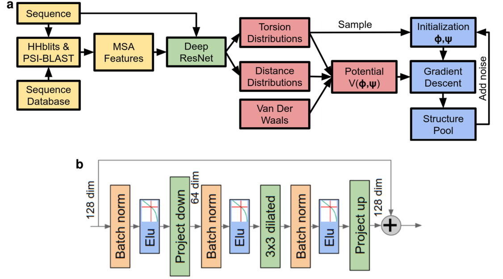

> 扩展数据图1：折叠系统和神经网络示意图。
>
> a，整体折叠系统。特征提取阶段(使用序列数据库搜索构建MSA和计算基于MSA的特征)用黄色表示；结构预测神经网络用绿色表示；潜在构造用红色表示；结构实现用蓝色表示。b，在深剩余卷积网络的一个块中使用的层。将膨胀卷积应用于降维的激活。块的输出将添加到上一层的表示法中。剩余网络的旁路连接使梯度能够不受影响地通过网络返回，从而允许对非常深的网络进行训练。

---

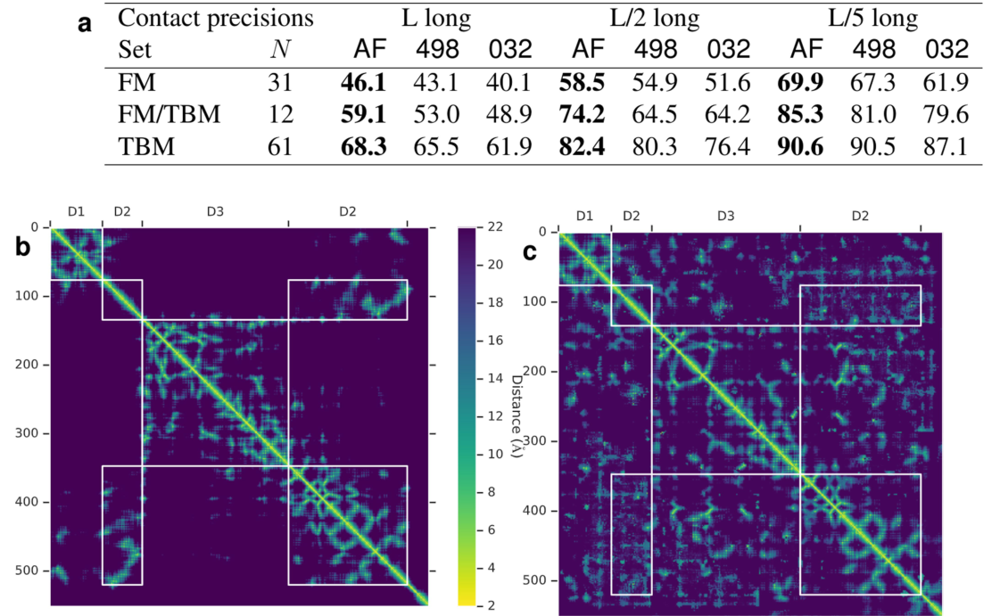

> 扩展数据图2|CASP13接触精度。a，精度(如图1C所示)，用于CASP13中最可能的L、L/2或L/5接触的长期接触预测，其中L是区域的长度。将AlphaFold(AF)在CASP13中使用的以接触预测为阈值的距离分布与CASP13中两种排名最好的接触预测方法的提交进行了比较：498(RaptorX-Contact)和032(TripletRes)，关于所有组目标，并更新了T0953s2的域定义。b、c、真距离(B)和CASP13目标T0990的预测距离图(C)的模式。CASP将该链分为三个结构域(D3插入D2中)，分别有39、36和42个HHblit比对(来自CASP网站)。

---

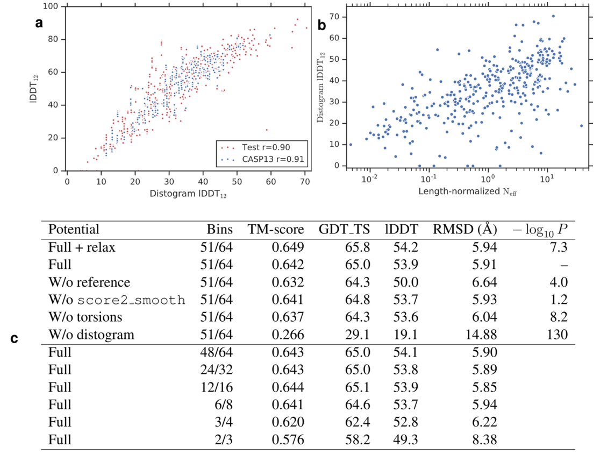

> 扩展数据图3：结构精度分析。a，lDDT12与散射图lDDT12(见方法，“准确度”)。距离图的准确性很好地预测了CASP13(n=500：5诱骗，不包括T0999)和测试(n=377)数据集的实现结构的lDDT(特别是对于中程和远程残基对，以及图4A所示的TM分数)。数据与皮尔逊相关系数一起显示。B，DLDDT12与按序列长度归一化的MSA(Nef)中的有效序列数(n=377)进行比较。有效序列的数量与这一距离图准确度相关(r=0.634)。C，结构精度测量，在测试集(n=377)上计算，用于不同形式的势的梯度下降优化。顶部，移除势能中的项，并显示使用Rosetta Relax进行后续优化的效果。在双尾配对t检验中，‘p’表示与‘Full’结果不同的潜在值的重要性。‘Bins’表示在外推之前由样条线拟合的箱的数量和完全分布中的数量。在CASP13中，64个垃圾箱中的第一个51个安装了花键。底部，降低了距离像分布的分辨率。最初的64个仓离散度图预测通过将相邻仓位相加反复向下采样2倍，在每种情况下都使用超过18$\AA$(仓位的最后四分之一)的恒定外推。最后一行的二能级势能是为了与接触预测进行比较而设计的，它是通过将8$\AA$以下的概率质量和8和14$\AA$之间的概率质量相加而构建的，并在14 $\AA$以上进行常量外推。此表中的TM分数如图4b所示。

----

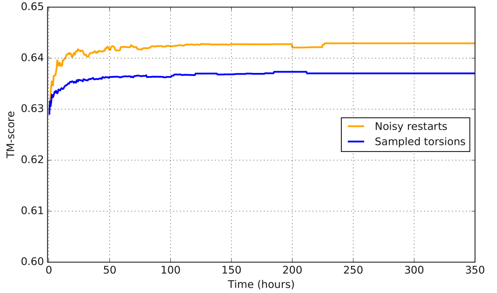

> 扩展数据图4|TM分数与每个目标的计算时间之间的关系，以测试集上的平均值计算。结构实现需要适度的计算预算，可以在多台机器上并行。噪声重启的完全优化(橙色)与采样扭矩的初始化(蓝色)进行了比较。计算是(基于CPU的)机器数量和运行时间的乘积，可以在很大程度上并行化。更长的目标需要更长的时间来优化。图2E显示了TM分数如何随着梯度下降重复次数的增加而增加。n=377。

---

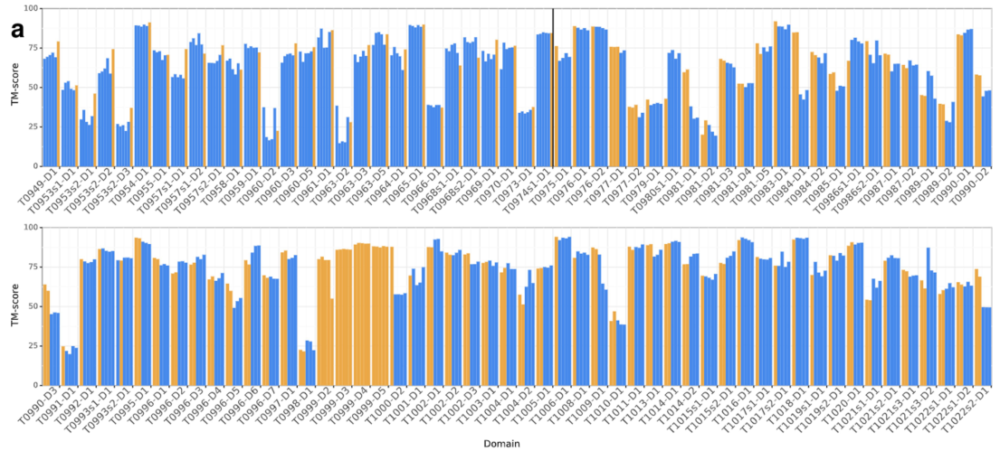

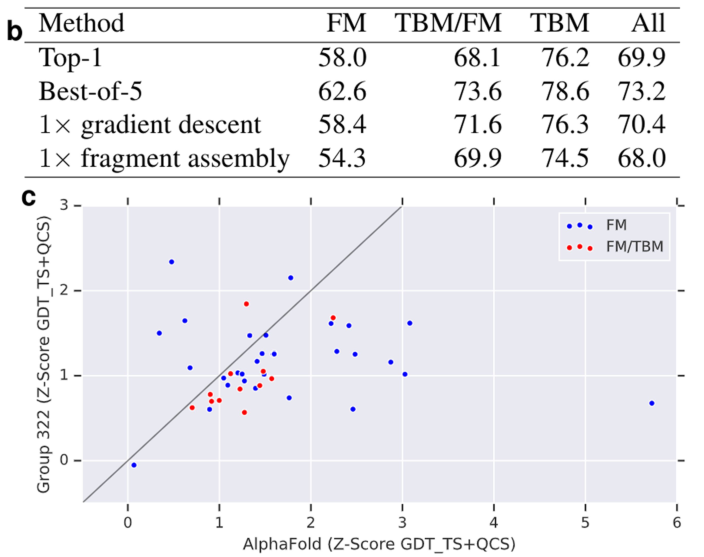

> 扩展数据图5|AlphaFold CASP13结果。A，显示了五个AlphaFold CASP13提交的每一个的TM得分。带有片段组装条目的模拟退火法以蓝色显示。渐变下降条目显示为黄色。梯度下降仅用于T0975及更高版本的目标，因此在黑线左侧，我们还显示了使用已部署系统的每个较早目标的单次“回填”梯度下降运行的结果。根据HHpred51同源匹配，手动分割T0999(1589个残基)。B，AlphaFold CASP13提交的平均TM得分(n=104个域)，比较提交的第一个模型、五局四选模型(提交的GDT_TS最高)、一次全链梯度下降(针对T0975及更高的CASP13运行一次CASP13，对较早的目标进行回填)和一次带有域分割的CASP13片段组装(使用针对T0999的梯度下降提交)。C、GDT TS+QCS、CASP FM(n=31)和FM/TBM(n=12)领域评价员的公式标准化(Z)分数，将AlphaFold与最接近的竞争者(第322组)进行比较，按领域类别着色。AlphaFold的表现更好(P=0.0032，单尾统计t检验)。

---

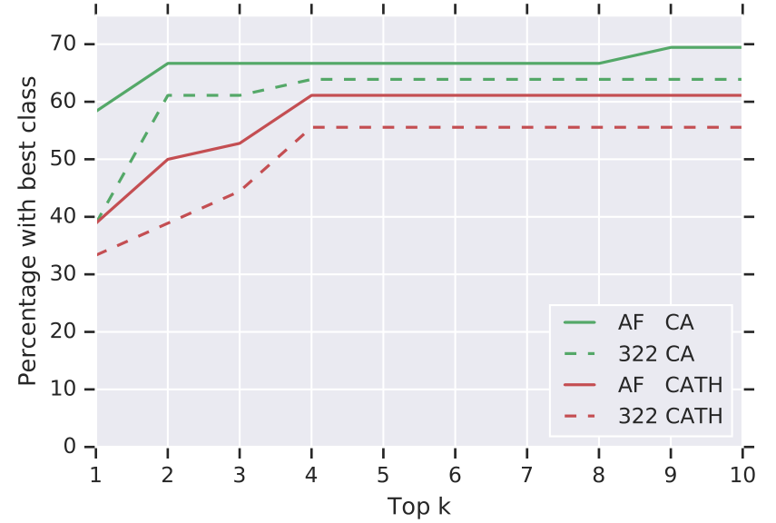

> 扩展数据图6：在CATH中通过结构搜索正确识别折叠。通常可以通过找到已知功能的同源蛋白质来推断蛋白质的功能。在这里，我们表明，AlphaFold的FM预测在Cath数据库中基于结构的同源结构域搜索中提供了更高的准确性。对于每个FM或TBM/FM域，将前一位提交和基本事实与使用TM-align53的所有30,744个Cath S40非冗余域进行比较。对于存在良好地-实匹配(得分>0.5)的36个域，我们显示具有相同CATH代码(Cath为红色，CA为绿色；CAT结果接近CASS结果)的域的诱饵的百分比，因为顶端地-实匹配是得分>0.5的top-k匹配。显示了AlphaFold和次好组(322)的曲线。AlphaFold预测可以更准确地确定匹配的折叠。确定匹配的Cath结构域可以深入了解新蛋白质的功能。

---

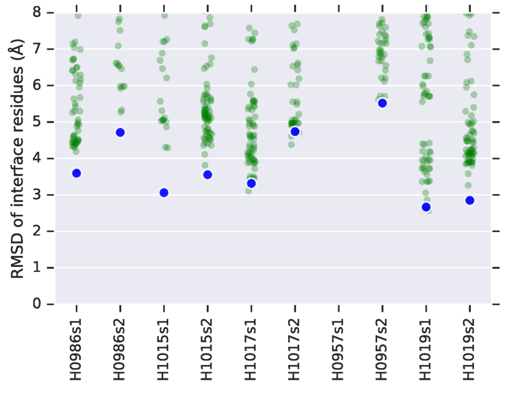

> 扩展数据图7：界面预测的准确性。蛋白质-蛋白质相互作用是理解蛋白质功能的一个重要领域，迄今为止，由于需要高精度的预测，这一领域在很大程度上局限于基于模板的模型，尽管在与预测结构对接方面取得了一定的成功，54最大对接的结构可达6$\AA$r.m.s.d。这个图表明，AlphaFold的预测提高了杂二聚体结构中链的界面区域的准确性，可能是更好的对接候选者，尽管对接并不构成AlphaFold系统的一部分，而且所有提交的材料都是针对孤立的链而不是络合物。对于五个全基团杂二聚体CASP13靶，全原子r.m.s.d。对于所有基团(绿色)的链提交，计算相对于目标络合物的界面残留值(具有基本真实的链间重原子距离<10ä的残基)。结果>8$\AA$不显示。AlphaFold(蓝色)实现了一致的高精度界面区域，并且对于5个目标中的4个，预测两个链的界面都低于5$\AA$。

---

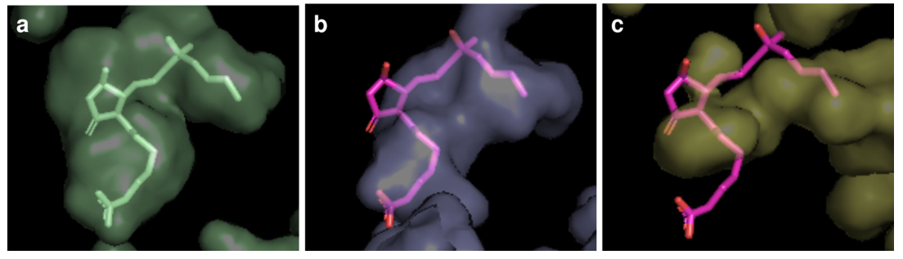

> 扩展数据图8|T1011的配位袋可视化。T1011(PDB 6M9T)是与米索前列醇FA55结合的EP3受体。A，显示口袋中的配体的天然结构。B，c，AlphaFold(B)提交的材料5(78.0GDT TS)，在不知道配体的情况下，显示了比最佳其他提交材料(322，模型3，68.7GDT TS)(C)更类似于真实口袋的口袋。这两种提交的材料都使用来自靠近配体口袋的螺旋的相同残基子集与天然蛋白质比对，并用内部口袋与天然配体位置一起可视化。

---

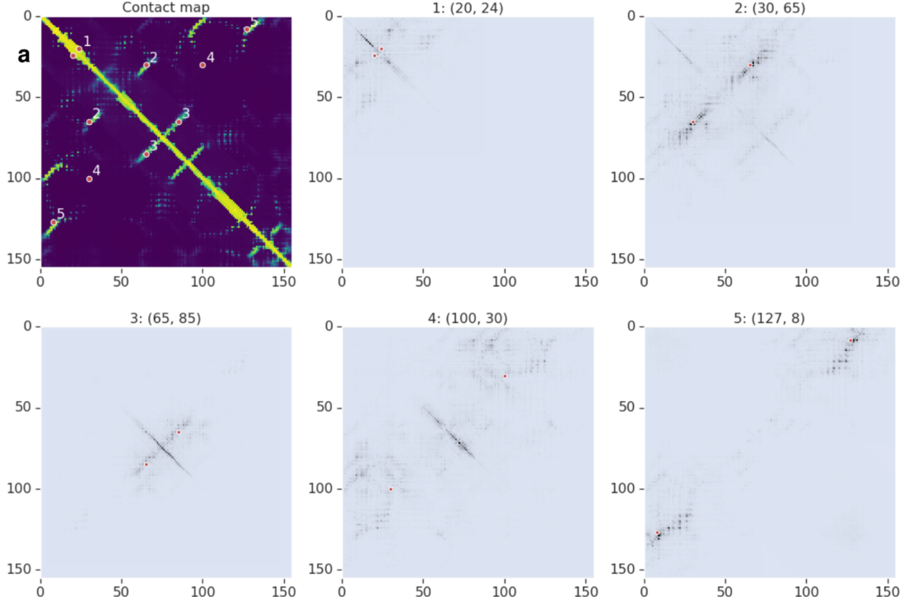

> 扩展数据图9：距离图网络属性图。T0986s2的接触概率图和关于五对不同残基(I，J)之间的预期距离的输入二维特征的积分梯度的总和绝对值$\sum_c|S^{IJ}_{i,j,c}|$：(1)螺旋自接触，(2)远程链-链接触，(3)中程链-链接触，(4)非接触和(5)极远程链-链接触。每一对都在图表上显示为两个红点。颜色越深，表示归因权重越高。

---

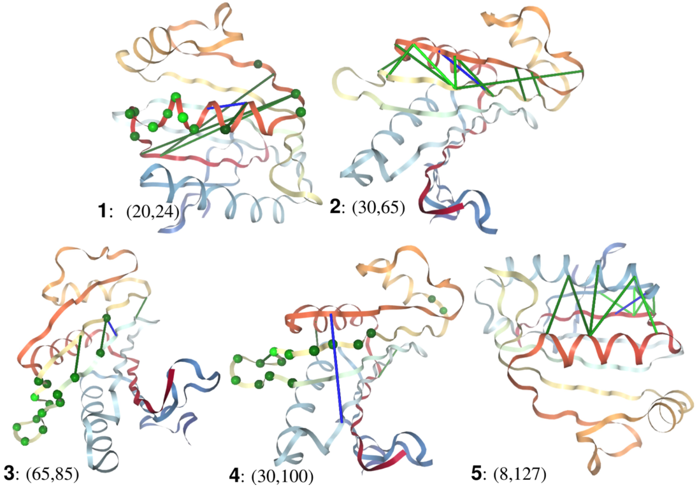

> 扩展数据图10：预测结构上显示的属性。对于T0986s2(TM得分0.8)，对于扩展数据图9中所示的五个输出对中的每一个，具有最高属性权重的前10个输入对(包括自体对)显示为按灵敏度着色的线条(或自体对的球体)，浅绿色表示更灵敏，而输出对显示为蓝色线。