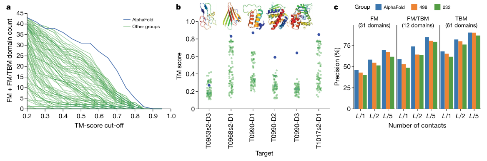
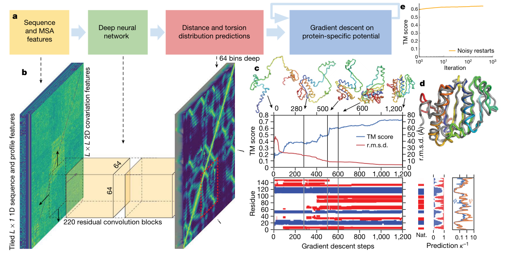
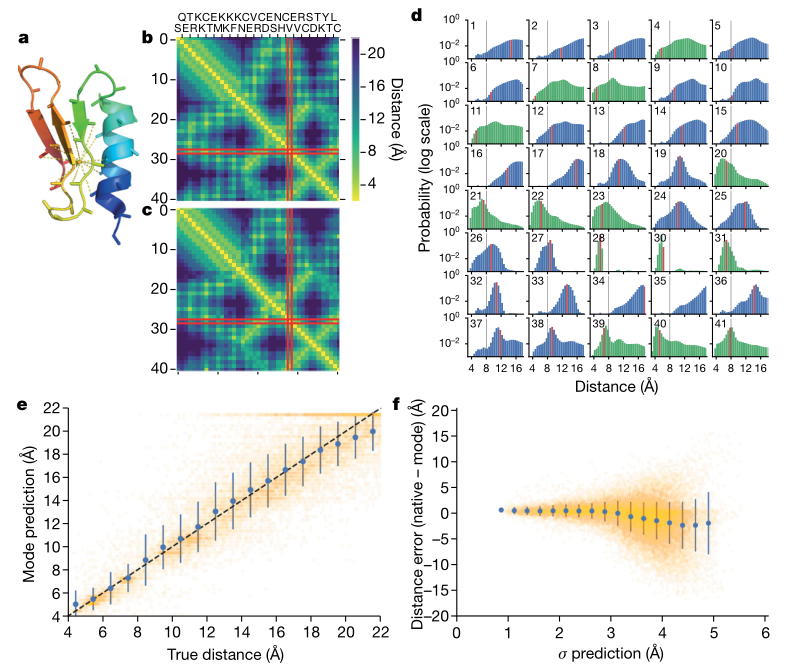
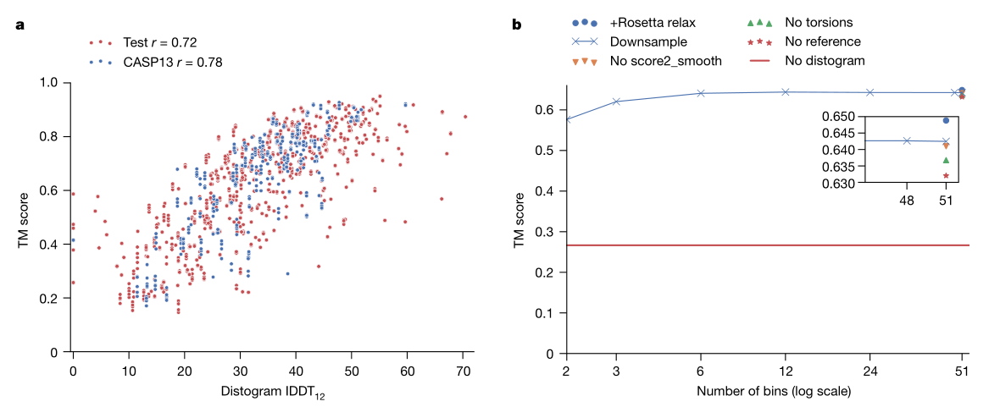

# 基于深度学习潜力的改进蛋白质结构预测

​		蛋白质结构预测可以用来根据蛋白质的氨基酸序列确定蛋白质的三维结构。这个问题至关重要，因为蛋白质的结构在很大程度上决定了它的功能；然而，蛋白质的结构很难通过实验来确定。最近，利用遗传信息取得了相当大的进展。可以通过分析同源序列中的不同来推断哪些氨基酸残基相互接触来预测蛋白质结构。本文展示了可以通过训练神经网络来准确预测残基对之间的距离，这比接触预测传达了更多关于结构的信息。利用这些信息，我们构造了一个可以准确描述蛋白质形状的平均力势能。我们发现，所产生的势能可以通过一个简单的梯度下降算法来优化，以生成结构，而不需要复杂的采样过程。由此产生的系统名为 AlphaFold，即使对于同源序列较少的序列也能实现高精度。在最近的蛋白质结构预测关键评估(CASP13)中，AlphaFold 为 43 个自由建模域中的 24 个创建了高精度结构(模板建模(template modelling, TM)得分为 0.7 或更高)，而另一种方法使用采样和联系信息，仅在 43 个域中的 14 个域实现了这种精度。AlphaFold 代表了蛋白质结构预测方面的一大进步。我们希望这种提高的准确性能够深入了解蛋白质的功能和故障，特别是在没有通过实验确定同源蛋白质结构的情况下。

---

​		蛋白质是大多数生物过程的核心。由于蛋白质的功能依赖于其结构，了解蛋白质的结构一直是几十年来生物学中的一个重大挑战。虽然已经开发了几种实验结构确定技术，并在精度上进行了改进，但它们仍然困难且耗时。因此，几十年来的理论工作一直试图从氨基酸序列预测蛋白质结构。

​		CASP 是由结构预测团体运行的两年一次的蛋白质结构盲测预测评估，以基准精度方面的进展。2018 年，AlphaFold 与来自世界各地的 97 个团体一起进行 CASP13 评估。每组都为 84 个蛋白质序列提交了最多 5 个结构预测，这些蛋白质序列的实验确定的结构被隔离了。评估者将蛋白质分为 104 个结构域进行评分，并将每个结构域归类为易于基于模板的建模(TBM，其中具有相似序列的蛋白质具有已知结构，并且根据序列差异修改同源结构)或需要自由建模(FM，在没有同源结构的情况下)，以及中间(FM/TBM)类别。图 1a 显示，AlphaFold 比任何其他系统都更准确地预测更多的 FM 域，特别是在 0.6 - 0.7 TM 分数范围内。TM 得分-范围在0 到 1 之间-衡量拟议结构的整体(主干)形状与原有结构的匹配程度。评审员根据结构的总和、上限 z 分数对 98 个参与小组进行排名，并按类别分开。AlphaFold 在 FM 类别中的总分为 52.8 分(五局三胜)，而紧随其后的组别为 36.6 分(322 分)。结合 FM 和 TBM/FM 类别，AlphaFold 得分为 68.3，而之前的得分为 48.2。AlphaFold 能够高精度地预测以前未知的折叠(图 1b)。尽管 AlphaFold 只使用 FM 技术，不使用模板，但根据评审员的公式 0 - 上限 z - 分数，AlphaFold 在 TBM 类别中也得分很高，在排名前一的模型中排名第四，在五局三胜的模型中排名第一。AlphaFold 的准确性在很大程度上要归功于距离预测的准确性，这从相应接触预测的高精度中可见一斑(图 1C 和扩展数据图 2A)。

> 图 1 | AlphaFold 在 CASP13 评估中的表现。a，对于 AlphaFold 和其他 97 个组，对于给定的 TM 分数阈值预测的 FM(FM+FM/TBM) 域的数量。对于 CASP13 评估者确定的 6 个新构型，将 AlphaFold 的 TM 评分与其他组进行比较，并与自然结构进行比较。T1017s2-d1 的结构不公开。C，CASP13 中最可能的 L、L/2 或 L/5 接触的长域接触预测精度，其中 L 是区域的长度。将 AlphaFold 在 CASP13 中使用的以接触预测为阈值的距离分布与 CASP13 中两种排名最高的接触预测方法：498(RaptorX-Contact26) 和 032(TripletRes32) 提交的关于「所有组」目标的提交进行了比较，并更新了 T0953s2 的域定义。

​		因此，最成功的 FM 方法依赖于片段组装。在这些方法中，通过随机抽样过程来创建结构，例如模拟退火法，该随机抽样过程最小化从蛋白质数据库(PDB)中的结构提取的汇总统计得出的统计势能。在片段组装中，结构假设被重复修改，通常通过改变一小段的形状同时保留降低势能的改变，最终导致低势能结构。模拟退火法需要数千次这样的移动，并且必须重复多次才能很好地覆盖低势能结构。

​		近年来，通过使用在一组相关序列中发现的进化协变数据，结构预测的准确性得到了提高。通过搜索从 DNA 测序得到并与目标序列比对的蛋白质序列的大数据集来找到与目标序列相似的序列，以产生多序列比对(MSA)。两个氨基酸残基在 MSA 序列上位置的相关变化可以用来推断哪些残基可能相互接触。接触通常被定义为当 2 个残基的 $\beta$ - 碳原子彼此之间在 $8\ \AA$ 以内时发生接触。几种方法，包括神经网络，已经被用来根据从 MSA 计算的特征来预测一对残基接触的概率。通过修改统计势以指导折叠过程到满足更多预测接触的结构中，接触预测被结合到结构预测中。其他研究使用了残基之间距离的预测，特别是距离几何方法。无协变特征的神经网络距离预测被用来使进化成对距离依赖的统计潜能被用来对结构假设进行排序。此外，夸克管线对 TBM 使用了基于模板的距离剖面约束。

​		在这项研究中，我们提出了一种深度学习方法来预测蛋白质结构，其各个阶段如图 2a 所示。我们证明，通过训练神经网络(图 2b)对给定序列的蛋白质结构做出准确预测，并通过梯度下降最小化潜力(图 2c)来准确预测结构本身，可以构建一个学习的、蛋白质特异的势能(图 2b)。神经网络预测包括主干扭转角和残基之间的成对距离。距离预测提供了比接触预测更具体的结构信息，并为神经网络提供了更丰富的训练信号。通过联合预测多个距离，网络可以传播距离信息，该距离信息遵循附近残基的协变、局部结构和残基一致性。预测的概率分布可以组合在一起，形成简单的、原则性的蛋白质特定势能。我们表明，在梯度下降的情况下，只需有限的采样就可以很容易地找到一组使这种蛋白质特有的势最小的扭转角。还表明，整个链可以同时优化，避免了像常见做法那样将长蛋白质分割成独立建模的假想区域的需要(见方法)。

​		AlphaFold 的中心组件是一个卷积神经网络，它根据 PDB 结构进行训练，以预测蛋白质残基的 $C_{\beta}$ 原子对 $ij$ 之间的距离 $d_{ij}$。根据蛋白质的氨基酸序列 $S$ 的表示和该序列的 MSA($S$) 得出的特征，该网络在结构上类似于用于图像识别任务的网络，预测 $L\times L$ 距离矩阵的任何 64×64 区域中的每个 $ij$ 对的离散概率分布 $P(d_{ij}|S,\ MSA(S))$，如图 2b 所示。通过组合覆盖整个距离图的这种预测而构建的全套距离分布预测称为距离图(来自距离直方图)。图 3c，d 中显示了对一个 CASP 蛋白质 T0955 的距离图预测示例。分布模式(图 3C)可以看到与真实距离(图 3b)非常接近。图 3d 显示了到一个残基(残基 29)的所有距离的示例分布。我们发现，对距离的预测与残基之间的真实距离有很好的相关性(图 3e)。此外，该网络还对其预测中的不确定性进行了建模(图 3f)。当 $s.d.$ 预测分布越低，预测越准确。这在图 3d 中也很明显，其中对距离分布(更高的峰值和更低的 $s.d.$)的预测更有信心。分布的距离)往往更准确，真实距离接近峰值。更广泛、更不可靠的预测分布仍然将概率分配给正确值，即使它不接近峰值。距离预测的高精度以及随后的接触预测(图 1c)来自神经网络设计及其训练、数据增强、特征表示、辅助损失、裁剪和数据精选(见方法)中的各种因素的组合。

> 图2|CASP13 目标 T0986s2 的折叠过程。CASP 靶 T0986s2，L=155，PDB：6N9V。a，结构预测的步骤。b，神经网络基于 MSA 特征预测整个 $L\times L$ 距离图，累积对 64×64 残基区域的单独预测。c，给出了一次梯度下降迭代(1,200 步)，TM得分和均方根偏差(r.m.s.d.)。根据步骤编号和结构的五个快照绘制。还显示了二级结构(来自 SST33)(蓝色螺旋，红色链)以及天然二级结构(NAT)、网络的二级结构预测概率和扭转角预测的不确定性(因为冯·米塞斯分布的 $\kappa^{-1}$ 与 $\varphi$ 和 $\psi$ 的预测相吻合)。虽然梯度下降的每一步都贪婪地降低了势能，但影响了大的全球构象变化，导致了一条紧密堆积的链。d、覆盖在原有结构上的最终第一份提交书(灰色)。e，相对于每个目标的梯度下降重复次数(对数标度)的最低势能结构的平均 TM 得分(在整个测试集上，n=377)。

​		为了生成符合距离预测的结构，我们通过对负对数概率拟合样条并对所有残数对求和来构造光滑势能 $V_{\text{distance}}$(见方法)。我们通过所有残基的主链扭转角($\varphi$，$\psi$)来参数化蛋白质结构，并建立了蛋白质几何的可微模型 $\bold{x}=G(\varphi,\ \psi)$ 来计算所有残基的 $C_{\beta}$ 坐标 ，从而计算每个结构的残基间距离 $d_{ij}=||\bold{x}_i-\bold{x}_j||$，并将 $V_{\text{distance}}$ 表示为 $\varphi$ 和 $\psi$ 的函数。对于含有 $L$ 残基的蛋白质，这个势能从边缘分布预测中累积 $L^2$ 项。为了纠正先验的过度表示，我们从对数域中的距离势中减去参考分布。参考分布对与蛋白质序列无关的距离分布 $P(d_{ij}|\text{length})$ 建模，并通过在相同结构上训练距离预测神经网络的小版本来计算，没有序列或 MSA 输入特征。对接触预测网络的单独输出头进行训练，以预测骨干扭转角 $P(\varphi_i,\psi_i|S,MSA(S))$ 的离散概率分布。在拟合了冯·米塞斯分布之后，这被用来将光滑的扭转模型项 $V_{\text{torsion}}$ 添加到势能。最后，为了防止立体碰撞，我们将 Rosetta 的 $V_{\text{score2\_smooth}}$ 分数添加到势能中，因为这包含了范德华项。我们对位势中的三项中的每一项都使用了乘法权重；然而，没有一种权重组合的表现明显优于同等权重。

​		由于组合势 $V_{\text{total}}(\varphi,\psi)$ 中的所有项都是 $(\varphi,\psi)$ 的可微函数，因此可以关于这些变量通过梯度下降来优化它。这里我们使用 L-BFGS。通过从 $P(\varphi_i,\psi|S,MSA(S))$ 中采样扭矩值来初始化结构。图 2c 说明了最小化势能的单一梯度下降轨迹，显示了这种贪婪优化过程如何导致精度的提高和大规模的构象变化。根据预测的扭角分布通过初始化来部分设置二级结构。总体精度(TM 得分)提高很快，经过几百步的梯度下降，结构的精度已经收敛到潜力的局部最优值。

​		我们重复了从采样的初始化开始的优化，产生了一个低电势结构池，从该池中进一步的结构初始化被采样，并增加了主干扭转噪声(噪声重新启动)，导致更多的结构被添加到池中。仅在几百个循环后，优化收敛，最低势能结构被选为最佳候选结构。图 2e 显示了在梯度下降过程的多次重新开始时最佳得分结构的精度的进展，表明在几次迭代之后，优化已经收敛。有噪音的重新启动使具有比继续从预测的扭转分布中采样时略高的 TM 分数的结构被发现(平均为 0.641 分，而在我们的测试集中为 0.636 分，如扩展数据图4所示)。

​		图 4a 显示，距离图的精度(使用距离图的局部距离差测试(LDDT)测量；见方法)与最终实现的结构的 TM 分数有很好的相关性。图 4b 显示了改变势的结构的效果。完全去掉距离势，TM 得分为 0.266。通过平均相邻的箱来降低距离图表示的分辨率低于六个箱会导致 TM 分数降低。去除扭转势、参考校正或 $V_{\text{score2\_smooth}}$ 只会略微降低精度。用 Rosetta 进行最后的「松弛」(侧链堆积与梯度下降交错)，使用 Talaris2014 势和我们参考校正的距离势的样条线拟合的组合，增加了侧链原子坐标，并产生了 0.007 TM 分数的小幅平均改善。

​		我们表明，精心设计的深度学习系统可以提供准确的残基间距离预测，并可以用来构建代表蛋白质结构的蛋白质特定势。此外，我们还表明，这种势可以通过梯度下降来优化，以实现准确的结构预测。

> 图3|预测距离分布与实际距离的对比。a-d，CASP 目标 T0955，L=41，PDB 5W9F。a，原生结构显示与残基 29 的 $C_\beta$ 之间的距离在 $8\ \AA$ 以下。b、c、固有残基间距离(b)和距离预测模式(v)，突出显示残基29。d，预测残基 29 到所有其他残基的距离的概率分布。与原始距离对应的面元以红色突出显示，$8\ \AA$ 以黑色绘制。真实接触点的分布用绿色表示，非接触点的分布用蓝色表示。r，f，CASP 目标 T0990，L=552，PDB 6N9V。E，预测距离与所有残基对的真实距离的模式，距离 $\le 22\ \AA$， $s.d.>3.5 \AA$(n=28,678)。数据为平均值 $\pm\ s.d.$ 。为 $1\ \AA$ 箱计算。f，模距预测相对于 $s.d.$ 的误差。距离分布，不包括原生距离 $>22\ \AA$ 的配对(n=61,872)。数据为平均值 $\pm\ s.d.$ 。显示为 $0.25\ \AA$ 个箱。T0990 的真实距离矩阵和距离图如扩展数据图2b，c所示。

​		虽然调频预测很少接近实验结构的精度，但 CASP13 的评估表明，AlphaFold 系统达到了前所未有的调频精度，这种调频方法可以在不使用模板的情况下与模板建模方法的性能相媲美，并开始达到提供生物学见解所需的精度(见方法)。我们希望我们所拥有的方法可以进一步发展和应用于蛋白质科学的所有领域，对未知结构的序列进行更准确的预测。

> 图4|TM 分数与远距离图的准确性的关系，以及TM分数对潜力的不同组成部分的依赖关系。对于CASP13 (n=500：所有领域的 5 个诱饵，不包括T0999)和TEST(n=377)数据集，TM得分与带有Pearson相关系数的距离图lDDT12的比较。
>
> B，测试集上的平均TM分数(n=377)与在对距离图进行下采样时使用的直方图箱的数量进行比较，与去除电位的不同分量或添加Rosetta松弛进行比较。