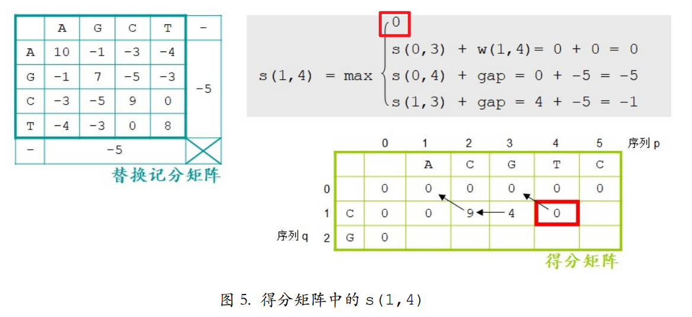
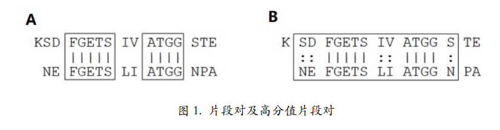

# 两序列比对

## 全局比对

长度近似的两条序列

Needleman-Wunsch 算法

根据计分矩阵，三个方向最大值，得分为右下角分数，从右下角回溯。

## 局部比对

Smith-Waterman 算法

max{三个方向分数，0} 得分为得分矩阵中的最大值 从最大值回溯到没有箭头为止

## BLAST

一种启发式算法，先找可形成无空位完全匹配的片段对

对片段对根据给定阈值延伸

+ Blastn：核酸序列搜索
+ blastp：蛋白质序列搜索
+ blastx：根据核酸序列的 6 条链搜索蛋白质（正链，1，2，3 位分别作为起点；负链 1，2，3 位）
+ tblastn：根据蛋白质的 6 条链搜索核酸序列（balstx的反过程）

## 打分矩阵

+ PAM 矩阵
  + 后面的数字表示不匹配度 范围从 1 到 250
  + 由 PAM 1 外推出来的
+ BLOSUM 矩阵
  + 后面的数字表示匹配度 范围从 100 到 0
  + BLOSUM 62 最常用
+ 对于匹配度不高的序列，使用 BLOSUM 矩阵更准确

# 多序列比对

+ 用途
  + 一个未知序列是否属于某一家族
  + 建立系统发生树
  + 模式识别
  + 已知推未知
+ 要求
  + 10 - 15 条序列比对
  + 序列之间关系不能太近 也不能太远
  + 要求是较长序列
  + 无重复域

# 分子进化与系统发生

## 分子进化

利用软件，从分子水平（DNA，RNA，蛋白质 序列）构建各种生物间的系统发生树。

+ 两个假设
  1. DNA，RNA，Pro 包含物种进化史信息
  2. 分子钟：Pro 变异速度再不同物种间已知，Pro 序列相似度反映共同祖先距离。

## 同源

来源于共同祖先的相似序列。相似不一定同源，同源一定相似。

+ 直系同源：来自不同物种，由垂直家系（物种形成）进化而来的基因
  + 一个基因进入不同物种，并且保留了与原始基因相同的功能
+ 旁系同源：在同一物种中的，来源于基因复制的基因，可能回进化出新的，与原来有关的功能。
+ 异同源：通过水平基因转移，来源于共生或病毒侵染（不来源于祖先）所产生的相似基因。
  + 水平基因转移：生物将遗传物质传递给其他生物而非子细胞