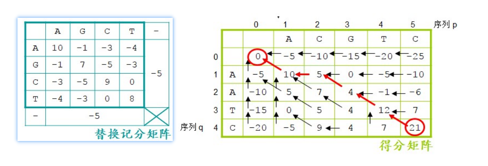
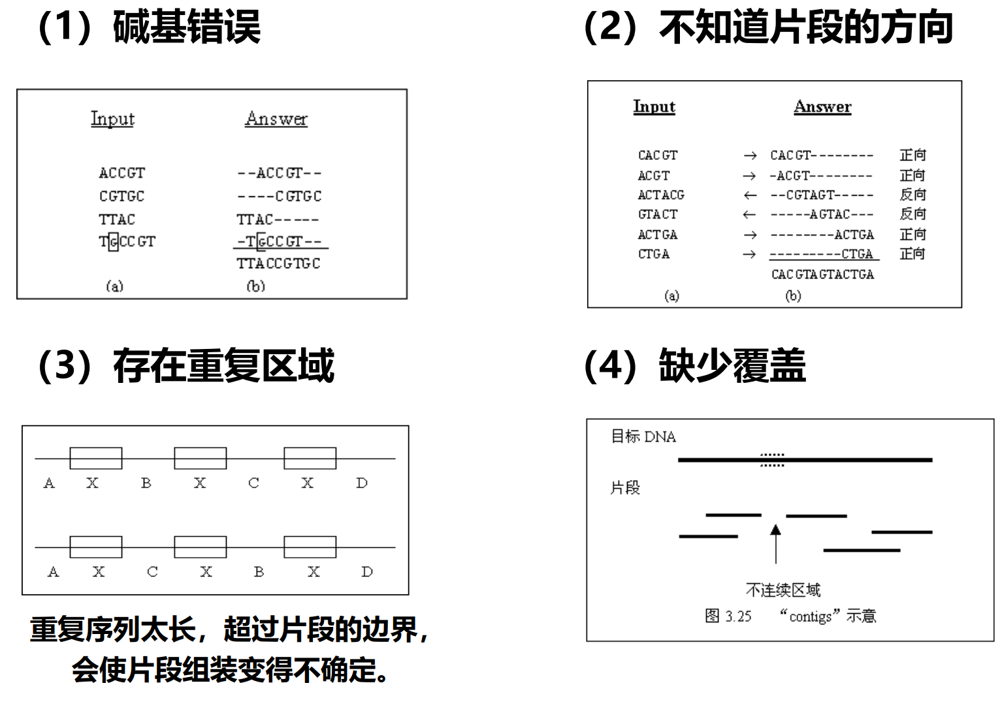

# 两序列比对

## 全局比对

长度近似的两条序列

Needleman-Wunsch 算法

根据计分矩阵，三个方向最大值，得分为右下角分数，从右下角回溯。

## 局部比对

Smith-Waterman 算法

max{三个方向分数，0} 得分为得分矩阵中的最大值 从最大值回溯到没有箭头为止

## BLAST

一种启发式算法，先找可形成无空位完全匹配的片段对

对片段对根据给定阈值延伸

+ Blastn：核酸序列搜索
+ blastp：蛋白质序列搜索
+ blastx：根据核酸序列的 6 条链搜索蛋白质（正链，1，2，3 位分别作为起点；负链 1，2，3 位）
+ tblastn：根据蛋白质的 6 条链搜索核酸序列（balstx的反过程）

## 打分矩阵

+ PAM 矩阵
  + 后面的数字表示不匹配度 范围从 1 到 250
  + 由 PAM 1 外推出来的
+ BLOSUM 矩阵
  + 后面的数字表示匹配度 范围从 100 到 0
  + BLOSUM 62 最常用
+ 对于匹配度不高的序列，使用 BLOSUM 矩阵更准确

# 多序列比对

+ 用途
  + 一个未知序列是否属于某一家族
  + 建立系统发生树
  + 模式识别
  + 已知推未知
+ 要求
  + 10 - 15 条序列比对
  + 序列之间关系不能太近 也不能太远
  + 要求是较长序列
  + 无重复域

+ 比对方法

  + SP 比对
    + 按照每个比对的列进行打分，然后加和 「两两比对」
    + 在给定的若干序列中，选择一个核心序列，通过该序列与其它序列的两两比对形成所有序列的多重比对 α，从而使得 α 在核心序列和任何一个其它序列方向的投影是最优的两两比对。

  + 星型比对
    + 选择核心序列与其他所有序列两两比对

  + 树型比对
    + 将序列赋予树的内部节点，使树的得分最大
    + 将序列赋予树的内部节点，可以计算树中每个分支的权值。权值代表对应分支连接的两个序列之间的相似性。所有权值的和就是这棵树的得分。寻找一种树的内部节点序列赋予方式，使得树的得分最大。

# 分子进化与系统发生

## 分子进化

利用软件，从分子水平（DNA，RNA，蛋白质 序列）构建各种生物间的系统发生树。

+ 两个假设
  1. DNA，RNA，Pro 包含物种进化史信息
  2. 分子钟：Pro 变异速度再不同物种间已知，Pro 序列相似度反映共同祖先距离。

## 同源

来源于共同祖先的相似序列。相似不一定同源，同源一定相似。

+ 直系同源：来自不同物种，由垂直家系（物种形成）进化而来的基因
  + 一个基因进入不同物种，并且保留了与原始基因相同的功能
+ 旁系同源：在同一物种中的，来源于基因复制的基因，可能回进化出新的，与原来有关的功能。
+ 异同源：通过水平基因转移，来源于共生或病毒侵染（不来源于祖先）所产生的相似基因。
  + 水平基因转移：生物将遗传物质传递给其他生物而非子细胞

+ 树
  + 从一个点到另一个点的路径只有一条
+ 网
  + 从一个点到另一个点的路径可以是多条

# 系统发生树 分子树

+ 作用

  + 对于一个位置的基因或蛋白质序列，确定其亲缘关系最近的物种

  + 预测一个分子功能的走势

  + 追溯基因起源

+ 步骤

  + 多序列比对
  + 选择建树方法（替代模型）
  + 建立进化树
  + 进化树评估

+ 构建方法

  + 基于距离的方法 UPGMA, neighbor joining 
    + 最快但不准确
  + 最大简约法 maximum parsimony MP
    + 少用
  + 最大似然法 maximum likelihood, ML 
    + 综合最优
  + 贝叶斯推断法 bayesian inference
    + 准确但慢

+ 进化树评估 自展法

  + 从排列的多序列从随机有放回地抽取某一列，构成相同长度的新的排列序列。
  + 重复以上过程，得到多组新的序列。
  + 对新序列进行建树，观察新树与原始树是否有差异。

## 基于距离的 UGPMA 法

计算所有序列两两间距离，再根据距离远近构建系统发生树。

距离使用双序列比对的一致度/相似度或其他简化值

# 基因组组装

## 序列拼接

+ 片段组装四个问题
  + 碱基错误
  + 不知道片段方向
  + 存在重复序列
  + 缺少覆盖
+ 序列片段组装模型 3个步骤
  + 序列片段两两比较，确定可能的片段之间重叠。
  + 确定所有片段的统一覆盖模式 （片段间的相对位置）。
  + 确定结果（目标序列）。
+ 片段组装 3种模型
  + 最短公共超串模型  给定一个字符串集合 F，求出预测最短的字符串 S，使所有属于 F 的字符串 f，S 是 f 的超串 -不允许片段的实验误差 。
    + 片段的方向已知 
    + 计算量大 近似求解
      
  + 重建模型 考虑片段误差和未知方向，不能处理重复区域，缺少覆盖问题。
  + 多重连续区模型 t-contig 一组序列片段最弱连接的交叠长度至少为 t，不同的 t 会产生不同的结果。

## 序列片段覆盖图

找到产生超串的路径

## 片段组装的一般过程

+ 对于给定的片段集合 F，首先去掉那些是子串的序列，形成新的片段集合 F'
+ 根据 F' 生成覆盖多图
+ 求权值最高的哈密顿路径，因此得到最短的公共超串
+ 最终形成组装结果

## 贪婪算法

+ 简化覆盖多图，对每一对顶点仅考虑权值最大的边， 而去掉其它的边。
+ 称经过处理后的新图为F的覆盖图，记为OG（F）。
+ 贪婪算法的核心思想就是逐步加入满足哈密顿路径条件的最大权值的边。

## 拓扑排序

# 基因组组装

+ 基因组组装流程

## 基于二代测序数据的基因组复杂度评估-kmer分析

k-mer 是指包含在一段序列中的长度为 k 的子串。

## 基因组组装质量评估

+ 组装连续性
  + N50/L50 描述组装的连续性
  + contig/scaffold 从大到小排列，累加，L50 是累加的 contig/scaffold 数目
  + 
+ 组装完整度
+ 组装准确率

# 隐马尔可夫模型

## 三个假设

+ 齐次马尔可夫假设
  + 任意时刻的状态只依赖前一时刻的状态，与其他时刻及观测值无关。
+ 参数不变性假设
  + 状态转移不随时间的变化而变化。
+ 观测（输出）独立性假设
  + 任意时刻的观测值只依赖当前时刻的状态，与其他状态及观测值无关。

## 模型参数

+ 状态集
+ 观测集
+ 转移概率矩阵
+ 输出概率矩阵
+ 初始状态分布

## 隐马模型基本问题

+ 评估问题 求观测序列概率
+ 解码问题 由观测序列 求可能性最大的状态序列
+ 学习问题 调整参数

# 基因预测

## 基本方法

+ 从头预测方法
+ 同源比对
+ 转录组数据比对和组装

# 基因定位和全基因组关联分析

+ 质量性状
  + 在一个群体内表现不连续变异的性状，相对性状间有质的差异。
+ 数量性状
  + 在一个群体内表现为连续变异的性状，相对性状间没有质的差异。