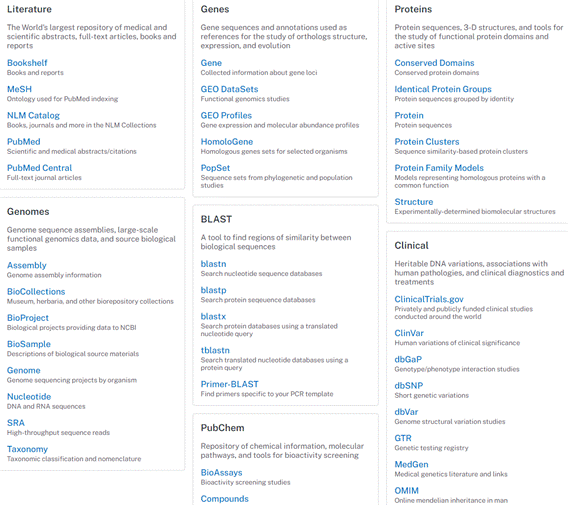

# 生物信息学

## 绪论

1. 计算生物学/生物信息学发展过程中的里程碑事件：
   1. 沃森和克里克 DNA 模型
   2. Sanger 测序胰岛素蛋白
   3. Dayhoff 的 Atlas
   4. 阿帕网(早期互联网)的诞生
   5. 序列比对算法的提出
   6. Sanger 双脱氧测序法
   7. PCR 的诞生
   8. 人类基因组计划起始
   9. 第一份人类基因组草图
   10. NGS 的提出
2. 技术决定计算生物学/生物信息学研究热点：

年代    ：  技术发展    =>  生信研究热点

①1960s-1980s：小规模测序=>序列比对、基因预测、蛋白质修饰、分子进化算法的提出

②1990s-：DNA自动化测序=>基因组组装、基因组注释算法

③1995-：基因芯片=>芯片数据分析

④2005-：新一代测序技术=>关联分析、高速序列比对、云计算

⑤2010-：多组学测序技术=>多组学整合分析

⑥2015-：单细胞测序技术=>单细胞多组学整合分析、深度学习

 

\3. 你认为生物信息学/计算生物学的下一波研究热点是什么？可能由什么技术触发？

我认为下一波研究热点可能是合成基因组时代的生物信息学研究。可能由系统与合成生物学、机器学习、深度学习、多组学分析算法等技术的成熟而触发。其中，基因线路、最小基因组等合成生物学领域已引入生物信息学方法，很有可能将是下一波研究热点。而三维基因组、单细胞基因组、翻译组等研究也涉及大量生物信息学分析。

 

\4. 人类基因组计划（HGP）：人类基因组计划是一项规模宏大、跨国跨学科的科学工程。其宗旨在于测定组成人类染色体（单倍体）中所包含的30亿个碱基对组成的核苷酸序列，从而绘制人类基因组图谱，并且辨识其载有的基因及其序列，达到破译人类遗传信息的最终目的。

（1）HGP可获得四张图：遗传图、物理图、序列图、基因图

（2）HGP的终极目标：

①获得人类基因组全部DNA序列

②识别基因

③建立这些信息的数据库

④开发相关数据分析工具

⑤研究HGP所带来的伦理、法律、社会问题

（3）John Craig Venter第一个完成人类基因组测序工作

 

\5. ENCODE project：  DNA元件百科全书计划，ENCODE的目标是定义人类基因组中所有发挥“功能”的DNA元件，并研究这些元件与蛋白和RNA之间的相互作用如何调控细胞的转录活动。

（1）不同阶段：

①第一阶段（2003－2007年）集中对人类基因组内特定的1%部分进行研究；

②第二阶段（2007－2012年）引入了基于高通量测序的技术（eg：ChIP-seq和RNA-seq），对整个人类基因组和转录组的功能进行研究；

③第三阶段（目前）已扩展导生物模型特别是小鼠之中；

④第四阶段试图通过研究更广泛的生物样本（包括与疾病有关的样本）以及采用ENCODE以前未使用的新颖测定方法，扩大人和小鼠基因组中候选调控元件的目录。

 

\6. Sanger测序（一代测序）的原理：

（1）双脱氧核糖核苷酸（ddNTP）的2‘和3’位置都不含羟基，因此ddNTP在DNA合成过程中不能形成磷酸二脂键，以中断DNA合成反应，在DNA合成反应体系中分别加入带有放射性同位素标记的ddATP，ddCTP，ddGTP，ddTTP，通过凝胶电泳和放射自显影后可根据电泳条带的位置确定待测分子的DNA序列。

（2）过程：反应混合物的制备→DNA合成反应→凝胶电泳→放射自显影

（3）局限：速度和成本方面达到极限，虽然测序读长可达 1000 bp，准确性高达99.999%，但缺点是测序成本高，通量低。

 

\7. 二代测序：

（1）共同点：将目标DNA剪切为小片段→单个小片段DNA分子结合到固相表面→单分子独立扩增→每次只复制一个碱基并检测信号→高分辨率成像系统

（2）局限：速度相比一代提高，成本明显下降，但读长比一代短的多

（3）Illumina特点（有桥式PCR扩增那个）：边合成边复制，每次只添加一个dNTP的特点能很好的解决同聚物长度的准确测量问题，但碱基的替换会造成测序错误

（4）454特点（乳液PCR的那个）：每个测序反应都在PTP板上独立的小孔中进行，大大降低相互间的干扰和测序偏差。优势在于其能获得较长的测序读长，但缺点是无法准确测量同聚物的长度，并且会有插入和缺失的测序错误。

（5）SOLiD特点（有连接酶测序的那个）：二代中准确率最高的一个，但在荧光解码阶段一旦发生错误容易产生连锁解码错误。

 

\8. 三代测序：（eg：PacBio、Nanopore）

（1）特点：单分子测序，无需进行 PCR 扩增

 

\9. 一代、二代、三代测序的区别与重点：

第一代和第二代测序技术除了通量和成本上的差异之外，其测序核心原理（除Solid是边连接边测序之外）都是基于边合成边测序的思想。第二代测序技术的优点是成本较之一代大大下降，通量大大提升，但缺点是所引入PCR过程会在一定程度上增加测序的错误率，并且具有系统偏向性，同时读长也比较短。第三代测序技术是为了解决第二代所存在的缺点而开发的，它的根本特点是单分子测序，不需要任何PCR的过程，这是为了能有效避免因PCR偏向性而导致的系统错误，同时提高读长，并要保持二代技术的高通量，低成本的优点。

 

 

第二章 生物信息学数据库

\1. 哪些数据可用于创建生物信息学数据库：

①核苷酸序列（DNA、RNA）

②蛋白质序列与结构

③序列与结构注释（基因注释、功能注释）

④代谢路径（底物、产物、酶）

⑤文献

 

\2. 常用生物信息学数据库：

（1）核苷酸数据库：

①三大核苷酸数据库：Genbank、ENA、DDBJ

②Genbank：美国NCBI的数据库，每天更新，核酸数据中包含部分蛋白质序列，源于核酸序列注释。序列默认显示GenBank flatfile格式，每条序列包含位点名（登录号，locus name）、注册号（accession number）、GI（GenInfo identifier，暂不公开）

③ENA：使用EMBL格式，与GenBank flatfile格式不同，但所包含的内容是相同的

④FASTA：最简单序列的格式

（2）基因组数据库：

①Genome：NCBI的另一个数据库，测序获得物种基因组序列、遗传图、物理图等，序列收集在GenBank

②Ensembl

③GOLD

（3）其他高通量测序相关数据库：

①BioProject：提交到NCBI的各种数据的项目描述

②BioSample：提交到NCBI的各种数据的样品描述

③SRA：NCBI存放高通量测序数据的数据库

④Assembly：NCBI各种基因组拼接的不同版本及信息

（4）SNP数据库：

dbSNP：NCBI的SNP数据库

（5）基因组结构变异数据库：

dbVar：NCBI的基因组结构变异数据库，包含基因组大片段的插入、缺失、倒位、异位等

（6）ncRNA数据库：

RNAcentral：EBI开发的ncRNA数据库，整合了Ensembl、GENCODE、LNCipedia、miRbase、Rfam等多个数据库中的ncRNA信息

（7）蛋白质数据库：

①UniProt：蛋白质序列数据库，包含UniProtKB、UniRef、UniParc。由PIR、EMBL-EBI、SIB联合创办，统一了PIR、TrEMBL、Swiss-Prot三个数据库。包含蛋白质亚细胞定位数据。

a. UniProtKB：KB表示knowledge base，UniProtKB又分为SwissProt和TrEMBL。SwissProt有详细的实验来源注释，TrEMBL是自动注释的。

b. UniRef：UniRef可以用于快速搜索蛋白质（可以理解为是UniProtKB的轻量版）。UniRef100收录非冗余的UniProt蛋白质序列；UniRef90聚类UniRef100中一致性超过90%且80%重叠的蛋白质，取最长的一条；UniRef50：聚类UniRef90中一致性超过50%且80%重叠的蛋白质，取最长的一条。

c. UniParc：存放非冗余的蛋白质序列，但没有任何注释。

②PIR：蛋白质序列数据库，包含PIR-PSD（已被统一进UniProt里）、iProClass、RIRSF

a. iProClass：与UniProtKB内容相同，但额外提供到160+数据库的链接。

b. PIRSF：提供不同层级的蛋白质家族分类，可以反映序列间的进化关系。

③iPTMnet：蛋白质翻译后修饰信息数据库

④PDB：蛋白质结构数据库，由结构生物信息学研究合作实验室RCSB维护。

⑤蛋白质结构分类数据库：

a. SCOP：对已知三维结构（PDB）的蛋白进行分类，基本是人工分类。

b. CATH：蛋白质结构分类数据库，基本是程序自动化分类。

⑥蛋白质功能域数据库：

a. PROSITE：蛋白质功能域数据库，收集了一些有生物学意义的位点和序列motif，用以快速可靠鉴别未知蛋白序列的归属。

b. Pfam：蛋白质功能域数据库，蛋白质家族数据库，是用多序列比对和隐马模型获得的数据。

c. InterPro：也是蛋白质功能域/家族/作用位点等数据库。

d. CDD：保守域数据库。

⑧蛋白质分子互作数据库：BioGRID、DIP、IntAct、STRING

（8）代谢通路数据库：KEGG（还有PlantCyc、MetaCyc database、Reactome、Pathguide......）

代谢组学数据库还包括MetaboLights、HMDB...... 

（9）文献数据库：PubMed，免费全文收集在PubMed Central。其他：NAR

 

\3. GenBank数据库提交数据：

（1） 提交直接在首页Submit=>BankIt功能网上提交，很简单，几天就能拿到注册号。

（2） 可用Sequin方法提交序列，可下载的电子表格，可自动确定CDS、ORF和查找重复序列。

（3） 修改GenBank中的序列和相关信息需要邮件联系。

 

\4. FASTA、GenBank flatfile、EMBL格式区别见上。GenBank flatfile格式包含LOCUS描述符部分、FEATURES注释部分、ORIGIN序列部分

 

\5. （1）如何获取一个物种的所有核酸序列？——Taxonomy数据库，或直接在Genbank/Nucleotide里高级检索organism搜物种

（2）如何获取一个物种所有的EST序列？——EST数据库里高级检索organism搜物种

（3）如何获取基因列表？——Gene数据库里高级检索organism搜物种

（4）如何检查基因组测序是否完成？——Genome数据库里高级检索organism搜物种

 

\6. 如何检索某单位某人某年在某期刊上发表的文章？如何自动获取文献更新？

（1）PubMed高级：affiliate：单位 author：人 date：时间 journal：期刊

（2）自动获取文献更新：create alert

 

\7.  

 

 

第三章 序列比对 & 第四章 分子进化分析

\1. 序列比对：根据特定的计分规则，通过一定的算法对两条或多条DNA或蛋白质序列进行比较，找出它们之间的最优匹配或最大相似度匹配。

（1）序列比对的根本任务：发现序列之间的相似性、辨别序列之间的差异

（2）序列比对的目的： ①通过相似序列发掘相似的结构、功能

②判别序列之间的同源性    

③推测序列之间的进化关系

④寻找遗传变异

（4） 序列比对是生信的基石。

 

\2. 双序列比对：根据特定的计分规则，通过一定的算法对两条DNA或蛋白质序列进行比较，找出它们之间的最优匹配或最大相似度匹配。

 

\3. 最优匹配（optimal alignment）：罚分最小的比对形式即为最优匹配。

 

\4. 动态规划（dynamic programming）：将一个问题，拆分成一个个子问题，直到子问题可以直接解决。然后，把子问题的答案保存起来，以减少重复计算。再根据子问题答案反推，得出原问题解的一种方法。核心思想：拆分子问题、记住过往，减少重复计算。

（1）动态规划适用范围：一个大的搜索空间可以被构造成一系列的阶段时，可以使用动态规划。

（2）双序列比对的动态规划规则：只向前计算而不向后计算，按列、行或对角线移动。

（3）动态规划的时间复杂度：O(mn)；空间复杂度：O(mn)。（填表时间复杂度是O(mn)，空间复杂度是O(m+n)）。

 

\5. 全局比对、半全局比对、局部比对：

（1）全局比对（Needleman-Wunsch算法）：对给定序列从头到尾进行比较，使尽可能多的字符在同一列中匹配的方法。适用于相似度较高且长度相近的序列。

（2）局部比对（Smith-Waterman算法）：只对给定序列中相似度最高的区域进行比对的方法。适用于在某些部分相似度较高，而其他部分差异较大的序列。

（3）半全局比对：介于全局比对和局部比对之间的比对算法。

 

\6. Needleman-Wunsch算法和Smith-Waterman算法的具体实现区别：

（1）Needleman-Wunsch算法回溯起点从最右下角的格子开始，直到最左上角的格子；Smith-Waterman算法回溯起点从矩阵的最大值开始，遇到 0 即结束回溯。

（2）Needleman-Wunsch允许值为负数，而在Smith-Waterman算法中所有负数都记为0。

 

\7. 打分矩阵的构建及其异同：

I. 对于DNA来说的替换矩阵就比较简单（match/mismatch/gap...）；

（1）这里涉及到一个constant gap penalties和affine gap penalties的概念区别。

这两个概念都不是我们练习过的gap罚分，它们都是针对连续gap的额外罚分。constant gap penalties就是扣了每个gap的分还要再额外扣，但是affine gap penalties就是扣了额外分就不扣原来每个gap的负分了，每个gap原来的罚分都记0。

（2）替换矩阵构建方式介绍了PAM方式（percent accepted mutation，不是PAM矩阵！）或转换与颠换相区分的方式。

PAM方式碱基突变为其他3种碱基的概率是相同的，而转换、颠换相区分的方式是会让这种概率不相同的。

 

II. 对于蛋白来说的替换矩阵主要分为PAM矩阵（Dayhoff矩阵）和BLOSUM矩阵：

（1）PAM矩阵：1 PAM相当于所有AA平均有1%发生了变化，Dayhoff基于1500多条数据构建了PAM1矩阵，并将PAM过程迭代了250次再取了个对数（从原理上，大于100个PAM的进化距离被证明可能区分进化关系较远的同源蛋白序列。)。

->①PAM矩阵如果PAM1有偏差，那么PAM250将偏差非常大。

②PAM250矩阵是早期应用较广的矩阵。

（2）BLOSUM矩阵：Henikoff直接基于多序列比对分析亲缘关系较远的蛋白质，而不是用近缘的序列。

->①BLOSUM矩阵的优点在于符合实际的观测结果，缺点在于不与进化挂钩。

 ②BLOSUM62表示用于构建矩阵的模块序列数据中，序列片段的各连配点上至少62%是相同的。目前而言BLOSUM62矩阵使用很广泛，且比PAM250要好。

 ③矩阵后的数字越大，则表示关系越近。

 

\8. 启发式算法（heuristic algorithm）：启发式算法是相对于最优化算法提出的。一个问题的最优算法求得该问题每个实例的最优解。启发式算法可以这样定义：一个基于直观或经验构造的算法，在可接受的花费（指计算时间和空间）下给出待解决组合优化问题每一个实例的一个可行解，该可行解与最优解的偏离程度一般不能被预计。现阶段，启发式算法以仿自然体算法为主，主要有蚁群算法、模拟退火法、神经网络等。

（1）PS.需求：由于数据库检索是一对多的，精确比对的计算方式计算量太大了，达到O(n^2)，因此需要开发新的算法降低计算量，由此生信领域开发了启发式算法。

（2）启发式算法包含FASTA/FASTP和BLAST，现在FASTP似乎都已经被淘汰了。

 

\9. Blast算法基本流程原理：

①从查询序列A中寻找得分大于阈值T的单词，构建单词哈希列表。

②扫描数据库中的序列B，找到hits（hits：比对后得分大于T的单词）。

③扩展hits，找到最大得分匹配项。

 

\10. HSP（high-scoring segment pair）：高比值片段对。具有一定长度的片段对根据给定的相似性阈值延伸，得到一定长度的相似性片段，称高分值片段对。

 

\11. LCR（low-complexity region）：低复杂度区域。BLAST搜索的过滤选项。指序列中包含的重复度高的区域，如poly（A）。

 

\12. E-value计算公式（Karlin-Altschul公式）：E=K·s·t·e^(-λS)，其中K和λ与数据库及算法有关，是常量；s表示查询序列的长度，t表示整个数据库的长度（s·t即表示搜索空间的大小），S为BLAST返回查询序列和数据库序列HSP的得分阈值。

（1）所以，E-value与序列长度s、数据库长度t和阈值S都有关系。E-value随S升高而下降,E趋近于0时比对随机发生的可能性趋近于0。

（2）E值的意义：S值表示两序列的同源性，分值越高表明它们之间相似的程度越大；而E值是S值可靠性的评价，它表明在随机的情况下，其它序列与目标序列相似度要大于S值的可能性。所以它的分值越低越好。

（3）E值的适用范围：由于目标序列太短或随机性较低时，E值会虚高（不懂，可能跟E的原始算法有关），所以E值作为比对统计学显著性指标时，适用于有一定长度与复杂度的序列。

（4）E值经验判断：E-value<10^(-5)，可以认为两个序列确实具有较高的同源性；如果甚至<10^(-6)，则基本不用再做更多确认。

（5）其实比对的统计学显著性计算不一定非要用E值，还可以算两条序列随机打乱后若干次后跑同样的程序得出的x的分布，用z-value = (x-μ)/σ判断显著性。而且从经验上讲，a. 两条序列相同率<15%，则不可能相关；b. 两条序列长度>100，且相同率>25%，则经验上认为多半是相关的。

 

\13. Blastn、Blastp、Blastx、TBlastn、TBlastx的用途与优缺点：

（1）Blastn：用于核酸序列在核酸数据库中的检索，适合寻找分值较高的匹配，不适合远缘关系。

（2）Blastp：用于蛋白序列在蛋白数据库中的检索，有可能找到具有远缘进化关系的匹配序列。

（3）Blastx：用于核酸序列（自动翻译为蛋白质之后）在蛋白数据库中的检索，适用于新DNA序列和EST序列（个人理解：EST就是cDNA的碎片）。

（4）TBlastn：用于蛋白质序列在核酸数据库（自动翻译为蛋白质）中的检索，适用于寻找数据库中尚未标注的编码区。

（5）TBlastx：用于核酸序列（自动翻译为蛋白质之后）在核酸数据库（自动翻译为蛋白质）中的检索，适用于分析EST序列。

 

\14. MegaBlast、Discontiguous megaBlast、PSI-Blast、PHI-Blast的特点：

I. 核酸-核酸比对：

（1）MegaBlast：可以快速地比较相似性较高（通常是95%以上）的序列，通常用于同一物种之间的比较；

（2）Discontiguous megaBlast：可以运用在相似性较低的序列比对上，通常可以是不同物种间，灵敏度和精确度相较于MegaBlast更高；（Megablast、Discontiguous megaBlast、Blastn里面Blastn比对精确度最高，速度最慢）

II. 蛋白-蛋白比对：

（1）PSI-Blast：位点特异性迭代Blast（PSI表示Position-Specific Iterated），是更加灵敏的Blastp程序，对于发现远缘物种的相似蛋白或某个蛋白家族的新成员非常有效。PSI-BLAST的特色是每次用profile搜索数据库后再利用搜索的结果重新构建profile，然后用新的profile再次搜索数据库，如此反复直至没有新的结果产生为止；

（2）PHI-Blast：模式发现迭代Blast，可以在搜索的时候限定蛋白质的模式（pattern），只给出包含此模式的比对结果。

 

\15. PSSM：Position-Specific Scoring Matrix，位点特异性计分矩阵。在蛋白质数据库中循环搜索查询蛋白质，所有前一次被psi-blast发现的统计显著蛋白质序列将整合成新记分矩阵（PSSM），通过多次迭代比对，直到不再发现统计显著的新蛋白质。

 

\16. sequence profile：蛋白质序列谱

 

\17. 一致性（identity）、相似性（similarity）、同源性（homology）：

（1）identity与similarity是定量指标，用来衡量序列之间的相似程度，而homology是定性指标，要么有要么无，不存在具体占比。通常具有homology的序列identity、similarity也较高。

（2）一致性指的是序列比对之后，相同的氨基酸的数量占序列总长度的百分比。

（3）相似性指的是序列比对之后，相同的氨基酸和相似的氨基酸的总数占序列总长度的百分比。

（4）一般情况下，会更多的考虑序列一致性的指标，因为不同的算法对相似氨基酸的定义不同。

 

\18. 多序列比对（MSA，Multiple sequence alignment）：根据特定的计分规则，通过一定的算法对多条DNA或蛋白质序列进行比较，找出它们之间的最优匹配或最大相似度匹配。

（1）原理：SP-比对、树型比对、星型比对

（2）用途（目的）： ①发现多个序列的共性

②发现与结构和功能相关的保守序列片段

 

\19. 用动态规划做多序列比对为什么运算量巨大？

答：计算量正比于节点数，而节点数等于各序列长度的乘积，每个结点依赖前驱节点，前驱节点个数等于$2^{k-1}$，所以时间复杂度为O($2^{k}·N^{k}$)。

 

\20. 常用多序列比对软件：MUSCLE、CLUSTAL

 

\21. 系统发生分析的应用领域：

①用系统学和分类学描述物种之间的关系(生命之树上物种之间的关系)；

②研究人类起源；

③研究一个基因家族中类似物之间的关系；

④病原体的进化和流行病学动态；

⑤体细胞在分化和癌症发展过程中的系谱关系；

⑥语言的进化

 

\22. 系统发生树的构建流程：

①多序列比对（自动/人工）；

②选择建树方法（替代模型）（距离法<距离法又包括UPGMA/邻近法/最小进化法>/最大似然法/最大简约法/贝叶斯法...）；

③建立进化树；

④进化树评估（bootstrap、likelihood ratio test）。

 

\23. 三种多序列比对的主要流派：

（1）SP（Sum of Pairs）比对：按照每个对比的列进行打分，然后加和。

（2）星型比对：选择一个核心序列，通过该序列与其他序列两两比对形成所有序列的多重比对α，从而使α中核心序列和任何一个其他序列方向的投影是最优的两两比对。

（3）树型比对：将序列当成树的节点，用树的每个分支的权值表示两个序列之间的相似性，寻找使树的总分最大的节点排列方式。

（星型比对和树型比对都是渐近法）

 

\24. 多序列比对的优化计算算法：（启发式算法，相比的对象是动态规划算法）

①渐近法：Clustal、T-Coffee、MUSCLE

②迭代法：PRRP、DIALIGN

③其他算法：MAFFT、profile HMM、partial order algorithm

 

\25. Clustal、MUSCLE、MAFFT比对算法的流程原理：

（1）Clustal算法： ①计算序列两两间的相似性分数；    

②UPGMA聚类建树分析；

③将距离最近的2个序列比对并进行gap的调整使其达到最优的匹配状态，重复进行③直到所有序列都这样搞完。

（2）MUSCLE算法： ①对序列们进行k-mer计算得到k-mer距离矩阵，UPGMA建树，多                  序列比对；

②构建Kimura距离矩阵，再UPGMA建树，多序列比对；

③删除②得到的树的一个边得到两棵子树，计算子树profile，多序列 比对并计算SP得分，如果SP分更高就保留。重复进行③直到所有    边都被删过一次。

（3）MAFFT算法：技术亮点：①利用快速傅里叶变换(FFT)快速识别同源区域；

②提出了一种简化的评分系统，计算速度非常快，且渐近法和迭代法都有在算法中使用到。

\26. 直系同源、旁系同源、内旁系同源、外旁系同源：

（1）直系同源（orthologs）：物种形成过程中源自同一祖先的序列，通常功能保守；

（2）旁系同源（paralogs）：基因组内基因复制产生的同源序列，较易发生功能分化；

（3）内旁系同源（inparalogs）：在物种分化之后产生的旁系同源基因；

（4）外旁系同源（outparalogs）：在物种分化之前产生的旁系同源基因。

 

\27. 系统发生树中的一些概念：

（1）树根（root）：所有分支的祖先节点，最早的祖先序列。

（2）分支（branch）：指两种及以上的生物或序列组成的进化关系。

（3）内部节点（HTU，Hypothetical Taxonomic Unit）：假设分类单位，认为是该分支可能的祖先。

（4）末端节点（OTU，Operational/Observed Taxonomic Unit）：观察到的分类单位，可以是物种、群体、蛋白质、DNA、RNA......（反正题目给的序列都是OTU，HTU应该不是真实存在于题干的应该）。

（5）进化支（clade）：是系统发生树中的概念，是一群生物，包括祖先和所有祖先的后裔。

（6）Newick格式：eg：((A,(B,C)),(D,E))。

 

\28. 系统发生树的类型：

（1）分支树（Cladogram）：分支长度没有意义。

（2）进化树（Phylogram）：分支长度表示遗传变化，两个物种之间的距离是连接它们的所有分支的长度之和。

（3）时间度量树（Ultrametric tree）：分支长度表示时间。

 

\29. 如何获得树根： ①通过outgroup定位root（有根树）

  ②通过中点或距离获得root（看上去像是无根树）

 

\30. 构建系统发生树的方法：最大简约法、距离法、最大似然法、贝叶斯法。

（1）最大简约法（Maximum parsimony，MP）：基于“生物序列总是采用最经济的方法完成进化”的假设，找出所需替代数最小的那个拓扑结构作为最优树，最小化总距离。

（2）距离法（Distance）：推导得出分类群之间的进化距离，构建进化距离矩阵，进化树再根据矩阵构建，使最近邻之间的距离最小。这个建树的方法又常分为UPGMA、邻近法和最小进化法三种方法。

①UPGMA（非加权组平均法）：各物种到它们的内部节点HTU距离取的是算术平均。

②邻近法（NJ法）：与UPGMA类似，NJ法确定距离最近的成对单位使系统树的总距离达到最小，但确定距离的方法不一样。NJ法循环地将相邻点合并成新的点，直到建立完整的系统发生树。

③最小进化法：将观察到的距离相对于基于进化树的距离的偏差的平方最小化。该方法先根据到外层节点的距离固定进化树内部节点的位置，然后根据这些观察点之间的最小计算误差，对内部的树枝长度进行优化。

④Fitch–Margoliash法。

（3）最大似然法（Maximum likelihood，ML）：其原理为选取一个特定的替代模型来分析给定的一组序列数据，使得获得的每一个拓扑结构的似然率都为最大值，然后再挑出其中似然率最大的拓扑结构作为最优树。（计算：给定模型理论T，观测到数据D的概率是多少）

（4）贝叶斯法（BI）：计算：给定数据D，模型理论T是正确的概率是多少。相比于ML法，优点在于：①速度快，②不需要bootstrapping。

（5）我们一般不怎么带BI法玩（但其实BI法准确性应该是最高的），通常比较Dis法、MP法、ML法：

①速度上，Dis法非常快，MP法比较慢，ML法慢的一批；

②各个算法的缺点：

a. Dis法容易陷入局部最优

b. MP法是当进化迅速时，MP法的假设就失败了

c. ML法是高度依赖于既定的假设进化模型（替代模型）

③适用范围上：

a. Dis法适合用于生成试探性的树

b. MP法是近缘序列的最佳选择(<30个类群，同型罕见时)

c. ML法适用于超小型数据集，或用于测试其他方法建立的树

 

\31. 评估系统发生树的可靠性——Bootstrapping method自展法：一种统计技术，它对数据进行密集的随机重抽样，以估计其潜在分布未知的统计量。

（1）流程：

①从排列的多序列中随机有放回的抽取某一列，构成相同长度的新的排列序列；

②重复上面的过程，得到多组新的序列；

③对这些新的序列进行建树，再观察这些树与原始树是否有差异，以此评价建树的可靠性。

（2）Bootstrapping其实并没有真正评估树的准确性，只是指出了数据的一致性。

（3）对于MP法和Dis法，就比较适合用Bootstrapping。不过对ML法而言，自展法太耗时，可用aLRT法检验进化树的可靠性。

 

\32. 基因组比对的主要应用：

（1）全基因组比对： ①同线性分析

②多态性检测

③序列图的构建

（2）多基因组比对： ①同线性分析

②多态性检测

③识别保守序列（eg：功能元件的注释）

 

\33. MUMmer比对：是一种全基因组比对方法

（1）流程原理： ①使用后缀树（suffix tree）发现MUMs

②用size、gap、distance等参数聚类MUMs

③用调整后的Smith-Waterman算法延伸聚类

 

\34. 多基因组比对的常用工具：ProgressiveMauve、ProgressiveCactus

 

\35. 重测序分析：对已知基因组序列的物种进行DNA测序，并在此基础上完成个体或群体基因组层面上的分析。

->主要内容：①序列比对

②构建遗传变异图谱

③研究群体遗传结构、种群历史或物种进化

④构建泛基因组

⑤全基因组关联分析，挖掘重要性状

......

 

\36. 短序列比对和长序列比对：

（1）短序列比对：将大量二代测序的短片段序列（>10^6）比对到参考基因组(通常一个)

（2）长序列比对：将大量三代测序的长片段序列比对到参考基因组(通常一个)

 

\37. 短序列比对软件和长序列比对软件：

（1）短序列比对软件：BWA、Bowtie：采用压缩索引技术对参考基因组进行压缩，直接在不解压缩的情况下进行比对，大大减少内存、时间消耗。

->基于BWT算法：将原来的文本转换为一个相似的文本，转换后使得相同的字符位置连续或者相邻，之后可以使用其他技术进行文本压缩。

（2）长序列比对软件：Minimap2、NLGMR

 

\38. 常用遗传变异识别工具：SAMtools、GATK

 

\39. 基因组复杂度的主要评估指标：

①基因组大小

②重复序列比例

③基因组杂合度

④染色体型和倍性

 

\40. 基于kmer分析评估基因组大小的方法：

①对于大小为G的基因组, 测序获得合计N条读段（read），读段读长为L。假设基因组对K-mer是特异的，可以得到G个不同的K-mer。则可知K-mer总数：K_num=(L−K+1) ∗N；

②单条读段测序覆盖某个K-mer的概率为（L-K+1）/G。因为该概率很小，总的测序读段条数（N）很多，每个K-mer的覆盖深度服从泊松分布。通过统计K-mer分布可知K-mer的期望测序深度：K_depth=[(L−K+1)]/G]∗N；

③则基于测序结果，假设获得了一个基因组的所有K-mer，基因组大小（G）可以根据如下公式估计：G=K_num/K_depth。

 

\41. 组装质量评估方法：

（1）组装连续性：N50、L50

（2）组装完整度：读端回帖Reads remapping、LAI指数、BUSCO、CEGMA、K-mer

（3）组装正确率：读段回帖Reads remapping、K-mer

 

\42. Contig N50/L50、Scaffold N50/L50：

Contig/Scaffold N50/L50 将组装获得的contig/scaffold 序列按长度从大到小排序，依次累加，当长度超过50%的contig/scaffold总长度时，对应的那个contig/scaffold的长度即为N50值，此时被累加的contig/scaffold数目即为L50值。

Contig/Scaffold N90/L90也是类似定义。

 

\43. 序列组装过程的主要步骤：

①测序&评估基因组复杂度；

②从头组装，得到contig序列；

③连接contig，得到scaffold序列；

④scaffold序列锚定到染色体序列。

 

\44. 最短公共超串模型（Shortest Common Superstring）：给定一个字符串数组 words ，找到以 words 中每个字符串作为子字符串的最短字符串。

 

\45. 图的一些概念：

（1）入度（indegree）：图的节点指向它的边的总数

（2）出度（outdegree）：图的节点指向它的边的总数

（3）欧拉通路/回路（Eulererian walk/cycle）：通过每条边有且仅有一次的通路/回路

（4）哈密顿通路/回路（Hamiltonian walk/cycle）：经过每个点有且仅有一次的通路/回路

 

\46. de Bruijn graph原理：把“碎片”reads打断成长度为k的核酸片段（kmer）后，利用De Bruijn graph根据kmer间重复的部分构建graph，得到最优化路径从而拼接contig。

->步骤：①测序

②构建kmer哈希列表

③简化线性草图

④错误移除

 

\47. SOAPdenovo组装流程原理： ①构建测序文库

②序列k-mer化，构建de Brujin图

③简化de Brujin图

④确定断点并输出contig

⑤构建Scaffold

⑥填充Gap

 

\48. Overlap-Layout-Consensus组装流程原理：①找出序列间的重叠区域（Overlap）

②基于重叠区域，拼接出序列片段（Layout）

③基于序列片段关系进行连接，经错误纠正，    获得最终序列（Consensus）

 

\49. 基于三代长片段测序数据的从头组装流程：①比对测序原始读段（所有对所有）

②纠正原始读段错误

③组装纠正后的读段（e.g.: OLC）

④纠正组装后的contig序列

 

\50. MinHash算法原理（Canu组装原理）：①设定kmer，列出序列中所有的kmer。

②通过多个哈希函数，将kmer转化为整数。每个哈希函数转换过后，整数值最小的kmer，即为该哈希函数下的min-mer。

③记录每个哈希函数转换后最小的整数值（sketch），比较任意两条序列的sketch，估算两者的Jaccard 相似性（通过比较sketch 的共有部分）。

④如果存在一定的相似性（需设定一个阈值），定位共有的kmer到原始序列，确定原始两条序列的重叠部分。

 

 

\51. PacBio HiFi数据的组装软件：Hifiasm、Hicanu、Flye、Falcon、Peregrine、LJA、mdBG、MBG（感觉应该不用背这么多...）

 

\52. 基于双末端测序（paired-end/mater-pair）数据的scaffolding：可以用SOAPdenovo。

 

\53. 求解欧拉路径和哈密顿路径的算法：弗勒里算法(Fleury's algorithm) 、Hierholzer算法（仅了解）

 

 

第五章 隐马尔可夫模型和基因组注释

\1. 马尔可夫过程和马尔可夫链：

（1）马尔可夫过程：如果一个过程的“将来”仅依赖“现在”而不依赖“过去”，则此过程具有马尔可夫性。

（2）时间和状态都离散的马尔科夫过程称为马尔科夫链。

 

\2. 隐马尔可夫模型：HMM，在马尔科夫模型的基础上，增加未知参数（隐藏状态）。

 

\3. 隐马尔可夫模型的五大参数：

①状态的有限集合

②观察值的有限集合

③转移概率

④输出概率

⑤初始状态分布

 

\4. 隐马尔可夫模型的三个基本问题： 

①评估问题：对于给定模型，求某个观察值序列的概率p(σ|λ) ；

②解码问题：对于给定模型和观察值序列，求可能性最大的状态序列；

③学习问题：对于给定的一个观察值序列，调整参数λ，使得观察值出现的概率p(σ|λ)最大。

 

\5. 向前算法（Forward algorithm）：可用于解决评估问题，即在给定的模型下，求某个观察值序列的概率。

 

\6. 维特比（Viterbi）算法：可用于解决解码问题，即在给定模型和观察值序列的情况下，求出可能性最大的状态序列。

 

\7. 向前向后算法、EM算法：向前向后算法是EM算法在隐马模型中的应用，可用于解决学习问题，即在给定的观察值序列下，求得使观察值出现概率最大的参数。

\8. 隐马模型可用于基因型纠正。

 

\9. 隐马模型在基因预测方面的应用：eg:Genscan

 

\10. 原核生物和真核生物基因组的特点及异同：

①大小上，真核基因组远大于原核

②真核的基因组在细胞核中，原核的基因组在拟核和质粒中

③真核具有多个复制起点，而原核则不是

④真核基因组中非编码区远多于编码区，而原核编码序列占基因组总长度90%

⑤真核基因组存在大量重复，原核基因组存在一定数量的重叠基因

⑥原核生物的基因组常为非对称分布，具有GCskew、ATskew、基因方向性偏好、密码子使用偏好

 

\11. 现有原核基因预测系统的问题：

①重叠基因对编码能力的判断造成影响

②短序列无法正确识别（算法对于短序列的精度会下降，且短序列之间重叠会更严重）

③翻译起始位点的预测问题（现有算法精度不高且验证算法精度的可靠数据缺乏）

 

\12. 基因预测的基本原理：

①序列相似性搜索：将基因组DNA序列在6个阅读框中进行翻译并于蛋白质数据库中的序列进行比较分析（Blastx）、对EST/TSA数据库中同一生物的cDNA序列进行比较分析（Blastn），由此确定基因数目与对应的ORF

②根据模式序列预测基因

 

\13. 基因组注释流程/基因预测流程：

（1）原核生物：

①种子ORFs的选取

②建立模型和训练Fisher

③对所有ORFs进行判别

④检查重叠ORFs

⑤确定起始位点

（2）真核生物：

①位点预测

②外显子识别

③组装最优基因结构

 

\14. 常用的基因预测软件：AUGUSTUS、Genscan、Gene Finding、GeneMark

 

\15. 基因精细结构分析：

①分析转录起始位点：Promoter2.0、PromID

②分析转录因子结合位点：JASPAR、PlantPAN、PROSCAN

③ncRNA基因预测：多种RNA结构预测及基因鉴别软件（缺点是假阳性太高）

④miRNA靶基因预测：miRDB、miRecords、TargetRNA2、WMD3

④基因组浏览器：UCSC Genome Browser（各种动物的基因组注释数据）、Ensembl Genome Browser（各种动植物的基因组注释数据）。

 

 

第六章 基因定位和全基因组关联分析

\1. 遗传学基本概念回顾：

（1）数量性状：在一个群体内表现为连续变异的性状，相对性状间没有质的差异。

（2）分子标记：是以个体间遗传物质核苷酸序列变异为基础的遗传标记（包含以Southern杂交为核心的一代分子标记、以PCR为核心的二代分子标记、以SNP为核心的三代分子标记）。

（3）遗传率：遗传变异在总变异中所占的比值，反映了通过表型预测基因型的可靠程度。

（4）连锁作图：根据基因间的重组值确定基因在染色体上的相对位置的过程。

（5）多基因假说：数量性状是许多彼此独立的基因作用的结果，每个基因对性状表现的效果较微，但其遗传方式仍然服从孟德尔遗传规律。

（6）重组率的概念、计算方法：重组型的配子百分数称为重组率。

（7）遗传图：某一物种的染色体图谱，显示所知的基因或遗传标记的相对位置。（8）物理图：DNA中一些可识别的界标在DNA上的物理位置。

（8）图距单位及其意义：遗传图距即标记间的距离，单位为cM。1 cM表示两个基因间的重组率为1%。

 

\2. QTL：数量性状位点，代表染色体上影响数量性状的某个区段，区段内可能会有一个甚至多个基因。

（1）QTL的定位目的：定位影响数量性状的功能基因

（2）QTL的定位基本原理：当标记与控制特定性状基因连锁时，不同标记基因型的表型值存在显著差异，通过分析表型与标记间的相关性，就可以确定控制数量性状的基因在染色体上的位置及效应。QTL本质上的原理就是利用功能基因与分子标记间的连锁与重组。

（3）QTL定位基本步骤：①分离世代群体建立，②遗传标记检测，③表型测定，④统计分析，⑤候选基因鉴定。

（4）QTL定位的常用统计方法：①单标记分析：方差分析（F检验）、t检验、线性回归

 ②区间作图法（Interval mapping，IM）：在线性模型的   基础上，利用最大似然法对相邻标记构成的区间内任意一点  可能存在的QTL进行似然比检验，进而获得其效应的极大   似然估计

 ③复合区间作图法（composite Interval mapping，CIM）：

使用逐步回归，将其他与表型关联的QTL作为协变量控制 背景遗传效应

 

\3. LOD值：概率值的对数。LOD值和p-value的概念略有不同，p-value是这个位点不存在QTL的概率，而LOD=log10（L1/L0），其中L1是这个位点有QTL的概率，L0是这个位点无QTL的概率。如果LOD=3，则意味着这个位点有QLT的概率是无QTL的概率的1000倍。

 

\4. LOD阈值的确定（LOD置信区间）：QTL的LOD值会形成一个信号峰，功能基因理论上就位与信号最强的峰尖附近，通常LOD值的阈值可以选择2-LOD置信区间（对应99.8%的置信区间，即功能基因有99.8%的概率落于这个区域内）。人工给定的阈值2~3都可以。

->或者比较科学的方法：使用permutation test确定显著性阈值：随机打乱表型和基因型的对应关系并记录区间中最大的LOD值，重复1000次得到在表型和基因型不关联的情况下的LOD值的分布，在这个随机模型里再取LOD值的前5%或1%作为显著性的阈值。

 

\5. GWAS：全基因组关联分析是应用基因组中数以百万计的SNP作为分子遗传标记，进行全基因组水平上的对照分析或相关性分析，通过比较发现影响复杂性状的基因变异的一种分析方法。（如果SNP变化与表型变化高度相关，则认为该位点可能会影响表型）

（1）优点： ①标记密度高，理论上可获得群体中所有的变异，并能利用历史上的重组，因             而具有较高的定位精度。

②具有丰富的变异，与人工构建的群体变异来源于两个或少数几个亲本相比，     自然群体中的变异来自与几百上千乃至数十万的个体。

③快速简便，无需构建群体耗时耗力的过程。

（2）缺点： ①标记数目多达几百至几千万，运算量较大。

②较复杂的遗传背景，易造成较高的假阳性和假阴性。

③不同频率的变异检出效率不同，只能检出常见变异。

 

\6. 连锁不平衡（LD）：是指分属两个或两个以上基因座位的等位基因同时出现的几率，高于随机出现的频率（不一定物理上接近，不同染色体上的位点由于遗传漂变等可产生连锁不平衡）

->LD会造成什么问题：   【有点不明白】

 

\7. 群体结构：群体结构是在一个群体中，基因在染色体上的分布情况，以及基因频率和基因型频率的维持和变化。

-> 群体结构的影响： ①由于变异之间存在LD，GWAS才能只检测一部分变异就定位                      基因。

②由于距离很远的变异之间也可能LD,GWAS的显著位点有不少 假  阳性。

 

\8. 混合线性模型：混合线性模型是一种方差分量模型，它既含有固定效应，又含有随机效应。考虑了群体结构的模型就是一般线性模型（GLM），既考虑了群体结构又考虑了Kinship矩阵的模型就是混合线性模型（MLM）。

->为什么GWAS要使用混合线性模型？——因为使用MLM（LMM）可以有效校正群体结构和群体内复杂的亲缘关系。

 

 

\9. 亲缘关系（Kinship）矩阵：用来校正群体内复杂的亲缘关系。使用Kinship可以求得一个加性遗传效应值并以此作为随机效应。

 

\10. 哪些因素决定了GWAS和QTL定位的精度？

①重组事件的数目是最根本的因素：所以标记数目、群体大小、群体结构、群体类型都会有所影响；

②表型的遗传率和测量误差也会有所影响；

③模型的选择也会影响；

④位点之间是否存在复杂的互作也会有所影响。

\11. 曼哈顿图和QQ图：

（1）曼哈顿图是一种散点图，通常用于显示具有大量数据点，许多非零振幅和更高振幅的数据。常用于GWAS分析。

（2）QQ图是一个概率图，用图形的方式比较两个概率分布，把他们的两个分位数放在一块比较，主要用于检验数据分布的相似性。

（3）曼哈顿图用基因所在染色体号作为x，-log10(P)作为y；QQ图用期望-log10(P)作为x，观测-log10(P)作为y。

 

\12. Imputation缺失基因型填补原理：基于家系样本中的遗传特性。具有已知亲缘关系的个体之间具有共享的单体型（haplotype），这些由有限个遗传标记所构成的单体型随祖先一起遗传，反映连锁不平衡。在具有相同单体型的家系中，遗传标记少的样本可以参照遗传标记多的样本进行基因型填充。对于没有亲缘关系的样本，以上理论也基本适用，主要的差别在于无血缘关系的样本之间共享的单体型比家系样本之间的要短很多。对无亲缘关系样本进行基因型填充需要一个高密度遗传标记构成的单体型图谱作为参照。通过对比待填充样本和参考模板，找到两者之间共有的单体型，然后就可以将匹配上的参考模板中的位点复制到目标数据集中。

 

 

第七章 基因芯片和表达谱分析

\1. 基因芯片：固定着大规模的DNA片段，用于检测整个转录组内成千上万个基因的mRNA表达水平的变化的微型器材。

 

\2. 典型的芯片实验的全过程：  ①提取RNA

②反转录 （并扩增）

③标记

④杂交

⑤扫描

⑥获得原始数据

 

\3. 单色芯片的物理结构：【不太明白这是什么意思】

 

\4. 基因芯片的优点与局限性：

（1）优点： ①稳定可靠

②积累了大量不可重新获取的数据

（2）局限性：   ①只能检测已知或确定性的序列

②无法检测新发现的、未放置到芯片上的基因

③有部分探针的信号可能会受到非特异性杂交及个体序列差异的影响

 

\5. 芯片数据前处理的步骤：    ①数据过滤

②背景纠正

③均一化

④总结

⑤补缺失值

⑥去除批次效应（人员、实验室、试剂等因素的影响造成的数据差异）

 

\6. MA图：MA图总结了样本在信号强度(在微阵列中)或读取计数(在RNA-seq实验中)方面的差异。M=log2(R)-log2(G)=log2(R/G)，A=1/2*(log2(R)+log2(G))=1/2*log2(R*G)。

 

\7. Quantile Normalization：将矩阵A的每一列按从小到大排列得到一个新矩阵B，计算B的每一行的平均值，把所有数转变为它所在那一行的平均值，再按这些数在矩阵A中的位置重新排列，得到的矩阵C就是A的Quantile Normalization结果。

 

\8. Median Polish：将矩阵A每一行都减去该行的中位数，再将每一列都减去该列的中位数，反复进行行、列中位数的减法计算，直到整个矩阵所有的行中位数、列中位数均为0，得到差数矩阵B。将A-B，得到的矩阵C就是A的Median Polish结果。

 

\9. 鉴定差异表达基因的常用方法：

①直接计算差异表达倍数（fold change，最简单的方法）

②但是光看差异倍数是不够的，需要衡量置信度：用T检验、Wilcoxon秩和检验、线性模型

 

\10. Permutation在差异表达基因鉴定中起的作用：为统计检验（T检验、Wilcoxon秩和检验）获得科学的显著性阈值（原理见第六章permutation test）

 

\11. 差异表达基因鉴定结果的可视化：MA plot 和 火山图。

（1）MA图：M：log2(差异表达倍数)；A：log2(平均表达)

（2）火山图：y：-log10(校正后P值)；x：log2(差异表达倍数)

 

\12. 多重假设检验：P值只对一次实验有效，多次实验会增加犯错误的概率，因此需要多重假设检验的方法来对P值进行校正。

常用多重假设检验方法：Bonferroni、FDR等

 

\13. Family-wise error rate：FWER，在一系列假设检验中，至少得出一次错误结论的概率。Bonferroni检验就是一种FWER检验方法，最简单但往往也最为严厉，容易造成较高的假阴性。

 

\14. False discovery rate：FDR，假发现率，即在所有表现为阳性的样本中，实际上是阴性的样本比例。FDR = FP / (FP + TP)

 

\15. False positive rate：FPR，假阳性率，即在所有实际为阴性的样本中，表现为阳性的样本比例。为误诊率。FPR = FP / (FP + TN) （与之类似的定义是假阴性率，FNR）

 

\16. Sensitivity：敏感性，在所有实际为阳性的样本中，真检测为阳性的样本比例。Sensitivity = TP / (TP + FN)

 

\17. Specificity：特异性，在所有实际为阴性的样本中，真检测为阴性的样本比例。Specificity=TN / (TN + FP)

\18. 基因的本体论（Gene Ontology）三大分类：   ①细胞组件（CC）

②分子功能（MF）

③生物过程（BP）

->GO注释：用GO术语来全面描述基因及其产物的功能和属性，是基因组注释的重要组成部分。

 

\19. 基因富集分析（GSEA）的原理：关注一组基因，而非单个基因；使用GO术语对基因集进行分类。

->目的：挖掘在数据库中与我们要研究的生物学问题具有显著相关性的基因功能类别。

 

\20. 不同富集分析方法的优缺点：

I. Over-Representation Analysis（ORA）：普通富集分析

（1）优点： ①需要的信息量少

②计算简单易于理解

③计算速度快

（2）缺点： ①基因权重相同

②基因集阈值确定过于武断（是否差异表达）

③必须基于基因与基因之间相互独立的假设

 

II. Functional Class Scoring（FCS）：功能类型评分

（1）优点： ①不需要武断确定阈值（是否差异表达）

②使用了所有基因的表达信息

③考虑了途径中基因表达的协调性

（2）缺点： ①基因权重相同

②必须基于途径之间相互独立的假设

③只考虑了基因的排序，未充分利用表达量变化幅度的信息

 

III. Pathway Topology Analysis（PTA）：路径拓扑分析

（1）优点：利用到了拓扑结构的信息

（2）缺点： ①没有完善可靠的拓扑结构可用

②未考虑不同组织或条件下拓扑结构的差异

③方法较复杂，计算速度慢

④方法的健壮性欠佳

 

\21. Fisher’s exact test、Chi-square test：都是用于分析列联表统计显著性检验方法，用于检验两个分类的关联（association)。大样本下多项分布近似于卡方分布，一般采用卡方检验；Fisher精确检验是基于超几何分布的，其实大样本下也可以使用，但是超几何分布在样本量大的时候计算量非常大，计算的非常缓慢，所以一般大样本下采用近似分布，得到的结果也不会较精确分布差很多。

 

\22. 热图（Heat map）：热图的行用于表示各个基因，热图的列表示各种不同的条件状况，颜色表示基因表达量高低。

 

\23. 表达谱聚类的目的：   ①数据可视化

②理解数据的一般特征

③概括基因的表达特征

④样本分类

 

\24. 表达谱聚类通常使用什么作为距离？

①将表达量类似的基因聚在一起：使用基因表达量的欧式距离

②将表达模式类似的基因聚在一起：a. 使用基因表达量均一化之后的欧式距离

b. 1-cor（相关系数）

（由于表达谱聚类最主要的目的是看差异基因的表达模式，所以更推荐使用1-cor作为距离）

 

\25. KNN填补缺失值：对于基因G表达量，样品A数据缺失。此时，我们可以选择与基因G表达最相关的J个基因，根据J个基因的表达量计算样品间距离，找到K个与A距离最小的样品。我们可以将这K个样品基因G的平均表达量作为A的基因G表达量，从而填补缺失值。

 

\26. 层次聚类（Hierarchical Clustering）：是聚类算法的一种，通过计算不同类别数据点间的相似度来创建一棵有层次的嵌套聚类树。

->层次聚类步骤：重复地合并两个彼此最接近的节点(一个基因或一个集群)并重新计算新形成的节点到所有其他节点的距离（用分支长度表示距离）

 

\27. 样本距离的计算方式：

（1）曼哈顿距离

（2）欧式距离

（3）马氏距离（协方差距离）：可以处理不同尺度的数据

（4）1-cor

 

\28. 不同簇之间的距离如何定义？

（1）Single distance：两个clusters之间距离最近的样本之间的距离

（2）Complete distance：两个clusters之间距离最远的样本之间的距离

（3）Average distance：两个clusters之间成对样本间的距离

 

\29. 如何获得不同表达模式的基因模块？（说人话就是：怎么样获得不同分类标准下的基因分类簇）

①不相交的组直接就可以区分；

②相交的组，可以通过不同切割层次聚类的切割方式获得任意数量的clusters。

 

\30. K-means算法：随机选择K个聚类中心，将样本i归于最近聚类中心所在的聚类，重新计算当前聚类的聚类中心，重复这个过程直到聚类中心稳定。

（1）K-means算法初始质心的选择很重要，我们可以通过 ①层次聚类找质心 并 ②随机多试几次的方法选择初始质心。

（2）K-means算法的缺点： ①非常容易受到异常值影响 

②可能陷入局部最优

 

\31. K-medoids算法：选择的是真实的样本点作为聚类中心而非平均值作为中心，这样可以在面对异常值和噪声的时候更加健壮。

 

\32. 如何选择K-means和K-medoids里合适的K？

答：从K=2开始逐渐增加，减少簇内距离增加簇外距离，当达到最大组间距离时即OK。同时遵循简约原则，评估增加K是否值得。

 

\33. 硬聚类、软聚类：硬聚类是把每一个样本都确切地分到某一类中（eg：K-means），软聚类是把数据以一定的概率分到各类中（eg：高斯混合模型GMM）

 

 

第八章 蛋白质结构和功能预测

\1. 蛋白质的一、二、三、四级结构：

（1）一级结构：氨基酸的序列

（2）二级结构：氨基酸链在蛋白质局部主要由氢键维系的空间结构

（3）三级结构：多个二级结构堆叠组合形成的蛋白质结构域

（4）四级结构：多个结构域亚基以氢键、范德华力等相互组装形成的蛋白质空间结构

 

\2. 蛋白质二级结构分析原理：每一段相邻的氨基酸残基具有形成一定二级结构的倾向。

（1）二级结构预测问题是模式分类问题->判断每一段中心的残基是否处于α-helix、β-sheet、turn（或其他状态）之一的三态。

（2）二级结构预测的方法大体分为三代：   ①统计学方法

②基于立体化学原则的物理化学方法

③神经网络与人工智能方法

 

\3. 蛋白质三级结构分析原理：三种方法

（1）同源建模：原理：基于知识的蛋白质结构预测方法，任何一对蛋白质，只要序列长度达到一定程度，并且序列相似性超过30%，就可以保证他们具有相似的三维结构。

（2）折叠识别：原理：蛋白质结构分类可以包括不同层次（折叠类型、拓扑结构、家族、超家族、结构域、二级结构、超二级结构），根据这些结构层次可以进行蛋白的折叠识别

（3）从头预测：原理：从蛋白质一级结构出发，根据物理化学、量子化学、量子物理的基本原理，利用各种理论方法计算蛋白质肽链所有可能构象的能量，然后从中找到能力最低的构象，作为蛋白质的天然构象。包括①表示蛋白质几何结构的方法；②能量函数及其参数；③构象空间搜索技术

 

\4. AlphaFold、AlphaFold2、RoseTTAFold：都是蛋白质结构预测软件

 

\5. 膜蛋白包含的类型：    ①膜整合蛋白 或 内在膜蛋白

②膜锚定蛋白

③外周蛋白

 

\6. PTM（蛋白质翻译后修饰）： ①羟基化-OH 

②甲基化-CH3

③脂化-SA

④乙酰化-COCH3

⑤二硫键-S-S-

⑥类泛素化-SUMO

⑦泛素化-Ubi.

⑧糖基化-Glucose

⑨磷酸化-P

 

\7. 糖基化修饰的先决条件：由于糖基化修饰是在内质网里发生的，所以糖基化修饰需要带有信号肽序列。

 

\8. 糖基化修饰发生的氨基酸：

（1）O－连接：丝氨酸、苏氨酸、羟赖氨酸的羟基

（2）N－连接：天冬酰氨的酰氨基

 

\9. 信号肽序列的特征：

①20－35 个氨基酸

②富含疏水氨基酸的片段

③至少有一个带正电荷的氨基酸

 

\10. 蛋白质亚细胞定位的常用（湿实验）方法：①荧光标记、②免疫荧光染色

 

 

 

 

 

 

 

 

 

 

 

 

 