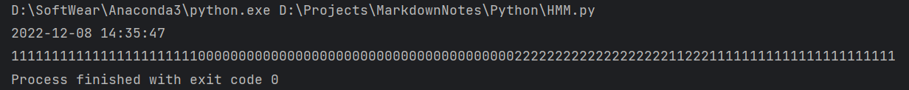
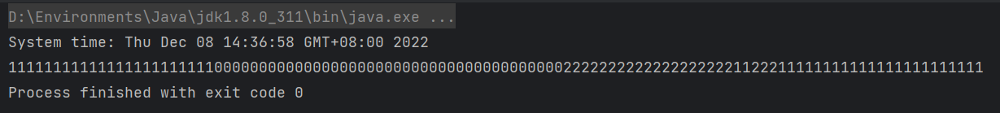

+ 初始概率

  + |  MM  |  MZ  |  ZZ  |
    | :--: | :--: | :--: |
    | 0.4  | 0.2  | 0.4  |

+ 输出概率

  + |  -   | 1(MM) | 0(ZZ) |
    | :--: | :---: | :---: |
    |  MM  | 0.97  | 0.03  |
    |  MZ  |  0.5  |  0.5  |
    |  ZZ  | 0.03  | 0.97  |

+ 转移概率

  + |  -   |  MM  |  MZ  |  ZZ  |
    | :--: | :--: | :--: | :--: |
    |  MM  | 0.98 | 0.01 | 0.01 |
    |  MZ  | 0.01 | 0.98 | 0.01 |
    |  ZZ  | 0.01 | 0.01 | 0.98 |

+ 观测结果 `11111 11011 11110 11111 11000 00000 10000 00001 00000 10000 00000 00000 10110 01010 10101 01111 11101 11111 11110 11111 11011 111`

+ 代码运行结果：
  + Python:
    + 
  + Java:
    + 
