# 生物数据库-以关键词为主的生物信息数据库检索

> 日期：2022-10-26
>
> 实验者：生信 2001 张子栋
>
> [MarkdownNotes/软件第1次作业.md at main · Bluuur/MarkdownNotes (github.com)](https://github.com/Bluuur/MarkdownNotes/blob/main/生物信息学原理/软件第1次作业.md)
> [生物信息学原理/软件第1次作业.md · blur/MarkdownNotes - 码云 - 开源中国 (gitee.com)](https://gitee.com/bluur/MarkdownNotes/blob/main/生物信息学原理/软件第1次作业.md)

## 实验目的与内容

+ 熟悉 NCBI 数据库 Entrez 检索系统
+ 会使用关键词检索 NCBI、UnitProtKB、PubMed 等数据库，能理解检索结果页面各条目含义
+ 了解文献管理工具

## 实验流程和结果

1. **查找与水稻抗病金银 $Xa21$ 有关的资料（GenBank, UnitProt 等）**
   1. **有多少条序列具有全长 CDS， 分别由多少碱基构成？编码多少个氨基酸？**
   2. **选择修改时间最早的一条序列，指出该基因 exon 和 intron 的位置。该基因编码的蛋白质有多少个氨基酸残基？该蛋白质可能位于细胞中的哪个位置？是否有三维结构信息？**

1.1：

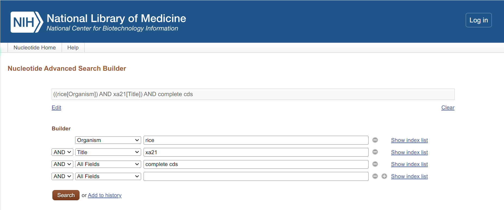

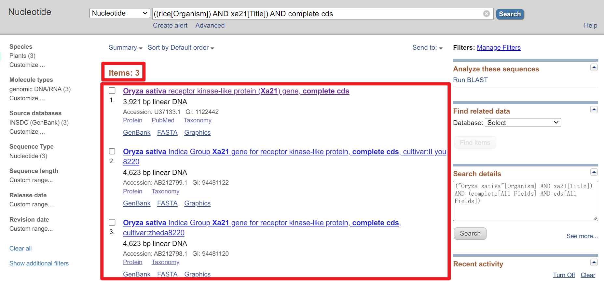

有 3 条序列具有全长 CDS

---

第 1 条序列：

+ 有 3921 个碱基
+ 编码 1025 个氨基酸

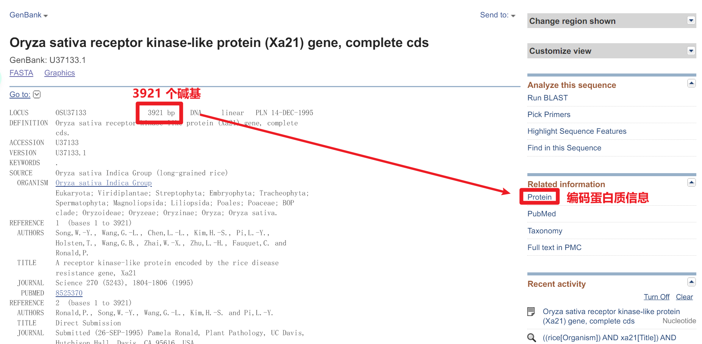

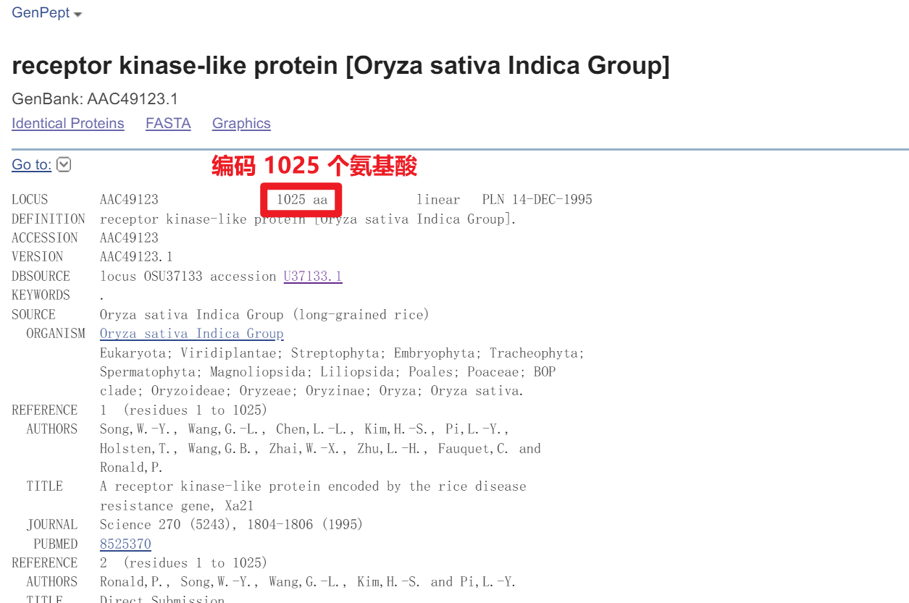

---

第 2 条序列：

+ 有 4623 个碱基
+ 编码 1025 个氨基酸

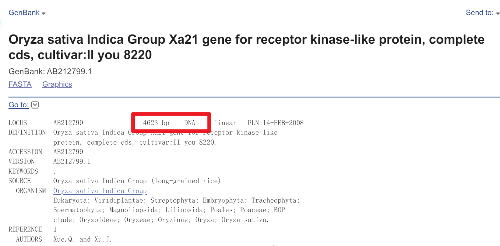

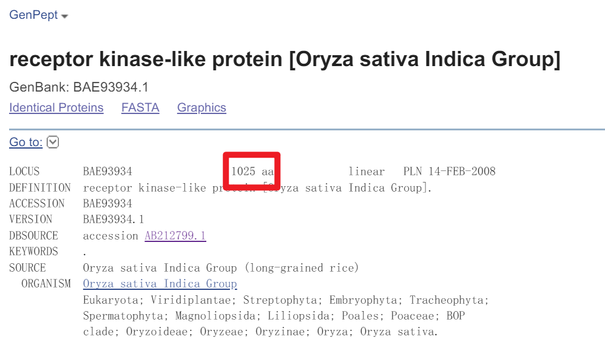

---

第 3 条序列：

+ 有 4623 个碱基
+ 编码 1025 个氨基酸

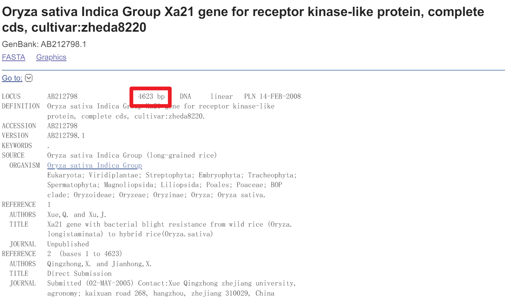

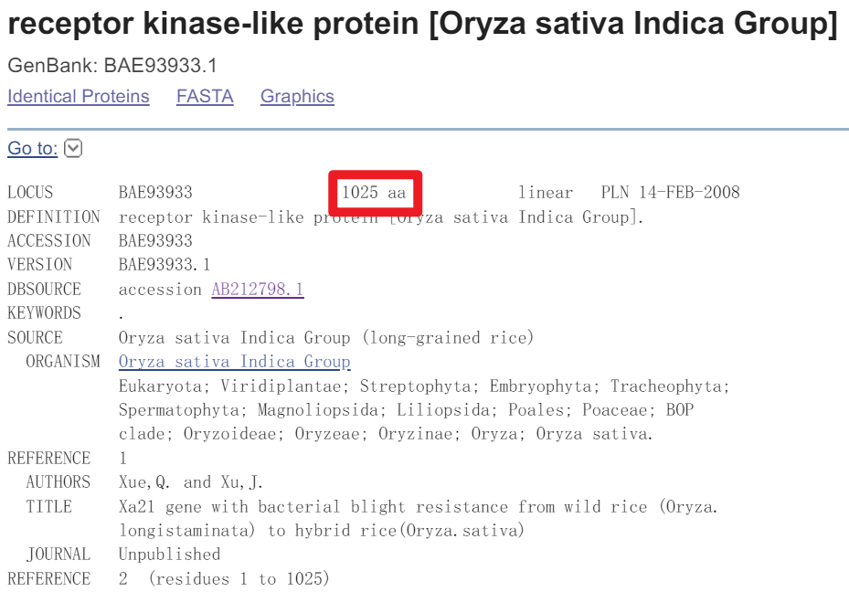

---

1.2：

找到修改时间最早的一条序列

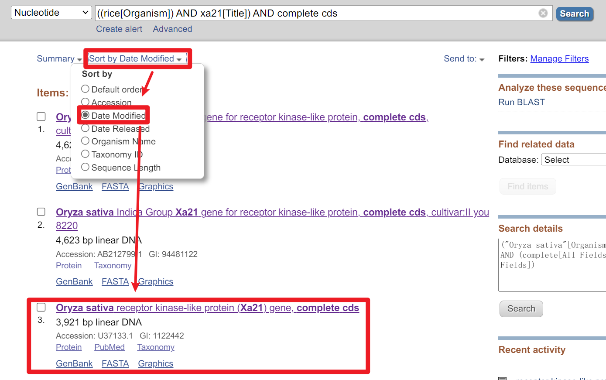

外显子为 `1-2677`, `3521-3921`; 内含子为 `2678-3520`

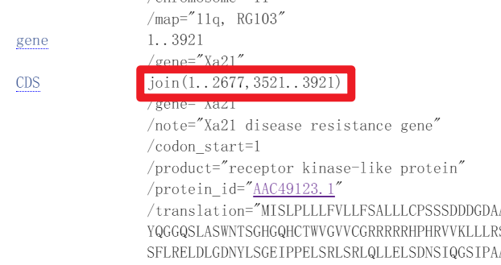

---

氨基酸残基数 1025

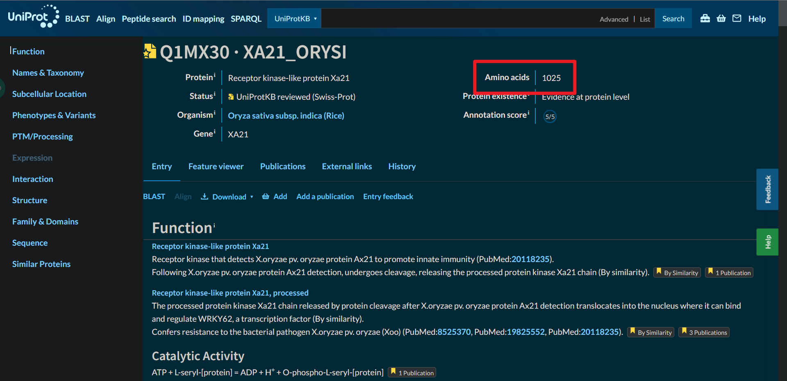

---

亚细胞定位：细胞膜，内质网膜

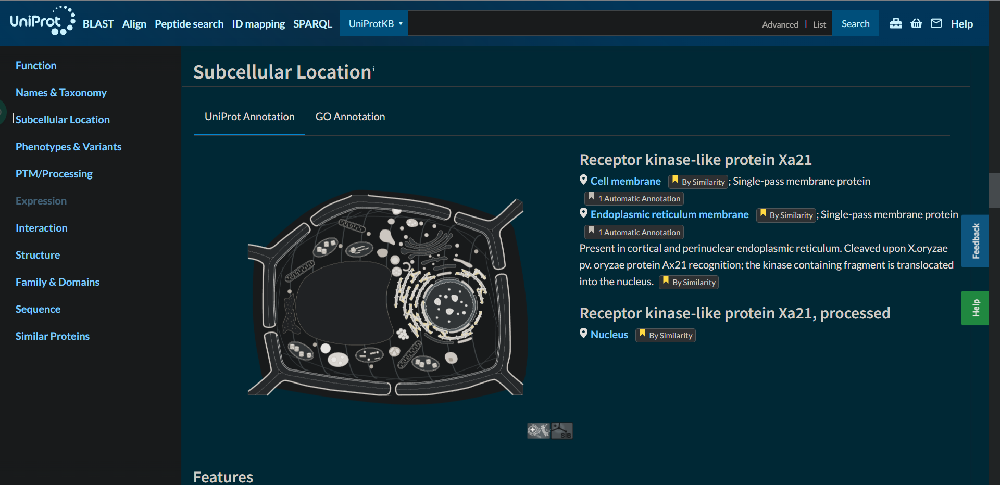

---

三维结构信息

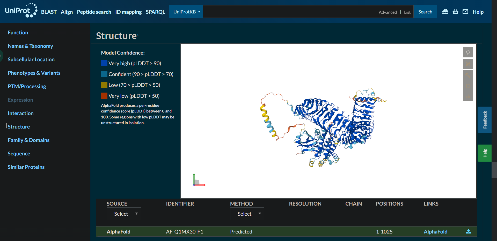

2. **检索注册号在 `AF123456-AF123478` 之间并且序列长度在 $1500$ 到 $1800\ bp$ 之间的核苷酸数据，共有多少条？如何批量下载它们 FASTA 的序列？**

   共 17 条

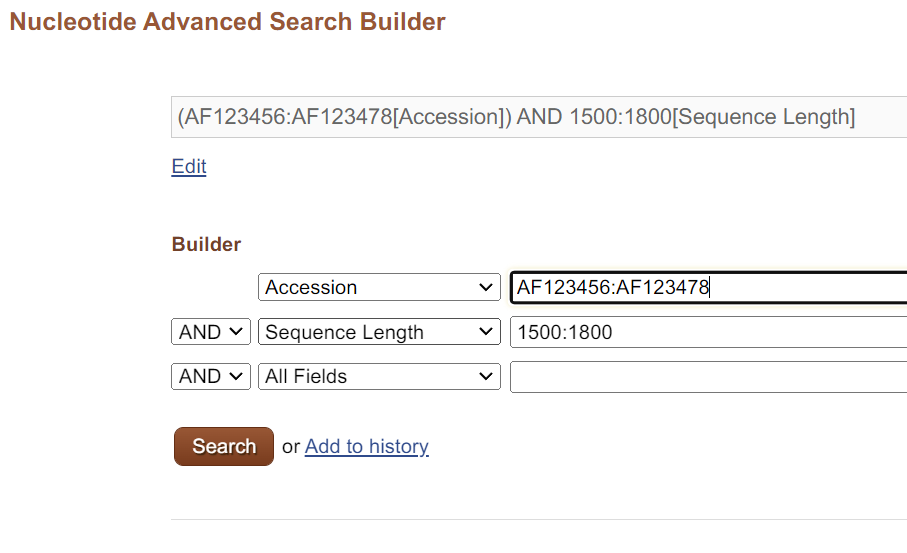

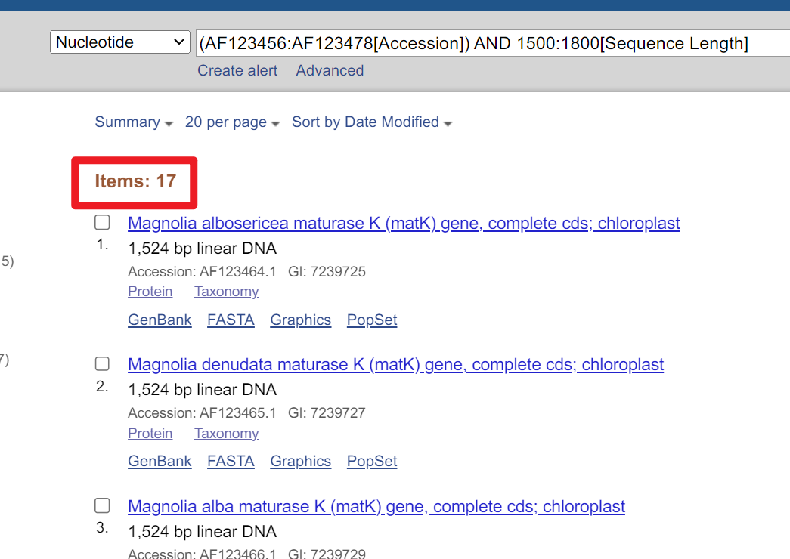

勾选后点击 `Send to`，格式选择 FASTA 

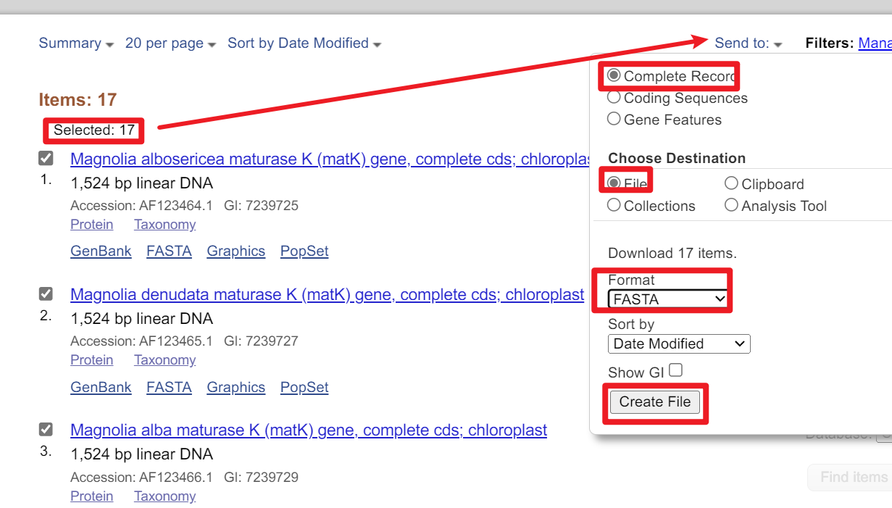

3. **通过关键词，在 PubMed 等数据库搜索跟你「项目育人」项目相关的文献**

PubMed:

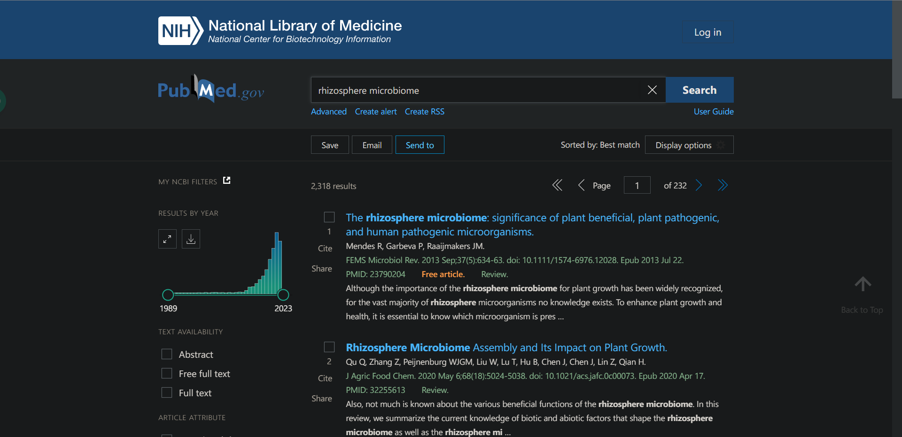

Google Scholar

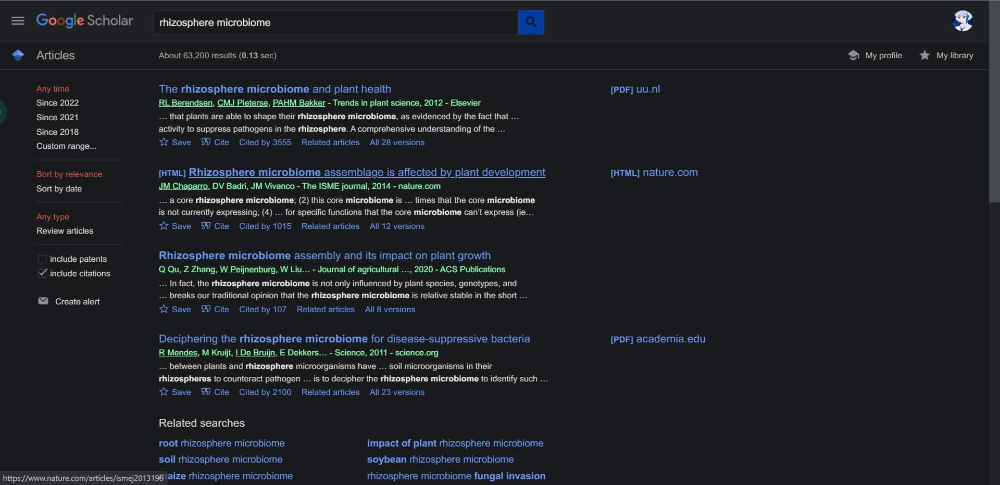

Bing Scholar

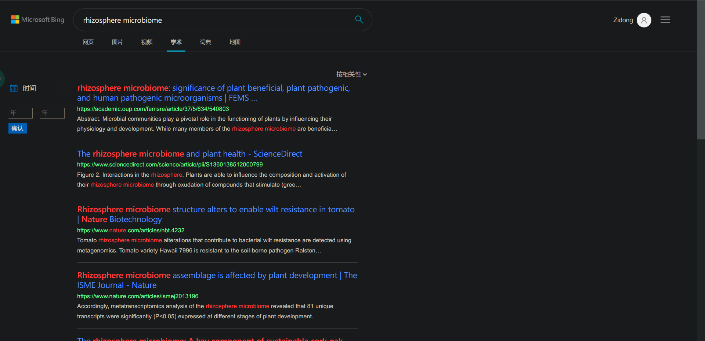

## 讨论

在本次上机实验中，