# 多序列比对与分子进化树

> 日期：2022-11-9
>
> 实验者：生信 2001 张子栋
>
> [MarkdownNotes/软件第3次作业.md at main · Bluuur/MarkdownNotes (github.com)](https://github.com/Bluuur/MarkdownNotes/blob/main/生物信息学原理/软件第3次作业.md)
> [生物信息学原理/软件第3次作业.md · blur/MarkdownNotes - 码云 - 开源中国 (gitee.com)](https://gitee.com/bluur/MarkdownNotes/blob/main/生物信息学原理/软件第3次作业.md)

## 实验目的

1. 掌握至少一种常用多序列比对软件的使用，并理解关键参数的含义，熟悉常用多序列比对文件格式，了解不同多序列比对软件的比对性能差异。
2. 了解比对编辑与美化软件的使用
3. 会使用至少一种软件构建系统发育树，并理解关键参数的含义，熟悉进化树的不同存储格式和结果展示方式，了解不同算法构建进化树的差异。

## 实验内容

1. 常用多序列比对软件进行DNA或蛋白质多序列比对的使用

     + Clustal在线与本地版
     + T-coffee在线版
     + MUSCLE 在线版 
2. 使用比对编辑美化软件的使用（选做）
   + Jalview
   + ESPript
3. 分子进化与系统发育树软件的使用
     + MEGA
4. 进化树的编辑与美化（选做）

## 实验步骤

1. 在基因重组人胰岛素面市之前，糖尿病患者所需胰岛素主要来自屠宰场的动物胰脏。请分析来源自猪、牛和羊的胰岛素哪一种最适于人使用，说明理由。四种蛋白的 NCBI 注册号分别是 `AAA59172`（人）, `AAQ00954`（猪），`AAA30722`（牛）和 `P01318`（羊）。


使用软件：MEGA 11.0.13

**下载数据**

[insulin [Homo sapiens] - Protein - NCBI (nih.gov)](https://www.ncbi.nlm.nih.gov/protein/AAA59172.1/?report=fasta)

[preproinsulin [Sus scrofa] - Protein - NCBI (nih.gov)](https://www.ncbi.nlm.nih.gov/protein/AAQ00954.1?report=fasta)

[insulin precursor [Bos taurus] - Protein - NCBI (nih.gov)](https://www.ncbi.nlm.nih.gov/protein/AAA30722.1?report=fasta)

[RecName: Full=Insulin; Contains: RecName: Full=Insulin B chain; Contai - Protein - NCBI (nih.gov)](https://www.ncbi.nlm.nih.gov/protein/P01318.2?report=fasta)

```fasta
>AAA59172.1 insulin [Homo sapiens]
MALWMRLLPLLALLALWGPDPAAAFVNQHLCGSHLVEALYLVCGERGFFYTPKTRREAEDLQVGQVELGG
GPGAGSLQPLALEGSLQKRGIVEQCCTSICSLYQLENYCN

>AAQ00954.1 preproinsulin [Sus scrofa]
MALWTRLLPLLALLALWAPAPAQAFVNQHLCGSHLVEALYLVCGERGFFYTPKARREAENPQAGAVELGG
GLGGLQALALEGPPQKRGIVEQCCTSICSLYQLENYCN

>AAA30722.1 insulin precursor [Bos taurus]
MALWTRLRPLLALLALWPPPPARAFVNQHLCGSHLVEALYLVCGERGFFYTPKARREVEGPQVGALELAG
GPGAGGLEGPPQKRGIVEQCCASVCSLYQLENYCN

>sp|P01318.2|INS_SHEEP RecName: Full=Insulin; Contains: RecName: Full=Insulin B chain; Contains: RecName: Full=Insulin A chain; Flags: Precursor
MALWTRLVPLLALLALWAPAPAHAFVNQHLCGSHLVEALYLVCGERGFFYTPKARREVEGPQVGALELAG
GPGAGGLEGPPQKRGIVEQCCAGVCSLYQLENYCN
```

+ 导入数据到 MEGA

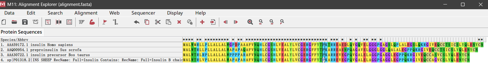

+ ClustaW 序列比对

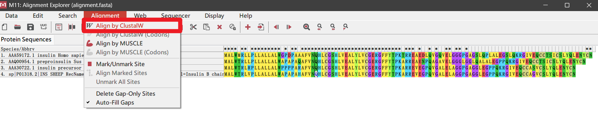

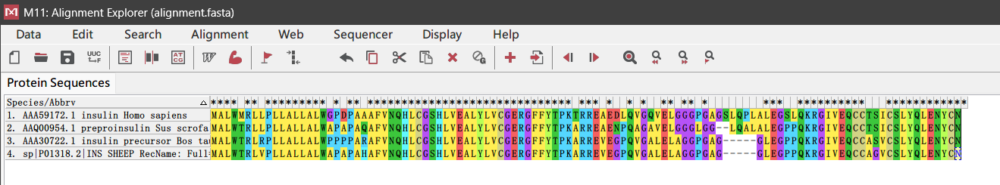

+ 数据分析

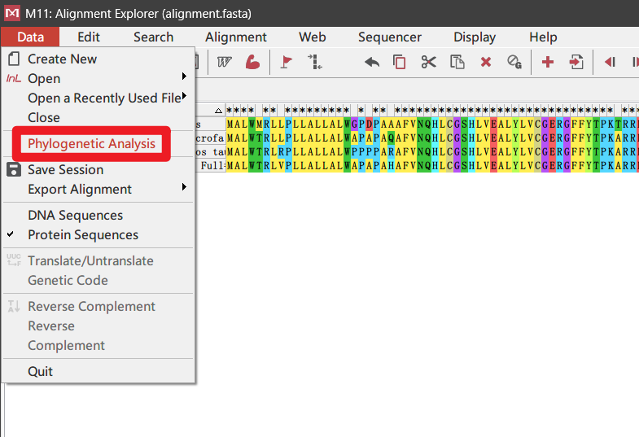

+ 建树（NJ 法）
  + 均选择默认选项


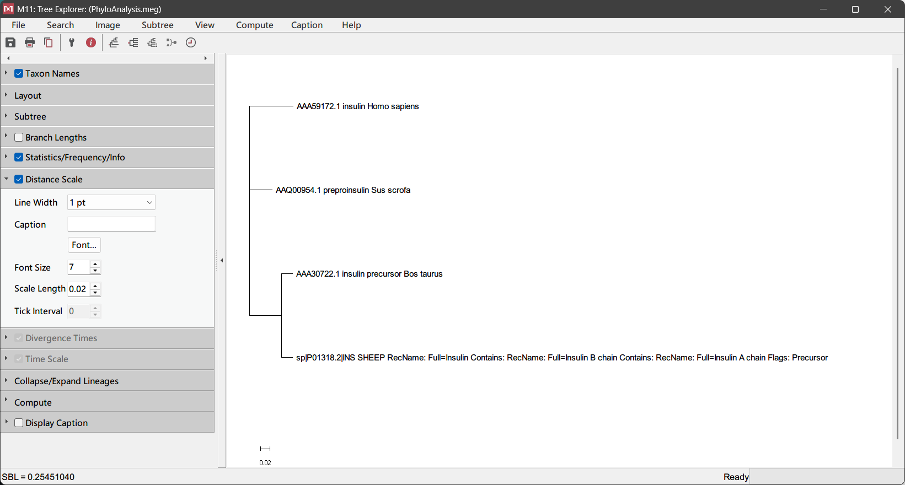

+ 构建距离矩阵


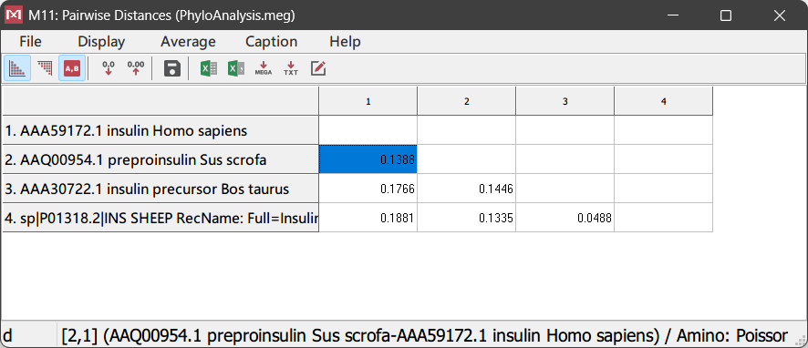

+ 由以上结果可以得出，猪胰岛素与人胰岛素序列遗传距离更近，相似性更好。

---

1. Keratin 是一种微管蛋白，有 type I 和 type II 两种类型，在染色体上成簇分布，对上皮细胞的正常结构十分重要。请根据人类 type II keratin 2p 蛋白序列（NCBI 注册号：`CAD91891`）对 NCBI Homo sapiens RefSeq protein 序列数据库进行 BLASTP 检索，根据检索结果，下载人基因组中 `E-value<1e-200` 的匹配的 RefSeq 序列，按照 Total Score 的顺序由大到小重新命名（比如 1-10）后进行分子进化分析。
   1. 任选一种工具，进行多序列比对，并根据比对结果列出距离矩阵
   2. 任选一种工具，构建分子进化树并对各分支的可靠性进行评估。

+ 获取序列

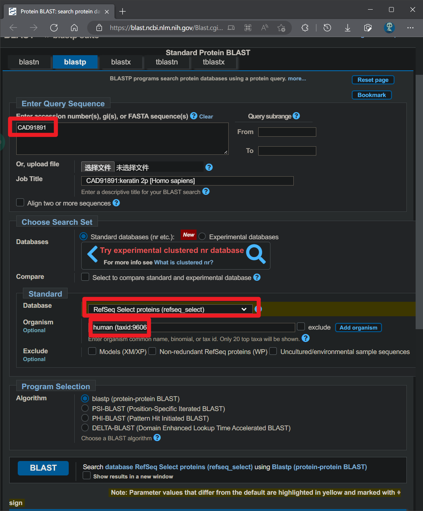


+ 下载符合条件的序列

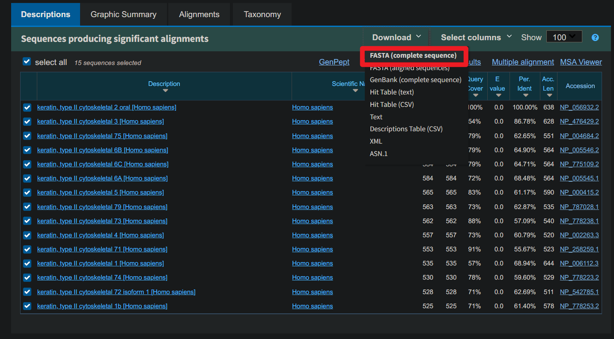

```fasta
>NP_056932.2 keratin, type II cytoskeletal 2 oral [Homo sapiens]
MNRQVCKKSFSGRSQGFSGRSAVVSGSSRMSCVARSGGAGGGACGFRSGAGSFGSRSLYNLGSNKSISISVAAGSSRAGG
FGGGRSSCGFAGGYGGGFGGSYGGGFGGGRGVGSGFGGAGGFGGAGGFGGPGVFGGPGSFGGPGGFGPGGFPGGIQEVIV
NQSLLQPLNVEIDPQIGQVKAQEREQIKTLNNKFASFIDKVRFLEQQNKVLETKWELLQQQTTGSGPSSLEPCFESYISF
LCKQLDSLLGERGNLEGELKSMQDLVEDFKKKYEDEINKRTAAENEFVGLKKDVDAAFMNKVELQAKVDSLTDEVSFLRT
LYEMELSQMQSHASDTSVVLSMDNNRCLDLGSIIAEVRAQYEEIAQRSKSEAEALYQTKLGELQTTAGRHGDDLRNTKSE
IMELNRMIQRLRAEIENVKKQNANLQTAIAEAEQRGEMALKDANAKLQDLQTALQKAKDDLARLLRDYQELMNVKLALDV
EIATYRKLLEGEECRMSGECQSAVCISVVSNVTSTSGSSGSSRGVFGGVSGSGSGGYKGGSSSSSSSGYGVSGGSGSGYG
GVSSGSTGGRGSSGSYQSSSSGSRLGGAGSISVSHSGMGSSSGSIQTSGGSGYKSGGGGSTSIRFSQTTSSSQHSSTK
>NP_476429.2 keratin, type II cytoskeletal 3 [Homo sapiens]
MSRQASKTSGGGSQGFSGRSAVVSGSSRMSCVAHSGGAGGGAYGFRSGAGGFGSRSLYNLGGNKSISISVAAGGSRAGGF
GGGRSSCAFAGGYGGGFGSGYGGGFGGGFGGGRGMGGGFGGAGGFGGAGGFGGAGGFGGPGGFGGSGGFGGPGSLGSPGG
FGPGGFPGGIQEVTINQSLLQPLNVEIDPQIGQVKAQEREQIKTLNNKFASFIDKVRFLEQQNKVLETKWNLLQQQGTSS
ISGTNNLEPLFENHINYLRSYLDNILGERGRLDSELKNMEDLVEDFKKKYEDEINKRTAAENEFVTLKKDVDSAYMNKVE
LQAKVDALIDEIDFLRTLYDAELSQMQSHISDTSVVLSMDNNRSLDLDSIIAEVRAQYEDIAQRSKAEAEALYQTKLGEL
QTTAGRHGDDLRNTKSEIIELNRMIQRLRAEIEGVKKQNANLQTAIAEAEQHGEMALKDANAKLQELQAALQQAKDDLAR
LLRDYQELMNVKLALDVEIATYRKLLEGEEYRMSGECPSAVSISVVSSSTTSASAGGYGGGYGGGMGGGLGGGFSAGGGS
GSGFGRGGGGGIGGGFGGGSSGFSGGSGFGSISGARYGVSGGGFSSASNRGGSIKFSQSSQSSQRYSR
>NP_004684.2 keratin, type II cytoskeletal 75 [Homo sapiens]
MSRQSSITFQSGSRRGFSTTSAITPAAGRSRFSSVSVARSAAGSGGLGRISSAGASFGSRSLYNLGGAKRVSINGCGSSC
RSGFGGRASNRFGVNSGFGYGGGVGGGFSGPSFPVCPPGGIQEVTVNQSLLTPLHLQIDPTIQRVRAEEREQIKTLNNKF
ASFIDKVRFLEQQNKVLETKWALLQEQGSRTVRQNLEPLFDSYTSELRRQLESITTERGRLEAELRNMQDVVEDFKVRYE
DEINKRTAAENEFVALKKDVDAAYMNKVELEAKVKSLPEEINFIHSVFDAELSQLQTQVGDTSVVLSMDNNRNLDLDSII
AEVKAQYEDIANRSRAEAESWYQTKYEELQVTAGRHGDDLRNTKQEISEMNRMIQRLRAEIDSVKKQCSSLQTAIADAEQ
RGELALKDARAKLVDLEEALQKAKQDMARLLREYQELMNIKLALDVEIATYRKLLEGEECRLSGEGVSPVNISVVTSTLS
SGYGSGSSIGGGNLGLGGGSGYSFTTSGGHSLGAGLGGSGFSATSNRGLGGSGSSVKFVSTTSSSQKSYTH
>NP_005546.2 keratin, type II cytoskeletal 6B [Homo sapiens]
MASTSTTIRSHSSSRRGFSANSARLPGVSRSGFSSISVSRSRGSGGLGGACGGAGFGSRSLYGLGGSKRISIGGGSCAIS
GGYGSRAGGSYGFGGAGSGFGFGGGAGIGFGLGGGAGLAGGFGGPGFPVCPPGGIQEVTVNQSLLTPLNLQIDPAIQRVR
AEEREQIKTLNNKFASFIDKVRFLEQQNKVLDTKWTLLQEQGTKTVRQNLEPLFEQYINNLRRQLDNIVGERGRLDSELR
NMQDLVEDLKNKYEDEINKRTAAENEFVTLKKDVDAAYMNKVELQAKADTLTDEINFLRALYDAELSQMQTHISDTSVVL
SMDNNRNLDLDSIIAEVKAQYEEIAQRSRAEAESWYQTKYEELQITAGRHGDDLRNTKQEIAEINRMIQRLRSEIDHVKK
QCANLQAAIADAEQRGEMALKDAKNKLEGLEDALQKAKQDLARLLKEYQELMNVKLALDVEIATYRKLLEGEECRLNGEG
VGQVNISVVQSTVSSGYGGASGVGSGLGLGGGSSYSYGSGLGVGGGFSSSSGRATGGGLSSVGGGSSTIKYTTTSSSSRK
SYKH
>NP_775109.2 keratin, type II cytoskeletal 6C [Homo sapiens]
MASTSTTIRSHSSSRRGFSANSARLPGVSRSGFSSISVSRSRGSGGLGGACGGAGFGSRSLYGLGGSKRISIGGGSCAIS
GGYGSRAGGSYGFGGAGSGFGFGGGAGIGFGLGGGAGLAGGFGGPGFPVCPPGGIQEVTVNQSLLTPLNLQIDPAIQRVR
AEEREQIKTLNNKFASFIDKVRFLEQQNKVLDTKWTLLQEQGTKTVRQNLEPLFEQYINNLRRQLDSIVGERGRLDSELR
NMQDLVEDLKNKYEDEINKRTAAENEFVTLKKDVDAAYMNKVELQAKADTLTDEINFLRALYDAELSQMQTHISDTSVVL
SMDNNRNLDLDSIIAEVKAQYEEIAQRSRAEAESWYQTKYEELQVTAGRHGDDLRNTKQEIAEINRMIQRLRSEIDHVKK
QCASLQAAIADAEQRGEMALKDAKNKLEGLEDALQKAKQDLARLLKEYQELMNVKLALDVEIATYRKLLEGEECRLNGEG
VGQVNVSVVQSTISSGYGGASGVGSGLGLGGGSSYSYGSGLGIGGGFSSSSGRAIGGGLSSVGGGSSTIKYTTTSSSSRK
SYKH
>NP_005545.1 keratin, type II cytoskeletal 6A [Homo sapiens]
MASTSTTIRSHSSSRRGFSANSARLPGVSRSGFSSVSVSRSRGSGGLGGACGGAGFGSRSLYGLGGSKRISIGGGSCAIS
GGYGSRAGGSYGFGGAGSGFGFGGGAGIGFGLGGGAGLAGGFGGPGFPVCPPGGIQEVTVNQSLLTPLNLQIDPTIQRVR
AEEREQIKTLNNKFASFIDKVRFLEQQNKVLETKWTLLQEQGTKTVRQNLEPLFEQYINNLRRQLDSIVGERGRLDSELR
GMQDLVEDFKNKYEDEINKRTAAENEFVTLKKDVDAAYMNKVELQAKADTLTDEINFLRALYDAELSQMQTHISDTSVVL
SMDNNRNLDLDSIIAEVKAQYEEIAQRSRAEAESWYQTKYEELQVTAGRHGDDLRNTKQEIAEINRMIQRLRSEIDHVKK
QCANLQAAIADAEQRGEMALKDAKNKLEGLEDALQKAKQDLARLLKEYQELMNVKLALDVEIATYRKLLEGEECRLNGEG
VGQVNISVVQSTVSSGYGGASGVGSGLGLGGGSSYSYGSGLGVGGGFSSSSGRAIGGGLSSVGGGSSTIKYTTTSSSSRK
SYKH
>NP_000415.2 keratin, type II cytoskeletal 5 [Homo sapiens]
MSRQSSVSFRSGGSRSFSTASAITPSVSRTSFTSVSRSGGGGGGGFGRVSLAGACGVGGYGSRSLYNLGGSKRISISTSG
GSFRNRFGAGAGGGYGFGGGAGSGFGFGGGAGGGFGLGGGAGFGGGFGGPGFPVCPPGGIQEVTVNQSLLTPLNLQIDPS
IQRVRTEEREQIKTLNNKFASFIDKVRFLEQQNKVLDTKWTLLQEQGTKTVRQNLEPLFEQYINNLRRQLDSIVGERGRL
DSELRNMQDLVEDFKNKYEDEINKRTTAENEFVMLKKDVDAAYMNKVELEAKVDALMDEINFMKMFFDAELSQMQTHVSD
TSVVLSMDNNRNLDLDSIIAEVKAQYEEIANRSRTEAESWYQTKYEELQQTAGRHGDDLRNTKHEISEMNRMIQRLRAEI
DNVKKQCANLQNAIADAEQRGELALKDARNKLAELEEALQKAKQDMARLLREYQELMNTKLALDVEIATYRKLLEGEECR
LSGEGVGPVNISVVTSSVSSGYGSGSGYGGGLGGGLGGGLGGGLAGGSSGSYYSSSSGGVGLGGGLSVGGSGFSASSGRG
LGVGFGSGGGSSSSVKFVSTTSSSRKSFKS
>NP_787028.1 keratin, type II cytoskeletal 79 [Homo sapiens]
MRSSVSRQTYSTKGGFSSNSASGGSGSQARTSFSSVTVSRSSGSGGGAHCGPGTGGFGSRSLYNLGGHKSISVSVAGGAL
LGRALGGFGFGSRAFMGQGAGRQTFGPACPPGGIQEVTVNQSLLTPLHVEIDPEIQRVRTQEREQIKTLNNKFASFIDKV
RFLEQQNKVLETKWALLQEQGQNLGVTRNNLEPLFEAYLGSMRSTLDRLQSERGRLDSELRNVQDLVEDFKNKYEDEINK
HTAAENEFVVLKKDVDAAYMGRMDLHGKVGTLTQEIDFLQQLYEMELSQVQTHVSNTNVVLSMDNNRNLDLDSIIAEVKA
QYELIAQRSRAEAEAWYQTKYEELQVTAGKHGDNLRDTKNEIAELTRTIQRLQGEADAAKKQCQQLQTAIAEAEQRGELA
LKDAQKKLGDLDVALHQAKEDLTRLLRDYQELMNVKLALDVEIATYRKLLESEESRMSGECPSAVSISVTGNSTTVCGGG
AASFGGGISLGGSGGATKGGFSTNVGYSTVKGGPVSAGTSILRKTTTVKTSSQRY
>NP_778238.1 keratin, type II cytoskeletal 73 [Homo sapiens]
MSRQFTYKSGAAAKGGFSGCSAVLSGGSSSSYRAGGKGLSGGFSSRSLYSLGGARSISFNVASGSGWAGGYGFGRGRASG
FAGSMFGSVALGSVCPSLCPPGGIHQVTINKSLLAPLNVELDPEIQKVRAQEREQIKVLNNKFASFIDKVRFLEQQNQVL
ETKWELLQQLDLNNCKNNLEPILEGYISNLRKQLETLSGDRVRLDSELRSVREVVEDYKKRYEEEINKRTTAENEFVVLK
KDVDAAYTSKVELQAKVDALDGEIKFFKCLYEGETAQIQSHISDTSIILSMDNNRNLDLDSIIAEVRAQYEEIARKSKAE
AEALYQTKFQELQLAAGRHGDDLKHTKNEISELTRLIQRLRSEIESVKKQCANLETAIADAEQRGDCALKDARAKLDELE
GALQQAKEELARMLREYQELLSVKLSLDIEIATYRKLLEGEECRMSGEYTNSVSISVINSSMAGMAGTGAGFGFSNAGTY
GYWPSSVSGGYSMLPGGCVTGSGNCSPRGEARTRLGSASEFRDSQGKTLALSSPTKKTMR
>NP_002263.3 keratin, type II cytoskeletal 4 [Homo sapiens]
MIARQQCVRGGPRGFSCGSAIVGGGKRGAFSSVSMSGGAGRCSSGGFGSRSLYNLRGNKSISMSVAGSRQGACFGGAGGF
GTGGFGGGFGGSFSGKGGPGFPVCPAGGIQEVTINQSLLTPLHVEIDPEIQKVRTEEREQIKLLNNKFASFIDKVQFLEQ
QNKVLETKWNLLQQQTTTTSSKNLEPLFETYLSVLRKQLDTLGNDKGRLQSELKTMQDSVEDFKTKYEEEINKRTAAEND
FVVLKKDVDAAYLNKVELEAKVDSLNDEINFLKVLYDAELSQMQTHVSDTSVVLSMDNNRNLDLDSIIAEVRAQYEEIAQ
RSKAEAEALYQTKVQQLQISVDQHGDNLKNTKSEIAELNRMIQRLRAEIENIKKQCQTLQVSVADAEQRGENALKDAHSK
RVELEAALQQAKEELARMLREYQELMSVKLALDIEIATYRKLLEGEEYRMSGECQSAVSISVVSGSTSTGGISGGLGSGS
GFGLSSGFGSGSGSGFGFGGSVSGSSSSKIISTTTLNKRR
>NP_258259.1 keratin, type II cytoskeletal 71 [Homo sapiens]
MSRQFTCKSGAAAKGGFSGCSAVLSGGSSSSFRAGSKGLSGGFGSRSLYSLGGVRSLNVASGSGKSGGYGFGRGRASGFA
GSMFGSVALGPVCPTVCPPGGIHQVTVNESLLAPLNVELDPEIQKVRAQEREQIKALNNKFASFIDKVRFLEQQNQVLET
KWELLQQLDLNNCKNNLEPILEGYISNLRKQLETLSGDRVRLDSELRNVRDVVEDYKKRYEEEINKRTAAENEFVLLKKD
VDAAYANKVELQAKVESMDQEIKFFRCLFEAEITQIQSHISDMSVILSMDNNRNLDLDSIIDEVRTQYEEIALKSKAEAE
ALYQTKFQELQLAAGRHGDDLKNTKNEISELTRLIQRIRSEIENVKKQASNLETAIADAEQRGDNALKDARAKLDELEGA
LHQAKEELARMLREYQELMSLKLALDMEIATYRKLLESEECRMSGEFPSPVSISIISSTSGGSVYGFRPSMVSGGYVANS
SNCISGVCSVRGGEGRSRGSANDYKDTLGKGSSLSAPSKKTSR
>NP_006112.3 keratin, type II cytoskeletal 1 [Homo sapiens]
MSRQFSSRSGYRSGGGFSSGSAGIINYQRRTTSSSTRRSGGGGGRFSSCGGGGGSFGAGGGFGSRSLVNLGGSKSISISV
ARGGGRGSGFGGGYGGGGFGGGGFGGGGFGGGGIGGGGFGGFGSGGGGFGGGGFGGGGYGGGYGPVCPPGGIQEVTINQS
LLQPLNVEIDPEIQKVKSREREQIKSLNNQFASFIDKVRFLEQQNQVLQTKWELLQQVDTSTRTHNLEPYFESFINNLRR
RVDQLKSDQSRLDSELKNMQDMVEDYRNKYEDEINKRTNAENEFVTIKKDVDGAYMTKVDLQAKLDNLQQEIDFLTALYQ
AELSQMQTQISETNVILSMDNNRSLDLDSIIAEVKAQYEDIAQKSKAEAESLYQSKYEELQITAGRHGDSVRNSKIEISE
LNRVIQRLRSEIDNVKKQISNLQQSISDAEQRGENALKDAKNKLNDLEDALQQAKEDLARLLRDYQELMNTKLALDLEIA
TYRTLLEGEESRMSGECAPNVSVSVSTSHTTISGGGSRGGGGGGYGSGGSSYGSGGGSYGSGGGGGGGRGSYGSGGSSYG
SGGGSYGSGGGGGGHGSYGSGSSSGGYRGGSGGGGGGSSGGRGSGGGSSGGSIGGRGSSSGGVKSSGGSSSVKFVSTTYS
GVTR
>NP_778223.2 keratin, type II cytoskeletal 74 [Homo sapiens]
MSRQLNIKSSGDKGNFSVHSAVVPRKAVGSLASYCAAGRGAGAGFGSRSLYSLGGNRRISFNVAGGGVRAGGYGFRPGSG
YGGGRASGFAGSMFGSVALGPACLSVCPPGGIHQVTVNKSLLAPLNVELDPEIQKVRAQEREQIKVLNDKFASFIDKVRF
LEQQNQVLETKWELLQQLDLNNCKKNLEPILEGYISNLRKQLETLSGDRVRLDSELRSMRDLVEDYKKRYEVEINRRTTA
ENEFVVLKKDADAAYAVKVELQAKVDSLDKEIKFLKCLYDAEIAQIQTHASETSVILSMDNNRDLDLDSIIAEVRMHYEE
IALKSKAEAEALYQTKIQELQLAASRHGDDLKHTRSEMVELNRLIQRIRCEIGNVKKQRASLETAIADAEQRGDNALKDA
QAKLDELEGALHQAKEELARMLREYQELMSLKLALDMEIATYRKLLEGEECRMSGENPSSVSISVISSSSYSYHHPSSAG
VDLGASAVAGSSGSTQSGQTKTTEARGGDLKDTQGKSTPASIPARKATR
>NP_542785.1 keratin, type II cytoskeletal 72 isoform 1 [Homo sapiens]
MSRQLTHFPRGERLGFSGCSAVLSGGIGSSSASFRARVKGSASFGSKSLSCLGGSRSLALSAAARRGGGRLGGFVGTAFG
SAGLGPKCPSVCPPGGIPQVTVNKSLLAPLNVEMDPEIQRVRAQEREQIKALNNKFASFIDKVRFLEQQNQVLETKWNLL
QQLDLNNCRKNLEPIYEGYISNLQKQLEMLSGDGVRLDSELRNMQDLVEDYKKRYEVEINRRTAAENEFVVLKKDVDAAY
MNKVELQAKVDSLTDEIKFFKCLYEGEITQIQSHISDTSIVLSMDNNRDLDLDSIIAEVRAQYEEIALKSKAEAETLYQT
KIQELQVTAGQHGDDLKLTKAEISELNRLIQRIRSEIGNVKKQCADLETAIADAEQRGDCALKDARAKLDELEGALHQAK
EELARMLREYQELVSLKLALDMEIATYRKLLESEECRMSGEYPNSVSISVISSTNAGAGGAGFSMGFGASSSYSYKTAAA
DVKTKGSCGSELKDPLAKTSGSSCATKKASR
>NP_778253.2 keratin, type II cytoskeletal 1b [Homo sapiens]
MSHQFSSQSAFSSMSRRVYSTSSSAGSGGGSPAVGSVCYARGRCGGGGYGIHGRGFGSRSLYNLGGSRSISINLMGRSTS
GFCQGGGVGGFGGGRGFGVGSTGAGGFGGGGFGGAGFGTSNFGLGGFGPYCPPGGIQEVTINQSLLEPLHLEVDPEIQRI
KTQEREQIMVLNNKFASFIDKVRFLEQQNQVLQTKWELLQQVNTSTGTNNLEPLLENYIGDLRRQVDLLSAEQMRQNAEV
RSMQDVVEDYKSKYEDEINKRTGSENDFVVLKKDVDAAYVSKVDLESRVDTLTGEVNFLKYLFLTELSQVQTHISDTNVI
LSMDNNRSLDLDSIIDAVRTQYELIAQRSKDEAEALYQTKYQELQITAGRHGDDLKNSKMEIAELNRTVQRLQAEISNVK
KQIEQMQSLISDAEERGEQALQDAWQKLQDLEEALQQSKEELARLLRDYQAMLGVKLSLDVEIATYRQLLEGEESRMSGE
LQSHVSISVQNSQVSVNGGAGGGGSYGSGGYGGGSGGGYGGGRSYRGGGARGRSGGGYGSGCGGGGGSYGGSGRSGRGSS
RVQIIQTSTNTSHRRILE

```

+ 在 MEGA 中处理数据

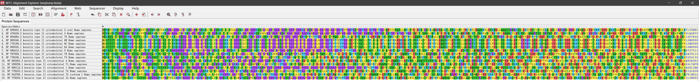

+ 使用 ClustaW 进行序列比对

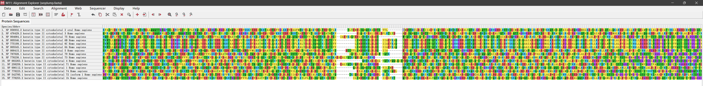

+ 分析数据并构建距离矩阵

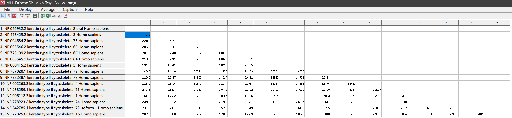

+ 构建进化树（NJ 法）
  + 使用自展法

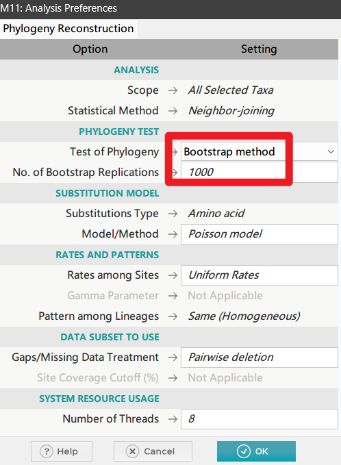

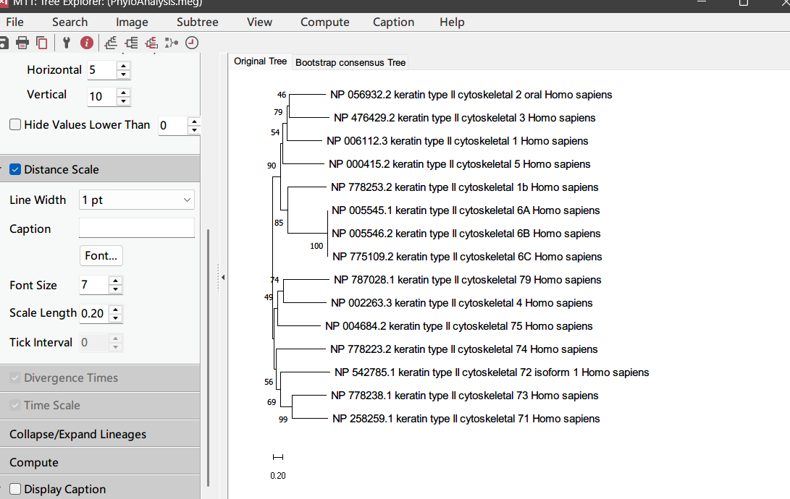

## 讨论

在本次实验中熟悉掌握了几种多序列比对的工具。
