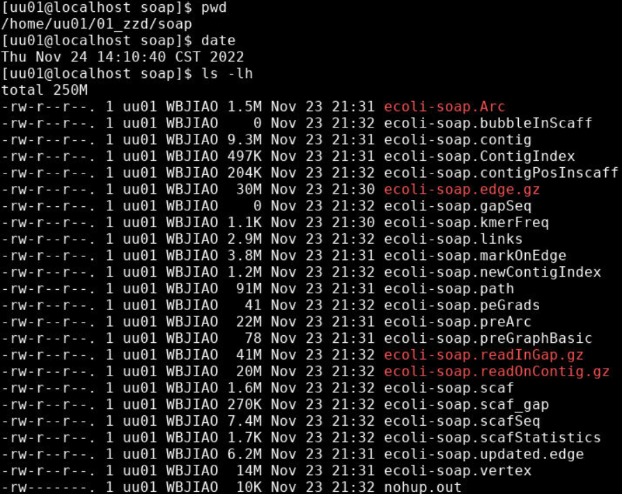
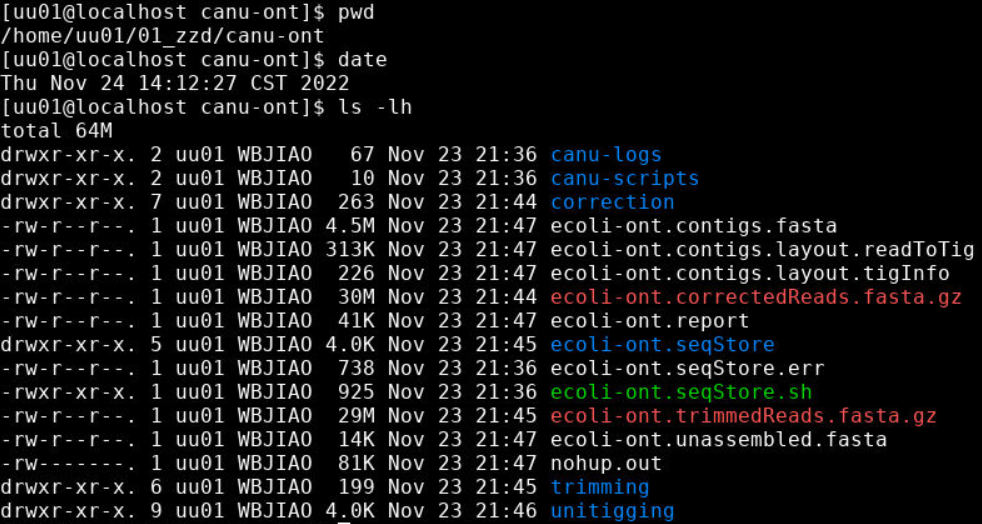
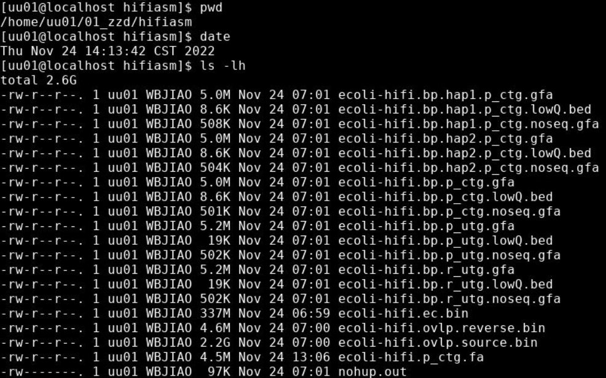
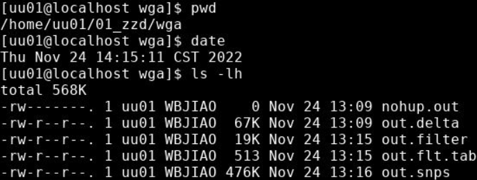
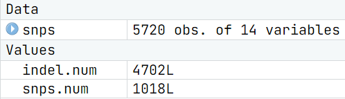

# 基因组组装

> 日期：2022-11-23
>
> 实验者：生信 2001 张子栋
>
> [MarkdownNotes/软件第4次作业.md at main · Bluuur/MarkdownNotes (github.com)](https://github.com/Bluuur/MarkdownNotes/blob/main/生物信息学原理/软件第4次作业.md)
> [生物信息学原理/软件第4次作业.md · blur/MarkdownNotes - 码云 - 开源中国 (gitee.com)](https://gitee.com/bluur/MarkdownNotes/blob/main/生物信息学原理/软件第4次作业.md)

## 实验目的

1. 回顾 Linux 系统的常用命令的使用。
2. 掌握常用三代和二代测序组装软件各至少一种的使用，并理解关键参数的含义，熟悉测序数据 fastq 等格式。
3. 会编写程序计算 N50 / L50 等组装连续性指标。
4. 会使用基因组比对工具 MUMmer 进行序列比对，并寻找 SNP 等变异。

## 实验内容

+ 使用组装软件 SOAPdenovo、canu、Hifiasm 分别组装大肠杆菌 Escherichia coli K12 基因组的二代和三代测序数据。
+ 编写程序计算 SOAPdenovo 组装 contig 和 scaffold 序列的 N50 / L50 等组装质量评估指标。
+ 使用基因组比对工具 MUMmer 比较 canu 组装的 contig 序列和 hifiasm 组装的 contig 序列，并寻找两者之间的序列差异。

## 实验结果

### 使用 soapdenovo2 组装 $E. coli$ 基因组 illumina 二代测序数据

### 使用 canu 组装 Nanopore 测序读段

### 使用 hifiasm 组装 PacBio HiFi 测序数据

### 比较 canu 的 ONT 组装和 hifiasm 的 hifi 组装

+ SNP 数量：1018
+ indel 数量：4702

## 讨论

在这次上机实验中熟悉掌握了几种基因组组装软件和基因组比对工具。
