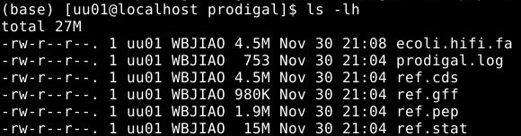
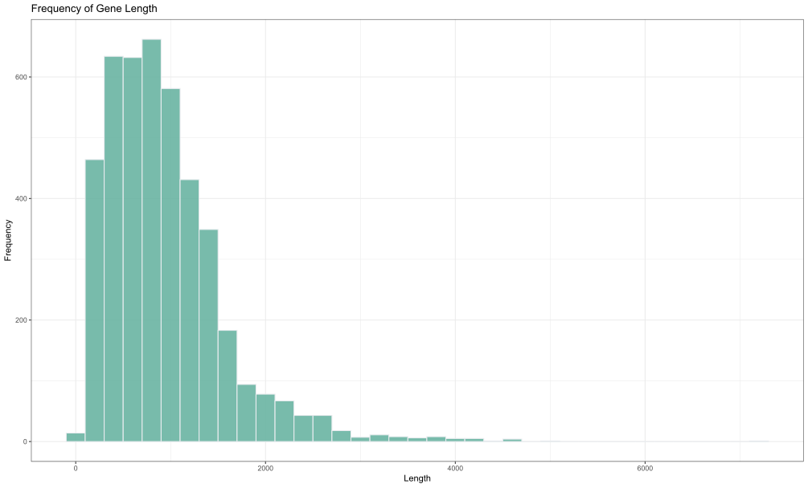
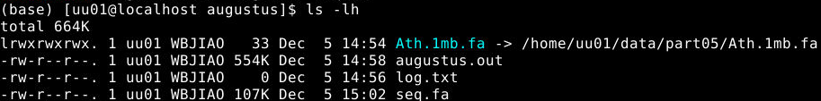
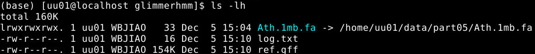
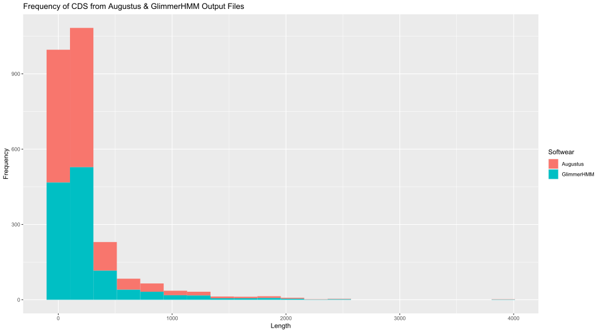
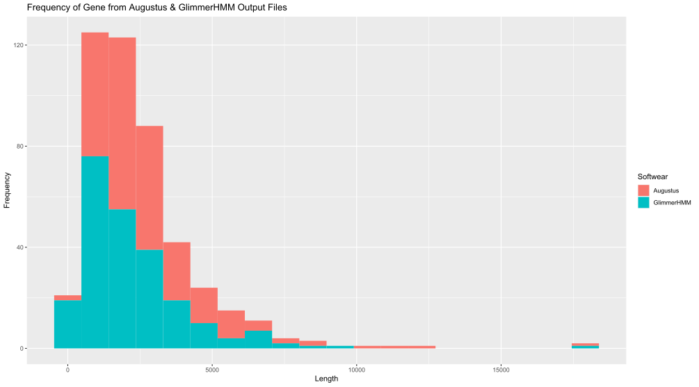
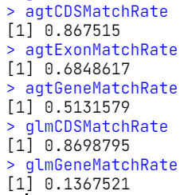
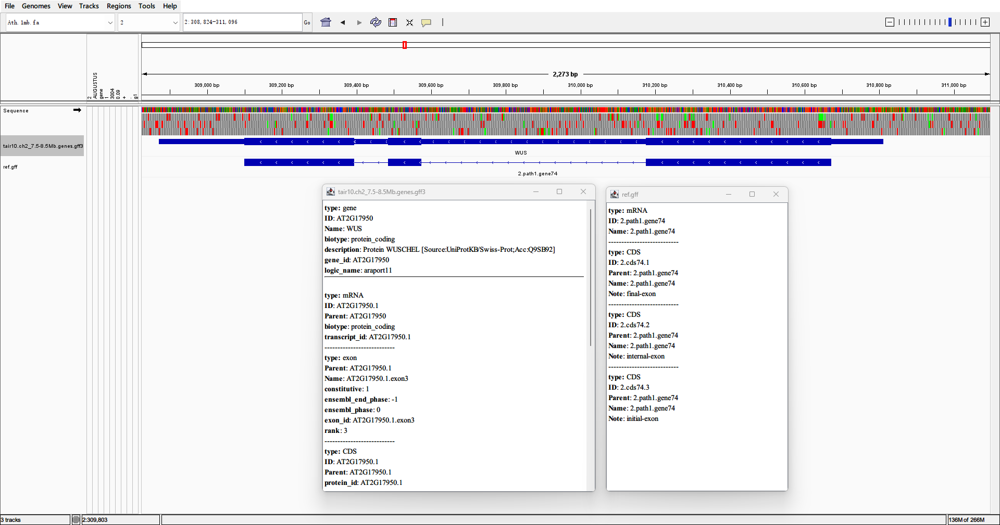
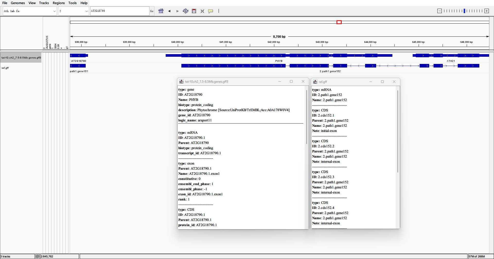

# 基因预测和基因结构分析

> 日期：2022-11-30
>
> 实验者：生信 2001 张子栋
>
> [MarkdownNotes/软件第5次作业.md at main · Bluuur/MarkdownNotes (github.com)](https://github.com/Bluuur/MarkdownNotes/blob/main/生物信息学原理/软件第5次作业.md)
> [生物信息学原理/软件第5次作业.md · blur/MarkdownNotes - 码云 - 开源中国 (gitee.com)](https://gitee.com/bluur/MarkdownNotes/blob/main/生物信息学原理/软件第5次作业.md)

## 实验目的

1. 掌握常用基因从头预测软件的使用和结果解读
2. 熟悉文件格式 GFF3 的基本信息
3. 熟悉至少一种基因组浏览器的使用
4. 了解基因结构和非编码基因预测等分析

## 实验内容

1. 使用 Prodigal 对上节课组装的大肠杆菌的序列（其中 1 Mb 序列，已提供，见文件 `ecoli.hifi.fa`）进行基因预测，统计预测得到的基因的长度分布，并用直方图进行可视化。（预测结果、统计结果、直方图展示）

   + 预测结果
     

   + 统计结果并作图
     ```R
     > ref.gff <- read.table(file.choose(), quote = "#")
     > ggplot(data = ref.gff, aes(x = V5 - V4 + 1)) + 
     +     geom_histogram(binwidth = 200, fill = "#69b3a2", 
     +                    color = "#e9ecef", alpha = 0.9) +
     +     theme_bw() +
     +     labs(x = "Length", y = "Frequency", title = "Frequency of Gene Length")
     ```

     

2. 从给定的拟南芥基因组（TAIR10 版本）的某段序列（二号染色体 7.5 - 8.5 Mb, 文件名：`Ath.1mb.fa`），完成以下任务：
   1. 使用 GenScan、Augustus、GlimmerHMM 等软件（至少两种软件）预测该序列所包含的蛋白质编码基因。统计不同软件组装得到的基因、exon、CDS 的数量和长度分布等信息，并选用适当的图表将结果进行展示。
   
      + 预测结果
        
        
      + 作图：
   
      ```R
      # 读取文件
      > Augustus <- read.table(file.choose(), quote = "#", fill = 1)
      > Glimmerhmm <- read.table(file.choose(), quote = "#")
      
      # 整理数据
      > glimmerHMMCDS <- Glimmerhmm[which(Glimmerhmm[, 3] == "CDS"), 3:5]
      > glimmerHMMGene <- Glimmerhmm[which(Glimmerhmm[, 3] == "mRNA"), 3:5]
      > augustusCDS <- Augustus[which(Augustus[, 3] == "CDS"), 3:5]
      > augustusGene <- Augustus[which(Augustus[, 3] == "gene"), 3:5]
      > augustusExon <- Augustus[which(Augustus[, 3] == "exon"), 3:5]
      > augustusCDS[, 1] <- "Augustus"
      > augustusExon[, 1] <- "Augustus"
      > augustusGene[, 1] <- "Augustus"
      > glimmerHMMCDS[, 1] <- "GlimmerHMM"
      > glimmerHMMGene[, 1] <- "GlimmerHMM"
      > CDSData <- rbind(augustusCDS, glimmerHMMCDS)
      > geneData <- rbind(augustusGene, glimmerHMMGene)
      > colnames(CDSData) <- c("Softwear", "Start", "End")
      > colnames(geneData) <- c("Softwear", "Start", "End")
      
      # 作图
      > ggplot(data = geneData, mapping = aes(x = End - Start +  1, fill = Softwear)) + 
      +     geom_histogram(bins = 20) + 
      +     labs(x = "Length", y = "Frequency", title = "Frequency of Gene from Augustus & GlimmerHMM Output Files")
      > ggplot(data = CDSData, mapping = aes(x = End - Start +  1, fill = Softwear)) + 
      +     geom_histogram(bins = 20) + 
      +     labs(x = "Length", y = "Frequency", title = "Frequency of CDS from Augustus & GlimmerHMM Output Files")
      ```
   
      
   
      
      
   2. 从 TAIR10 网站下载该区间的基因注释信息（已下载到服务器，见文件 `tair10.ch2_7.5-8.5Mb.genes.gff3`），作为标准参考集，试评估第 1 题中使用的不同软件预测结果的准确率和灵敏度等。（可以考虑从基因、exon、CDS三个水平上进行比较，比如：对于某个基因，augustus 预测的跟 tair10 的基因重叠区域超过各自注释区间的 90%，则认为两者一致，其他 exon、CDS 的比较，可采用相同标准）
   
      + 
      
      + 代码实现
      
        ```R
        > matchGlmGene <- 0
        > matchGlmCDS <- 0
        > matchAgtGene <- 0
        > matchAgtExon <- 0
        > matchAgtCSD <- 0
        > for (i in 1:nrow(augustusCDS)) {
        +     for (j in 1:nrow(refCDS)) {
        +         overlap <- intersect(augustusCDS$Start[i]:augustusCDS$End[i], refCDS$Start[j]:refCDS$End[j])
        +         agtMatchRate <- length(overlap) / augustusCDS$Length[i]
        +         refMatchRate <- length(overlap) / refCDS$Length[j]
        +         if (agtMatchRate >= 0.9 && refMatchRate >= 0.9) {
        +             matchAgtCSD = matchAgtCSD + 1
        +         }
        +     }
        + }
        > for (i in 1:nrow(augustusExon)) {
        +     for (j in 1:nrow(refExon)) {
        +         overlap <- intersect(augustusExon$Start[i]:augustusExon$End[i], refExon$Start[j]:refExon$End[j])
        +         agtMatchRate <- length(overlap) / augustusExon$Length[i]
        +         refMatchRate <- length(overlap) / refExon$Length[j]
        +         if (agtMatchRate >= 0.9 && refMatchRate >= 0.9) {
        +             matchAgtExon = matchAgtExon + 1
        +         }
        +     }
        + }
        > for (i in 1:nrow(augustusGene)) {
        +     for (j in 1:nrow(refGene)) {
        +         overlap <- intersect(augustusGene$Start[i]:augustusGene$End[i], refGene$Start[j]:refGene$End[j])
        +         agtMatchRate <- length(overlap) / augustusGene$Length[i]
        +         refMatchRate <- length(overlap) / refGene$Length[j]
        +         if (agtMatchRate >= 0.9 && refMatchRate >= 0.9) {
        +             matchAgtGene = matchAgtGene + 1
        +         }
        +     }
        + }
        > for (i in 1:nrow(glimmerHMMCDS)) {
        +     for (j in 1:nrow(refCDS)) {
        +         overlap <- intersect(glimmerHMMCDS$Start[i]:glimmerHMMCDS$End[i], refCDS$Start[j]:refCDS$End[j])
        +         glmMatchRate <- length(overlap) / glimmerHMMCDS$Length[i]
        +         refMatchRate <- length(overlap) / refCDS$Length[j]
        +         if (glmMatchRate >= 0.9 && refMatchRate >= 0.9) {
        +             matchGlmCDS = matchGlmCDS + 1
        +         }
        +     }
        + }
        > for (i in 1:nrow(glimmerHMMGene)) {
        +     for (j in 1:nrow(refGene)) {
        +         overlap <- intersect(glimmerHMMGene$Start[i]:glimmerHMMGene$End[i], refGene$Start[j]:refGene$End[j])
        +         glmMatchRate <- length(overlap) / glimmerHMMGene$Length[i]
        +         refMatchRate <- length(overlap) / refGene$Length[j]
        +         if (glmMatchRate >= 0.9 && refMatchRate >= 0.9) {
        +             matchGlmGene = matchGlmGene + 1
        +         }
        +     }
        + }
        > agtCDSMatchRate <- matchAgtCDS / length(augustusCDS$Length)
        > agtExonMatchRate <- matchAgtExon / length(augustusExon$Length)
        > agtGeneMatchRate <- matchAgtGene / length(augustusGene$Length)
        > glmCDSMatchRate <- matchGlmCDS / length(glimmerHMMCDS$Length)
        > glmGeneMatchRate <- matchGlmGene / length(glimmerHMMGene$Length)
        > agtCDSMatchRate
        [1] 0.867515
        > agtExonMatchRate
        [1] 0.6848617
        > agtGeneMatchRate
        [1] 0.5131579
        > glmCDSMatchRate
        [1] 0.8698795
        > glmGeneMatchRate
        [1] 0.1367521
        ```
      
   3. 试列举 1-2 个基因的在不同软件和 TAIR10 中的注释差异情况（结合 IGV 展示不同软件的注释结果）。可参考的基因：WUS、PHYTOCHROME B （gff3 文件中 ID 号 `AT2G17950`、`AT2G18790`）





## 讨论

在这次实验中主要学习了几种基因预测和基因结构分析软件，并回顾了 R 语言作图相关操作。
