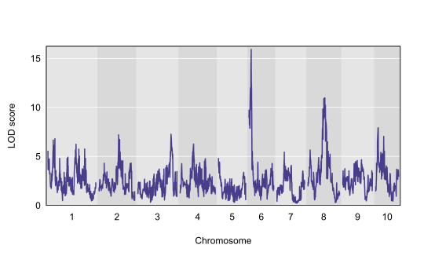
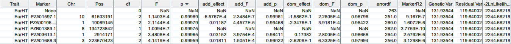
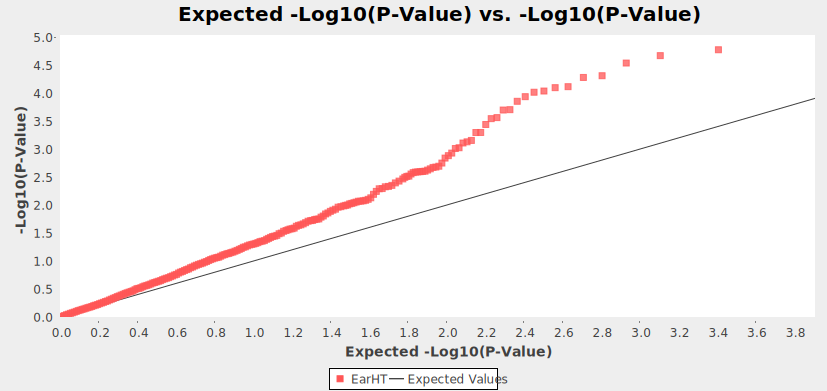

# 数量形状位点定位与全基因组关联分析

> 日期：2022-12-7
>
> 实验者：生信 2001 张子栋
>
> [MarkdownNotes/软件第6次作业.md at main · Bluuur/MarkdownNotes (github.com)](https://github.com/Bluuur/MarkdownNotes/blob/main/生物信息学原理/软件第6次作业.md)
> [生物信息学原理/软件第6次作业.md · blur/MarkdownNotes - 码云 - 开源中国 (gitee.com)](https://gitee.com/bluur/MarkdownNotes/blob/main/生物信息学原理/软件第6次作业.md)

## 实验目的

1. 了解 R 语言工作环境
1. 熟悉 QTL 和 GWAS 分析的一般流程
1. 掌握至少一种常用 QTL 和 GWAS 分析软件

## 实验内容

1. 使用 R 包 qtl2 进行 QTL 分析
2. 使用软件 TASSEL 进行 GWAS 分析
3. 熟悉基因型、表型等数据格式，掌握 QTL 和 GWAS 分析结果的解读和可视化

## 实验操作

1. 利用玉米 MAGIC 群体数据（https://github.com/rqtl/qtl2data/blob/main/MaizeMAGIC/maize_magic.zip），根据前面 R/qtl2 使用方法和流程，使用 R/qtl2 完成以下 QTL 分析：

   1. 本群体包含哪些数据？

      + 基因型标记文件 `maize_magic_geno.csv`
      + 表型文件 `maize_magic_pheno.csv`
      + 遗传图谱 `maize_magic_gmap.csv`
      + 物理图谱 `maize_magic_pmap.csv`
      + 表型协变量文件 `maize_magic_phenocovar.csv`

   2. 绘制株高（PH）的 LOD 曲线

      

   3. 给出株高对应的 QTL

      ```R
        lodindex lodcolumn chr      pos       lod     ci_lo    ci_hi
      4        2        PH   6 12.28468 15.910467 11.009798 12.30230
      5        2        PH   8 90.14981 10.979198 79.445938 93.54998
      6        2        PH  10 13.94991  7.916526  9.585541 43.14987
      ```

   ---

   代码实现: 

   ```R
   > # 安装 R 包并导入
   > if (! require ('BiocManager')){
   +     install.packages("BiocManager")
   +     library("BiocManager")
   + }
   > if (! require ('qtl2')){
   +     install.packages("qtl2")
   +     library("qtl2")
   + }
   > # 加载数据
   > maizeMagic <- read_cross2(file.choose())
   > # 查看数据
   > summary(maizeMagic)
   Object of class cross2 (crosstype "genril9")
   
   Total individuals              529
   No. genotyped individuals      529
   No. phenotyped individuals     529
   No. with both geno & pheno     529
   
   No. phenotypes                   4
   No. covariates                   0
   No. phenotype covariates         1
   
   No. chromosomes                 10
   Total markers                41324
   
   No. markers by chr:
      1    2    3    4    5    6    7    8    9   10 
   6594 4788 4675 4663 4458 3295 3380 3567 3025 2879 
   > # 标记插入遗传图, 获取假定 QTL; 以 1 cM 为间隔插入伪标记
   > maizeMagicMap <- qtl2::insert_pseudomarkers(map = maizeMagic$gmap, step = 1)
   > # 计算基因型概率, 假定基因分型误差概率 0.002
   > maizeMagicPr <- qtl2::calc_genoprob(cross = maizeMagic, map = maizeMagicMap, error_prob = 0.002)
   > # 可视化查看基因型效率
   > # 参数以此为 基因型效率, marker 图, 要查看的个体编号, 要查看的染色体号
   > # 染色体的坐标在横轴上, 基因型在纵轴上, 较高的基因型概率表示为暗色
   > qtl2::plot_genoprob(maizeMagicPr, maizeMagicMap, ind = 1, chr = 1)
   > # 运用 Haley-Knott regression 进行基因组扫描
   > # 可加协变量, 此处不加, 输出 LOD 分数矩阵（positions \times phenotypes）
   > maizeMagicScan1Out <- qtl2::scan1(maizeMagicPr, maizeMagic$pheno, cores = 0)
   > # 绘制 LOD 曲线, 指定一列 表型 PH
   > qtl2::plot_scan1(maizeMagicScan1Out, map = maizeMagicMap, lodcolumn = "PH")
   > # 查看对 PH 而言 LOD 分数最高的伪标记, LOD 得分最高的基因型标记
   > which.max(maizeMagicScan1Out[, "PH"])
   PZE.106020122 
           26298 
   > # permutation test 说明scan结果的统计学意义
   > # 识别随机下可能出现的最大 LOD 分数, 使用 1000 种排列 
   > maizeMagicOperm <- qtl2::scan1perm(genoprobs = maizeMagicPr, pheno = maizeMagic$pheno, n_perm = 1000)
   > # 显著性阈值, 默认 5% 水平
   > # PH 为 7.45 期望 LOD 得分低于 7.45 是偶然事件
   > summary(maizeMagicOperm, alpha = 0.05)
   LOD thresholds (1000 permutations)
          PS   PH   EH GYrad
   0.05 7.33 7.53 7.82  7.75
   > # 寻峰, 95% 置信区间
   > thr <- summary(maizeMagicOperm)
   > maizeMagicPeaks <- qtl2::find_peaks(scan1_output = maizeMagicScan1Out, map = maizeMagicMap, threshold = thr, prob = 0.95, expand2markers = FALSE)
   > # 查看 PH 表型对应多少满足阈值的峰(QTL), 分别在哪
   > maizeMagicPeaks[maizeMagicPeaks$lodcolumn == "PH", ]
     lodindex lodcolumn chr      pos       lod     ci_lo    ci_hi
   4        2        PH   6 12.28468 15.910467 11.009798 12.30230
   5        2        PH   8 90.14981 10.979198 79.445938 93.54998
   6        2        PH  10 13.94991  7.916526  9.585541 43.14987
   ```

   

2. 使用 TASSEL 对自带数据集（安装目录下 TutorialData 子目录中），对其它两个性状（EarHT 和 EarDia）中任意一个，进行关联分析。
   至少需要给出以下结果：

   1. 与 EarHT 或 EarDia 最显著关联的 Top 5 位点信息（包括染色体号、位置和 P 值）

      + 选择性状为 EarHT

      

   2. 两张图（曼哈顿图、QQ 图）及相应的解释（绘图结果说明什么）

      + 曼哈顿图
        + 一号染色体 五号染色体出现明显堆积峰, 说明这些区域的基因型与 EarHT 表型关联性强, 可以对其进行进一步分析.
      + QQ 图
        + QQ 图后半部分脱离均匀分布, 说明基因型与表型之间存在显著相关的自然选择作用.
          

## 讨论

在这次上机操作中, 熟悉了 R/qtl 包, TASSEL 的使用.